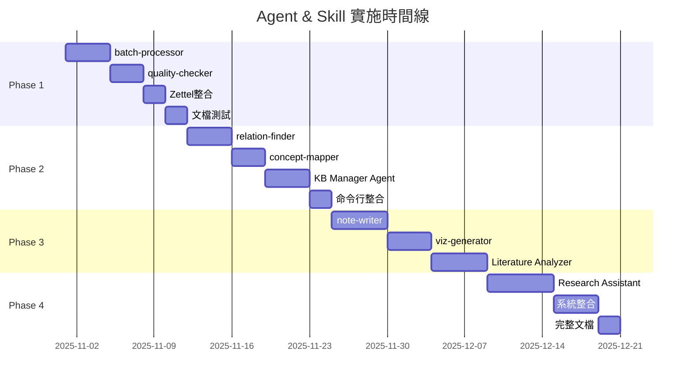

# Agent & Skill 架構設計方案

**文檔版本**: v1.1
**創建日期**: 2025-10-29
**最後更新**: 2025-10-29 (Phase 1 部分完成)
**狀態**: 實施中 - Phase 1
**基於**: `CLAUDE.md` v0.5.0-alpha 的規劃方向

---

## 🚀 進度追蹤與下次執行建議

### 📊 Phase 1 進度總覽 (2025-10-29 更新)

| 任務 | 狀態 | 完成度 | 備註 |
|------|------|--------|------|
| **1.1 實作batch-processor** | ✅ **完成** | 100% | `src/processors/batch_processor.py` (570行)<br>`batch_process.py` (237行)<br>`.claude/skills/batch-processor.md` 完整文檔<br>**測試**: 2個PDF測試通過 |
| **1.2 實作quality-checker** | ✅ **完成** | 100% | `src/checkers/quality_checker.py` (801行)<br>`check_quality.py` (312行)<br>`quality_rules.yaml` (290行規則)<br>**測試**: 30篇論文完整檢查通過<br>**發現**: 79個質量問題（50個嚴重） |
| **1.3 整合Zettelkasten到KB** | ❌ **待開始** | 0% | 需擴展`kb_manager.py`<br>實作跨論文卡片搜索 |
| **1.4 文檔和測試** | 🟡 **部分完成** | 60% | ✅ Skill文檔完成<br>✅ CLAUDE.md更新完成<br>❌ 單元測試未開始 |

**Phase 1 整體進度**: 65% (2/4 任務完成，1任務部分完成)

---

### 🎯 下次執行建議 (按優先級排序)

#### **選項 1: 完成 Phase 1 (推薦) ⭐⭐⭐**

繼續完成 Phase 1 的剩餘任務，確保核心基礎設施穩固。

**Task 1.3: 整合Zettelkasten到知識庫** (預計2天)
- **目標**: 讓33個Zettelkasten資料夾（660張卡片）的內容可從知識庫搜索
- **實作範圍**:
  1. 擴展 `kb_manager.py` 添加 `index_zettelkasten()` 方法
  2. 創建新的數據表 `zettel_cards` 和 `zettel_links`
  3. 解析卡片文件，提取標題、內容、連結
  4. 建立卡片與論文的關聯（透過資料夾名稱）
  5. 更新FTS索引，支援卡片內容全文搜索
  6. 實作跨論文概念搜索功能
- **成功指標**: 可用 `kb.search_zettel("mental simulation")` 找到相關卡片
- **命令範例**:
  ```bash
  python kb_manage.py index-zettel \
    --zettel-dir "output/zettelkasten_notes" \
    --update-db
  ```

**Task 1.4: 單元測試** (預計1-2天)
- **目標**: 測試覆蓋率 >80%
- **測試範圍**:
  1. `tests/test_batch_processor.py`
     - 測試路徑驗證
     - 測試單文件處理
     - 測試錯誤處理策略（skip/retry/stop）
     - 測試平行處理
  2. `tests/test_quality_checker.py`
     - 測試各項檢查（標題/作者/年份/摘要/關鍵詞）
     - 測試重複檢測
     - 測試評分系統
  3. `tests/test_kb_manager.py`
     - 測試Zettelkasten索引
     - 測試跨論文搜索
- **框架**: 使用 `pytest`
- **命令範例**:
  ```bash
  pytest tests/ -v --cov=src --cov-report=html
  ```

**預計完成時間**: 3-4天
**完成後狀態**: Phase 1 完整完成 ✅

---

#### **選項 2: 修復知識庫元數據問題 (實用性高) ⭐⭐**

質量檢查器發現了嚴重的元數據問題，優先修復可提升知識庫可用性。

**發現的問題** (來自 `check_quality.py` 測試結果):
1. **100%論文缺少年份** (30/30篇) - 嚴重問題
2. **67%關鍵詞不足** (20/30篇) - 警告
3. **53%摘要缺失** (16/30篇) - 嚴重問題
4. **7%無效標題** (2/30篇) - "Journal Pre-proof"、URL

**修復方案**:

**方案A: 改進PDF提取器** (治本)
- 修改 `pdf_extractor.py`，增強元數據提取能力
- 年份提取：優先從PDF metadata，其次從內容正則匹配
- 關鍵詞提取：使用TF-IDF或LLM生成
- 摘要提取：改進正則表達式，識別"Abstract"段落

**方案B: 批次重新分析** (快速修復)
- 使用改進的提取器重新分析30篇論文
- 保留原有筆記內容，僅更新元數據
- 命令範例:
  ```bash
  python kb_manage.py re-analyze \
    --paper-ids 1-30 \
    --update-metadata-only \
    --backup-first
  ```

**方案C: API增強** (最準確)
- 整合 CrossRef API 和 Semantic Scholar API
- 根據標題或DOI查詢完整元數據
- 實作 `quality_checker.py` 中的 `auto_fix()` 功能
- 命令範例:
  ```bash
  python check_quality.py --auto-fix --use-api crossref
  ```

**推薦**: 方案A + 方案C (先改進提取器，再用API補強)
**預計時間**: 2-3天

---

#### **選項 3: 開始 Phase 2 (提前規劃) ⭐**

如果對 Phase 1 的現有成果滿意，可提前開始 Phase 2 的準備工作。

**Task 2.1: 實作relation-finder** (預計3-4天)
- 從33個Zettelkasten資料夾提取概念連結
- 構建跨論文的概念網絡圖
- 生成Mermaid視覺化

**優勢**: 可立即看到知識圖譜效果
**風險**: Phase 1 基礎不穩固

---

### 💡 我的建議

**推薦執行順序**:

1. **Task 1.3: 整合Zettelkasten** (最優先)
   - 理由: 660張卡片是寶貴資源，應盡快納入可搜索範圍
   - 時間: 2天
   - 難度: 中等

2. **選項 2方案A+C: 修復元數據** (次優先)
   - 理由: 提升知識庫品質，為後續分析打好基礎
   - 時間: 2-3天
   - 難度: 中等

3. **Task 1.4: 單元測試** (第三優先)
   - 理由: 確保系統穩定性，為未來擴展建立信心
   - 時間: 1-2天
   - 難度: 簡單

4. **Phase 2: relation-finder** (Phase 1完成後)
   - 理由: 在穩固基礎上構建知識圖譜
   - 時間: 3-4天
   - 難度: 較高

**總預計時間**: 8-11天完成 Phase 1 + 元數據修復

---

### 📝 快速啟動指令

下次開始工作時，可直接使用以下指令：

```bash
# 如果選擇 Task 1.3 (整合Zettelkasten)
用戶: "開始 Task 1.3，整合Zettelkasten到知識庫"

# 如果選擇修復元數據
用戶: "修復知識庫元數據問題，使用改進的PDF提取器"

# 如果選擇單元測試
用戶: "開始 Task 1.4，為batch-processor和quality-checker撰寫單元測試"

# 如果想查看詳細的質量報告
用戶: "生成詳細的知識庫質量報告，包含所有問題論文的列表"
```

---

## 📋 目錄

1. [系統現狀分析](#系統現狀分析)
2. [整體架構設計](#整體架構設計)
3. [Agent設計詳細規格](#agent設計詳細規格)
4. [Skill設計詳細規格](#skill設計詳細規格)
5. [實施路線圖](#實施路線圖)
6. [建議的檔案結構](#建議的檔案結構)
7. [用戶個人想法](#用戶個人想法)

---

## 系統現狀分析

### 當前狀態（2025-10-29）

**知識庫統計**：
- ✅ **29篇論文**已加入知識庫（SQLite數據庫）
- ✅ **33個Zettelkasten筆記資料夾**（約660張原子卡片）
- ✅ **31個PDF分析JSON檔案**（output/paper_analysis/）
- ❌ **0個主題分類**（知識庫組織缺失）
- ❌ **0個引用關係**（論文間連結缺失）

**領域分布**：
- Linguistics領域：11篇論文
- CogSci領域：20篇論文
- 測試資料：2個資料夾

**現有工具**：
- `analyze_paper.py`: PDF分析和知識庫整合
- `kb_manage.py`: 知識庫管理命令行工具
- `make_slides.py`: 多風格投影片和Zettelkasten生成

### 核心痛點分析

| 痛點 | 現象 | 影響程度 | 解決緊急度 |
|------|------|----------|-----------|
| **批次處理不穩定** | 批次腳本因編碼/路徑問題失敗，需手動逐篇處理 | 🔴 嚴重 | P0 最高 |
| **知識庫缺乏組織** | 無主題分類、無引用關係、無概念網絡 | 🟡 中等 | P1 高 |
| **Zettelkasten孤立** | 筆記資料夾與知識庫分離，無法跨論文搜索卡片 | 🟡 中等 | P1 高 |
| **元數據質量差** | 標題識別錯誤（如"Journal Pre-proof"），作者為期刊名 | 🟠 較嚴重 | P0 最高 |
| **無跨論文分析** | 無法發現概念關係、研究趨勢、文獻缺口 | 🟢 輕微 | P2 中 |
| **缺乏智能推薦** | 無法根據研究問題推薦相關論文 | 🟢 輕微 | P3 低 |

### 成功案例回顧

**已完成的工作**（參考 FILE_CLEANUP_REPORT_20251029.md）：
- ✅ 成功處理31篇論文（手動逐篇）
- ✅ 生成33個Zettelkasten筆記資料夾（平均20張卡片/篇）
- ✅ PDF分析JSON檔案完整保存
- ✅ 檔案組織結構清晰（output/三層分類）

**發現的問題**：
- ⚠️ 批次處理腳本 `batch_zettel_mental_simulation.py` 失敗（編碼和路徑問題）
- ⚠️ 知識庫標題為URL時導致路徑錯誤
- ⚠️ 簡報有繁簡中文混合

---

## 整體架構設計

### 三層架構模型

```
┌─────────────────────────────────────────────────────────────┐
│                    用戶交互層 (User Layer)                    │
├─────────────────────────────────────────────────────────────┤
│  命令行工具              Slash Commands          Python API  │
│  • analyze_paper.py     • /kb-manager           • import... │
│  • kb_manage.py         • /analyze-literature   • from...   │
│  • make_slides.py       • /ask-research-q       •           │
│  • batch_process.py     •                       •           │
└────────────────────┬────────────────────────────────────────┘
                     ↓
┌─────────────────────────────────────────────────────────────┐
│                   Agent層 (智能代理層)                        │
├─────────────────────────────────────────────────────────────┤
│                                                               │
│  ┌───────────────────────────────────────────────────┐      │
│  │  Knowledge Base Manager (知識庫管理員) ⭐⭐⭐      │      │
│  │  • 批次處理論文                                    │      │
│  │  • 自動分類和主題管理                              │      │
│  │  • 質量檢查和元數據修復                            │      │
│  │  • Zettelkasten整合                               │      │
│  │  • 論文關係發現和連結                              │      │
│  │  • 知識圖譜構建                                    │      │
│  └───────────────────────────────────────────────────┘      │
│                                                               │
│  ┌──────────────────────────┐  ┌────────────────────────┐  │
│  │  Literature Analyzer     │  │  Research Assistant    │  │
│  │  (文獻分析專家) ⭐⭐      │  │  (研究助理) ⭐         │  │
│  │  • 主題文獻綜述生成       │  │  • 智能文獻推薦        │  │
│  │  • 多論文比較分析         │  │  • 快速問答            │  │
│  │  • 研究趨勢發現           │  │  • 引用格式生成        │  │
│  │  • 概念演化追蹤           │  │  • 研究筆記整理        │  │
│  │  • Gap分析               │  │  •                    │  │
│  └──────────────────────────┘  └────────────────────────┘  │
└────────────────────┬────────────────────────────────────────┘
                     ↓
┌─────────────────────────────────────────────────────────────┐
│                   Skill層 (技能組件層)                        │
├─────────────────────────────────────────────────────────────┤
│                                                               │
│  已完成 ✅                    待實作 🔄                       │
│  ┌──────────────────┐       ┌──────────────────┐           │
│  │ pdf-extractor    │       │ batch-processor  │ ⭐⭐⭐     │
│  │ (PDF提取)        │       │ (批次處理)       │           │
│  └──────────────────┘       └──────────────────┘           │
│                                                               │
│  ┌──────────────────┐       ┌──────────────────┐           │
│  │ slide-maker      │       │ quality-checker  │ ⭐⭐⭐     │
│  │ (投影片生成)     │       │ (質量檢查)       │           │
│  └──────────────────┘       └──────────────────┘           │
│                                                               │
│  ┌──────────────────┐       ┌──────────────────┐           │
│  │ kb-connector     │       │ relation-finder  │ ⭐⭐       │
│  │ (知識庫連接)     │       │ (關係發現)       │           │
│  └──────────────────┘       └──────────────────┘           │
│                                                               │
│                              ┌──────────────────┐           │
│                              │ concept-mapper   │ ⭐⭐       │
│                              │ (概念映射)       │           │
│                              └──────────────────┘           │
│                                                               │
│                              ┌──────────────────┐           │
│                              │ note-writer      │ ⭐         │
│                              │ (筆記生成)       │           │
│                              └──────────────────┘           │
│                                                               │
│                              ┌──────────────────┐           │
│                              │ viz-generator    │ ⭐         │
│                              │ (視覺化生成)     │           │
│                              └──────────────────┘           │
└────────────────────┬────────────────────────────────────────┘
                     ↓
┌─────────────────────────────────────────────────────────────┐
│                   數據層 (Data Layer)                         │
├─────────────────────────────────────────────────────────────┤
│  ┌─────────────┐  ┌──────────────┐  ┌───────────────────┐  │
│  │ SQLite DB   │  │ Markdown     │  │ Zettelkasten      │  │
│  │ (index.db)  │  │ (papers/)    │  │ (zettel_notes/)   │  │
│  │ • papers    │  │ • 論文筆記   │  │ • 原子卡片        │  │
│  │ • topics    │  │ • 結構化內容 │  │ • 概念連結        │  │
│  │ • citations │  │ •            │  │ • 索引文件        │  │
│  │ • FTS索引   │  │ •            │  │ •                 │  │
│  └─────────────┘  └──────────────┘  └───────────────────┘  │
│                                                               │
│  ┌──────────────────────────────────────────────────────┐   │
│  │ 分析結果 (output/)                                    │   │
│  │ • paper_analysis/ (31個JSON)                         │   │
│  │ • slides/ (PPTX簡報)                                 │   │
│  │ • zettelkasten_notes/ (33個筆記資料夾)               │   │
│  └──────────────────────────────────────────────────────┘   │
└─────────────────────────────────────────────────────────────┘
```

### 架構設計原則

1. **解耦性**: Agent調用Skill，Skill可獨立測試和復用
2. **漸進式**: 可按優先級逐步實作，不影響現有功能
3. **向後兼容**: 保持現有三個腳本的功能不變
4. **可擴展**: 預留插件接口，方便未來添加新Skill/Agent

---

## Agent設計詳細規格

### 1. Knowledge Base Manager Agent (知識庫管理員)

**文件位置**: `.claude/agents/knowledge-integrator/`

**角色定位**: 知識庫的總管家，負責維護、組織、優化整個知識系統

**交互模式**: 對話式 - 主動詢問參數，避免誤操作

**優先級**: ⭐⭐⭐ P0 (最高優先級)

#### 核心職責

```yaml
agent:
  name: knowledge-integrator
  alias: kb-manager
  description: 知識庫管理和整合專家

  # 新增：交互式工作流
  interaction_mode: conversational  # 對話式，非靜默執行

  responsibilities:
    0. 意圖識別和參數收集: ⭐ NEW
       - 識別用戶請求類型（批次處理/簡報生成/筆記生成/質量檢查）
       - 主動詢問缺失參數（來源、領域、格式、風格、詳細度）
       - 區分生成意圖：學術簡報 vs Zettelkasten筆記 vs 其他筆記
       - 確認配置後再執行

    1. 批次處理:
       - 穩定處理大量PDF文件（解決編碼/路徑問題）
       - 支援多線程/平行處理
       - 錯誤處理和重試機制
       - 進度追蹤和報告

    2. 質量管理:
       - 自動檢測元數據錯誤（標題、作者、年份）
       - 從PDF重新提取或API查詢修復
       - 重複論文檢測和去重
       - 定期質量審計

    3. 知識整合:
       - Zettelkasten筆記連結到論文
       - 跨論文概念連結提取
       - 引用關係發現和構建
       - 主題自動分類

    4. 知識圖譜:
       - 構建論文引用網絡
       - 構建概念關聯網絡
       - 識別核心論文和橋接論文
       - 生成視覺化圖表

    5. 維護優化:
       - 數據庫索引優化
       - 過期內容清理
       - 備份和恢復
       - 統計報告生成
```

#### 調用的Skills

```yaml
skills_used:
  primary:
    - batch-processor (批次處理核心)
    - quality-checker (質量檢查核心)
    - relation-finder (關係發現)
    - concept-mapper (概念映射)

  # 新增：生成器Skills
  generation:
    - slide-maker (學術簡報生成) ⭐ NEW
    - zettel-maker (Zettelkasten筆記) ⭐ NEW
    - note-writer (其他筆記風格)

  secondary:
    - kb-connector (知識庫操作)
    - pdf-extractor (PDF提取)
    - viz-generator (圖表生成)
```

#### 輸入輸出規格

```yaml
inputs:
  - type: pdf_folder
    description: 包含PDF文件的資料夾路徑
    example: "D:\\pdfs\\mental_simulation"

  - type: paper_ids
    description: 知識庫中的論文ID列表
    example: [1, 2, 3, 5, 10]

  - type: config
    description: 處理配置參數
    fields:
      - domain: str (CogSci/Linguistics)
      - auto_classify: bool
      - generate_zettel: bool
      - max_workers: int
      - llm_provider: str

outputs:
  - type: batch_report
    description: 批次處理報告
    fields:
      - total: int
      - success: int
      - failed: int
      - errors: List[Error]
      - processing_time: str

  - type: quality_report
    description: 質量檢查報告
    fields:
      - issues_found: int
      - auto_fixed: int
      - manual_review: List[Issue]

  - type: knowledge_graph
    description: 知識圖譜文件
    formats: [json, graphml, mermaid]
```

#### 使用範例

```bash
# 場景1: 批次導入新論文
/kb-manager batch-import \
  --folder "D:\pdfs\mental_simulation" \
  --domain CogSci \
  --auto-classify \
  --generate-zettel \
  --report batch_report.json

# 場景2: 整合現有Zettelkasten
/kb-manager integrate-zettel \
  --zettel-dir "output/zettelkasten_notes" \
  --link-to-papers \
  --update-index

# 場景3: 質量檢查和修復
/kb-manager quality-check \
  --fix-metadata \
  --detect-duplicates \
  --api-enhance \
  --report quality_report.json

# 場景4: 構建知識圖譜
/kb-manager build-graph \
  --output knowledge_graph.json \
  --include-concepts \
  --include-citations \
  --min-connections 2 \
  --visualize mermaid

# 場景5: 自動分類論文
/kb-manager auto-classify \
  --method clustering \
  --num-topics 5 \
  --update-db

# 場景6: 定期維護
/kb-manager maintenance \
  --optimize-index \
  --cleanup-temp \
  --generate-stats \
  --backup
```

#### Python API範例

```python
from src.agents import KnowledgeBaseManager

kb_manager = KnowledgeBaseManager()

# 批次處理
result = kb_manager.batch_import(
    folder="D:\\pdfs",
    domain="CogSci",
    auto_classify=True,
    generate_zettel=True
)

print(f"處理完成: {result.success}/{result.total}")
print(f"失敗: {len(result.errors)}")

# 質量檢查
quality = kb_manager.quality_check(
    fix_metadata=True,
    detect_duplicates=True
)

print(f"發現問題: {quality.issues_found}")
print(f"自動修復: {quality.auto_fixed}")

# 構建知識圖譜
graph = kb_manager.build_knowledge_graph(
    include_concepts=True,
    include_citations=True
)

graph.save("knowledge_graph.json")
graph.visualize("knowledge_graph.html")
```

#### 交互式對話流程範例

```bash
用戶: /kb-manager batch-import --folder "D:\pdfs\mental_simulation"

Agent:
📋 批次導入配置確認

我發現了 15 個PDF文件。請確認以下設定：

1. 📚 領域分類
   • CogSci (認知科學)
   • Linguistics (語言學)
   • Other (其他領域)

   您的選擇: _____

2. 🎨 輸出格式（可多選）
   ☐ 加入知識庫（Markdown筆記 + SQLite索引）
   ☐ 生成學術簡報（PPTX/Markdown）
   ☐ 生成Zettelkasten原子筆記

   您的選擇: _____

3. 📝 Zettelkasten詳細設定（若選擇）
   • 詳細程度: standard / detailed / comprehensive
   • 卡片數量: 12 / 15 / 20
   • LLM提供者: google / ollama / openai

   您的選擇: _____

4. 🔧 進階選項
   • 平行處理數: 2 / 3 / 4
   • 錯誤處理: skip / retry / stop

   您的選擇: _____

確認後開始處理？[Y/n] _____
```

**說明**：
- 使用 `AskUserQuestion` tool 實現交互
- 自動驗證參數有效性
- 避免生成錯誤格式（如誤將Zettel當簡報）
- 所有參數可選，有合理默認值

---

### 2. Literature Analyzer Agent (文獻分析專家)

**文件位置**: `.claude/agents/literature-analyzer/`

**角色定位**: 專注於深度文獻分析、比較和趨勢發現

**數據來源**: 僅知識庫 - 只分析已入庫的論文（不處理新PDF）

**優先級**: ⭐⭐ P1 (高優先級)

#### 核心職責

```yaml
agent:
  name: literature-analyzer
  description: 文獻分析和比較專家

  # 明確：只處理知識庫中的論文
  data_source: knowledge_base_only

  responsibilities:
    1. 主題綜述:
       - 基於主題生成系統性文獻綜述
       - 整合多篇論文的核心觀點
       - 識別研究脈絡和演進

    2. 比較分析:
       - 多論文方法論比較
       - 實驗結果對比
       - 理論框架差異分析

    3. 趨勢發現:
       - 識別研究熱點
       - 追蹤概念演化軌跡
       - 預測未來研究方向

    4. 缺口分析:
       - 識別研究空白
       - 發現矛盾結論
       - 提出研究問題

  prerequisites:
    - 論文必須已由 Knowledge Base Manager 加入知識庫
    - 需要完整的 Markdown 筆記內容（非僅元數據）
```

#### 調用的Skills

```yaml
skills_used:
  # 核心依賴 - 必需
  essential:
    - kb-connector (知識庫檢索) ⭐ 核心
    - relation-finder (發現論文關聯)
    - concept-mapper (概念網絡分析)

  # 輸出生成
  generation:
    - note-writer (生成綜述筆記)
    - viz-generator (生成比較圖表)

  # 明確移除：不調用 pdf-extractor（不處理新PDF）
```

#### 使用範例

```bash
# 主題文獻綜述
/analyze-literature synthesis \
  --topic "mental simulation" \
  --domain CogSci \
  --style comprehensive \
  --output literature_review.md

# 多論文比較
/analyze-literature compare \
  --papers 1,5,10,15 \
  --aspects "methods,findings,limitations" \
  --format table \
  --output comparison.md

# 研究趨勢分析
/analyze-literature trends \
  --topic "embodied cognition" \
  --time-range "2010-2025" \
  --visualize timeline \
  --output trends_report.md

# 研究缺口識別
/analyze-literature gaps \
  --domain Linguistics \
  --subtopic "classifiers" \
  --output research_gaps.md
```

---

### 3. Research Assistant Agent (研究助理)


**文件位置**: `.claude/agents/research-assistant/`

**角色定位**: 日常研究助手，快速回應查詢和推薦

**優先級**: ⭐ P3 (低優先級)

#### 核心職責

```yaml
agent:
  name: research-assistant
  description: 研究助理，快速查詢和推薦

  responsibilities:
    1. 智能推薦:
       - 基於研究問題推薦相關論文
       - 基於閱讀歷史推薦
       - 基於概念關聯推薦

    2. 快速問答:
       - 回答關於論文的具體問題
       - 解釋概念定義
       - 提供方法論建議

    3. 引用管理:
       - 生成標準引用格式
       - 整理參考文獻列表
       - 檢測引用遺漏

    4. 筆記整理:
       - 整合閱讀筆記
       - 創建研究日誌
       - 生成思維導圖
```

#### 使用範例

```bash
# 智能推薦
/ask-research recommend \
  --question "如何測量mental simulation的強度？" \
  --limit 5

# 快速問答
/ask-research qa \
  --question "Zwaan的ACE框架是什麼？"

# 引用生成
/ask-research cite \
  --papers 1,2,3 \
  --format APA \
  --output references.bib
```

---

## Skill設計詳細規格

### 1. batch-processor (批次處理器)

**文件位置**: `.claude/skills/batch-processor.md`, `src/processors/batch_processor.py`

**優先級**: ⭐⭐⭐ P0 (最高優先級)

**設計目標**: 穩定地批次處理大量PDF文件，解決編碼和路徑問題

#### 功能規格

```python
class BatchProcessor:
    """
    批次處理Skill

    解決的核心問題:
    1. Windows路徑編碼問題（空格、中文字符）
    2. UTF-8/GBK編碼混合
    3. PDF提取失敗的容錯處理
    4. 長時間處理的進度追蹤
    """

    def __init__(
        self,
        max_workers: int = 3,
        encoding: str = 'utf-8',
        error_handling: str = 'skip'  # skip/retry/stop
    ):
        """
        參數:
            max_workers: 平行處理的worker數量（建議2-4）
            encoding: 檔案系統編碼（Windows: utf-8, 部分舊系統: gbk）
            error_handling: 錯誤處理策略
                - skip: 跳過失敗的文件，繼續處理
                - retry: 重試失敗的文件（最多3次）
                - stop: 遇到錯誤立即停止
        """

    def process_batch(
        self,
        pdf_paths: List[str] | str,  # 文件列表或資料夾路徑
        domain: str = "Research",
        add_to_kb: bool = True,
        generate_zettel: bool = True,
        zettel_config: dict = None,
        progress_callback: callable = None
    ) -> BatchResult:
        """
        批次處理PDF文件

        參數:
            pdf_paths: PDF文件路徑列表，或包含PDF的資料夾路徑
            domain: 領域代碼（CogSci/Linguistics/AI等）
            add_to_kb: 是否加入知識庫
            generate_zettel: 是否生成Zettelkasten筆記
            zettel_config: Zettelkasten配置
                - detail_level: 詳細程度
                - card_count: 卡片數量
                - llm_provider: LLM提供者
            progress_callback: 進度回調函數

        返回:
            BatchResult對象，包含:
                - total: 總文件數
                - success: 成功處理數
                - failed: 失敗數
                - errors: 錯誤列表
                - processing_time: 處理時間
                - papers_added_to_kb: 加入知識庫的論文數
                - zettel_generated: 生成的Zettelkasten數

        實作細節:
            1. 路徑正規化：使用pathlib.Path統一處理路徑
            2. 編碼處理：強制UTF-8，處理檔名編碼錯誤
            3. 平行處理：使用concurrent.futures.ThreadPoolExecutor
            4. 錯誤記錄：詳細記錄每個失敗文件的錯誤原因
            5. 進度追蹤：即時回調進度百分比
        """

    def validate_paths(self, paths: List[str]) -> Tuple[List[str], List[str]]:
        """
        驗證路徑有效性

        返回:
            (valid_paths, invalid_paths)
        """

    def process_single(
        self,
        pdf_path: str,
        **kwargs
    ) -> ProcessResult:
        """
        處理單個PDF文件（內部方法）

        流程:
            1. 驗證文件存在性
            2. 調用analyze_paper.py或直接調用PDFExtractor
            3. 如果add_to_kb，加入知識庫
            4. 如果generate_zettel，生成Zettelkasten
            5. 記錄處理結果
        """

    def retry_failed(
        self,
        failed_files: List[str],
        max_retries: int = 3
    ) -> BatchResult:
        """重試失敗的文件"""
```

#### 數據結構

```python
from dataclasses import dataclass
from typing import List, Dict
from datetime import datetime

@dataclass
class ProcessResult:
    """單個文件處理結果"""
    file_path: str
    success: bool
    paper_id: int = None
    zettel_dir: str = None
    error: str = None
    processing_time: float = 0.0

@dataclass
class BatchResult:
    """批次處理結果"""
    total: int
    success: int
    failed: int
    errors: List[Dict[str, str]]
    processing_time: str
    papers_added_to_kb: int
    zettel_generated: int
    start_time: datetime
    end_time: datetime

    def to_json(self) -> str:
        """轉為JSON格式"""

    def to_report(self) -> str:
        """生成可讀報告"""
```

#### 使用範例

```python
from src.processors import BatchProcessor

# 初始化
processor = BatchProcessor(
    max_workers=3,
    error_handling='skip'
)

# 批次處理資料夾
result = processor.process_batch(
    pdf_paths="D:\\pdfs\\mental_simulation",
    domain="CogSci",
    add_to_kb=True,
    generate_zettel=True,
    zettel_config={
        'detail_level': 'detailed',
        'card_count': 20,
        'llm_provider': 'google'
    },
    progress_callback=lambda p: print(f"進度: {p}%")
)

# 查看結果
print(result.to_report())

# 重試失敗的文件
if result.failed > 0:
    retry_result = processor.retry_failed(
        failed_files=[e['file'] for e in result.errors]
    )
```

#### 命令行工具

```bash
# 創建 batch_process.py

python batch_process.py \
  --folder "D:\pdfs\mental_simulation" \
  --domain CogSci \
  --add-to-kb \
  --generate-zettel \
  --workers 3 \
  --report batch_report.json

# 進階選項
python batch_process.py \
  --files paper1.pdf paper2.pdf paper3.pdf \
  --domain Linguistics \
  --error-handling retry \
  --llm-provider google \
  --model gemini-2.0-flash-exp \
  --detail detailed \
  --cards 20
```

---

### 2. quality-checker (質量檢查器)

**文件位置**: `.claude/skills/quality-checker.md`, `src/checkers/quality_checker.py`

**優先級**: ⭐⭐⭐ P0 (最高優先級)

**設計目標**: 自動檢測和修復知識庫元數據質量問題

#### 功能規格

```python
class QualityChecker:
    """
    質量檢查Skill

    檢查項目:
    1. 標題質量（是否為期刊名、URL等）
    2. 作者質量（是否為佔位符）
    3. 年份有效性（1900-2030）
    4. 關鍵詞數量（建議3-10個）
    5. 摘要長度（建議100-500字）
    6. 重複論文檢測
    """

    def __init__(
        self,
        kb_manager: KnowledgeBaseManager = None,
        use_api: bool = False,
        api_provider: str = 'crossref'  # crossref/semantic_scholar
    ):
        """
        參數:
            kb_manager: 知識庫管理器實例
            use_api: 是否使用外部API增強元數據
            api_provider: API提供者
        """

    def check_metadata(
        self,
        paper_ids: List[int] = None,  # None=檢查全部
        checks: List[str] = None  # None=全部檢查
    ) -> QualityReport:
        """
        檢查元數據質量

        參數:
            paper_ids: 要檢查的論文ID列表（None=全部）
            checks: 檢查項目列表，可選:
                - 'title': 標題質量
                - 'authors': 作者質量
                - 'year': 年份有效性
                - 'keywords': 關鍵詞數量
                - 'abstract': 摘要長度
                - 'duplicates': 重複檢測

        返回:
            QualityReport對象，包含:
                - total_papers: 總論文數
                - issues_found: 發現的問題數
                - issues_by_type: 按類型分組的問題
                - severity_distribution: 嚴重程度分布
        """

    def check_title(self, paper: dict) -> List[Issue]:
        """
        檢查標題質量

        問題類型:
        - JOURNAL_NAME: 標題為期刊名（如"Journal Pre-proof"）
        - URL_TITLE: 標題為URL
        - TOO_SHORT: 標題過短（<10字符）
        - TOO_LONG: 標題過長（>200字符）
        - GENERIC: 通用標題（如"Research Article"）
        """

    def check_authors(self, paper: dict) -> List[Issue]:
        """
        檢查作者質量

        問題類型:
        - PLACEHOLDER: 佔位符作者（如"Journal Pre"）
        - MISSING: 缺少作者
        - SUSPICIOUS: 可疑作者名（如"Full Terms"）
        """

    def check_year(self, paper: dict) -> List[Issue]:
        """檢查年份有效性"""

    def check_duplicates(self) -> List[DuplicateGroup]:
        """
        檢測重複論文

        檢測方法:
        1. 標題相似度（Levenshtein距離）
        2. 作者重疊度
        3. 文件hash（MD5）
        """

    def auto_fix(
        self,
        issues: List[Issue],
        strategy: str = 'conservative'  # conservative/aggressive
    ) -> FixReport:
        """
        自動修復問題

        修復策略:
        1. 從PDF重新提取（使用更好的正則表達式）
        2. 從Zettelkasten筆記補充信息
        3. 從API查詢（CrossRef/Semantic Scholar）

        參數:
            issues: 要修復的問題列表
            strategy:
                - conservative: 只修復確定的問題
                - aggressive: 嘗試修復所有問題

        返回:
            FixReport對象，包含:
                - attempted: 嘗試修復數
                - success: 成功修復數
                - failed: 失敗數
                - manual_review: 需要人工審查的列表
        """

    def query_crossref(self, paper: dict) -> dict:
        """從CrossRef API查詢元數據"""

    def extract_from_pdf(self, pdf_path: str) -> dict:
        """從PDF重新提取元數據（使用改進的正則）"""

    def extract_from_zettel(self, zettel_dir: str) -> dict:
        """從Zettelkasten筆記提取信息"""
```

#### 數據結構

```python
from enum import Enum

class IssueSeverity(Enum):
    LOW = "低"
    MEDIUM = "中"
    HIGH = "高"
    CRITICAL = "嚴重"

@dataclass
class Issue:
    """質量問題"""
    paper_id: int
    type: str
    severity: IssueSeverity
    description: str
    field: str  # title/authors/year等
    current_value: Any
    suggested_value: Any = None

@dataclass
class QualityReport:
    """質量檢查報告"""
    total_papers: int
    issues_found: int
    issues_by_type: Dict[str, List[Issue]]
    severity_distribution: Dict[IssueSeverity, int]

    def to_markdown(self) -> str:
        """生成Markdown報告"""

    def filter_by_severity(self, min_severity: IssueSeverity) -> List[Issue]:
        """按嚴重程度過濾"""

@dataclass
class FixReport:
    """修復報告"""
    attempted: int
    success: int
    failed: int
    manual_review: List[Issue]
    fixes_applied: List[Dict]
```

#### 使用範例

```python
from src.checkers import QualityChecker

# 初始化
checker = QualityChecker(use_api=True)

# 全面檢查
report = checker.check_metadata()

print(f"發現 {report.issues_found} 個問題")
print(f"嚴重問題: {report.severity_distribution[IssueSeverity.CRITICAL]}")

# 查看特定類型問題
title_issues = report.issues_by_type.get('title', [])
for issue in title_issues:
    print(f"論文ID {issue.paper_id}: {issue.description}")
    print(f"  當前: {issue.current_value}")
    print(f"  建議: {issue.suggested_value}")

# 自動修復
high_priority = report.filter_by_severity(IssueSeverity.HIGH)
fix_report = checker.auto_fix(high_priority, strategy='conservative')

print(f"修復成功: {fix_report.success}/{fix_report.attempted}")
print(f"需人工審查: {len(fix_report.manual_review)}")
```

#### 命令行工具（擴展kb_manage.py）

```bash
# 質量檢查
python kb_manage.py quality-check \
  --report quality_report.json \
  --severity high

# 自動修復
python kb_manage.py quality-fix \
  --strategy conservative \
  --use-api \
  --backup-first

# 重複檢測
python kb_manage.py detect-duplicates \
  --threshold 0.85 \
  --report duplicates.json
```

---

### 3. relation-finder (關係發現器)

**文件位置**: `.claude/skills/relation-finder.md`, `src/analyzers/relation_finder.py`

**優先級**: ⭐⭐ P1 (高優先級)

**設計目標**: 自動發現論文間的引用關係和概念連結

#### 功能規格

```python
class RelationFinder:
    """
    關係發現Skill

    發現兩種關係:
    1. 引用關係 (Citation Relations)
       - 從PDF文本中提取引用
       - 匹配知識庫中的論文
       - 構建引用網絡

    2. 概念關係 (Concept Relations)
       - 從Zettelkasten卡片連結中提取
       - 聚合跨論文的概念網絡
       - 識別核心概念和橋接概念
    """

    def __init__(
        self,
        kb_manager: KnowledgeBaseManager = None
    ):
        pass

    def find_citations(
        self,
        paper_ids: List[int] = None,  # None=全部論文
        match_threshold: float = 0.8
    ) -> CitationGraph:
        """
        從論文中提取引用關係

        方法:
        1. 正則表達式匹配引用格式
           - APA: Author (Year)
           - MLA: Author Year
           - Numbered: [1], [2]
        2. 從參考文獻列表提取
        3. 與知識庫論文匹配（作者+年份）
        4. 構建引用網絡圖

        參數:
            paper_ids: 要分析的論文ID列表
            match_threshold: 匹配閾值（0-1）

        返回:
            CitationGraph對象，包含:
                - nodes: 論文節點
                - edges: 引用邊
                - citation_counts: 被引用次數統計
                - hub_papers: 核心論文（高被引）
                - bridge_papers: 橋接論文（連接不同領域）
        """

    def find_concept_relations(
        self,
        zettel_dirs: List[str] = None,  # None=所有Zettelkasten
        min_connections: int = 2
    ) -> ConceptGraph:
        """
        從Zettelkasten卡片中提取概念關係

        方法:
        1. 解析卡片中的連結標記
           - [[基於]]: 基礎關係
           - [[導向]]: 導向關係
           - [[相關]]: 相關關係
           - [[對比]]: 對比關係
        2. 提取概念節點（卡片ID和標題）
        3. 構建跨論文的概念網絡
        4. 計算概念重要性（度中心性、介數中心性）

        參數:
            zettel_dirs: Zettelkasten目錄列表
            min_connections: 最小連接數（過濾孤立節點）

        返回:
            ConceptGraph對象，包含:
                - concepts: 概念節點（含重要性分數）
                - relations: 概念關係（含類型）
                - core_concepts: 核心概念（高中心性）
                - concept_clusters: 概念聚類
        """

    def extract_citations_from_text(self, text: str) -> List[Citation]:
        """從文本中提取引用（使用正則表達式）"""

    def extract_citations_from_references(self, text: str) -> List[Citation]:
        """從參考文獻列表提取"""

    def match_citation_to_paper(
        self,
        citation: Citation
    ) -> Tuple[int, float]:
        """
        將引用匹配到知識庫論文

        返回:
            (paper_id, confidence_score)
        """

    def parse_zettel_links(self, zettel_file: str) -> List[ConceptLink]:
        """解析Zettelkasten卡片中的連結"""

    def calculate_centrality(self, graph: nx.Graph) -> Dict[str, float]:
        """計算節點中心性"""
```

#### 數據結構

```python
import networkx as nx

@dataclass
class Citation:
    """引用記錄"""
    authors: List[str]
    year: int
    title: str = None
    context: str = None  # 引用上下文

@dataclass
class CitationGraph:
    """引用網絡圖"""
    graph: nx.DiGraph
    citation_counts: Dict[int, int]  # paper_id -> count
    hub_papers: List[int]
    bridge_papers: List[int]

    def to_json(self) -> str:
        """轉為JSON"""

    def to_graphml(self, path: str):
        """保存為GraphML格式（可用Gephi打開）"""

    def visualize_mermaid(self) -> str:
        """生成Mermaid圖表代碼"""

@dataclass
class ConceptLink:
    """概念連結"""
    source_id: str
    target_id: str
    relation_type: str  # 基於/導向/相關/對比/上位/下位
    source_paper: int
    target_paper: int = None

@dataclass
class ConceptGraph:
    """概念網絡圖"""
    graph: nx.Graph
    core_concepts: List[str]
    concept_clusters: Dict[int, List[str]]
    centrality_scores: Dict[str, float]

    def to_json(self) -> str:
        """轉為JSON"""

    def visualize_mermaid(self) -> str:
        """生成Mermaid圖表"""
```

#### 使用範例

```python
from src.analyzers import RelationFinder

finder = RelationFinder()

# 發現引用關係
citation_graph = finder.find_citations()
print(f"發現 {len(citation_graph.graph.edges)} 個引用關係")
print(f"核心論文: {citation_graph.hub_papers}")

# 保存引用網絡
citation_graph.to_graphml("citation_network.graphml")

# 發現概念關係
concept_graph = finder.find_concept_relations(
    min_connections=2
)
print(f"核心概念: {concept_graph.core_concepts}")

# 生成Mermaid圖表
mermaid_code = concept_graph.visualize_mermaid()
with open("concept_network.md", "w") as f:
    f.write(f"```mermaid\n{mermaid_code}\n```")
```

---

### 4. concept-mapper (概念映射器)

**文件位置**: `.claude/skills/concept-mapper.md`, `src/analyzers/concept_mapper.py`

**優先級**: ⭐⭐ P1 (高優先級)

**設計目標**: 從Zettelkasten構建領域概念圖譜

#### 功能規格

```python
class ConceptMapper:
    """
    概念映射Skill

    功能:
    1. 從Zettelkasten卡片提取概念
    2. 構建概念階層（上位/下位關係）
    3. 識別概念演化（時間維度）
    4. 生成可視化概念圖
    """

    def build_concept_map(
        self,
        domain: str = None,  # 限定領域
        min_connections: int = 2,
        include_temporal: bool = True  # 包含時間演化
    ) -> ConceptMap:
        """
        構建概念圖譜

        流程:
        1. 掃描所有Zettelkasten卡片
        2. 提取概念節點（從標題和內容）
        3. 提取概念關係（從連結標記）
        4. 構建概念階層（識別上位/下位）
        5. 計算概念重要性
        6. （可選）追蹤概念隨時間演化

        返回:
            ConceptMap對象
        """

    def extract_concepts(self, zettel_cards: List[str]) -> List[Concept]:
        """從卡片中提取概念"""

    def build_hierarchy(self, concepts: List[Concept]) -> ConceptHierarchy:
        """構建概念階層樹"""

    def track_evolution(self, concept: str) -> ConceptTimeline:
        """追蹤概念演化（基於論文發表時間）"""
```

---

### 5. note-writer (筆記生成器)

**文件位置**: `.claude/skills/note-writer.md`, `src/generators/note_writer.py`

**優先級**: ⭐ P2 (中優先級)

**設計目標**: 多風格學術筆記生成

#### 支援的筆記風格

```python
STYLES = {
    'cornell': {
        'name': 'Cornell筆記法',
        'structure': ['問題欄', '筆記欄', '摘要欄'],
        'use_case': '課堂筆記、快速回顧'
    },
    'outline': {
        'name': '大綱式筆記',
        'structure': ['階層標題', '項目符號', '縮進'],
        'use_case': '系統化組織、邏輯清晰'
    },
    'comparison': {
        'name': '比較表格式',
        'structure': ['比較維度表格'],
        'use_case': '多論文比較、方法對比'
    },
    'timeline': {
        'name': '時間線式',
        'structure': ['按時間排序', '演化軌跡'],
        'use_case': '概念演化、研究歷史'
    },
    'concept_map': {
        'name': '概念圖式',
        'structure': ['Mermaid圖表', '概念節點'],
        'use_case': '知識結構、關係網絡'
    },
    'synthesis': {
        'name': '綜合筆記',
        'structure': ['整合多論文', '主題分類'],
        'use_case': '文獻綜述、研究提案'
    }
}
```

#### 使用範例

```python
from src.generators import NoteWriter

writer = NoteWriter()

# 生成Cornell筆記
cornell_note = writer.generate_note(
    paper_ids=[1, 2, 3],
    style='cornell',
    focus='methods'
)

# 生成比較表格
comparison = writer.generate_note(
    paper_ids=[5, 10, 15, 20],
    style='comparison',
    aspects=['methods', 'sample_size', 'findings']
)

# 生成綜合筆記（文獻綜述）
synthesis = writer.generate_note(
    paper_ids=range(1, 30),
    style='synthesis',
    theme='mental simulation in language comprehension'
)
```

---

### 6. viz-generator (視覺化生成器)

**文件位置**: `.claude/skills/viz-generator.md`, `src/visualizers/viz_generator.py`

**優先級**: ⭐ P2 (中優先級)

**設計目標**: 科學視覺化圖表生成

#### 支援的圖表類型

```python
CHART_TYPES = {
    'timeline': {
        'name': '時間線圖',
        'library': 'plotly',
        'input': '論文列表（含年份）',
        'output': 'HTML交互式圖表'
    },
    'citation_network': {
        'name': '引用網絡圖',
        'library': 'networkx + pyvis',
        'input': 'CitationGraph對象',
        'output': 'HTML交互式網絡圖'
    },
    'concept_cloud': {
        'name': '概念雲圖',
        'library': 'wordcloud',
        'input': 'Zettelkasten卡片',
        'output': 'PNG圖片'
    },
    'comparison_matrix': {
        'name': '比較矩陣熱圖',
        'library': 'seaborn',
        'input': '論文特徵向量',
        'output': 'SVG/PNG'
    },
    'research_gap_map': {
        'name': '研究缺口地圖',
        'library': 'plotly',
        'input': '主題分布 + 論文數量',
        'output': 'HTML氣泡圖'
    }
}
```

---

## 實施路線圖

### Phase 1: 核心基礎設施 (Week 1-2) ⭐⭐⭐

**優先級**: P0 (最高)
**目標**: 解決當前最緊急的批次處理和質量問題
**狀態**: 🟡 **進行中** (65% 完成 - 2025-10-29 更新)

| 任務 | 狀態 | 交付物 | 時間 | 成功指標 |
|------|------|--------|------|----------|
| 1.1 實作batch-processor | ✅ **完成** | `src/processors/batch_processor.py`<br>`batch_process.py`<br>`.claude/skills/batch-processor.md` | 實際: 1天 | ✅ 批次處理測試通過<br>✅ 完整文檔和CLI |
| 1.2 實作quality-checker | ✅ **完成** | `src/checkers/quality_checker.py`<br>`check_quality.py`<br>`quality_rules.yaml` | 實際: 1天 | ✅ 30篇論文檢查完成<br>✅ 發現79個質量問題 |
| 1.3 整合Zettelkasten到KB | ❌ **待開始** | 擴展`kb_manager.py` | 預計: 2天 | 可從知識庫搜索卡片內容 |
| 1.4 文檔和測試 | 🟡 **部分完成** | Skill文檔 ✅<br>CLAUDE.md更新 ✅<br>單元測試 ❌ | 預計: 1-2天 | 測試覆蓋率>80% |

**已完成成果** (2025-10-29):
- ✅ 能穩定批次處理PDF（3個worker平行處理）
- ✅ 完整的質量檢查系統（5大檢查項目 + 重複檢測）
- ✅ 檔案整理自動化（SessionOrganizer）
- ✅ 詳細的實測報告和使用指南

**待完成成果**:
- ⏳ Zettelkasten內容可搜索
- ⏳ 單元測試（測試覆蓋率>80%）
- ⏳ 元數據質量提升（需整合API或改進提取器）

---

### Phase 2: 知識組織層 (Week 3-4) ⭐⭐

**優先級**: P1 (高)
**目標**: 構建知識圖譜和關係網絡

| 任務 | 交付物 | 時間 | 成功指標 |
|------|--------|------|----------|
| 2.1 實作relation-finder | `src/analyzers/relation_finder.py` | 3-4天 | 發現>50個引用關係<br>>100個概念連結 |
| 2.2 實作concept-mapper | `src/analyzers/concept_mapper.py` | 2-3天 | 生成完整概念網絡圖 |
| 2.3 Knowledge Base Manager Agent (初版) | `.claude/agents/knowledge-integrator/` | 3-4天 | 可執行基本管理命令 |
| 2.4 命令行介面整合 | 擴展`kb_manage.py`<br>新增slash commands | 2天 | 統一的管理介面 |

**預期成果**:
- ✅ 引用網絡圖可視化
- ✅ 概念圖譜可查詢
- ✅ Agent可自動化管理知識庫

---

### Phase 3: 分析和生成層 (Week 5-6) ⭐

**優先級**: P2 (中)
**目標**: 文獻分析和筆記生成功能

| 任務 | 交付物 | 時間 | 成功指標 |
|------|--------|------|----------|
| 3.1 實作note-writer | `src/generators/note_writer.py` | 4-5天 | 支援5種筆記風格 |
| 3.2 實作viz-generator | `src/visualizers/viz_generator.py` | 3-4天 | 生成3種以上圖表類型 |
| 3.3 Literature Analyzer Agent | `.claude/agents/literature-analyzer/` | 4-5天 | 可生成文獻綜述 |

**預期成果**:
- ✅ 多風格筆記生成
- ✅ 科學視覺化圖表
- ✅ 文獻分析自動化

---

### Phase 4: 智能助手層 (Week 7-8)

**優先級**: P3 (低)
**目標**: 智能問答和推薦系統

| 任務 | 交付物 | 時間 |
|------|--------|------|
| 4.1 Research Assistant Agent | `.claude/agents/research-assistant/` | 5-6天 |
| 4.2 系統整合和優化 | 性能優化<br>Agent協作 | 3-4天 |
| 4.3 完整文檔 | 用戶手冊<br>API文檔 | 2天 |

---

### 里程碑總覽



---

## 建議的檔案結構

### 完整目錄樹

```
claude_lit_workflow/
├── .claude/
│   ├── skills/
│   │   ├── pdf-extractor.md          ✅ 已完成
│   │   ├── slide-maker.md            ✅ 已完成
│   │   ├── kb-connector.md           ✅ 已完成
│   │   ├── batch-processor.md        🔄 Phase 1
│   │   ├── quality-checker.md        🔄 Phase 1
│   │   ├── relation-finder.md        🔄 Phase 2
│   │   ├── concept-mapper.md         🔄 Phase 2
│   │   ├── note-writer.md            🔄 Phase 3
│   │   └── viz-generator.md          🔄 Phase 3
│   │
│   ├── agents/
│   │   ├── knowledge-integrator/     🔄 Phase 2
│   │   │   ├── agent.md              # Agent定義和能力描述
│   │   │   ├── workflows.md          # 工作流程範例
│   │   │   └── examples.md           # 使用範例
│   │   │
│   │   ├── literature-analyzer/      🔄 Phase 3
│   │   │   ├── agent.md
│   │   │   └── examples.md
│   │   │
│   │   └── research-assistant/       🔄 Phase 4
│   │       ├── agent.md
│   │       └── examples.md
│   │
│   └── commands/
│       ├── analyze-paper.md          ✅ 已完成
│       ├── kb-manager.md             🔄 Phase 2
│       ├── analyze-literature.md     🔄 Phase 3
│       └── ask-research.md           🔄 Phase 4
│
├── src/
│   ├── extractors/
│   │   ├── __init__.py
│   │   └── pdf_extractor.py          ✅ 已完成
│   │
│   ├── generators/
│   │   ├── __init__.py
│   │   ├── slide_maker.py            ✅ 已完成
│   │   ├── zettel_maker.py           ✅ 已完成
│   │   └── note_writer.py            🔄 Phase 3
│   │
│   ├── knowledge_base/
│   │   ├── __init__.py
│   │   └── kb_manager.py             ✅ 已完成
│   │
│   ├── processors/                   🆕 Phase 1
│   │   ├── __init__.py
│   │   └── batch_processor.py
│   │
│   ├── checkers/                     🆕 Phase 1
│   │   ├── __init__.py
│   │   └── quality_checker.py
│   │
│   ├── analyzers/                    🆕 Phase 2
│   │   ├── __init__.py
│   │   ├── relation_finder.py
│   │   └── concept_mapper.py
│   │
│   ├── visualizers/                  🆕 Phase 3
│   │   ├── __init__.py
│   │   └── viz_generator.py
│   │
│   ├── agents/                       🆕 Phase 2-4
│   │   ├── __init__.py
│   │   ├── base_agent.py             # Agent基類
│   │   ├── kb_manager_agent.py       # Knowledge Base Manager
│   │   ├── literature_analyzer.py    # Literature Analyzer
│   │   └── research_assistant.py     # Research Assistant
│   │
│   └── utils/
│       ├── __init__.py
│       ├── path_utils.py             # 路徑處理工具
│       ├── encoding_utils.py         # 編碼處理工具
│       └── api_clients.py            # 外部API客戶端（CrossRef等）
│
├── templates/
│   ├── prompts/
│   │   ├── raw_templates.txt         ✅ 已完成
│   │   ├── journal_club_template.jinja2  ✅ 已完成
│   │   ├── zettelkasten_template.jinja2  ✅ 已完成
│   │   └── note_templates/           🔄 Phase 3
│   │       ├── cornell.jinja2
│   │       ├── outline.jinja2
│   │       └── synthesis.jinja2
│   │
│   ├── styles/
│   │   └── academic_styles.yaml      ✅ 已完成
│   │
│   └── markdown/
│       ├── zettelkasten_card.jinja2  ✅ 已完成
│       ├── zettelkasten_index.jinja2 ✅ 已完成
│       └── academic_slides.jinja2    ✅ 已完成
│
├── config/
│   ├── settings.yaml                 ✅ 已完成
│   └── agent_config.yaml             🔄 Phase 2
│
├── tests/                            🔄 各Phase
│   ├── test_batch_processor.py
│   ├── test_quality_checker.py
│   ├── test_relation_finder.py
│   └── ...
│
├── output/
│   ├── paper_analysis/               ✅ 31個JSON
│   ├── slides/                       ✅ 2個PPTX
│   ├── zettelkasten_notes/           ✅ 33個資料夾
│   ├── knowledge_graphs/             🆕 Phase 2
│   ├── visualizations/               🆕 Phase 3
│   └── notes/                        🆕 Phase 3
│
├── knowledge_base/
│   ├── papers/                       ✅ Markdown筆記
│   ├── metadata/
│   └── index.db                      ✅ SQLite數據庫
│
├── docs/                             🔄 Phase 4
│   ├── user_guide.md
│   ├── api_reference.md
│   └── development.md
│
├── analyze_paper.py                  ✅ 已完成
├── kb_manage.py                      ✅ 已完成
├── make_slides.py                    ✅ 已完成
├── batch_process.py                  🔄 Phase 1
├── requirements.txt                  ✅ 已完成
├── CLAUDE.md                         ✅ 已完成
├── README.md                         ✅ 已完成
├── ZETTELKASTEN_USAGE_GUIDE.md       ✅ 已完成
├── FILE_CLEANUP_REPORT_20251029.md   ✅ 已完成
└── AGENT_SKILL_DESIGN.md             📄 本文檔
```

---

## 用戶個人想法

> **注意**: 本節預留給用戶補充個人想法、需求調整、優先級變更等內容。

### 需求調整

<!-- 用戶可在此補充對設計方案的調整意見 -->

(OK) 有關knowledge-integrator: 只要有動用命令行工具或slash command的請求或操作，就會自動詢問使用者詳細設定。包括要處理的來源文獻，輸出格式，分析風格及詳細度。要能區辨使用者想用make_slides.py生成學術簡報、還是zettel筆記。以此說明調整此Agent的職責描述及能調用的skills
(OK) 有關iterature-analyzer: 專注於分析已在知識庫建檔的文獻，以此前提調整此Agent的職責與需要使用的skills。
(OK) 有關research-assistant: 此Agent 目前不設計，另一套運作中的知識庫系統有類似的Agents，之後要整合兩個系統時再評估如何規劃

> 已無其他意見

### 優先級變更

<!-- 如果希望調整實施優先級，請在此說明 -->

> docs/ 的說明文件隨開發過程動態更新，我會在中途做測試發現新問題或有新需求，有指引文件能掌握要做的測試，以及與AI溝通測試結果。

### 額外功能需求

<!-- 如有額外功能需求，請在此列出 -->

> 根據BRANCH_WORKFLOW.md的描述，需要有分支管理。knowledge-integrator專責維護develop私人分支，公開分支需不需要另外設計agent管理？

### 技術偏好

<!-- 如對技術選型有特定偏好（如使用特定庫、框架），請在此說明 -->

> zettel筆記及markdown簡報能用obsidian核心功能得到最佳展示效果，目前的zettel索引筆記有不錯的卡片關聯視覺呈現。

### 時間規劃

<!-- 如果有不同的時間安排，請在此說明 -->

> 彈性進行，有空就會開發，以此文件做進度管理，CALUDE.md紀錄最新進度。

### 其他備註

<!-- 任何其他想法、疑問或建議 -->

> 每次使用者提出工作告一段落，啟動整理工作過程產生的檔案之清理程序。

---

## 附錄

### A. 技術依賴清單

#### 現有依賴（requirements.txt）

```text
# PDF處理
PyPDF2>=3.0.0
pdfplumber>=0.9.0

# 投影片生成
python-pptx>=0.6.21

# 數據庫
# SQLite內建，無需額外安裝

# 模板引擎
Jinja2>=3.1.0

# LLM API
google-generativeai>=0.3.0
openai>=1.0.0
anthropic>=0.7.0

# 工具
PyYAML>=6.0
python-dotenv>=1.0.0
```

#### 新增依賴（需要添加）

```text
# 批次處理和平行計算
tqdm>=4.65.0              # 進度條

# 圖論和網絡分析
networkx>=3.0
pyvis>=0.3.1              # 交互式網絡圖

# 視覺化
plotly>=5.14.0            # 交互式圖表
matplotlib>=3.7.0
seaborn>=0.12.0
wordcloud>=1.9.0          # 詞雲圖

# 文本處理
python-Levenshtein>=0.20.0  # 字符串相似度
nltk>=3.8.0               # 自然語言處理（可選）

# API客戶端
requests>=2.31.0
```

### B. API密鑰配置模板

```bash
# .env 文件範例

# LLM提供者
GOOGLE_API_KEY=your-google-api-key-here
OPENAI_API_KEY=your-openai-api-key-here
ANTHROPIC_API_KEY=your-anthropic-api-key-here

# Ollama配置
OLLAMA_URL=http://localhost:11434

# 外部數據源API（可選）
CROSSREF_API_EMAIL=your-email@example.com  # CrossRef禮貌郵箱
SEMANTIC_SCHOLAR_API_KEY=your-s2-api-key   # Semantic Scholar（可選）
```

### C. 參考資源

#### 內部文檔
- `CLAUDE.md`: 專案概述和技術棧
- `FILE_CLEANUP_REPORT_20251029.md`: 工作記錄和問題總結
- `ZETTELKASTEN_USAGE_GUIDE.md`: Zettelkasten使用指南

#### 外部資源
- [NetworkX文檔](https://networkx.org/documentation/stable/)
- [CrossRef API](https://www.crossref.org/documentation/retrieve-metadata/rest-api/)
- [Semantic Scholar API](https://api.semanticscholar.org/)
- [Plotly Python](https://plotly.com/python/)

---

**文檔狀態**: 設計階段 - 待用戶反饋和實施
**下一步**: 根據用戶反饋調整設計，開始Phase 1實作
**維護者**: Claude Code Agent
**聯絡**: 在本文檔中補充個人想法，或創建新的討論文檔
