# Agent & Skill 架構設計方案

**文檔版本**: v2.2 (Phase 1.5 規劃版)
**最後更新**: 2025-11-01 12:00
**狀態**: Phase 1 完成 ✅ | Phase 1.5 規劃完成 🎯 | Phase 2-4 待實施
**基於**: Phase 1 完整實施成果 + Phase 1.5 向量搜索規劃

---

## 🎊 Agent/Skill Phase 1 階段性總結

**階段狀態**: Phase 1 開發工作告一段落 (2025-10-31)
**下階段**: 進入應用驗證與優化階段

### 📊 Phase 1 完成狀況 (✅ 100%)

| 任務 | 狀態 | 交付物 | 備註 |
|------|------|--------|------|
| **1.1 batch-processor** | ✅ 完成 | `src/processors/batch_processor.py` (570行)<br>`batch_process.py` (237行)<br>`.claude/skills/batch-processor.md` | 2個PDF測試通過 |
| **1.2 quality-checker** | ✅ 完成 | `src/checkers/quality_checker.py` (801行)<br>`check_quality.py` (312行)<br>`quality_rules.yaml` (290行) | 30篇論文檢查完成 |
| **1.3 Zettelkasten整合** | ✅ 完成+修復 | `src/integrations/bibtex_parser.py`<br>`src/integrations/zotero_scanner.py`<br>`kb_manager.py` (Zettel功能)<br>`test_zettel_full_index.py` | **644張卡片索引成功**<br>100%成功率<br>**修復目錄結構** (10-31) |
| **1.4 MVP Agent** | ✅ 完成 | `src/agents/kb_manager_agent.py` (380行)<br>`.claude/agents/knowledge-integrator/`<br>`workflows.yaml` (750行)<br>`instructions.md` (387行) | **額外交付**<br>6個workflows<br>5個Skills整合 |
| **1.5 文檔與測試** | ✅ 完成 | CLAUDE.md更新<br>完整實施報告<br>選項C評估報告 | 手動測試指南 |

**Phase 1 達成率**: **100%** (原計畫 + MVP Agent 額外交付 + 修復優化)

**總代碼生產**: ~7,300行 (Python + YAML + Markdown)

**文檔歸檔**: 18個報告文件移至 `archive/` 結構化存儲

**測試結果**:
- ✅ 644張 Zettelkasten 卡片索引（100%成功率）
- ✅ 34個資料夾完整處理（新增 Guest-2025a）
- ✅ 2,847個連結關係
- ✅ 5/5搜索查詢通過
- ✅ 質量檢查發現79個問題
- ✅ **批次處理目錄結構修復** (2025-10-31)
- ✅ **--model 參數支援測試通過** (gpt-oss:20b-cloud)

### 🎯 當前狀態與下一步 (2025-11-01)

#### **✅ Phase 1 已完成 (2025-10-31)**

- 批次處理系統、質量檢查器、Zettelkasten整合、KB Manager Agent
- 7,300行代碼、644張卡片索引、MVP Agent
- 詳細報告已歸檔至 `archive/`

#### **🎯 Phase 1.5 規劃完成 (2025-11-01)**

**目標**: 實作向量搜索功能，提升知識庫查詢能力
**狀態**: 📝 規劃文檔完成，等待執行批准
**預計時間**: 2-3週 (2025-11-01 ~ 2025-11-13)
**預計成本**: ~$0.05 (一次性初始化)

**核心交付**:
1. Gemini Embedding 基礎設施 (4天)
2. 批次生成 675 項 embeddings (1天)
3. kb_manage.py 語義搜索整合 (3天)
4. auto_link_v2() 向量版本 (2天)
5. 測試與文檔 (2天)

**立即下一步**:
```bash
# 1. 審閱 Phase 1.5 規劃
cat AGENT_SKILL_DESIGN.md | grep -A 500 "Phase 1.5"

# 2. 確認後創建分支
git checkout -b feature/phase1.5-vector-search

# 3. 開始實施
mkdir -p src/embeddings/providers
pip install chromadb google-generativeai tqdm
```

#### **Phase 2 調整 (2025-11-13起)**

基於 Phase 1.5 完成後：
1. ~~auto_link 優化~~: ✅ Phase 1.5 完成
2. **relation-finder**: 使用向量搜索發現引用關係
3. **concept-mapper**: 基於 embeddings 聚類生成概念圖

---

### 🏆 Phase 1 成果總結

#### **已交付功能**
✅ **批次處理系統**: 穩定處理大量PDF，支援平行處理
✅ **質量檢查器**: 自動檢測元數據問題，提供修復建議
✅ **Zettelkasten 整合**: 644張卡片完整索引，支援全文搜索
✅ **KB Manager Agent**: 6個工作流程，整合5個Skills
✅ **知識庫管理**: SQLite FTS5 全文搜索，Markdown 雙重存儲

#### **技術指標**
- 📊 代碼規模: 7,300+ 行
- 📁 處理文件: 34個資料夾，644張卡片
- 🔗 關係網絡: 2,847個連結
- ⚡ 處理效率: 3個worker平行處理
- 🎯 測試覆蓋: 手動測試100%通過

#### **專案價值**
1. **自動化程度高**: 從PDF到Zettelkasten全流程自動化
2. **擴展性強**: Skills和Agents架構支援未來擴展
3. **穩定可靠**: 完整錯誤處理和重試機制
4. **易於使用**: CLI工具和Python API雙介面

---

### 📁 工作檔案整理建議

#### **核心保留文件** (根目錄)
```
├── AGENT_SKILL_DESIGN.md    # 架構設計主文檔
├── CLAUDE.md                 # 專案說明文檔
├── README.md                 # 使用說明
├── FINAL_IMPLEMENTATION_REPORT_20251030.md  # Phase 1 總報告
└── OPTION_C_EVALUATION_REPORT.md            # 技術評估報告
```

#### **歸檔文件** (archive/)
```
archive/
├── phase1_reports/    # 階段性報告（已歸檔10個）
├── task_reports/      # 任務報告（已歸檔3個）
├── test_reports/      # 測試報告（已歸檔4個）
└── daily_summaries/   # 每日總結（建議歸檔）
```

#### **版本控制建議**
- **必須納入**: `.claude/agents/`, `src/agents/`, 核心Python檔案
- **可以忽略**: `knowledge_base/backups/`, `output/`, `*.log`
- **定期備份**: `knowledge_base/index.db`

---

### 📝 快速啟動指令

```bash
# 1. 測試批次處理（當前任務）
python batch_process.py --files "*.pdf" --domain CogSci --add-to-kb --generate-zettel

# 2. 檢查知識庫質量
python check_quality.py --critical-only

# 3. 搜尋 Zettelkasten
python -c "from src.knowledge_base import KnowledgeBaseManager; kb = KnowledgeBaseManager(); print(kb.search_zettel('AI literacy'))"

# 4. 清理工作環境
python cleanup_session.py --auto --session batch

# 5. 查看關鍵報告
cat DEV_SUMMARY_20251031.md
cat OPTION_C_EVALUATION_REPORT.md

# 6. 添加 Agent 到版本控制
git add .claude/agents/ src/agents/
git commit -m "feat: 添加 KB Manager Agent 實作"
```

---

## 📋 目錄

1. [整體架構設計](#整體架構設計)
2. [Agent 設計摘要](#agent-設計摘要)
3. [Skill 設計摘要](#skill-設計摘要)
4. [實施路線圖](#實施路線圖)
5. [檔案結構](#檔案結構)
6. [附錄](#附錄)

---

## 整體架構設計

### 三層架構模型

```
┌─────────────────────────────────────────────────────────────┐
│                    用戶交互層 (User Layer)                    │
├─────────────────────────────────────────────────────────────┤
│  命令行工具              Slash Commands          Python API  │
│  • analyze_paper.py     • /kb-manager           • import... │
│  • kb_manage.py         • /analyze-literature   • from...   │
│  • make_slides.py       • /ask-research-q       •           │
│  • batch_process.py  ✅ •                       •           │
│  • check_quality.py  ✅ •                       •           │
└────────────────────┬────────────────────────────────────────┘
                     ↓
┌─────────────────────────────────────────────────────────────┐
│                   Agent層 (智能代理層)                        │
├─────────────────────────────────────────────────────────────┤
│                                                               │
│  ┌───────────────────────────────────────────────────┐      │
│  │  Knowledge Base Manager (知識庫管理員) ✅ MVP     │      │
│  │  • 批次處理論文                                    │      │
│  │  • 質量檢查和元數據修復                            │      │
│  │  • Zettelkasten整合                               │      │
│  │  • 搜索和查詢                                      │      │
│  │  • 生成簡報和筆記                                  │      │
│  └───────────────────────────────────────────────────┘      │
│                                                               │
│  ┌──────────────────────────┐  ┌────────────────────────┐  │
│  │  Literature Analyzer     │  │  Research Assistant    │  │
│  │  (文獻分析專家) 🔄        │  │  (研究助理) 🔄          │  │
│  │  • 主題文獻綜述生成       │  │  • 智能文獻推薦        │  │
│  │  • 多論文比較分析         │  │  • 快速問答            │  │
│  │  • 研究趨勢發現           │  │  • 引用格式生成        │  │
│  └──────────────────────────┘  └────────────────────────┘  │
└────────────────────┬────────────────────────────────────────┘
                     ↓
┌─────────────────────────────────────────────────────────────┐
│                   Skill層 (技能組件層)                        │
├─────────────────────────────────────────────────────────────┤
│                                                               │
│  已完成 ✅                    待實作 🔄                       │
│  ┌──────────────────┐       ┌──────────────────┐           │
│  │ pdf-extractor ✅ │       │ relation-finder  │ Phase 2    │
│  │ (PDF提取)        │       │ (關係發現)       │           │
│  └──────────────────┘       └──────────────────┘           │
│                                                               │
│  ┌──────────────────┐       ┌──────────────────┐           │
│  │ slide-maker ✅   │       │ concept-mapper   │ Phase 2    │
│  │ (投影片生成)     │       │ (概念映射)       │           │
│  └──────────────────┘       └──────────────────┘           │
│                                                               │
│  ┌──────────────────┐       ┌──────────────────┐           │
│  │ kb-connector ✅  │       │ note-writer      │ Phase 3    │
│  │ (知識庫連接)     │       │ (筆記生成)       │           │
│  └──────────────────┘       └──────────────────┘           │
│                                                               │
│  ┌──────────────────┐       ┌──────────────────┐           │
│  │ batch-processor✅│       │ viz-generator    │ Phase 3    │
│  │ (批次處理)       │       │ (視覺化生成)     │           │
│  └──────────────────┘       └──────────────────┘           │
│                                                               │
│  ┌──────────────────┐                                        │
│  │ quality-checker✅│                                        │
│  │ (質量檢查)       │                                        │
│  └──────────────────┘                                        │
└────────────────────┬────────────────────────────────────────┘
                     ↓
┌─────────────────────────────────────────────────────────────┐
│                   數據層 (Data Layer)                         │
├─────────────────────────────────────────────────────────────┤
│  ┌─────────────┐  ┌──────────────┐  ┌───────────────────┐  │
│  │ SQLite DB   │  │ Markdown     │  │ Zettelkasten      │  │
│  │ (index.db)  │  │ (papers/)    │  │ (zettel_notes/)   │  │
│  │ • papers ✅ │  │ • 論文筆記 ✅│  │ • 644張卡片 ✅    │  │
│  │ • topics    │  │ • 結構化內容 │  │ • 2847個連結 ✅  │  │
│  │ • citations │  │ •            │  │ • FTS5索引 ✅     │  │
│  │ • zettel ✅ │  │ •            │  │ •                 │  │
│  │ • FTS5 ✅   │  │ •            │  │ •                 │  │
│  └─────────────┘  └──────────────┘  └───────────────────┘  │
└─────────────────────────────────────────────────────────────┘
```

### 架構設計原則

1. **解耦性**: Agent調用Skill，Skill可獨立測試和復用
2. **對話式**: Agent主動詢問參數，確認後執行
3. **錯誤處理**: Graceful degradation，skip-on-error
4. **進度追蹤**: 實時顯示處理進度
5. **報告生成**: 詳細的執行報告和統計
6. **模組化**: 每個Skill專注單一職責
7. **可測試性**: 完整的測試覆蓋

---

## Agent 設計摘要

### 1. Knowledge Base Manager Agent ✅ (已完成)

**別名**: kb-manager, knowledge-integrator

**核心職責**:
1. 批次處理PDF文件（批次導入、質量檢查）
2. 整合Zettelkasten原子筆記到知識庫
3. 搜索和查詢知識（論文、Zettelkasten）
4. 生成學術簡報和筆記
5. 元數據增強和修復

**調用的Skills**:
- batch-processor (批次處理)
- quality-checker (質量檢查)
- kb-connector (知識庫連接)
- zettel-indexer (Zettelkasten索引)
- zettel-searcher (Zettelkasten搜索)

**6個工作流** (workflows.yaml):
1. `batch_import` - 批次導入PDF
2. `quality_audit` - 質量審計
3. `integrate_zettel` - 整合Zettelkasten
4. `search_knowledge` - 搜索知識
5. `generate_slides` - 生成簡報
6. `generate_notes` - 生成筆記

**實作狀態**: ✅ MVP完成
- 380行 Python 代碼
- 750行 workflows.yaml
- 387行 instructions.md
- 完整手動測試指南

**使用範例**:
```python
from src.agents import KnowledgeBaseManagerAgent

agent = KnowledgeBaseManagerAgent()

# 批次導入
result = agent.batch_import(
    folder_path="D:\\pdfs",
    domain="CogSci",
    generate_zettel=True
)

# 整合Zettelkasten
result = agent.integrate_zettel(
    zettel_dir="output/zettelkasten_notes",
    auto_link=True
)

# 質量審計
result = agent.quality_audit(
    severity="all",
    detect_duplicates=True
)
```

**詳細文檔**: `.claude/agents/knowledge-integrator/`

---

### 2. Literature Analyzer Agent 🔄 (待實施 - Phase 3)

**別名**: lit-analyzer

**核心職責**:
1. 生成主題文獻綜述
2. 多論文比較分析
3. 研究趨勢發現
4. 概念演化追蹤
5. Gap分析

**調用的Skills**:
- relation-finder (關係發現)
- concept-mapper (概念映射)
- note-writer (筆記生成)
- viz-generator (視覺化生成)

**實作優先級**: Phase 3 (P2)

---

### 3. Research Assistant Agent 🔄 (待實施 - Phase 4)

**別名**: research-agent

**核心職責**:
1. 智能文獻推薦
2. 快速問答
3. 引用格式生成
4. 研究筆記整理

**調用的Skills**: 全部Skills

**實作優先級**: Phase 4 (P3)

---

## Skill 設計摘要

### 已完成的Skills ✅

#### 1. batch-processor (批次處理器)

**狀態**: ✅ 完成+修復 (2025-10-31)

**核心功能**:
- 平行批次處理PDF文件（ThreadPoolExecutor）
- 支援知識庫和Zettelkasten生成
- 完整錯誤處理（skip/retry/stop）
- Windows路徑支援
- **修復輸出目錄結構** (每個PDF獨立資料夾)
- **新增 --model 參數支援** (自訂LLM模型)

**實作**:
- `src/processors/batch_processor.py` (570行)
- `batch_process.py` CLI (237行)
- `.claude/skills/batch-processor.md` 文檔

**使用範例**:
```python
from src.processors import BatchProcessor

processor = BatchProcessor(max_workers=3)
result = processor.process_batch(
    pdf_paths="D:\\pdfs",
    domain="CogSci",
    add_to_kb=True,
    generate_zettel=True
)
```

**測試結果**: 2個PDF測試通過（1成功，1 timeout）

---

#### 2. quality-checker (質量檢查器)

**狀態**: ✅ 完成 (2025-10-29)

**核心功能**:
- 5大檢查項目（標題、作者、年份、摘要、關鍵詞）
- 290行YAML規則定義
- 質量評分系統（0-100分）
- 重複檢測（相似度算法）

**實作**:
- `src/checkers/quality_checker.py` (801行)
- `check_quality.py` CLI (312行)
- `quality_rules.yaml` (290行)

**使用範例**:
```python
from src.checkers import QualityChecker

checker = QualityChecker()

# 檢查單篇論文
report = checker.check_paper(paper_id=27)
print(f"質量評分: {report.overall_score}/100")

# 檢查所有論文
reports = checker.check_all_papers()

# 檢測重複
duplicates = checker.detect_duplicates(threshold=0.85)
```

**測試結果**: 30篇論文檢查完成，發現79個問題

---

#### 3. zettel-indexer / zettel-searcher (Zettelkasten整合)

**狀態**: ✅ 完成 (2025-10-30)

**核心功能**:
- 解析YAML frontmatter + Markdown內容
- 批次索引Zettelkasten資料夾
- FTS5全文搜索
- 連結網絡管理（6種語義關係）
- 自動關聯論文（需優化）

**實作**:
- `src/knowledge_base/kb_manager.py` (Zettel功能，506行)
- `src/integrations/bibtex_parser.py` (200+行)
- `src/integrations/zotero_scanner.py` (150+行)

**數據庫結構**:
```sql
-- zettel_cards 表 (17欄位)
-- zettel_links 表 (7欄位)
-- zettel_cards_fts 全文搜索
```

**使用範例**:
```python
from src.knowledge_base import KnowledgeBaseManager

kb = KnowledgeBaseManager()

# 索引Zettelkasten
stats = kb.index_zettelkasten("output/zettelkasten_notes")

# 搜索卡片
results = kb.search_zettel("mass noun", limit=20)

# 自動關聯論文
link_stats = kb.auto_link_zettel_papers(similarity_threshold=0.7)
```

**測試結果**: 644張卡片索引成功（100%成功率），2847個連結

**已知問題**: 自動關聯成功率0%（待修復，見選項C評估）

---

### 待實作的Skills 🔄

#### 4. relation-finder (關係發現器) - Phase 2

**功能**:
- 論文引用關係抽取
- 共同作者網絡
- 概念共現分析
- 時間序列分析

**預期交付**:
- `src/analyzers/relation_finder.py`
- 發現>50個引用關係
- >100個概念連結

**優先級**: P1 (Phase 2)

---

#### 5. concept-mapper (概念映射器) - Phase 2

**功能**:
- 概念網絡圖生成
- 主題聚類
- 知識圖譜構建

**預期交付**:
- `src/analyzers/concept_mapper.py`
- 完整概念網絡圖

**優先級**: P1 (Phase 2)

---

#### 6. note-writer (筆記生成器) - Phase 3

**功能**:
- 5種筆記風格（Cornell/Outline/Mind Map/等）
- Markdown/DOCX輸出

**優先級**: P2 (Phase 3)

---

#### 7. viz-generator (視覺化生成器) - Phase 3

**功能**:
- 引用網絡圖
- 時間線圖
- 概念關係圖

**優先級**: P2 (Phase 3)

---

## 實施路線圖

### Phase 1: 核心基礎設施 ✅ (完成)

**狀態**: ✅ 100% 完成 (2025-10-31)

| 任務 | 狀態 | 交付物 |
|------|------|--------|
| 1.1 batch-processor | ✅ | `src/processors/` |
| 1.2 quality-checker | ✅ | `src/checkers/` |
| 1.3 Zettelkasten整合 | ✅ | `kb_manager.py` (Zettel功能) |
| 1.4 MVP Agent | ✅ | `src/agents/kb_manager_agent.py` |
| 1.5 文檔與測試 | ✅ | 完整報告 |

**成果**:
- 644張Zettelkasten卡片索引（100%成功率）
- 質量檢查發現79個問題
- MVP Agent（6個workflows）
- 7,300行代碼
- **批次處理修復**（目錄結構 + --model參數）
- **文檔歸檔**（18個報告文件）

**已知問題**:
- auto_link功能需優化（0%成功率）
- UTF-8編碼衝突（改為手動測試）

---

### Phase 1.5: 向量搜索整合 🎯 (規劃中)

**狀態**: 🎯 待執行 (2025-11-01起)
**優先級**: P0 (Phase 2 的前置依賴)
**目標**: 實作語義搜索功能，提升知識庫查詢能力
**預計時間**: 2-3週

#### **核心交付**

| 任務 | 交付物 | 時間 | 優先級 |
|------|--------|------|--------|
| **1.5.1 Embedding 基礎設施** | `src/embeddings/` 模組 | 3-4天 | P0 |
| **1.5.2 批次生成 Embeddings** | 31篇論文 + 644張卡片向量化 | 1天 | P0 |
| **1.5.3 kb_manage.py 整合** | 語義搜索命令 | 2-3天 | P0 |
| **1.5.4 auto_link_v2()** | 基於向量相似度的關聯 | 2天 | P0 |
| **1.5.5 測試與文檔** | 準確性測試、API文檔 | 2天 | P1 |

#### **1.5.1 Embedding 基礎設施 (3-4天)**

**交付物**:
```
src/
├── embeddings/
│   ├── __init__.py
│   ├── embedding_manager.py      # 統一 Embedding 介面
│   ├── vector_db.py               # ChromaDB 封裝
│   └── providers/
│       ├── __init__.py
│       ├── gemini_embedder.py    # Google Gemini (主要) ⭐
│       ├── ollama_embedder.py    # Ollama 本地 (備用)
│       └── voyage_embedder.py    # Voyage AI (備用)

config/
└── settings.yaml                  # 新增 embeddings 配置段
```

**核心類別設計**:

```python
class EmbeddingManager:
    """統一的 Embedding 管理器"""

    def __init__(self,
                 primary_provider: str = "gemini",
                 fallback_provider: str = "ollama",
                 use_cloud_for_batch: bool = True):
        """
        Args:
            primary_provider: 主要提供者 (gemini/ollama/voyage)
            fallback_provider: 備用提供者
            use_cloud_for_batch: 批次處理是否使用雲端
        """
        self.primary = self._init_provider(primary_provider)
        self.fallback = self._init_provider(fallback_provider)
        self.use_cloud_for_batch = use_cloud_for_batch

    def embed(self, text: str) -> np.ndarray:
        """單次嵌入（使用主要提供者）"""

    def embed_batch(self, texts: List[str]) -> np.ndarray:
        """批次嵌入（策略性選擇提供者）"""

class VectorDatabase:
    """ChromaDB 封裝"""

    def __init__(self, persist_directory: str = "knowledge_base/vectors"):
        self.client = chromadb.PersistentClient(path=persist_directory)
        self.papers_collection = self._get_or_create_collection("papers")
        self.zettel_collection = self._get_or_create_collection("zettel")

    def add_paper_embedding(self, paper_id: int, embedding: np.ndarray, metadata: dict):
        """添加論文向量"""

    def search_papers(self, query_embedding: np.ndarray, top_k: int = 10) -> List[Tuple[int, float]]:
        """語義搜索論文"""

    def search_zettel(self, query_embedding: np.ndarray, top_k: int = 10) -> List[Tuple[str, float]]:
        """語義搜索 Zettelkasten"""
```

**Gemini Embedder 實作**:

```python
class GeminiEmbedder:
    """Google Gemini Embedding (gemini-embedding-001)"""

    def __init__(self, api_key: str = None):
        import google.generativeai as genai

        self.api_key = api_key or os.getenv('GOOGLE_API_KEY')
        genai.configure(api_key=self.api_key)

        self.model = 'models/gemini-embedding-001'
        self.dimension = 3072
        self.max_tokens = 2048
        self.cost_per_1k_tokens = 0.00015

    def embed(self, text: str) -> np.ndarray:
        """單次嵌入"""
        result = genai.embed_content(
            model=self.model,
            content=text,
            task_type="retrieval_document"
        )
        return np.array(result['embedding'], dtype=np.float32)

    def embed_batch(self, texts: List[str]) -> np.ndarray:
        """批次嵌入（使用 API 批次接口）"""
        embeddings = []

        # Gemini 支援批次請求（每次最多100個）
        for i in range(0, len(texts), 100):
            batch = texts[i:i+100]
            results = genai.embed_content(
                model=self.model,
                content=batch,
                task_type="retrieval_document"
            )
            embeddings.extend(results['embeddings'])

        return np.array(embeddings, dtype=np.float32)
```

**配置更新** (`config/settings.yaml`):

```yaml
# 新增 embeddings 配置段
embeddings:
  enabled: true

  # 提供者優先級
  primary_provider: "gemini"     # gemini | ollama | voyage
  fallback_provider: "ollama"    # 備用提供者

  # 批次處理策略
  use_cloud_for_batch: true      # 批次使用雲端，單次使用本地
  batch_threshold: 10            # 超過此數量視為批次

  # Google Gemini
  gemini:
    model: "models/gemini-embedding-001"
    dimension: 3072
    max_tokens: 2048
    cost_per_1k_tokens: 0.00015
    api_key_env: "GOOGLE_API_KEY"

  # Ollama 本地
  ollama:
    base_url: "http://localhost:11434"
    model: "qwen3-embedding:4b"
    dimension: 2560
    max_tokens: 40000

  # Voyage AI (備用)
  voyage:
    model: "voyage-3-large"
    dimension: 2048
    cost_per_1k_tokens: 0.00018
    api_key_env: "VOYAGE_API_KEY"

  # ChromaDB 配置
  vector_db:
    persist_directory: "knowledge_base/vectors"
    distance_metric: "cosine"
    hnsw_space: "cosine"

  # 搜索參數
  search:
    default_top_k: 10
    similarity_threshold: 0.7
    hybrid_search_enabled: true
    fts_weight: 0.3           # FTS5 權重
    vector_weight: 0.7        # Vector 權重
```

#### **1.5.2 批次生成 Embeddings (1天)**

**目標**: 為現有知識生成向量表示

**實作腳本**: `generate_embeddings.py`

```python
#!/usr/bin/env python3
"""
批次生成知識庫 Embeddings
使用 Gemini Embedding API
"""

import sys
from pathlib import Path
from tqdm import tqdm

sys.path.insert(0, str(Path(__file__).parent))

from src.embeddings import EmbeddingManager, VectorDatabase
from src.knowledge_base import KnowledgeBaseManager

def generate_paper_embeddings(kb: KnowledgeBaseManager,
                              embedder: EmbeddingManager,
                              vector_db: VectorDatabase):
    """為論文生成 embeddings"""

    papers = kb.list_papers(limit=1000)
    print(f"\n📄 處理 {len(papers)} 篇論文...")

    texts = []
    metadata_list = []

    # 準備文本
    for paper in tqdm(papers, desc="準備文本"):
        # 組合：標題 + 作者 + 摘要 + 關鍵詞
        text_parts = [paper['title']]

        if paper['authors']:
            text_parts.append(f"Authors: {', '.join(paper['authors'])}")

        if paper['abstract']:
            text_parts.append(paper['abstract'][:500])

        if paper['keywords']:
            text_parts.append(f"Keywords: {', '.join(paper['keywords'])}")

        text = "\n".join(text_parts)
        texts.append(text)

        metadata_list.append({
            'paper_id': paper['id'],
            'title': paper['title'],
            'year': paper['year'],
            'authors': paper['authors'][:3]  # 只存前3位作者
        })

    # 批次生成 embeddings（使用 Gemini）
    print(f"\n🔢 生成 embeddings (使用 Gemini)...")
    embeddings = embedder.embed_batch(texts)

    # 存入 ChromaDB
    print(f"\n💾 存入 ChromaDB...")
    for i, (paper, embedding, metadata) in enumerate(zip(papers, embeddings, metadata_list)):
        vector_db.add_paper_embedding(
            paper_id=paper['id'],
            embedding=embedding,
            metadata=metadata
        )

    print(f"✅ 完成！共處理 {len(papers)} 篇論文")

    # 成本估算
    total_tokens = sum(len(text.split()) * 1.3 for text in texts)  # 粗估
    cost = total_tokens * 0.00015 / 1000
    print(f"💰 預估成本: ${cost:.4f}")

def generate_zettel_embeddings(kb: KnowledgeBaseManager,
                               embedder: EmbeddingManager,
                               vector_db: VectorDatabase):
    """為 Zettelkasten 卡片生成 embeddings"""

    # 獲取所有卡片
    conn = kb._get_connection()
    cursor = conn.execute("""
        SELECT card_id, title, core_summary, detailed_explanation, tags
        FROM zettel_cards
        ORDER BY card_id
    """)

    cards = cursor.fetchall()
    print(f"\n🗂️  處理 {len(cards)} 張 Zettelkasten 卡片...")

    texts = []
    metadata_list = []

    # 準備文本
    for card in tqdm(cards, desc="準備文本"):
        card_id, title, core, detail, tags = card

        # 組合：標題 + 核心摘要 + 詳細說明 + 標籤
        text_parts = [
            title or "",
            core or "",
            detail[:300] if detail else "",  # 限制長度
            f"Tags: {tags}" if tags else ""
        ]

        text = "\n".join([p for p in text_parts if p])
        texts.append(text)

        metadata_list.append({
            'card_id': card_id,
            'title': title,
            'tags': tags
        })

    # 批次生成
    print(f"\n🔢 生成 embeddings (使用 Gemini)...")
    embeddings = embedder.embed_batch(texts)

    # 存入 ChromaDB
    print(f"\n💾 存入 ChromaDB...")
    for card, embedding, metadata in zip(cards, embeddings, metadata_list):
        vector_db.add_zettel_embedding(
            card_id=card[0],
            embedding=embedding,
            metadata=metadata
        )

    print(f"✅ 完成！共處理 {len(cards)} 張卡片")

    # 成本估算
    total_tokens = sum(len(text.split()) * 1.3 for text in texts)
    cost = total_tokens * 0.00015 / 1000
    print(f"💰 預估成本: ${cost:.4f}")

def main():
    print("=" * 70)
    print("📦 批次生成知識庫 Embeddings")
    print("=" * 70)

    # 初始化
    kb = KnowledgeBaseManager()
    embedder = EmbeddingManager(
        primary_provider="gemini",
        use_cloud_for_batch=True
    )
    vector_db = VectorDatabase()

    # 生成論文 embeddings
    generate_paper_embeddings(kb, embedder, vector_db)

    # 生成 Zettelkasten embeddings
    generate_zettel_embeddings(kb, embedder, vector_db)

    print("\n" + "=" * 70)
    print("✅ 全部完成！")
    print("=" * 70)

if __name__ == "__main__":
    main()
```

**執行**:
```bash
# 確保 GOOGLE_API_KEY 已設置
export GOOGLE_API_KEY="your-api-key"

# 執行批次生成
python generate_embeddings.py

# 預期輸出
📄 處理 31 篇論文...
🔢 生成 embeddings (使用 Gemini)...
💾 存入 ChromaDB...
✅ 完成！共處理 31 篇論文
💰 預估成本: $0.0312

🗂️  處理 644 張 Zettelkasten 卡片...
🔢 生成 embeddings (使用 Gemini)...
💾 存入 ChromaDB...
✅ 完成！共處理 644 張卡片
💰 預估成本: $0.0194

✅ 全部完成！
總成本: $0.0506 (約 $0.05)
```

#### **1.5.3 kb_manage.py 整合 (2-3天)**

**新增命令**:

1. **semantic-search** - 語義搜索
2. **similar** - 相似內容推薦
3. **hybrid-search** - 混合搜索（FTS5 + Vector）

**實作**:

```python
def cmd_semantic_search(args):
    """語義搜索論文和 Zettelkasten"""
    from src.embeddings import EmbeddingManager, VectorDatabase

    kb = KnowledgeBaseManager()
    embedder = EmbeddingManager()
    vector_db = VectorDatabase()

    print("\n" + "=" * 60)
    print(f"🔍 語義搜索: '{args.query}'")
    print("=" * 60)

    # 生成查詢向量
    query_embedding = embedder.embed(args.query)

    # 搜索
    if args.search_type in ['papers', 'both']:
        print("\n📄 論文結果:")
        paper_results = vector_db.search_papers(
            query_embedding=query_embedding,
            top_k=args.top_k
        )

        for i, (paper_id, similarity) in enumerate(paper_results, 1):
            paper = kb.get_paper_by_id(paper_id)
            print(f"{i}. [{similarity:.2%}] {paper['title']}")
            print(f"   作者: {', '.join(paper['authors'][:3])}")

    if args.search_type in ['zettel', 'both']:
        print("\n🗂️  Zettelkasten 結果:")
        zettel_results = vector_db.search_zettel(
            query_embedding=query_embedding,
            top_k=args.top_k
        )

        for i, (card_id, similarity) in enumerate(zettel_results, 1):
            card = kb.get_zettel_card(card_id)
            print(f"{i}. [{similarity:.2%}] {card['title']}")
            print(f"   ID: {card_id}")

    print("\n" + "=" * 60 + "\n")

def cmd_find_similar(args):
    """找出相似的論文或卡片"""
    from src.embeddings import VectorDatabase

    kb = KnowledgeBaseManager()
    vector_db = VectorDatabase()

    print("\n" + "=" * 60)
    print(f"📊 尋找相似內容 (ID: {args.target_id})")
    print("=" * 60)

    if args.content_type == 'paper':
        # 獲取論文向量
        target_embedding = vector_db.get_paper_embedding(args.target_id)
        target = kb.get_paper_by_id(args.target_id)

        print(f"\n目標論文: {target['title']}")
        print("\n相似論文:")

        results = vector_db.search_papers(
            query_embedding=target_embedding,
            top_k=args.top_k + 1  # +1 因為會包含自己
        )

        for i, (paper_id, similarity) in enumerate(results):
            if paper_id == args.target_id:
                continue  # 跳過自己

            paper = kb.get_paper_by_id(paper_id)
            print(f"{i}. [{similarity:.2%}] {paper['title']}")

    elif args.content_type == 'zettel':
        # 類似處理...
        pass

    print("\n" + "=" * 60 + "\n")

def cmd_hybrid_search(args):
    """混合搜索：FTS5 + Vector"""
    from src.embeddings import EmbeddingManager, VectorDatabase

    kb = KnowledgeBaseManager()
    embedder = EmbeddingManager()
    vector_db = VectorDatabase()

    print("\n" + "=" * 60)
    print(f"🔍 混合搜索: '{args.query}'")
    print("=" * 60)

    # 1. FTS5 全文搜索
    fts_results = kb.search_papers(args.query, limit=50)
    fts_ids = {p['id']: p for p in fts_results}

    # 2. 向量語義搜索
    query_embedding = embedder.embed(args.query)
    vector_results = vector_db.search_papers(query_embedding, top_k=50)
    vector_ids = {pid: sim for pid, sim in vector_results}

    # 3. 合併結果
    intersection = set(fts_ids.keys()) & set(vector_ids.keys())
    union = set(fts_ids.keys()) | set(vector_ids.keys())

    print(f"\n📊 統計:")
    print(f"  FTS5 匹配: {len(fts_ids)}")
    print(f"  向量匹配: {len(vector_ids)}")
    print(f"  交集（高度相關）: {len(intersection)}")

    # 4. 重新排序（交集優先）
    print(f"\n⭐ 高度相關（同時匹配關鍵字和語義）:")
    for paper_id in list(intersection)[:5]:
        paper = fts_ids[paper_id]
        similarity = vector_ids[paper_id]
        print(f"  [{similarity:.2%}] {paper['title']}")

    print(f"\n📄 其他相關:")
    for paper_id in list(union - intersection)[:5]:
        if paper_id in fts_ids:
            paper = fts_ids[paper_id]
            marker = "📝"  # FTS5 only
        else:
            paper = kb.get_paper_by_id(paper_id)
            marker = "🔢"  # Vector only

        similarity = vector_ids.get(paper_id, 0)
        print(f"  {marker} [{similarity:.2%}] {paper['title']}")

    print("\n" + "=" * 60 + "\n")

# 在 main() 中添加新的 subparsers
def main():
    # ... 現有代碼 ...

    # semantic-search 命令
    parser_semantic = subparsers.add_parser('semantic-search', help='語義搜索')
    parser_semantic.add_argument('query', help='搜索查詢')
    parser_semantic.add_argument('--search-type', choices=['papers', 'zettel', 'both'],
                                default='both', help='搜索類型')
    parser_semantic.add_argument('--top-k', type=int, default=10, help='返回數量')
    parser_semantic.set_defaults(func=cmd_semantic_search)

    # similar 命令
    parser_similar = subparsers.add_parser('similar', help='尋找相似內容')
    parser_similar.add_argument('target_id', help='目標ID（論文ID或卡片ID）')
    parser_similar.add_argument('--content-type', choices=['paper', 'zettel'],
                               required=True, help='內容類型')
    parser_similar.add_argument('--top-k', type=int, default=5, help='返回數量')
    parser_similar.set_defaults(func=cmd_find_similar)

    # hybrid-search 命令
    parser_hybrid = subparsers.add_parser('hybrid-search', help='混合搜索')
    parser_hybrid.add_argument('query', help='搜索查詢')
    parser_hybrid.add_argument('--limit', type=int, default=10, help='返回數量')
    parser_hybrid.set_defaults(func=cmd_hybrid_search)
```

**使用範例**:

```bash
# 語義搜索
python kb_manage.py semantic-search "心智模擬與決策" --search-type papers --top-k 10

# 找相似論文
python kb_manage.py similar 36 --content-type paper --top-k 5

# 混合搜索
python kb_manage.py hybrid-search "認知科學" --limit 10
```

#### **1.5.4 auto_link_v2() 實作 (2天)**

**目標**: 使用向量相似度替代模糊字串匹配，提升成功率至 >80%

**修改** `src/knowledge_base/kb_manager.py`:

```python
def auto_link_zettel_papers_v2(self,
                                similarity_threshold: float = 0.75,
                                use_vector: bool = True) -> dict:
    """
    使用向量相似度自動關聯 Zettelkasten 卡片到論文

    Args:
        similarity_threshold: 向量相似度閾值 (0.75 = 75%)
        use_vector: 是否使用向量搜索（False 則用舊的模糊匹配）

    Returns:
        統計資訊 dict
    """
    from src.embeddings import VectorDatabase

    if use_vector:
        vector_db = VectorDatabase()

    # 獲取所有卡片
    conn = self._get_connection()
    cursor = conn.execute("""
        SELECT card_id, title, core_summary, paper_id, source_file
        FROM zettel_cards
        WHERE paper_id IS NULL  -- 只處理未關聯的卡片
        ORDER BY card_id
    """)

    unlinked_cards = cursor.fetchall()

    print(f"\n🔗 自動關聯 Zettelkasten 到論文 (v2)")
    print(f"未關聯卡片: {len(unlinked_cards)}")
    print(f"方法: {'向量相似度' if use_vector else '模糊匹配'}")
    print(f"閾值: {similarity_threshold:.0%}")
    print("-" * 60)

    stats = {
        'total': len(unlinked_cards),
        'linked': 0,
        'skipped': 0,
        'errors': 0
    }

    for card_id, title, core, current_paper_id, source_file in unlinked_cards:
        try:
            if use_vector:
                # 向量相似度方法
                card_embedding = vector_db.get_zettel_embedding(card_id)

                # 搜索最相似的論文
                results = vector_db.search_papers(
                    query_embedding=card_embedding,
                    top_k=1
                )

                if results and results[0][1] >= similarity_threshold:
                    paper_id, similarity = results[0]

                    # 更新資料庫
                    conn.execute("""
                        UPDATE zettel_cards
                        SET paper_id = ?, confidence = ?
                        WHERE card_id = ?
                    """, (paper_id, similarity, card_id))

                    paper = self.get_paper_by_id(paper_id)
                    print(f"✅ {card_id} → [{similarity:.2%}] {paper['title'][:50]}...")
                    stats['linked'] += 1
                else:
                    print(f"⚠️  {card_id} - 無足夠相似的論文")
                    stats['skipped'] += 1

            else:
                # 舊的模糊匹配方法（備用）
                # ... 原有代碼 ...
                pass

        except Exception as e:
            print(f"❌ {card_id} - 錯誤: {e}")
            stats['errors'] += 1

    conn.commit()

    # 統計
    success_rate = stats['linked'] / stats['total'] * 100 if stats['total'] > 0 else 0

    print("\n" + "=" * 60)
    print(f"✅ 完成！成功率: {success_rate:.1f}%")
    print(f"   成功關聯: {stats['linked']}/{stats['total']}")
    print(f"   跳過: {stats['skipped']}")
    print(f"   錯誤: {stats['errors']}")
    print("=" * 60)

    return stats
```

#### **1.5.5 測試與文檔 (2天)**

**準確性測試**:

```python
# tests/test_semantic_search.py

def test_semantic_search_accuracy():
    """測試語義搜索準確性"""

    test_cases = [
        {
            'query': '心智模擬與預測',
            'expected_papers': [5, 12, 23],  # 預期相關的 paper_id
            'min_recall': 0.8  # 至少要找到 80%
        },
        {
            'query': 'AI literacy and education',
            'expected_papers': [36, 18],
            'min_recall': 0.8
        },
        # 更多測試案例...
    ]

    from src.embeddings import EmbeddingManager, VectorDatabase

    embedder = EmbeddingManager()
    vector_db = VectorDatabase()

    total_recall = 0

    for case in test_cases:
        query_emb = embedder.embed(case['query'])
        results = vector_db.search_papers(query_emb, top_k=10)

        found_ids = [pid for pid, _ in results]
        expected_ids = case['expected_papers']

        # 計算 recall
        hits = len(set(found_ids) & set(expected_ids))
        recall = hits / len(expected_ids)

        assert recall >= case['min_recall'], f"Recall {recall:.2%} < {case['min_recall']:.0%}"

        total_recall += recall

    avg_recall = total_recall / len(test_cases)
    print(f"✅ 平均 Recall: {avg_recall:.2%}")

def test_auto_link_v2():
    """測試 auto_link_v2 成功率"""

    kb = KnowledgeBaseManager()

    stats = kb.auto_link_zettel_papers_v2(
        similarity_threshold=0.75,
        use_vector=True
    )

    success_rate = stats['linked'] / stats['total']

    assert success_rate >= 0.80, f"成功率 {success_rate:.0%} < 80%"

    print(f"✅ auto_link_v2 成功率: {success_rate:.0%}")
```

**API 文檔**:

更新 `CLAUDE.md`:

```markdown
## 向量搜索功能 (Phase 1.5) ✅

### 語義搜索

使用 Gemini Embedding 模型進行語義理解搜索：

```python
from src.embeddings import EmbeddingManager, VectorDatabase

embedder = EmbeddingManager()
vector_db = VectorDatabase()

# 語義搜索論文
query_emb = embedder.embed("心智模擬")
results = vector_db.search_papers(query_emb, top_k=10)

for paper_id, similarity in results:
    print(f"[{similarity:.2%}] Paper {paper_id}")
```

**命令列使用**:

```bash
# 語義搜索
python kb_manage.py semantic-search "認知科學" --search-type papers

# 找相似論文
python kb_manage.py similar 36 --content-type paper

# 混合搜索
python kb_manage.py hybrid-search "AI倫理"
```

### 成本與效能

- **Embedding 模型**: Google Gemini Embedding-001
- **維度**: 3072
- **成本**: $0.00015 / 1K tokens
- **初始化成本**: ~$0.05 (一次性，675項內容)
- **日常查詢**: 免費（本地 Ollama 備用）
- **查詢速度**: <1秒
```

#### **成功指標**

| 指標 | 目標 | 驗證方式 |
|------|------|---------|
| Embeddings 生成 | 675項 (31論文+644卡片) | ChromaDB 統計 |
| 語義搜索準確性 | Top-5 Recall >80% | 人工評估 20 個查詢 |
| auto_link 成功率 | >80% | 執行 auto_link_v2() |
| 搜索速度 | <1秒/查詢 | 性能測試 |
| 初始化成本 | <$0.10 | API 帳單 |
| 文檔完整性 | API文檔 + 範例 | Code review |

#### **風險與緩解**

| 風險 | 可能性 | 影響 | 緩解措施 |
|------|-------|------|---------|
| Gemini API 限流 | 中 | 中 | 使用批次 API，添加重試機制 |
| ChromaDB 性能問題 | 低 | 低 | 675項規模不大，HNSW索引足夠快 |
| auto_link 準確性不足 | 中 | 中 | 調整閾值，人工驗證樣本 |
| 成本超支 | 低 | 低 | 預估$0.05，遠低於預算 |

---

### Phase 2: 知識組織層 🔄 (待實施)

**優先級**: P1 (高)
**目標**: 構建知識圖譜和關係網絡
**預計時間**: 2-3週
**前置依賴**: ✅ Phase 1.5 完成（向量搜索基礎）

| 任務 | 交付物 | 時間 | 優先級 | 備註 |
|------|--------|------|--------|------|
| ~~2.0 修復auto_link~~ | ~~`auto_link_v2()`~~ | ~~3.5小時~~ | ~~P0~~ | ⬆️ 已移至 Phase 1.5.4 |
| 2.1 relation-finder | `src/analyzers/relation_finder.py` | 3-4天 | P1 | 使用向量搜索 |
| 2.2 concept-mapper | `src/analyzers/concept_mapper.py` | 2-3天 | P1 | 基於 embeddings 聚類 |
| 2.3 元數據增強 | `enrich_paper_from_bibtex()` | 4.5小時 | P1 | |
| 2.4 測試補充 | 單元測試 | 5天 | P2 | |

**預期成果**:
- ~~auto_link成功率 >80%~~ ✅ Phase 1.5 完成
- 引用網絡圖可視化
- 概念圖譜可查詢
- 測試覆蓋率 >80%

**技術依賴**:
- 依賴 Phase 1.5 的向量數據庫
- relation-finder 使用 embedding 相似度推測引用關係
- concept-mapper 使用 K-means 聚類 embeddings

---

### Phase 3: 分析和生成層 🔄 (待實施)

**優先級**: P2 (中)
**預計時間**: 5-6週

| 任務 | 交付物 | 時間 |
|------|--------|------|
| 3.1 note-writer | `src/generators/note_writer.py` | 4-5天 |
| 3.2 viz-generator | `src/visualizers/viz_generator.py` | 3-4天 |
| 3.3 Literature Analyzer Agent | `.claude/agents/literature-analyzer/` | 4-5天 |

---

### Phase 4: 智能助手層 🔄 (待實施)

**優先級**: P3 (低)
**預計時間**: 7-8週

| 任務 | 交付物 | 時間 |
|------|--------|------|
| 4.1 Research Assistant Agent | `.claude/agents/research-assistant/` | 5-6天 |
| 4.2 系統整合和優化 | 性能優化 | 3-4天 |
| 4.3 完整文檔 | 用戶手冊 | 2天 |

---

### 里程碑甘特圖

```mermaid
gantt
    title Agent & Skill 實施時間線 (Phase 1.5 更新版)
    dateFormat  YYYY-MM-DD

    section Phase 1 (完成 ✅)
    batch-processor       :done, p1-1, 2025-10-29, 1d
    quality-checker       :done, p1-2, 2025-10-29, 1d
    Zettel整合            :done, p1-3, 2025-10-30, 1d
    MVP Agent             :done, p1-4, 2025-10-30, 1d
    批次處理修復          :done, p1-5, 2025-10-31, 1d

    section Phase 1.5 (規劃中 🎯)
    Embedding基礎設施     :p1.5-1, 2025-11-01, 4d
    批次生成Embeddings    :p1.5-2, 2025-11-05, 1d
    kb_manage整合         :p1.5-3, 2025-11-06, 3d
    auto_link_v2          :p1.5-4, 2025-11-09, 2d
    測試與文檔            :p1.5-5, 2025-11-11, 2d

    section Phase 2 (待執行 🔄)
    relation-finder       :p2-1, 2025-11-13, 4d
    concept-mapper        :p2-2, 2025-11-17, 3d
    元數據增強            :p2-3, 2025-11-20, 1d
    測試補充              :p2-4, 2025-11-21, 5d

    section Phase 3
    note-writer           :p3-1, 2025-11-14, 5d
    viz-generator         :p3-2, 2025-11-19, 4d
    Literature Analyzer   :p3-3, 2025-11-23, 5d

    section Phase 4
    Research Assistant    :p4-1, 2025-11-28, 6d
    系統整合              :p4-2, 2025-12-04, 4d
    完整文檔              :p4-3, 2025-12-08, 2d
```



---

## 檔案結構

### 完整目錄樹（精簡版）

```
claude_lit_workflow/
├── .claude/
│   ├── skills/
│   │   ├── pdf-extractor.md          ✅
│   │   ├── slide-maker.md            ✅
│   │   ├── kb-connector.md           ✅
│   │   ├── batch-processor.md        ✅
│   │   ├── quality-checker.md        ✅
│   │   ├── zettel-indexer.md         ✅
│   │   ├── zettel-searcher.md        ✅
│   │   ├── relation-finder.md        🔄 Phase 2
│   │   ├── concept-mapper.md         🔄 Phase 2
│   │   ├── note-writer.md            🔄 Phase 3
│   │   └── viz-generator.md          🔄 Phase 3
│   │
│   ├── agents/
│   │   ├── knowledge-integrator/     ✅ MVP完成
│   │   │   ├── agent.yaml
│   │   │   ├── workflows.yaml
│   │   │   └── instructions.md
│   │   ├── literature-analyzer/      🔄 Phase 3
│   │   └── research-assistant/       🔄 Phase 4
│   │
│   └── commands/
│       └── analyze-paper.md          ✅
│
├── src/
│   ├── extractors/
│   │   └── pdf_extractor.py          ✅
│   ├── generators/
│   │   ├── slide_maker.py            ✅
│   │   ├── zettel_maker.py           ✅
│   │   └── note_writer.py            🔄 Phase 3
│   ├── knowledge_base/
│   │   └── kb_manager.py             ✅ (含Zettel功能)
│   ├── integrations/
│   │   ├── bibtex_parser.py          ✅
│   │   └── zotero_scanner.py         ✅
│   ├── processors/
│   │   └── batch_processor.py        ✅
│   ├── checkers/
│   │   ├── quality_checker.py        ✅
│   │   └── quality_rules.yaml        ✅
│   ├── analyzers/                    🔄 Phase 2
│   │   ├── relation_finder.py
│   │   └── concept_mapper.py
│   ├── visualizers/                  🔄 Phase 3
│   │   └── viz_generator.py
│   ├── agents/
│   │   ├── __init__.py               ✅
│   │   ├── kb_manager_agent.py       ✅
│   │   ├── literature_analyzer.py    🔄 Phase 3
│   │   └── research_assistant.py     🔄 Phase 4
│   └── utils/
│       ├── session_organizer.py      ✅
│       └── cleanup_rules.yaml        ✅
│
├── knowledge_base/
│   ├── papers/                       ✅ 40篇論文
│   └── index.db                      ✅ SQLite (含Zettel表)
│
├── output/
│   ├── zettelkasten_notes/           ✅ 644張卡片
│   ├── slides/                       ✅
│   └── paper_analysis/               ✅
│
├── tests/                            🔄 待補充
│   ├── unit/
│   ├── integration/
│   └── e2e/
│
├── migrations/                       🆕 待創建
│   └── add_cite_key_column.py        🔄 Phase 2
│
├── batch_process.py                  ✅
├── check_quality.py                  ✅
├── cleanup_session.py                ✅
├── make_slides.py                    ✅
├── analyze_paper.py                  ✅
├── requirements.txt
├── CLAUDE.md                         ✅ 更新
├── AGENT_SKILL_DESIGN.md             ✅ 本文件（v2.1精簡版）
├── FINAL_IMPLEMENTATION_REPORT_20251030.md  ✅
├── OPTION_C_EVALUATION_REPORT.md     ✅
└── DEV_SUMMARY_20251031.md          ✅ 今日開發總結
```

---

## 附錄

### A. 技術依賴清單

#### 現有依賴 (requirements.txt)

```
# 核心依賴
sqlite-fts5                # FTS5全文搜索
pathlib                    # 跨平台路徑處理
dataclasses                # 數據結構

# PDF處理
PyPDF2                     # PDF解析
pdfplumber                 # PDF文本提取

# 投影片生成
python-pptx                # PowerPoint生成
Jinja2                     # 模板引擎

# LLM整合
requests                   # API調用
google-generativeai        # Google Gemini
openai                     # OpenAI API
anthropic                  # Claude API

# BibTeX & Zotero
bibtexparser               # BibTeX解析

# 質量檢查
difflib                    # 相似度計算
re                         # 正則表達式

# YAML配置
PyYAML                     # YAML解析
```

#### Phase 2 新增依賴

```
# 關係發現
networkx                   # 圖網絡分析
spacy                      # NLP處理

# 視覺化
matplotlib                 # 圖表生成
plotly                     # 交互式圖表

# 測試
pytest                     # 單元測試
pytest-cov                 # 測試覆蓋率
```

---

### B. API密鑰配置模板

在專案根目錄創建 `.env` 文件：

```bash
# Google Gemini
GOOGLE_API_KEY=your-google-api-key-here

# OpenAI
OPENAI_API_KEY=your-openai-api-key-here

# Anthropic Claude
ANTHROPIC_API_KEY=your-anthropic-api-key-here

# Ollama (本地，無需API key)
OLLAMA_URL=http://localhost:11434
```

---

### C. 參考資源

#### 內部文檔
- `FINAL_IMPLEMENTATION_REPORT_20251030.md` - Phase 1 完整報告
- `OPTION_C_EVALUATION_REPORT.md` - 選項C評估
- `EMBEDDING_MODELS_EVALUATION_20251101.md` - Embedding模型評估 🆕
- `TASK_1.3_IMPLEMENTATION_PLAN.md` - Task 1.3 詳細計畫
- `ZETTEL_INDEX_TEST_REPORT_20251030.md` - 全量測試報告

#### 外部資源
- Claude Code文檔: https://docs.claude.com/claude-code
- python-pptx文檔: https://python-pptx.readthedocs.io/
- SQLite FTS5: https://www.sqlite.org/fts5.html
- ChromaDB文檔: https://docs.trychroma.com/ 🆕
- Google Gemini Embedding API: https://ai.google.dev/gemini-api/docs/embeddings 🆕

---

**文檔最後更新**: 2025-11-01 12:00
**當前版本**: v2.2 (Phase 1.5 規劃版)
**總行數**: ~1,650行
**變更內容**: 新增 Phase 1.5 向量搜索整合完整規劃 (約900行)
**備份位置**: `archive/AGENT_SKILL_DESIGN_v2.1_backup_20251031.md`
