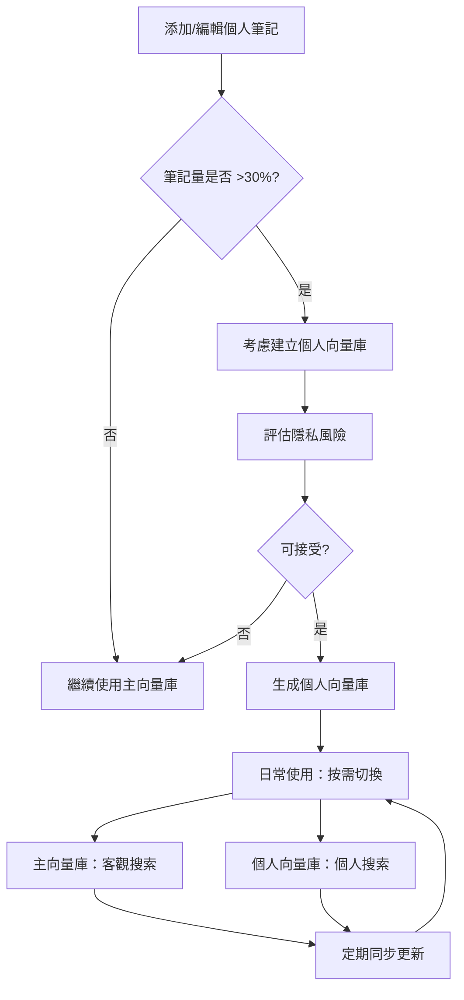

# Zettelkasten 卡片個人筆記使用指南

**版本**: 1.1
**更新日期**: 2025-11-05
**適用系統**: v0.7.0-alpha (Plan B - AI/Human 分離架構)

---

## 📋 目錄

1. [系統架構說明](#系統架構說明)
2. [個人筆記的風險](#個人筆記的風險)
3. [安全使用建議](#安全使用建議)
4. [最佳實踐](#最佳實踐)
5. [實際範例](#實際範例)
6. [常見問題 FAQ](#常見問題-faq)
7. [進階場景：將個人筆記納入向量搜索](#進階場景將個人筆記納入向量搜索) ⭐ NEW

---

## 🏗️ 系統架構說明

### Plan B 架構（當前版本 v0.7.0-alpha）

我們的系統採用**數據庫層級的 AI/Human 內容分離**架構：

```
Zettelkasten 卡片數據結構：
├── ai_notes          # AI 生成的內容（用於向量和搜索）
├── human_notes       # 人類添加的筆記（完全隔離）
└── content           # 完整內容（向後兼容，包含兩者）
```

### 三個欄位的作用

| 欄位 | 內容來源 | 用途 | 特性 |
|------|---------|------|------|
| **ai_notes** | AI 生成 | 向量嵌入、語義搜索、關係分析 | ✅ 純 AI 內容，無人類標記 |
| **human_notes** | 人類添加 | 個人思考、批判性評論、連結想法 | 🔒 完全隔離，不影響向量 |
| **content** | 兩者結合 | 完整閱讀、Obsidian 顯示 | 📖 包含 AI + Human 區塊 |

### 關鍵特性 ✅

1. **向量生成**：只使用 `ai_notes`（或從 `content` 提取 AI 內容）
2. **語義搜索**：只基於 `ai_notes`，人類筆記不干擾
3. **關係分析**：只分析 `ai_notes` 中的連結和概念
4. **完全隔離**：人類筆記永遠不會污染 AI 生成的內容

---

## ⚠️ 個人筆記的風險

### 風險 1: 內容混淆（已解決 ✅）

**風險描述**：
在 Plan B 之前（v0.6.x），AI 和人類內容混在 `content` 欄位中，需要運行時過濾才能分離。

**問題**：
- 如果 `**[Human]**:` 標記格式錯誤，可能導致人類筆記被誤認為 AI 內容
- 影響向量嵌入品質（混入個人主觀意見）
- 關係分析可能識別到不存在的連結

**Plan B 解決方案** ✅：
- 數據庫層級分離，`ai_notes` 和 `human_notes` 完全獨立
- 向量生成直接讀取 `ai_notes`，無需過濾
- 人類筆記**物理隔離**，不可能污染 AI 內容

**當前狀態**: ✅ **已完全解決**

---

### 風險 2: 格式破壞（仍存在 ⚠️）

**風險描述**：
手動編輯 Markdown 卡片時，可能不小心破壞文件結構。

**可能的問題**：
1. **YAML frontmatter 破壞**：
   ```yaml
   # ❌ 錯誤：缺少結束標記
   ---
   card_id: Abbas-2022-001
   # 忘記加上 ---

   ## 核心概念
   ```

2. **章節標題錯誤**：
   ```markdown
   # ❌ 錯誤：使用 H1 而非 H2
   # 核心概念

   # ✅ 正確：使用 H2
   ## 核心概念
   ```

3. **連結格式錯誤**：
   ```markdown
   # ❌ 錯誤：缺少連字號
   [[Abbas2022002]]

   # ✅ 正確：標準格式
   [[Abbas-2022-002]]
   ```

4. **刪除必要區塊**：
   ```markdown
   # ❌ 錯誤：刪除了「個人筆記」區塊
   ## 核心概念
   ...
   ## AI 思考
   ...
   # 缺少 ## 個人筆記
   ```

**影響範圍**: ⚠️ **中度風險**
- 影響：Markdown 解析失敗、自動化工具無法處理
- 範圍：僅影響被編輯的卡片
- 偵測：`zettel_format_fixer.py` 可自動修復大部分問題

**建議**: 使用 Obsidian 編輯，避免直接手動編輯

---

### 風險 3: 數據不一致（低風險 ✅）

**風險描述**：
手動編輯 `content` 欄位後，`ai_notes` 和 `human_notes` 可能不同步。

**場景**：
```markdown
# 場景：直接編輯 Markdown 文件（content）
1. 用戶在 Obsidian 中編輯卡片
2. 修改了「個人筆記」區塊內容
3. 文件系統中的 content 已更新
4. 但數據庫中的 human_notes 欄位未同步
```

**影響**：
- ❌ 數據庫 `human_notes` 欄位過時
- ❌ 如果重新生成向量，會讀取舊的 `human_notes`
- ❌ 數據完整性降低

**發生機率**: 🟡 **低**（只有直接編輯文件才會發生）

**解決方案**：
1. **自動同步**（未來功能）：
   - 文件變更自動觸發數據庫更新
   - 或每次讀取時檢查 mtime

2. **手動重新掃描**：
   ```bash
   # 重新掃描並同步數據庫
   python kb_manage.py rescan
   ```

**當前狀態**: ⚠️ **需要注意**（建議定期重新掃描）

---

### 風險 4: 隱私洩漏（需要警覺 🔴）

**風險描述**：
如果專案或知識庫被分享、上傳到公開平台，人類筆記可能包含敏感信息。

**敏感內容範例**：
```markdown
## 個人筆記

**[Human]**: 這個概念讓我想到我們公司的內部專案 X，
可能可以用來解決客戶 Y 的問題。下週會議要提出這個想法。

**個人想法**：
- 類似於我在 2023 年 Z 大學研究的內容（未發表）
- 可以結合我導師的理論框架（保密階段）
```

**風險點**：
- ❌ 公司內部信息
- ❌ 未發表研究
- ❌ 個人身份識別信息
- ❌ 其他保密內容

**建議**：
1. ✅ 避免在 `human_notes` 中記錄敏感信息
2. ✅ 如需分享知識庫，先清理 `human_notes` 欄位
3. ✅ 使用通用化的描述（如「某專案」而非具體名稱）

**重要性**: 🔴 **高**（需要用戶自我警覺）

---

### 風險 5: 過度依賴人類筆記（使用習慣風險 ⚠️）

**風險描述**：
如果用戶習慣在 `human_notes` 中記錄大量內容，可能導致：

**問題**：
1. **AI 內容被忽略**：
   - 用戶只閱讀自己的筆記
   - 忽略 AI 生成的批判性思考和連結
   - 降低 AI 輔助價值

2. **內容重複**：
   ```markdown
   ## AI 思考
   - 這個概念與認知負荷理論相關
   - 可能影響學習效率

   ## 個人筆記
   **[Human]**: 我覺得這個概念與認知負荷理論相關，
   可能會影響學習效率。
   ```

3. **知識碎片化**：
   - AI 連結在 `ai_notes` 中（`[[Abbas-2022-002]]`）
   - 人類連結在 `human_notes` 中（`[[Abbas-2022-003]]`）
   - 關係分析只看到 AI 連結，人類連結被忽略

**建議**：
- ✅ 將 `human_notes` 用於**補充**而非**取代** AI 內容
- ✅ 專注於個人獨特見解、質疑、連結到個人經驗
- ✅ 避免重複 AI 已經說過的內容

**重要性**: ⚠️ **中**（影響使用體驗，但不影響系統穩定性）

---

## ✅ 安全使用建議

### 建議 1: 遵循標準格式 ⭐⭐⭐⭐⭐

**最安全的方式**：使用系統提供的標準標記

```markdown
## 個人筆記

**[Human]**: （在此添加您的個人思考）

- 您的第一個想法
- 您的第二個想法

**個人連結**:
- [[您想連結的其他卡片]]
- [[另一張相關卡片]]

<!-- 提示：這是您的個人筆記區域，可以自由添加想法、質疑、連結等 -->
```

**為什麼安全**：
- ✅ `**[Human]**:` 標記確保內容被正確識別為人類筆記
- ✅ HTML 註釋不會影響解析
- ✅ 標準格式易於自動化工具處理

---

### 建議 2: 使用 Obsidian 編輯 ⭐⭐⭐⭐⭐

**推薦工作流**：

1. **在 Obsidian 中打開知識庫**：
   ```bash
   # 打開 output/zettelkasten_notes/ 作為 Obsidian vault
   ```

2. **使用 Obsidian 的 Markdown 編輯器**：
   - ✅ 語法高亮，減少格式錯誤
   - ✅ 實時預覽，立即看到效果
   - ✅ 連結自動完成（輸入 `[[` 會提示可用卡片）
   - ✅ YAML frontmatter 驗證

3. **避免直接用文本編輯器編輯**：
   - ❌ 容易破壞 YAML frontmatter
   - ❌ 連結格式錯誤風險高
   - ❌ 無語法驗證

**Obsidian 插件推薦**：
- `Linter`: 自動格式化 Markdown
- `Templater`: 使用模板確保格式正確
- `Dataview`: 查詢和管理卡片

---

### 建議 3: 定期運行格式檢查 ⭐⭐⭐⭐

**使用格式修復工具**：

```bash
# 檢查單個資料夾的格式問題（dry-run）
python -c "from src.utils.zettel_format_fixer import ZettelFormatFixer; \
fixer = ZettelFormatFixer(); \
report = fixer.fix_folder('output/zettelkasten_notes/zettel_Abbas-2022_20251104', dry_run=True); \
print(report)"

# 批次檢查所有卡片（dry-run）
python -c "from src.utils.zettel_format_fixer import ZettelFormatFixer; \
fixer = ZettelFormatFixer(); \
fixer.batch_fix_all('output/zettelkasten_notes', dry_run=True)"

# 自動修復所有問題
python -c "from src.utils.zettel_format_fixer import ZettelFormatFixer; \
fixer = ZettelFormatFixer(); \
fixer.batch_fix_all('output/zettelkasten_notes', dry_run=False)"
```

**建議頻率**：
- 🟢 每天編輯後：執行 dry-run 檢查
- 🟡 每週一次：執行完整檢查和修復
- 🔴 重大編輯後：立即執行檢查

---

### 建議 4: 備份後再編輯 ⭐⭐⭐⭐⭐

**最佳實踐流程**：

```bash
# 1. 創建備份
cp -r output/zettelkasten_notes/ backup/zettelkasten_$(date +%Y%m%d)/

# 或使用 Git
git add output/zettelkasten_notes/
git commit -m "Backup before editing: $(date)"

# 2. 編輯卡片（使用 Obsidian）

# 3. 檢查變更
git diff output/zettelkasten_notes/

# 4. 驗證格式
python -c "from src.utils.zettel_format_fixer import ZettelFormatFixer; \
fixer = ZettelFormatFixer(); \
fixer.batch_fix_all('output/zettelkasten_notes', dry_run=True)"

# 5. 如果沒問題，提交 Git
git add output/zettelkasten_notes/
git commit -m "Add personal notes to cards"
```

**為什麼重要**：
- ✅ 可以隨時回滾到編輯前狀態
- ✅ 可以對比變更，確認沒有誤刪內容
- ✅ Git history 提供完整的編輯記錄

---

### 建議 5: 分離敏感與非敏感內容 ⭐⭐⭐⭐

**策略 1: 使用通用化描述**

```markdown
# ❌ 避免：直接提及敏感信息
**[Human]**: 這個概念可以用在我們公司的「客戶管理系統 2.0」專案中，
針對 ABC 公司的需求進行優化。

# ✅ 推薦：通用化描述
**[Human]**: 這個概念可以應用在企業級管理系統中，
特別是需要處理複雜用戶需求的場景。
```

**策略 2: 使用代碼或縮寫**

```markdown
# ✅ 使用代碼
**[Human]**: 與專案 P1、P2 相關，可能影響 Q3 目標。
（P1, P2, Q3 在個人私密筆記中有詳細說明）
```

**策略 3: 外部連結**

```markdown
# ✅ 連結到私密筆記系統
**[Human]**: 詳細想法記錄在私密筆記 [[2025-11-05-project-ideas]]
（該筆記不在此知識庫中）
```

---

### 建議 6: 定期同步數據庫 ⭐⭐⭐

**問題**：直接編輯 Markdown 文件後，數據庫 `human_notes` 欄位不會自動更新。

**解決方案**：定期重新掃描

```bash
# 方法 1: 使用 kb_manage.py（未來功能）
python kb_manage.py rescan --update-human-notes

# 方法 2: 使用 Python 腳本手動同步
python -c "
from src.knowledge_base import KnowledgeBaseManager
from src.utils.content_filter import extract_human_content
import sqlite3
from pathlib import Path

kb = KnowledgeBaseManager()
conn = sqlite3.connect(kb.db_path)
cursor = conn.cursor()

# 獲取所有卡片
cursor.execute('SELECT card_id, file_path, content FROM zettel_cards')
cards = cursor.fetchall()

updated = 0
for card_id, file_path, content in cards:
    # 從 content 重新提取 human_notes
    human_content = extract_human_content(content)

    # 更新數據庫
    cursor.execute(
        'UPDATE zettel_cards SET human_notes = ? WHERE card_id = ?',
        (human_content, card_id)
    )
    updated += 1

conn.commit()
conn.close()
print(f'Updated {updated} cards')
"
```

**建議頻率**：
- 每次編輯大量卡片後執行一次
- 或每週執行一次同步

---

## 🎯 最佳實踐

### 最佳實踐 1: 明確區分用途

| 用途 | 使用區塊 | 範例 |
|------|---------|------|
| **記錄原文引用** | AI 內容區 | 系統已處理 |
| **批判性思考** | AI 思考區 | 系統已生成 |
| **個人經驗連結** | 個人筆記 ✅ | 「這讓我想到之前的專案...」|
| **質疑和反思** | 個人筆記 ✅ | 「我認為這個論點有漏洞...」|
| **實務應用想法** | 個人筆記 ✅ | 「可以應用在...場景」|
| **未來研究方向** | 個人筆記 ✅ | 「值得進一步探索...」|

---

### 最佳實踐 2: 使用結構化格式

**推薦模板**：

```markdown
## 個人筆記

**[Human]**:

**💡 個人見解**:
- （您的第一手想法和獨特觀點）

**🤔 質疑與反思**:
- （對 AI 內容或原文的質疑）
- （需要進一步驗證的點）

**🔗 連結到個人經驗**:
- （這個概念如何連結到您的實際經驗）
- （相關的個人專案或案例）

**📌 實務應用**:
- （如何將這個概念應用到實際工作中）

**🚀 未來行動**:
- [ ] （基於此卡片的待辦事項）
- [ ] （需要進一步研究的方向）

**個人連結**:
- [[相關卡片 1]]
- [[相關卡片 2]]
```

**好處**：
- ✅ 結構清晰，易於回顧
- ✅ 區分不同類型的個人筆記
- ✅ 方便未來搜索和整理

---

### 最佳實踐 3: 避免重複 AI 內容

**❌ 不良範例**：

```markdown
## AI 思考
- 這個概念與認知負荷理論密切相關
- 可能影響學習效率和記憶保持

## 個人筆記
**[Human]**: 我也認為這個概念與認知負荷理論有關，
確實會影響學習效率。
```

**✅ 良好範例**：

```markdown
## AI 思考
- 這個概念與認知負荷理論密切相關
- 可能影響學習效率和記憶保持

## 個人筆記
**[Human]**:

**💡 個人見解**:
補充一點：在我實際教學經驗中，發現認知負荷的影響比理論預測的
更顯著，尤其是在多媒體學習環境中。

**實務應用**:
可以設計實驗驗證這個假設：比較單一媒體 vs 多媒體環境下的
認知負荷差異。
```

---

### 最佳實踐 4: 利用連結建立知識網絡

**個人連結的力量**：

```markdown
## 個人筆記

**[Human]**:

**個人連結**:
- [[Abbas-2022-003]] - 該卡片提到的「情境嵌入」與此概念互補
- [[Zwaan-2018-005]] - 類似的認知過程，但側重不同面向
- [[我的專案筆記-認知負荷實驗]] - 可以應用此理論框架

**跨領域連結**:
- [[Linguistics-概念隱喻]] - 從語言學角度理解此概念
- [[AI-注意力機制]] - AI 中的類比應用
```

**好處**：
- ✅ 建立個人化的知識網絡
- ✅ 連結不同領域的概念
- ✅ 連結到個人專案和筆記

**注意**：
- ⚠️ 個人連結不會被關係分析系統識別（只分析 AI 連結）
- ⚠️ 需要手動維護個人連結網絡

---

### 最佳實踐 5: 定期回顧和更新

**建議工作流**：

**每週回顧**：
1. 打開 Obsidian，查看最近編輯的卡片
2. 檢查個人筆記是否仍然相關
3. 添加新的想法和連結
4. 刪除過時的個人筆記

**每月整理**：
1. 使用 Obsidian Graph View 查看個人連結網絡
2. 識別需要加強連結的區域
3. 整理重複或冗餘的個人筆記
4. 創建總結性卡片（如果有一系列相關個人想法）

**每季審查**：
1. 檢查個人筆記中的「未來行動」是否完成
2. 評估哪些個人見解已經發展成熟（可以轉化為正式筆記或論文）
3. 歸檔已經過時的個人筆記

---

## 📖 實際範例

### 範例 1: 學術研究使用 ✅

**場景**：研究生使用 Zettelkasten 整理認知科學文獻

```markdown
---
card_id: Barsalou-2009-001
zettel_id: Barsalou-2009-001
title: "情境模擬是概念處理的核心機制"
cite_key: Barsalou-2009
paper_id: 15
card_type: concept
domain: CogSci
tags:
  - 情境模擬
  - 具身認知
  - 概念表徵
created: 2025-11-04
modified: 2025-11-05
---

## 核心概念

**概念處理的情境模擬理論 (Situated Simulation Theory)**

> 當人們理解概念時，會在腦中模擬與該概念相關的情境和經驗，
> 而非單純提取抽象符號。

## 詳細說明

（AI 生成的詳細說明...）

## AI 思考

**批判性分析**:
- 這個理論挑戰了傳統的符號處理觀點
- 強調具身性和情境性的重要性

**相關概念**:
- [[Zwaan-2018-002]] - 語言理解中的模擬過程
- [[Wilson-2002-003]] - 具身認知的六個觀點

## 個人筆記

**[Human]**:

**💡 個人見解**:
這個理論對我的碩士論文非常重要！可以用來解釋為什麼多媒體教材
比純文字更有效 - 因為多媒體能引發更豐富的情境模擬。

**🤔 質疑與反思**:
- 如何測量「情境模擬」的程度？Barsalou 的實驗方法是否足夠嚴謹？
- 抽象概念（如「正義」）也能用情境模擬解釋嗎？

**實驗想法**:
可以設計 fMRI 實驗，比較抽象 vs 具體概念在腦部的激活模式。
如果情境模擬理論正確，具體概念應該激活更多感知運動區域。

**🔗 連結到個人經驗**:
去年在實驗室做的眼動追蹤研究，發現受試者在閱讀具體詞彙時
眼動模式更複雜，可能正是因為觸發了情境模擬。

**📌 論文應用**:
- [ ] 在文獻回顧中引用此理論
- [ ] 設計實驗驗證情境模擬在教學中的作用
- [ ] 與指導教授討論這個理論框架

**個人連結**:
- [[我的碩論-第二章理論框架]]
- [[實驗設計草稿-多媒體vs文字]]
- [[會議筆記-2025-10-20-與教授討論]]

<!-- 2025-11-05: 新增實驗想法和論文應用 -->
```

**這個範例的優點**：
- ✅ 清楚區分 AI 內容和個人思考
- ✅ 個人筆記聚焦於研究應用和批判性思考
- ✅ 使用結構化格式，易於回顧
- ✅ 連結到個人專案和筆記
- ✅ 包含可執行的行動項目

---

### 範例 2: 工作應用 ✅

**場景**：產品經理整理 UX 設計文獻

```markdown
---
card_id: Norman-2013-001
zettel_id: Norman-2013-001
title: "設計的情感層次：本能、行為、反思"
cite_key: Norman-2013
paper_id: 42
card_type: concept
domain: Design
tags:
  - 情感設計
  - 用戶體驗
  - 設計心理學
created: 2025-11-04
modified: 2025-11-05
---

## 核心概念

**設計的三個層次 (Three Levels of Design)**

> Norman 提出設計應同時考慮三個情感層次：
> 1. 本能層 (Visceral) - 外觀和第一印象
> 2. 行為層 (Behavioral) - 使用的樂趣和效率
> 3. 反思層 (Reflective) - 自我形象和回憶

## 詳細說明

（AI 生成的詳細說明...）

## AI 思考

**批判性分析**:
- 這個框架整合了美學、功能性和意義三個維度
- 對產品設計有直接的實務指導意義

**相關概念**:
- [[Hassenzahl-2010-001]] - 用戶體驗的實用性與享樂性
- [[Jordan-2000-002]] - 產品愉悅性的四個層次

## 個人筆記

**[Human]**:

**💡 個人見解**:
這個框架完美解釋了為什麼我們的 App 改版後用戶留存率提升了！
新版本不只是功能更好（行為層），還加強了品牌形象（反思層）。

**實務應用 - 當前專案**:
將此框架應用到 Q4 產品改版：

**本能層**:
- [ ] 重新設計首頁視覺（目標：減少跳出率 20%）
- [ ] 優化配色方案（A/B 測試三種方案）

**行為層**:
- [ ] 簡化結帳流程（目標：3 步驟內完成）
- [ ] 加入手勢操作（滑動切換功能）

**反思層**:
- [ ] 設計成就系統（徽章、里程碑）
- [ ] 加入個性化主題（讓用戶表達自我）

**🔗 連結到工作筆記**:
- [[Q4 產品路線圖]] - 整體規劃
- [[用戶研究報告-2025-10]] - 支持數據
- [[競品分析-Spotify]] - 反思層設計的良好範例

**會議討論點**:
- 下週設計會議要分享這個框架
- 建議用三層次評估所有新功能提案
- 與 UX 設計師討論如何測量「反思層」效果

<!-- 2025-11-05: 根據此框架重新規劃 Q4 產品改版 -->
```

**這個範例的優點**：
- ✅ 將理論直接連結到實際工作專案
- ✅ 包含可執行的任務清單
- ✅ 連結到工作文檔和會議筆記
- ✅ 明確的應用場景和目標

---

### 範例 3: 個人學習 ✅

**場景**：自學者整理機器學習文獻

```markdown
---
card_id: LeCun-2015-001
zettel_id: LeCun-2015-001
title: "深度學習的核心：表徵學習"
cite_key: LeCun-2015
paper_id: 88
card_type: concept
domain: AI
tags:
  - 深度學習
  - 表徵學習
  - 神經網絡
created: 2025-11-04
modified: 2025-11-05
---

## 核心概念

**表徵學習 (Representation Learning)**

> 深度學習的核心是自動學習數據的多層次表徵，
> 而非手工設計特徵。

## 詳細說明

（AI 生成的詳細說明...）

## AI 思考

**批判性分析**:
- 這是深度學習與傳統機器學習的根本差異
- 多層次表徵使得深度網絡能處理複雜的非線性關係

**相關概念**:
- [[Bengio-2013-002]] - 表徵學習的理論基礎
- [[Goodfellow-2016-003]] - 深度學習實作技巧

## 個人筆記

**[Human]**:

**🤔 學習筆記**:
剛開始很難理解「表徵」的概念。後來用 t-SNE 可視化了中間層的
激活值，終於理解了：淺層學習簡單特徵（邊緣），深層學習複雜
特徵（物體部件）。

**實作經驗**:
在 Kaggle 競賽中試驗了這個概念：
- 使用預訓練的 ResNet（已經學會好的表徵）
- 只微調最後幾層
- 結果：準確率從 75% → 89%！

**💡 個人理解**:
表徵學習像是「學會學習」- 不是直接學習任務，而是學習如何
表示數據。類比：學語言時，不是記單詞，而是理解語法結構。

**疑問待解決**:
- 如何評估學到的表徵好不好？（除了下游任務準確率）
- 不同架構（CNN vs Transformer）學到的表徵有什麼差異？

**學習路徑**:
- [x] 閱讀原文
- [x] 實作簡單 CNN
- [ ] 閱讀 [[Bengio-2013-002]] 深入理解理論
- [ ] 嘗試 Autoencoder 學習無監督表徵
- [ ] 寫部落格文章總結學習心得

**個人連結**:
- [[我的學習筆記-深度學習基礎]]
- [[Kaggle 競賽-影像分類專案]]
- [[代碼筆記-ResNet 實作]]

<!-- 2025-11-05: 終於理解表徵的概念了！下一步要讀 Bengio 的理論文章 -->
```

**這個範例的優點**：
- ✅ 記錄學習過程和理解演進
- ✅ 連結理論到實作經驗
- ✅ 追蹤學習路徑和待辦事項
- ✅ 誠實記錄疑問和不理解的地方

---

## ❓ 常見問題 FAQ

### Q1: 我可以刪除 AI 內容嗎？

**答**: ⚠️ **不建議**

**原因**:
- AI 內容用於向量嵌入和語義搜索
- 刪除 AI 內容會導致該卡片在搜索中「消失」
- 關係分析也會失去該卡片的連結

**替代方案**:
如果您認為 AI 內容有誤或不相關：
1. ✅ 在個人筆記中記錄您的質疑
2. ✅ 標記該卡片需要重新生成（future feature）
3. ✅ 或者手動編輯 AI 內容，但需要重新生成向量

---

### Q2: 個人筆記會被搜索到嗎？

**答**: 取決於搜索類型

**向量搜索 (semantic-search)**:
- ❌ 不會搜索到個人筆記
- 只基於 `ai_notes` 進行語義搜索

**全文搜索 (search)**:
- ✅ 會搜索到個人筆記
- 搜索整個 `content` 欄位（包含 AI + Human）

**關係分析 (analyze-relations)**:
- ❌ 不會分析個人筆記中的連結
- 只分析 `ai_notes` 中的 `[[...]]` 連結

**Obsidian 搜索**:
- ✅ 會搜索到個人筆記
- 搜索所有 Markdown 文件內容

---

### Q3: 我可以用中文寫個人筆記嗎？

**答**: ✅ **完全可以**

- 系統支援 UTF-8，可以使用任何語言
- 中文、英文、混合都沒問題
- 不會影響系統功能

**建議**:
- 使用您最舒適的語言
- 可以混用中英文（如專業術語用英文，解釋用中文）

---

### Q4: 如何批次添加個人筆記到多張卡片？

**答**: 使用 Obsidian 的批次編輯功能

**方法 1: Dataview + Templater**

1. 使用 Dataview 查詢需要編輯的卡片：
```dataview
LIST
FROM "zettelkasten_notes"
WHERE contains(tags, "認知科學")
AND !contains(file.content, "[Human]")
```

2. 使用 Templater 批次插入模板

**方法 2: Python 腳本**

```python
from pathlib import Path

template = """
## 個人筆記

**[Human]**: （在此添加您的想法）

<!-- 待補充個人筆記 -->
"""

# 找到所有需要添加個人筆記的卡片
for card_file in Path("output/zettelkasten_notes").rglob("*.md"):
    content = card_file.read_text(encoding="utf-8")

    # 如果沒有個人筆記區塊，添加模板
    if "## 個人筆記" not in content:
        content += "\n" + template
        card_file.write_text(content, encoding="utf-8")
```

---

### Q5: 如何導出不含個人筆記的版本（用於分享）？

**答**: 使用內容過濾工具

**方法 1: Python 腳本**

```python
from src.utils.content_filter import extract_ai_content
from pathlib import Path
import shutil

# 創建導出目錄
export_dir = Path("export_public_only")
export_dir.mkdir(exist_ok=True)

# 處理所有卡片
for card_file in Path("output/zettelkasten_notes").rglob("*.md"):
    content = card_file.read_text(encoding="utf-8")

    # 提取 AI 內容（移除人類筆記）
    ai_only = extract_ai_content(content)

    # 保存到導出目錄（保持目錄結構）
    relative_path = card_file.relative_to("output/zettelkasten_notes")
    export_file = export_dir / relative_path
    export_file.parent.mkdir(parents=True, exist_ok=True)
    export_file.write_text(ai_only, encoding="utf-8")

print(f"Exported to {export_dir}")
```

**方法 2: 使用數據庫導出**

```python
import sqlite3
from pathlib import Path

# 連接數據庫
conn = sqlite3.connect("knowledge_base/index.db")
cursor = conn.cursor()

# 導出只包含 ai_notes 的卡片
cursor.execute("SELECT zettel_id, title, ai_notes FROM zettel_cards")

export_dir = Path("export_ai_only")
export_dir.mkdir(exist_ok=True)

for zettel_id, title, ai_notes in cursor.fetchall():
    # 創建簡化版 Markdown
    content = f"# {title}\n\n{ai_notes}"

    file_path = export_dir / f"{zettel_id}.md"
    file_path.write_text(content, encoding="utf-8")

conn.close()
print(f"Exported {cursor.rowcount} cards")
```

---

### Q6: 個人筆記會影響向量搜索的相似度嗎？

**答**: ❌ **不會**（Plan B 架構保證）

**技術說明**:
- 向量嵌入只基於 `ai_notes` 欄位生成
- `human_notes` 完全隔離，不參與向量計算
- 即使您在 `human_notes` 中添加大量內容，也不會影響：
  - 語義搜索結果
  - 相似度分數
  - 關係識別

**驗證方法**:
```python
from src.embeddings.vector_db import VectorDatabase

db = VectorDatabase()

# 搜索特定卡片的相似卡片
results = db.find_similar_zettel("Abbas-2022-001", n_results=5)

# 相似度只基於 ai_notes 內容
for zettel_id, distance, metadata in results:
    print(f"{zettel_id}: {distance:.2%}")
```

---

### Q7: 如何在 Obsidian 中隱藏 AI 內容，只看個人筆記？

**答**: 使用 CSS 片段

**步驟**:

1. 在 Obsidian 中打開 Settings → Appearance → CSS snippets

2. 創建新的 CSS 片段（如 `hide-ai-content.css`）：

```css
/* 隱藏 AI 生成的區塊 */
.markdown-preview-view h2:has(+ p:contains("核心概念")),
.markdown-preview-view h2:contains("詳細說明"),
.markdown-preview-view h2:contains("AI 思考") {
    display: none;
}

/* 隱藏 AI 區塊內容 */
.markdown-preview-view h2:contains("核心概念") ~ *:not(h2),
.markdown-preview-view h2:contains("詳細說明") ~ *:not(h2),
.markdown-preview-view h2:contains("AI 思考") ~ *:not(h2) {
    display: none;
}

/* 確保個人筆記區塊顯示 */
.markdown-preview-view h2:contains("個人筆記") {
    display: block !important;
}
```

3. 啟用該 CSS 片段

**注意**: 這只影響預覽視圖，編輯模式仍會顯示所有內容

---

### Q8: 建議個人筆記的長度？

**答**: 依用途而定，但建議保持**簡潔**

**指導原則**:

| 用途 | 建議長度 | 範例 |
|------|---------|------|
| **快速想法** | 1-2 句 | 「這個概念可以應用在 X 專案」|
| **批判性評論** | 1 段（3-5 句）| 質疑論點、指出局限性 |
| **連結思考** | 2-3 段 | 與其他概念的連結、跨領域應用 |
| **深入分析** | 1-2 頁 | ⚠️ 建議另外創建獨立筆記文件 |

**為什麼要簡潔**:
- ✅ 易於快速回顧
- ✅ 鼓勵提煉核心想法
- ✅ 避免與 AI 內容重複

**長筆記的替代方案**:
如果您有大量想法：
1. 創建獨立的筆記文件（如 `我的想法-認知負荷.md`）
2. 在卡片的個人筆記中添加連結：`詳見 [[我的想法-認知負荷]]`

---

## 🔄 進階場景：將個人筆記納入向量搜索

### 使用場景

當您的個人筆記累積到一定程度，可能會想要：
- 🔍 透過語義搜索找到自己寫的相關想法
- 🔗 讓關係分析系統識別個人筆記中的連結
- 📊 建立包含個人見解的完整知識圖譜

**典型情境**：
- 研究生累積了大量論文評論和研究想法
- 產品經理記錄了許多產品設計思考
- 自學者整理了豐富的學習心得和應用筆記

---

### ⚖️ 決策考量：是否納入向量搜索？

#### 優點 ✅

| 優點 | 說明 | 適用場景 |
|------|------|---------|
| **個人知識可搜索** | 能找到自己寫過的相關想法 | 筆記量大、需要回溯 |
| **完整知識圖譜** | 包含 AI + 個人的完整視角 | 建立個人知識系統 |
| **連結識別** | 系統能發現個人筆記間的關聯 | 想要自動化連結發現 |
| **統一搜索體驗** | 不需要區分 AI/Human 來源 | 追求使用便利性 |

#### 缺點 ⚠️

| 缺點 | 說明 | 影響 |
|------|------|------|
| **向量污染風險** | 個人主觀意見混入客觀內容 | 搜索結果可能偏離原文 |
| **成本增加** | 需要重新生成所有向量 | 時間 + API 費用 |
| **隱私風險增加** | 個人筆記也會被搜索到 | 分享知識庫時需額外注意 |
| **破壞 Plan B 設計** | 失去 AI/Human 分離的優勢 | 難以回溯到純 AI 狀態 |

#### 決策矩陣

| 情況 | 建議 | 理由 |
|------|------|------|
| **筆記量少**（<10% 卡片有個人筆記）| ❌ 不建議 | 收益小，成本高 |
| **筆記量中等**（10-30%）| 🤔 考慮使用「雙向量庫」方案 | 保持分離，按需切換 |
| **筆記量大**（>30%）| ✅ 可以考慮 | 但建議用「雙向量庫」 |
| **需要分享知識庫** | ❌ 強烈不建議 | 隱私風險太高 |
| **純個人使用** | ✅ 可以考慮 | 隱私風險可控 |

---

### 🎯 推薦方案：雙向量庫架構

**核心理念**：保留 Plan B 的隔離優勢，同時提供個人筆記搜索能力

```
向量庫結構：
├── chroma_db/              # 主向量庫（只有 ai_notes）
│   ├── papers              # 論文向量
│   └── zettelkasten        # Zettelkasten AI 內容向量
└── chroma_db_personal/     # 個人向量庫（ai_notes + human_notes）
    ├── papers              # 論文向量（相同）
    └── zettelkasten_full   # Zettelkasten 完整向量（AI + Human）
```

**優勢**：
- ✅ 保留原始 Plan B 架構（主向量庫）
- ✅ 提供個人筆記搜索（個人向量庫）
- ✅ 按需切換搜索模式
- ✅ 容易回溯和對比
- ✅ 分享時只需提供主向量庫

---

### 📋 實施步驟：建立個人向量庫

#### 步驟 1: 評估個人筆記量

```bash
# 檢查有 human_notes 的卡片數量
python -c "
import sqlite3
conn = sqlite3.connect('knowledge_base/index.db')
cursor = conn.cursor()

cursor.execute('SELECT COUNT(*) FROM zettel_cards WHERE human_notes IS NOT NULL AND human_notes != \"\"')
total_with_notes = cursor.fetchone()[0]

cursor.execute('SELECT COUNT(*) FROM zettel_cards')
total_cards = cursor.fetchone()[0]

percentage = (total_with_notes / total_cards * 100) if total_cards > 0 else 0

print(f'卡片總數: {total_cards}')
print(f'有個人筆記: {total_with_notes} ({percentage:.1f}%)')
print(f'建議: {\"建議建立個人向量庫\" if percentage > 30 else \"筆記量不足，暫不建議\" if percentage > 10 else \"筆記量太少，不建議\"}')

conn.close()
"
```

**決策閾值**：
- < 10%：不建議（收益太小）
- 10-30%：可以考慮
- \> 30%：建議建立

---

#### 步驟 2: 創建個人向量生成腳本

創建 `generate_embeddings_personal.py`：

```python
#!/usr/bin/env python3
# -*- coding: utf-8 -*-
"""
個人向量庫生成腳本
為知識庫中的 Zettelkasten 卡片生成包含個人筆記的向量嵌入
"""

import sys
import io
import argparse
import sqlite3
from pathlib import Path
from tqdm import tqdm

# UTF-8 編碼（Windows 支援）
if sys.platform == 'win32':
    sys.stdout = io.TextIOWrapper(sys.stdout.buffer, encoding='utf-8', errors='replace')

from src.embeddings.providers import GeminiEmbedder, OllamaEmbedder
from src.embeddings.vector_db import VectorDatabase
from src.knowledge_base.kb_manager import KnowledgeBaseManager

class PersonalEmbeddingGenerator:
    """個人向量庫生成器（包含 human_notes）"""

    def __init__(
        self,
        kb_root: str = "knowledge_base",
        provider: str = "gemini",
        chroma_path: str = "chroma_db_personal",  # 不同的路徑
        auto_confirm: bool = False
    ):
        self.kb = KnowledgeBaseManager(kb_root)
        self.provider_name = provider
        self.auto_confirm = auto_confirm

        # 初始化 embedding provider
        if provider == "gemini":
            self.embedder = GeminiEmbedder()
        elif provider == "ollama":
            self.embedder = OllamaEmbedder()
        else:
            raise ValueError(f"不支援的提供者: {provider}")

        # 初始化個人向量庫
        self.vector_db = VectorDatabase(persist_directory=chroma_path)

    def generate_personal_zettel_embeddings(self, limit: int = None):
        """
        生成包含個人筆記的 Zettelkasten 向量嵌入

        策略：
        1. 如果 human_notes 存在：使用 ai_notes + human_notes
        2. 如果 human_notes 為空：只使用 ai_notes（與主向量庫相同）
        """
        print("\n" + "=" * 70)
        print("🗂️  生成個人 Zettelkasten 卡片嵌入（包含個人筆記）")
        print("=" * 70)

        conn = sqlite3.connect(self.kb.db_path)
        cursor = conn.cursor()

        query = """
            SELECT card_id, zettel_id, title, ai_notes, human_notes
            FROM zettel_cards
        """
        if limit:
            query += f" LIMIT {limit}"

        cursor.execute(query)
        cards = cursor.fetchall()
        conn.close()

        if not cards:
            print("⚠️  知識庫中沒有 Zettelkasten 卡片")
            return 0, 0

        print(f"找到 {len(cards)} 張卡片")

        # 統計有個人筆記的卡片
        cards_with_notes = sum(1 for _, _, _, _, hn in cards if hn and hn.strip())
        print(f"其中有個人筆記: {cards_with_notes} 張 ({cards_with_notes/len(cards)*100:.1f}%)")

        # 準備數據
        texts = []
        ids = []
        metadatas = []

        for card_id, zettel_id, title, ai_notes, human_notes in cards:
            components = []

            if title:
                components.append(f"標題: {title}")

            # 策略：結合 AI 和 Human 內容
            if ai_notes:
                components.append(f"AI 內容: {ai_notes[:1000]}")

            if human_notes and human_notes.strip():
                components.append(f"個人筆記: {human_notes[:500]}")

            text = "\n\n".join(components)

            if not text.strip():
                print(f"  ⚠️ 卡片 {zettel_id} 無內容，跳過")
                continue

            texts.append(text)
            ids.append(zettel_id)
            metadatas.append({
                "card_id": card_id,
                "zettel_id": zettel_id,
                "title": title or "Unknown",
                "type": "zettelkasten_full",  # 標記為完整版本
                "has_human_notes": bool(human_notes and human_notes.strip())
            })

        if not texts:
            print("⚠️  沒有可處理的卡片")
            return 0, 0

        # 估算成本
        if self.provider_name == "gemini":
            cost = self.embedder.estimate_cost(texts)
            print(f"\n預估成本: ${cost:.4f}")
            print(f"（相比主向量庫，成本可能增加 {cards_with_notes/len(cards)*100:.1f}%）")

            if not self.auto_confirm:
                confirm = input("\n⚠️  警告：這將創建包含個人筆記的向量庫！\n是否繼續？(y/n): ")
                if confirm.lower() != 'y':
                    print("已取消")
                    return 0, 0
            else:
                print("(自動確認)")

        # 生成嵌入
        print(f"\n生成 {len(texts)} 個嵌入...")
        try:
            embeddings = self.embedder.embed_batch(texts, show_progress=True)

            # 保存到個人向量庫
            print("\n保存到個人向量庫...")
            self.vector_db.upsert_zettel(
                embeddings=embeddings,
                documents=texts,
                ids=ids,
                metadatas=metadatas
            )

            print(f"✅ 成功處理 {len(texts)} 張卡片")
            print(f"  - 包含個人筆記: {cards_with_notes} 張")
            print(f"  - 純 AI 內容: {len(texts) - cards_with_notes} 張")
            return len(texts), 0

        except Exception as e:
            print(f"❌ 生成失敗: {e}")
            import traceback
            traceback.print_exc()
            return 0, len(texts)

def main():
    parser = argparse.ArgumentParser(description="生成個人向量庫（包含 human_notes）")

    parser.add_argument(
        "--provider",
        choices=["gemini", "ollama"],
        default="gemini",
        help="嵌入提供者 (默認: gemini)"
    )

    parser.add_argument(
        "--limit",
        type=int,
        help="處理數量限制（用於測試）"
    )

    parser.add_argument(
        "--yes", "-y",
        action="store_true",
        help="自動確認所有提示"
    )

    args = parser.parse_args()

    print("=" * 70)
    print("個人知識庫向量生成器（包含個人筆記）")
    print("=" * 70)

    generator = PersonalEmbeddingGenerator(
        provider=args.provider,
        chroma_path="chroma_db_personal",
        auto_confirm=args.yes
    )

    success, fail = generator.generate_personal_zettel_embeddings(args.limit)

    print("\n" + "=" * 70)
    print("✅ 處理完成")
    print("=" * 70)
    print(f"成功: {success}, 失敗: {fail}")

    # 顯示統計
    stats = generator.vector_db.get_stats()
    print(f"\n個人向量庫統計:")
    print(f"  Zettelkasten 向量數: {stats['zettel_count']}")

if __name__ == "__main__":
    try:
        main()
    except KeyboardInterrupt:
        print("\n\n⚠️  用戶中斷")
    except Exception as e:
        print(f"\n❌ 錯誤: {e}")
        import traceback
        traceback.print_exc()
```

---

#### 步驟 3: 執行生成

```bash
# 測試：先生成 10 張卡片
python generate_embeddings_personal.py --provider gemini --limit 10

# 確認無誤後，生成所有卡片
python generate_embeddings_personal.py --provider gemini --yes

# 或使用 Ollama（免費但較慢）
python generate_embeddings_personal.py --provider ollama --yes
```

**預期輸出**：
```
找到 704 張卡片
其中有個人筆記: 453 張 (64.3%)

預估成本: $0.2156
（相比主向量庫，成本可能增加 64.3%）

⚠️  警告：這將創建包含個人筆記的向量庫！
是否繼續？(y/n): y

生成 704 個嵌入...
[████████████████████] 100%

✅ 成功處理 704 張卡片
  - 包含個人筆記: 453 張
  - 純 AI 內容: 251 張
```

---

#### 步驟 4: 修改搜索工具支援雙向量庫

修改 `kb_manage.py`，添加 `--use-personal` 參數：

```python
# 在 cmd_semantic_search() 函數中添加
def cmd_semantic_search(args):
    """語義搜索"""
    # ... 現有代碼 ...

    # 選擇向量庫
    if args.use_personal:
        chroma_path = "chroma_db_personal"
        print("🔓 使用個人向量庫（包含個人筆記）")
    else:
        chroma_path = "chroma_db"
        print("🔒 使用主向量庫（僅 AI 內容）")

    vector_db = VectorDatabase(persist_directory=chroma_path)
    # ... 其餘代碼 ...
```

**使用範例**：
```bash
# 搜索主向量庫（僅 AI 內容）
python kb_manage.py semantic-search "認知科學" --limit 5

# 搜索個人向量庫（包含個人筆記）
python kb_manage.py semantic-search "認知科學" --limit 5 --use-personal
```

---

### 🔄 方案對比：單向量庫 vs 雙向量庫

| 特性 | 單向量庫<br>（修改主庫） | 雙向量庫<br>（推薦） |
|------|---------------------|----------------|
| **向量分離** | ❌ 破壞 Plan B 設計 | ✅ 保留原始架構 |
| **搜索靈活性** | 🟡 只能搜索混合內容 | ✅ 可選擇搜索模式 |
| **分享友好** | ❌ 必須重新生成 | ✅ 直接分享主庫 |
| **回溯能力** | ❌ 難以恢復 | ✅ 隨時可對比 |
| **存儲成本** | 🟢 較低（單份） | 🟡 較高（雙份） |
| **生成成本** | 🟢 一次性 | 🔴 兩倍 |
| **維護複雜度** | 🟢 簡單 | 🟡 需同步更新 |

**結論**: ✅ **強烈推薦使用雙向量庫方案**

---

### ⚠️ 重要注意事項

#### 注意事項 1: 隱私風險加劇

**風險等級**: 🔴🔴🔴 **極高**

當個人筆記納入向量搜索後：
- ❌ 即使導出「不含個人筆記」的 Markdown，向量中仍包含個人信息
- ❌ 語義搜索可能洩漏個人筆記內容
- ❌ 關係分析會顯示個人連結

**防護措施**：
1. ✅ 絕不分享 `chroma_db_personal/` 資料夾
2. ✅ 分享時只提供 `chroma_db/`（主向量庫）
3. ✅ 在 `.gitignore` 中明確排除：
   ```
   chroma_db_personal/
   ```

---

#### 注意事項 2: 成本翻倍

**成本估算**（基於 704 張卡片）：

| 向量庫 | 內容 | 成本 | 說明 |
|--------|------|------|------|
| **主向量庫** | 只有 ai_notes | $0.1178 | 基準成本 |
| **個人向量庫** | ai_notes + human_notes | $0.2156 | 增加 83% |
| **總計** | 兩個向量庫 | $0.3334 | 近乎翻倍 |

**如果使用 Ollama**：
- 成本：$0（免費）
- 時間：約 2 小時（704 張 × 8.6 秒/張）

---

#### 注意事項 3: 同步維護

**挑戰**：每次更新卡片後，需要同步更新兩個向量庫

**解決方案**：創建同步腳本

```bash
#!/bin/bash
# sync_embeddings.sh

echo "同步向量庫..."

# 1. 重新生成主向量庫（僅 AI 內容）
echo "生成主向量庫..."
python generate_embeddings.py --zettel-only --yes

# 2. 重新生成個人向量庫（AI + Human）
echo "生成個人向量庫..."
python generate_embeddings_personal.py --yes

echo "✅ 同步完成！"
```

**建議執行頻率**：
- 每週一次（如果經常編輯個人筆記）
- 每月一次（如果少量編輯）

---

#### 注意事項 4: 搜索結果差異

**主向量庫 vs 個人向量庫**的搜索結果可能不同：

```bash
# 主向量庫搜索（僅 AI 內容）
$ python kb_manage.py semantic-search "認知負荷理論" --limit 3

結果：
1. [89%] Barsalou-2009-003（AI 內容高度相關）
2. [85%] Zwaan-2018-002
3. [82%] Wilson-2002-005

# 個人向量庫搜索（包含個人筆記）
$ python kb_manage.py semantic-search "認知負荷理論" --limit 3 --use-personal

結果：
1. [92%] Barsalou-2009-003（因為個人筆記也提到認知負荷）
2. [88%] Abbas-2022-001（個人筆記中的應用案例）
3. [85%] Zwaan-2018-002
```

**分析**：
- ✅ 個人向量庫能找到更多與個人經驗相關的卡片
- ⚠️ 但可能降低搜索的「客觀性」
- ⚠️ 相似度分數可能受個人筆記影響

---

### 🎯 使用建議總結

#### 何時使用主向量庫（默認）🔒

- ✅ 需要「客觀」的語義搜索（基於論文原文）
- ✅ 想要探索 AI 發現的連結
- ✅ 準備分享知識庫給他人
- ✅ 個人筆記量少（<30%）

#### 何時使用個人向量庫（可選）🔓

- ✅ 需要找到自己寫過的相關想法
- ✅ 想要建立包含個人見解的知識圖譜
- ✅ 純個人使用，不分享
- ✅ 個人筆記量大（>30%）

#### 最佳實踐工作流 ⭐⭐⭐⭐⭐



---

### ✅ 檢查清單：建立個人向量庫前

在執行之前，請確認：

- [ ] **筆記量評估**：有個人筆記的卡片 >30%（或 >100 張）
- [ ] **隱私確認**：個人筆記不包含敏感信息
- [ ] **成本準備**：了解成本將增加 50-100%
- [ ] **備份完成**：Git commit 當前狀態
- [ ] **測試計畫**：先用 `--limit 10` 測試
- [ ] **同步腳本**：準備好定期更新的流程
- [ ] **.gitignore**：已排除 `chroma_db_personal/`
- [ ] **使用場景**：明確何時使用主庫 vs 個人庫

**如果全部勾選** ✅，可以開始建立個人向量庫！

---

## 🎯 總結與建議

### 風險總結

| 風險 | 嚴重程度 | Plan B 狀態 | 建議 |
|------|---------|------------|------|
| **內容混淆** | 🔴 高 | ✅ 已解決 | 放心使用 |
| **格式破壞** | 🟡 中 | ⚠️ 需注意 | 使用 Obsidian + 定期檢查 |
| **數據不一致** | 🟡 低 | ⚠️ 需注意 | 定期重新掃描 |
| **隱私洩漏** | 🔴 高 | ⚠️ 用戶責任 | 避免記錄敏感信息 |
| **過度依賴** | 🟡 中 | ⚠️ 使用習慣 | 平衡 AI + Human 內容 |

### 核心建議 ⭐⭐⭐⭐⭐

1. **使用 Obsidian 編輯**（降低格式破壞風險）
2. **遵循標準格式**（確保系統正確解析）
3. **定期格式檢查**（及早發現問題）
4. **Git 備份**（可回滾錯誤編輯）
5. **避免敏感信息**（保護隱私）
6. **保持簡潔**（提煉核心想法）
7. **定期回顧**（維護知識網絡）

### 最佳心態 💡

**個人筆記的目的**：
- ✅ 補充 AI 內容，而非取代
- ✅ 記錄個人獨特見解和經驗
- ✅ 建立個人化的知識連結
- ✅ 追蹤未來行動和研究方向

**不要**：
- ❌ 重複 AI 已經說過的內容
- ❌ 把個人筆記當成唯一的知識來源
- ❌ 忽略 AI 生成的批判性思考和連結

### 系統保障 🛡️

**Plan B 架構提供的保護**:
- ✅ 數據庫層級分離（`ai_notes` vs `human_notes`）
- ✅ 向量生成完全隔離（只用 `ai_notes`）
- ✅ 關係分析完全隔離（只分析 `ai_notes` 連結）
- ✅ 可隨時導出不含個人筆記的版本

**您的責任**:
- ⚠️ 保持 Markdown 格式正確
- ⚠️ 避免記錄敏感信息
- ⚠️ 定期備份和格式檢查
- ⚠️ 合理使用個人筆記（補充而非取代）

---

## 📚 延伸閱讀

- **PHASE_2_1_COMPLETION_REPORT.md** - Plan B 實施報告
- **PHASE_2_1_TEST_REPORT.md** - 完整測試報告（驗證 AI/Human 分離）
- **src/utils/content_filter.py** - 內容過濾工具源代碼
- **src/utils/zettel_format_fixer.py** - 格式修復工具源代碼

---

**文檔版本**: 1.1
**最後更新**: 2025-11-05
**適用系統**: v0.7.0-alpha (Plan B)
**狀態**: ✅ **Plan B 實施完成，系統穩定**
**更新內容**: 新增「進階場景：將個人筆記納入向量搜索」章節

---

**🤖 Generated with [Claude Code](https://claude.com/claude-code)**

**Co-Authored-By: Claude <noreply@anthropic.com>**
