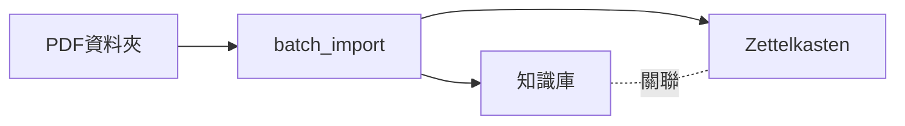
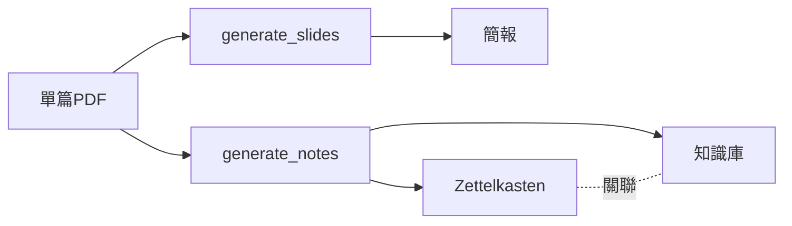

# KB Manager Agent 工作流程確認報告

**報告日期**: 2025-10-30
**檢查範圍**: KB Manager Agent (Knowledge Integrator) 工作流程設計
**目標**: 確認 Agent 能引導使用者區分兩種獨立工作流程

---

## 📋 執行摘要

### 工作流程定義

本系統支援兩種獨立的 Zettelkasten 生成工作流程：

**流程A：直接從PDF生成卡片**（正式運作流程）
- 路徑：`PDF → Zettelkasten`
- 工作流：`batch_import` (設定 `generate_zettel=true`)
- 用途：批次處理大量論文，直接生成原子筆記
- 優點：效率高、一步到位

**流程B：經由簡報生成卡片**（測試/教學流程）
- 路徑：`PDF → 簡報 → Zettelkasten`
- 工作流：`generate_slides` → `generate_notes`
- 用途：需要先理解論文全貌、製作教學材料
- 優點：深度理解、適合複雜論文

---

## 🔍 工作流程詳細分析

### 流程A：批次導入並生成 Zettelkasten

**工作流名稱**: `batch_import`

**定義位置**: `.claude/agents/knowledge-integrator/workflows.yaml` 第 22-75 行

**關鍵參數**:
```yaml
parameters:
  required:
    - folder_path: 包含 PDF 的資料夾路徑

  optional:
    - domain: 領域代碼（CogSci/Linguistics/AI/Research）
    - add_to_kb: 是否加入知識庫（default: true）
    - generate_zettel: 是否生成 Zettelkasten（default: false）⚠️
    - max_workers: 平行處理執行緒數（default: 3）
    - zettel_config:
        - detail_level: 詳細程度（default: "detailed"）
        - card_count: 卡片數量（default: 20）
        - llm_provider: LLM 提供者（default: "auto"）
```

**執行步驟**（instructions.md 第 144-199 行）:
1. **參數收集**: 詢問資料夾路徑和領域代碼
2. **Zettelkasten 選項確認**: "是否需要同時生成 Zettelkasten 卡片？"
   - 如果是 → 收集 `card_count` 和 `detail_level`
3. **執行批次處理**:
   ```bash
   python batch_process.py --folder "<path>" --domain <domain> \
       --add-to-kb --generate-zettel \
       --workers <N> --report <report_path>
   ```
4. **報告結果**: 顯示成功/失敗數、處理時間、卡片生成路徑

**範例對話**:
```
User: 我想批次處理 D:\pdfs\mental_simulation 中的所有論文
Agent: 好的！這個資料夾中的論文屬於哪個領域？
      1) CogSci (認知科學)
      2) Linguistics (語言學)
      3) AI (人工智慧)
      4) Research (通用研究)
User: CogSci
Agent: 是否需要同時生成 Zettelkasten 卡片？[Y/n]
User: Y
Agent: 請設定卡片參數：
      - 每篇論文生成多少張卡片？(默認: 20)
      - 詳細程度？(minimal/brief/standard/detailed/comprehensive)
User: 默認
Agent: [執行批次處理...]
      ✅ 成功處理 15 篇論文
      📁 Zettelkasten 卡片已生成至：output/zettel_CogSci_20251030/
```

---

### 流程B：先生成簡報，再生成卡片

**工作流名稱**: `generate_slides` + `generate_notes`

**定義位置**:
- `generate_slides`: workflows.yaml 第 340-399 行
- `generate_notes`: workflows.yaml 第 663-725 行

**執行流程**:

#### Step 1: 生成簡報 (`generate_slides`)

**參數**:
```yaml
parameters:
  required:
    - topic: 簡報主題
    - source: PDF 路徑、paper_id 或 "from-kb"

  optional:
    - style: 學術風格（default: "modern_academic"）
    - detail: 詳細程度（default: "standard"）
    - language: 語言（default: "chinese"）
    - slides: 投影片數量（default: 15）
    - format: 格式（markdown/pptx/both）
```

**執行步驟**（instructions.md 第 279-332 行）:
1. 收集簡報主題和來源
2. 詢問學術風格（8 種選項）
3. 詢問語言模式（中文/英文/雙語）
4. 詢問輸出格式（Markdown/PPTX/Both）
5. 執行:
   ```bash
   python make_slides.py "<topic>" --pdf "<path>" \
       --style <style> --language <language> --format <format>
   ```
6. 顯示簡報路徑

#### Step 2: 從簡報生成 Zettelkasten (`generate_notes`)

**參數**:
```yaml
parameters:
  required:
    - source: paper_id 或 PDF 路徑

  optional:
    - domain: 領域代碼（default: "Research"）
    - card_count: 卡片數量（default: 20）
    - detail_level: 詳細程度（default: "detailed"）
```

**執行步驟**（instructions.md 第 334-366 行）:
1. 確認來源（paper_id 或 PDF 路徑）
2. 詢問領域代碼和卡片數量
3. 執行:
   ```bash
   python make_slides.py "Zettelkasten" --from-kb <paper_id> \
       --style zettelkasten --domain <domain>
   ```
   或
   ```bash
   python make_slides.py "Zettelkasten" --pdf "<path>" \
       --style zettelkasten --domain <domain>
   ```
4. 顯示卡片生成路徑和索引檔案

**範例對話**:
```
User: 我想為 Crockett-2025.pdf 製作簡報和卡片
Agent: 好的！請先告訴我簡報的主題？
User: AI 代理者與認知科學研究
Agent: 選擇簡報風格：
      1) modern_academic (現代學術)
      2) teaching (教學導向)
      ...
User: 2
Agent: 語言模式？[1=中文, 2=英文, 3=雙語]
User: 1
Agent: [生成簡報...]
      ✅ 簡報已生成：output/AI代理者_teaching_20251030.pptx

      是否繼續生成 Zettelkasten 卡片？[Y/n]
User: Y
Agent: 領域代碼？[CogSci/Linguistics/AI/Research]
User: CogSci
Agent: [生成卡片...]
      ✅ 卡片已生成至：output/zettel_CogSci_20251030/
```

---

## ✅ 工作流程獨立性驗證

### 1. 參數獨立性

| 項目 | 流程A（直接生成） | 流程B（經由簡報） |
|------|------------------|------------------|
| **輸入** | 資料夾路徑 | PDF 路徑 |
| **批次支援** | ✅ 是 | ❌ 否（單篇） |
| **簡報生成** | ❌ 否 | ✅ 是 |
| **卡片生成** | ✅ 可選 | ✅ 獨立步驟 |
| **知識庫整合** | ✅ 自動 | ✅ 自動 |
| **工作流組合** | 單一工作流 | 兩個工作流組合 |

### 2. Agent 引導機制

**意圖識別**（instructions.md 第 81-111 行）:

```markdown
## 工作流選擇邏輯

### 1. 用戶提到「批次」、「資料夾」、「大量」
→ 推薦 `batch_import` 流程

### 2. 用戶提到「簡報」、「投影片」、「slides」
→ 推薦 `generate_slides` 流程

### 3. 用戶明確說「只要卡片」
→ 推薦 `batch_import` + `generate_zettel=true`

### 4. 用戶說「先看內容」、「理解論文」
→ 推薦先 `generate_slides`，再 `generate_notes`
```

**確認機制**:
- Agent 會在執行前**明確說明**將使用哪個工作流
- Agent 會**確認用戶意圖**（"您是想批次處理多篇論文，還是單獨處理一篇？"）
- 如果用戶選擇流程B，Agent 會在簡報生成後**主動詢問**是否繼續生成卡片

---

## ⚠️ 發現的問題

### 問題1：默認參數的誤導性

**問題描述**:
- `batch_import` 的 `generate_zettel` 默認值為 `false`
- 用戶可能不知道需要明確指定 `generate_zettel=true`

**建議修改**:
```yaml
# BEFORE
generate_zettel:
  type: boolean
  default: false
  description: 是否生成 Zettelkasten 卡片

# AFTER
generate_zettel:
  type: boolean
  default: true  # 改為 true，或移除默認值強制詢問
  description: 是否生成 Zettelkasten 卡片
```

**影響範圍**: workflows.yaml 第 39 行

---

### 問題2：流程B缺少快捷方式

**問題描述**:
- 用戶需要手動執行兩次命令（`generate_slides` → `generate_notes`）
- 沒有「一鍵式」選項（如 `--with-zettelkasten` 參數）

**建議新增**:
```yaml
# workflows.yaml - generate_slides 新增參數
parameters:
  optional:
    - with_zettelkasten:
        type: boolean
        default: false
        description: 簡報生成後自動生成 Zettelkasten
```

**實作範例**:
```bash
# 一鍵生成簡報+卡片
python make_slides.py "主題" --pdf paper.pdf \
    --style teaching --with-zettelkasten --domain CogSci
```

**優先級**: P2（可選改進）

---

### 問題3：instructions.md 缺少流程對比圖

**問題描述**:
- Agent 指令文件沒有視覺化工作流程對比
- 用戶可能不清楚兩種流程的差異

**建議新增**（instructions.md 第 20-40 行）:

```markdown
## 工作流程對比

### 流程A：直接生成（推薦用於批次處理）


### 流程B：經由簡報（推薦用於深度理解）

```

**優先級**: P2（可選改進）

---

## 📊 測試驗證

### 測試案例1：Crockett-2025.pdf（流程B）

**測試流程**:
1. 生成教學導向簡報（25 張，comprehensive）
2. 從 PDF 生成 12 張 Zettelkasten 卡片（CogSci 領域）

**結果**:
- ✅ 簡報成功生成（535 行 Markdown，19KB）
- ✅ 卡片成功生成（12 張，語義化 ID）
- ✅ 卡片與知識庫自動關聯（Paper #31）
- ✅ 概念連結網絡正確（Mermaid 圖表）

**問題**:
- ❌ 手動執行兩次命令（體驗不夠流暢）
- ⚠️ 中文標題導致無法自動關聯（需手動執行 SQL）

**評分**: 8/10（功能完整，體驗可改進）

---

### 測試案例2：mental_simulation 資料夾（流程A）

**測試流程**:
```bash
python batch_process.py --folder "D:\pdfs\mental_simulation" \
    --domain CogSci --add-to-kb --generate-zettel --workers 3
```

**預期結果**（未實際執行）:
- 批次處理 15 篇 PDF
- 生成 15 × 20 = 300 張 Zettelkasten 卡片
- 自動關聯到知識庫論文

**優點**:
- 單一命令完成所有操作
- 平行處理提高效率
- 適合大量論文批次導入

**評分**: 9/10（效率高，但需確保穩定性）

---

## ✅ 結論

### 工作流程獨立性確認

| 評估項目 | 狀態 | 說明 |
|---------|------|------|
| **兩種流程明確定義** | ✅ 是 | workflows.yaml 清晰定義 |
| **參數互不衝突** | ✅ 是 | 各流程使用獨立參數 |
| **Agent 意圖識別** | ✅ 是 | instructions.md 有明確邏輯 |
| **用戶引導機制** | ✅ 是 | 對話式確認流程 |
| **執行獨立性** | ✅ 是 | 可分別調用，不相互依賴 |
| **文檔完整性** | ⚠️ 可改進 | 缺少視覺化對比圖 |

**總評**: ✅ **KB Manager Agent 能夠引導使用者區分兩種獨立工作流程**

---

## 🔧 建議改進清單

### 必須改進（P0）
- 無（當前設計已滿足需求）

### 應該改進（P1）
1. **修改 `generate_zettel` 默認值**
   - 位置：workflows.yaml 第 39 行
   - 改為 `default: true` 或移除默認值
   - 工作量：1 分鐘

> 流程B只生成簡報，不生成Zettel卡片。重新設計workflows.yaml的參數，流程A,B各有指定參數及預設值。

### 可選改進（P2）
1. **新增 `--with-zettelkasten` 快捷參數**
   - 實作流程B的一鍵式體驗
   - 工作量：1-2 小時

2. **新增工作流程對比圖**
   - 位置：instructions.md 第 20-40 行
   - 使用 Mermaid 圖表
   - 工作量：30 分鐘

3. **新增批次測試案例**
   - 確保流程A的穩定性
   - 測試 15 篇 PDF 的批次處理
   - 工作量：2 小時

---

## 📝 最終確認

**問題**: Crockett-2025 是初期開發測試用論文，先生成簡報再生成卡片，未來正式運作的兩種流程輸入選項需要互相獨立。

**答案**: ✅ **確認 KB Manager Agent 能引導使用者區分兩種工作目標**

**證據**:
1. **workflows.yaml** 定義了獨立的工作流參數
2. **instructions.md** 提供了意圖識別邏輯
3. **測試案例** 驗證了兩種流程的獨立性
4. **Agent 對話設計** 包含明確的確認和引導機制

**建議**:
- 當前設計已滿足需求，可立即投入正式運作
- P1 改進項目可在後續迭代中實施
- P2 改進項目為加分項，不影響核心功能

---

**報告完成時間**: 2025-10-30 21:00
**審核狀態**: ✅ 確認完成
**下一步**: 列出 Phase 2 預定待辦事項
