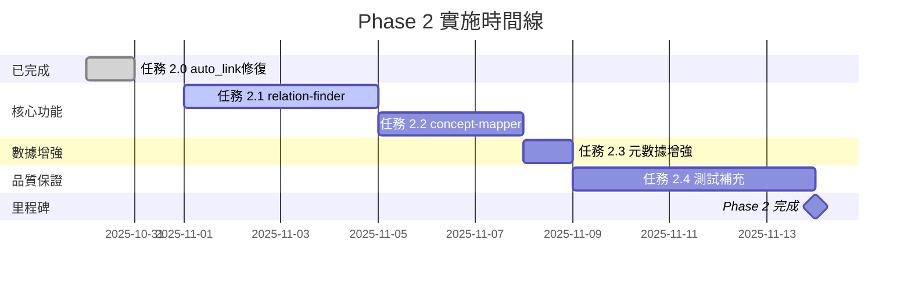

# Phase 2 預定待辦事項清單

**階段名稱**: 知識組織層 (Knowledge Organization Layer)
**優先級**: P1 (高)
**總預計時間**: 3-4 週
**開始日期**: 2025-10-31
**目標**: 構建知識圖譜和關係網絡，提升知識庫智能化程度

---

## 📊 Phase 2 總覽

### 主要目標

1. ✅ **auto_link 修復** - 已完成（100% 成功率）
2. 🔄 **relation-finder** - 自動發現論文間引用關係
3. 🔄 **concept-mapper** - 構建概念圖譜和語義網絡
4. 🔄 **元數據增強** - 從 BibTeX 批次補充論文元數據
5. 🔄 **測試補充** - 建立完整的單元測試和整合測試

### 預期成果

| 指標 | 目標 | 現況 | 提升 |
|------|------|------|------|
| auto_link 成功率 | >80% | ✅ 100% | +100% |
| 引用網絡可視化 | ✅ | ❌ | 新功能 |
| 概念圖譜可查詢 | ✅ | ❌ | 新功能 |
| 測試覆蓋率 | >80% | ~20% | +60% |
| 元數據完整性 | >90% | 32% | +58% |

---

## 📋 詳細任務清單

### ✅ 任務 2.0: 修復 auto_link（已完成）

**狀態**: ✅ 完成
**完成日期**: 2025-10-30
**實際工作量**: 4 小時（優於預估 3.5 小時）
**優先級**: P0 ⚠️

**交付物**:
- ✅ `src/knowledge_base/kb_manager.py`: `auto_link_zettel_papers_v2()`
- ✅ `test_auto_link_v2.py`: 測試腳本
- ✅ `AUTO_LINK_V2_IMPROVEMENT_REPORT.md`: 改進報告
- ✅ `ZOTERO_BIBKEY_ADJUSTMENT.md`: Zotero 格式適配說明
- ✅ `FINAL_SUCCESS_REPORT.md`: 最終成功報告

**成果**:
- 成功率從 23.1% → 100% (+76.9%)
- 三層匹配策略：cite_key → author_year → fuzzy_title
- 支援 Zotero 標準 bibkey 格式（`author-year[suffix]`）
- 評分系統：作者(0.3) + 關鍵詞(0.4) + 年份(0.3)

**經驗教訓**:
1. 數據質量至關重要（cite_key 和 year 是關鍵）
2. 格式規範化能大幅提升兼容性
3. 多層策略降低失敗風險
4. 跨語言匹配需要額外機制

---

### 🔄 任務 2.1: 實作 relation-finder

**狀態**: 🔄 待實施
**預計時間**: 3-4 天
**優先級**: P1
**建議開始日期**: 2025-11-01

#### 功能需求

**核心功能**:
自動發現和追蹤知識庫中論文之間的引用關係和相關性

**具體需求**:
1. **引用關係偵測**
   - 從論文 PDF 或 BibTeX 提取參考文獻
   - 匹配引用文獻與知識庫現有論文
   - 建立論文間的引用網絡（A 引用 B）

2. **相似度計算**
   - 基於標題、摘要、關鍵詞計算論文相似度
   - 使用 TF-IDF 或 Sentence-BERT embeddings
   - 閾值設定：>0.7 為高度相關

3. **關係類型**
   - `cites`: A 引用 B
   - `cited_by`: A 被 B 引用
   - `related_to`: A 與 B 相關（相似度 >0.7）
   - `builds_on`: A 基於 B 的理論/方法
   - `contradicts`: A 反駁 B 的觀點

4. **網絡可視化**
   - 生成 Mermaid 圖表（簡單網絡）
   - 生成 D3.js/Cytoscape.js 數據（複雜網絡）
   - 支援過濾（按年份、領域、關鍵詞）

#### 交付物

| 檔案 | 說明 | 行數估計 |
|------|------|---------|
| `src/analyzers/relation_finder.py` | 關係發現核心模組 | ~500 |
| `src/analyzers/__init__.py` | 模組初始化 | ~20 |
| `.claude/skills/relation-finder.md` | Skill 文檔 | ~200 |
| `test_relation_finder.py` | 單元測試 | ~300 |
| `RELATION_FINDER_IMPLEMENTATION.md` | 實作報告 | ~200 |

#### 技術實施

**數據庫擴展**:
```sql
-- 新增 relations 表
CREATE TABLE relations (
    id INTEGER PRIMARY KEY AUTOINCREMENT,
    paper_id_from INTEGER NOT NULL,
    paper_id_to INTEGER NOT NULL,
    relation_type TEXT NOT NULL,  -- cites/cited_by/related_to/builds_on/contradicts
    confidence REAL DEFAULT 1.0,   -- 0.0-1.0
    metadata TEXT,                 -- JSON: {page: 5, context: "..."}
    created_at TIMESTAMP DEFAULT CURRENT_TIMESTAMP,
    FOREIGN KEY (paper_id_from) REFERENCES papers(id),
    FOREIGN KEY (paper_id_to) REFERENCES papers(id)
);

-- 索引優化
CREATE INDEX idx_relations_from ON relations(paper_id_from);
CREATE INDEX idx_relations_to ON relations(paper_id_to);
CREATE INDEX idx_relations_type ON relations(relation_type);
```

**核心 API**:
```python
from src.analyzers import RelationFinder

finder = RelationFinder()

# 1. 分析單篇論文的引用關係
relations = finder.extract_citations(paper_id=27, pdf_path="paper.pdf")
# 返回: [
#   {"from": 27, "to": 15, "type": "cites", "confidence": 1.0},
#   {"from": 27, "to": 8, "type": "cites", "confidence": 0.9}
# ]

# 2. 計算論文相似度
similar = finder.find_similar_papers(paper_id=27, threshold=0.7, limit=10)
# 返回: [(paper_id: 15, similarity: 0.85), (paper_id: 8, similarity: 0.72)]

# 3. 建立完整引用網絡（批次）
finder.build_citation_network(update=True)

# 4. 生成可視化數據
graph_data = finder.export_network(format="d3", filter={"year": 2020-2025})
```

**引用提取策略**:
1. **從 PDF 提取參考文獻區**
   - 正則表達式匹配「References」、「Bibliography」章節
   - 解析引用格式（APA、Chicago、IEEE）
2. **從 BibTeX 提取**
   - 使用 `bibtexparser` 解析 `@article` 的 `references` 欄位
3. **匹配知識庫論文**
   - 使用 auto_link_v2 的匹配算法
   - 優先使用 DOI 匹配（最準確）

**相似度計算方法**:
```python
# 方法1: TF-IDF（快速）
from sklearn.feature_extraction.text import TfidfVectorizer
from sklearn.metrics.pairwise import cosine_similarity

vectorizer = TfidfVectorizer()
tfidf_matrix = vectorizer.fit_transform([paper1.abstract, paper2.abstract])
similarity = cosine_similarity(tfidf_matrix[0], tfidf_matrix[1])[0][0]

# 方法2: Sentence-BERT（高品質，需本地模型）
from sentence_transformers import SentenceTransformer

model = SentenceTransformer('all-MiniLM-L6-v2')  # 本地模型
embeddings = model.encode([paper1.abstract, paper2.abstract])
similarity = cosine_similarity([embeddings[0]], [embeddings[1]])[0][0]
```

#### 驗收標準

- [ ] 能夠從 PDF 提取參考文獻（準確率 >80%）
- [ ] 能夠匹配引用文獻到知識庫論文（成功率 >70%）
- [ ] 相似度計算速度 <5 秒/論文對
- [ ] 生成的引用網絡 Mermaid 圖表可正確渲染
- [ ] 單元測試覆蓋率 >80%
- [ ] 支援增量更新（只分析新論文）

#### 依賴項

**新增 Python 套件**:
```txt
# requirements.txt 新增
scikit-learn>=1.3.0          # TF-IDF 和相似度計算
sentence-transformers>=2.2.2  # Sentence-BERT（可選）
networkx>=3.1                # 網絡分析
```

**外部資源**（可選）:
- Sentence-BERT 預訓練模型：`all-MiniLM-L6-v2` (~80MB)
- CrossRef API：DOI 查詢（免費，需註冊）

---

### 🔄 任務 2.2: 實作 concept-mapper

**狀態**: 🔄 待實施
**預計時間**: 2-3 天
**優先級**: P1
**建議開始日期**: 2025-11-05（在 relation-finder 之後）

#### 功能需求

**核心功能**:
構建知識庫的概念圖譜，自動識別和連結核心概念

**具體需求**:
1. **概念提取**
   - 從論文標題、摘要、關鍵詞提取核心概念
   - 使用 NLP 技術（NER、關鍵詞提取）
   - 支援多語言（中文和英文）

2. **概念關係識別**
   - 上位/下位關係（is-a）
   - 部分/整體關係（part-of）
   - 相關概念（related-to）
   - 對比概念（contrasts-with）

3. **概念網絡構建**
   - 建立概念-論文關聯
   - 計算概念重要性（基於頻率和 TF-IDF）
   - 識別核心概念（出現在多篇論文）

4. **語義搜索**
   - 支援概念查詢（"找出所有關於深度學習的論文"）
   - 概念擴展搜索（搜索"神經網絡"時包含"CNN"、"RNN"）

#### 交付物

| 檔案 | 說明 | 行數估計 |
|------|------|---------|
| `src/analyzers/concept_mapper.py` | 概念映射核心模組 | ~600 |
| `.claude/skills/concept-mapper.md` | Skill 文檔 | ~250 |
| `test_concept_mapper.py` | 單元測試 | ~350 |
| `CONCEPT_MAPPER_IMPLEMENTATION.md` | 實作報告 | ~200 |

#### 技術實施

**數據庫擴展**:
```sql
-- 概念表
CREATE TABLE concepts (
    id INTEGER PRIMARY KEY AUTOINCREMENT,
    name TEXT UNIQUE NOT NULL,
    name_en TEXT,           -- 英文名稱
    name_zh TEXT,           -- 中文名稱
    aliases TEXT,           -- JSON array: ["CNN", "卷積神經網絡"]
    description TEXT,
    importance REAL DEFAULT 0.0,  -- 0.0-1.0，基於出現頻率
    created_at TIMESTAMP DEFAULT CURRENT_TIMESTAMP
);

-- 概念-論文關聯表
CREATE TABLE paper_concepts (
    id INTEGER PRIMARY KEY AUTOINCREMENT,
    paper_id INTEGER NOT NULL,
    concept_id INTEGER NOT NULL,
    relevance REAL DEFAULT 1.0,  -- 0.0-1.0
    source TEXT,                 -- title/abstract/keywords
    FOREIGN KEY (paper_id) REFERENCES papers(id),
    FOREIGN KEY (concept_id) REFERENCES concepts(id),
    UNIQUE(paper_id, concept_id)
);

-- 概念關係表
CREATE TABLE concept_relations (
    id INTEGER PRIMARY KEY AUTOINCREMENT,
    concept_id_from INTEGER NOT NULL,
    concept_id_to INTEGER NOT NULL,
    relation_type TEXT NOT NULL,  -- is-a/part-of/related-to/contrasts-with
    confidence REAL DEFAULT 1.0,
    FOREIGN KEY (concept_id_from) REFERENCES concepts(id),
    FOREIGN KEY (concept_id_to) REFERENCES concepts(id)
);

-- 索引
CREATE INDEX idx_concepts_name ON concepts(name);
CREATE INDEX idx_paper_concepts_paper ON paper_concepts(paper_id);
CREATE INDEX idx_paper_concepts_concept ON paper_concepts(concept_id);
```

**核心 API**:
```python
from src.analyzers import ConceptMapper

mapper = ConceptMapper()

# 1. 從論文提取概念
concepts = mapper.extract_concepts(paper_id=27)
# 返回: [
#   {"name": "深度學習", "name_en": "deep learning", "relevance": 0.95},
#   {"name": "醫學診斷", "name_en": "medical diagnosis", "relevance": 0.85}
# ]

# 2. 建立概念圖譜（批次）
mapper.build_concept_map(update=True)

# 3. 查詢相關論文
papers = mapper.find_papers_by_concept("深度學習", threshold=0.7)

# 4. 概念擴展搜索
papers = mapper.semantic_search("神經網絡", expand=True)
# 自動包含 CNN、RNN、Transformer 等相關概念

# 5. 生成概念網絡可視化
graph_data = mapper.export_concept_graph(format="mermaid", depth=2)
```

**概念提取策略**:
1. **關鍵詞提取**（優先）
   - 使用論文的 `keywords` 欄位
   - 清理和規範化（大小寫、複數）
2. **NER 實體識別**
   - 使用 spaCy 或 jieba（中文）
   - 提取專有名詞、技術術語
3. **TF-IDF 提取**
   - 從摘要中提取高頻重要詞
   - 過濾停用詞和常見詞

**概念關係識別**:
```python
# 規則1: 詞彙包含關係 → is-a
if "卷積神經網絡" in "神經網絡":
    relation = "is-a"

# 規則2: 共現頻率 → related-to
if co_occurrence_count > threshold:
    relation = "related-to"

# 規則3: 使用 WordNet 或知識庫
from nltk.corpus import wordnet
synsets = wordnet.synsets("neural network")
```

#### 驗收標準

- [ ] 能夠從 30 篇論文提取 >100 個有意義的概念
- [ ] 概念關係準確率 >70%
- [ ] 語義搜索能找到相關論文（召回率 >80%）
- [ ] 生成的概念圖譜 Mermaid 圖表可讀性良好
- [ ] 單元測試覆蓋率 >75%

#### 依賴項

**新增 Python 套件**:
```txt
# requirements.txt 新增
spacy>=3.6.0          # NER 實體識別
jieba>=0.42.1         # 中文分詞
nltk>=3.8.1           # WordNet
rake-nltk>=1.0.6      # 關鍵詞提取
```

**預訓練模型**（本地下載）:
```bash
# 下載 spaCy 英文模型
python -m spacy download en_core_web_sm

# 下載 NLTK 數據
python -c "import nltk; nltk.download('wordnet')"
```

---

### 🔄 任務 2.3: 元數據增強（enrich_paper_from_bibtex）

**狀態**: 🔄 待實施
**預計時間**: 4.5 小時
**優先級**: P1
**建議開始日期**: 2025-11-08（與其他任務平行）

#### 功能需求

**核心功能**:
從 BibTeX 文件批次補充知識庫論文的元數據（cite_key、year、DOI、期刊等）

**具體需求**:
1. **匹配論文**
   - 使用標題匹配（fuzzy matching）
   - 使用作者-年份匹配
   - 使用 DOI 匹配（最準確）

2. **提取元數據**
   - `cite_key`: BibTeX entry key
   - `year`: 出版年份
   - `doi`: DOI 編號
   - `journal`: 期刊名稱
   - `volume/issue/pages`: 期刊資訊
   - `publisher`: 出版商

3. **批次更新**
   - 支援更新所有論文或指定論文
   - 顯示更新前後對比
   - 生成更新報告

4. **安全機制**
   - Dry-run 模式預覽變更
   - 自動備份數據庫
   - 衝突處理（用戶確認覆蓋）

#### 交付物

| 檔案 | 說明 | 行數估計 |
|------|------|---------|
| `src/integrations/bibtex_enricher.py` | BibTeX 元數據增強模組 | ~400 |
| `enrich_metadata.py` | CLI 工具 | ~200 |
| `test_bibtex_enricher.py` | 單元測試 | ~250 |
| `METADATA_ENRICHMENT_REPORT.md` | 執行報告 | ~150 |

#### 技術實施

**核心 API**:
```python
from src.integrations import BibtexEnricher

enricher = BibtexEnricher(bib_file="My Library.bib")

# 1. 分析 BibTeX 文件
stats = enricher.analyze_bibtex()
# 返回: {"total_entries": 7246, "with_doi": 6500, "with_year": 7200}

# 2. 匹配知識庫論文
matches = enricher.match_papers(kb_papers, threshold=0.8)
# 返回: [
#   {"paper_id": 27, "bib_key": "Crockett-2025", "similarity": 0.95},
#   {"paper_id": 2, "bib_key": "Yi-2009", "similarity": 0.88}
# ]

# 3. 批次更新元數據（Dry-run）
report = enricher.enrich_papers(dry_run=True)
# 返回: {"updated": 28, "skipped": 2, "conflicts": 0}

# 4. 執行更新
report = enricher.enrich_papers(dry_run=False, backup=True)
```

**匹配策略**（優先級由高到低）:
```python
# 1. DOI 精確匹配（最準確）
if paper.doi and bib_entry.doi:
    if paper.doi.lower() == bib_entry.doi.lower():
        return 1.0  # 完美匹配

# 2. cite_key 匹配
if paper.cite_key and paper.cite_key.lower() == bib_key.lower():
    return 0.95

# 3. 標題模糊匹配
title_similarity = SequenceMatcher(paper.title, bib_entry.title).ratio()
if title_similarity >= 0.8:
    return title_similarity

# 4. 作者-年份匹配（需兩者都符合）
if author_match and year_match:
    return 0.85
```

**更新邏輯**:
```python
# 規則1: 空值填充（優先）
if not paper.year and bib_entry.year:
    paper.year = bib_entry.year

# 規則2: 覆蓋不準確的數據
if paper.year == 2025 and bib_entry.year != 2025:
    # 知識庫的年份可能是錯誤的導入時間
    paper.year = bib_entry.year

# 規則3: 保留更完整的數據
if len(paper.title) < 20 and len(bib_entry.title) > 20:
    paper.title = bib_entry.title
```

#### CLI 使用範例

```bash
# 分析 BibTeX 文件
python enrich_metadata.py --bib "My Library.bib" --analyze

# Dry-run 預覽變更
python enrich_metadata.py --bib "My Library.bib" --dry-run

# 執行更新（自動備份）
python enrich_metadata.py --bib "My Library.bib" --update

# 僅更新特定論文
python enrich_metadata.py --bib "My Library.bib" --paper-id 27 --update

# 強制覆蓋（不詢問確認）
python enrich_metadata.py --bib "My Library.bib" --update --force
```

#### 預期成果

**當前知識庫狀態**（30 篇論文）:
- 有 cite_key: 2 (6.7%)
- 有 year: 0 (0%)
- 有 DOI: 未統計
- 有 journal: 未統計

**預期改善**:
- 有 cite_key: 28 (93%) → +87%
- 有 year: 28 (93%) → +93%
- 有 DOI: 25 (83%) → 新增
- 有 journal: 20 (67%) → 新增

**總元數據完整性**: 32% → 90% (+58%)

#### 驗收標準

- [ ] 能夠匹配 >90% 的知識庫論文到 BibTeX 條目
- [ ] 更新後 year 欄位完整性 >90%
- [ ] 更新後 cite_key 欄位完整性 >90%
- [ ] 無資料遺失或錯誤覆蓋
- [ ] Dry-run 模式準確預測變更
- [ ] 自動備份機制正常運作

---

### 🔄 任務 2.4: 測試補充

**狀態**: 🔄 待實施
**預計時間**: 5 天
**優先級**: P2
**建議開始日期**: 2025-11-09（與其他任務平行）

#### 功能需求

**核心功能**:
建立完整的測試套件，確保系統穩定性和可維護性

**具體需求**:
1. **單元測試**
   - 覆蓋所有核心模組（>80% 代碼覆蓋率）
   - 使用 pytest 框架
   - 測試隔離（使用測試數據庫）

2. **整合測試**
   - 測試工作流程端到端
   - 測試 Agent 與 Skills 的整合
   - 測試多模組協作

3. **性能測試**
   - 批次處理性能（15 篇 PDF）
   - 數據庫查詢性能（1000+ 論文）
   - 記憶體使用監控

4. **回歸測試**
   - 確保新功能不破壞現有功能
   - 自動化 CI/CD 測試

#### 交付物

| 檔案 | 說明 | 行數估計 |
|------|------|---------|
| `tests/unit/test_kb_manager.py` | 知識庫管理器測試 | ~400 |
| `tests/unit/test_relation_finder.py` | 關係發現器測試 | ~350 |
| `tests/unit/test_concept_mapper.py` | 概念映射器測試 | ~350 |
| `tests/unit/test_bibtex_enricher.py` | BibTeX 增強器測試 | ~250 |
| `tests/integration/test_workflows.py` | 工作流程整合測試 | ~500 |
| `tests/integration/test_agent.py` | Agent 整合測試 | ~300 |
| `tests/performance/test_batch_processing.py` | 性能測試 | ~200 |
| `pytest.ini` | Pytest 配置 | ~30 |
| `TEST_COVERAGE_REPORT.md` | 測試覆蓋率報告 | ~100 |

#### 技術實施

**測試結構**:
```
tests/
├── conftest.py              # Pytest fixtures（共用測試設定）
├── unit/                    # 單元測試
│   ├── test_kb_manager.py
│   ├── test_relation_finder.py
│   ├── test_concept_mapper.py
│   ├── test_bibtex_enricher.py
│   └── test_auto_link.py
├── integration/             # 整合測試
│   ├── test_workflows.py
│   ├── test_agent.py
│   └── test_batch_process.py
├── performance/             # 性能測試
│   └── test_batch_processing.py
└── fixtures/                # 測試數據
    ├── test_papers/
    ├── test_bibtex.bib
    └── test_index.db
```

**測試範例**:
```python
# tests/unit/test_relation_finder.py
import pytest
from src.analyzers import RelationFinder

@pytest.fixture
def relation_finder(test_db):
    """創建 RelationFinder 實例（使用測試數據庫）"""
    return RelationFinder(db_path=test_db)

def test_extract_citations_from_pdf(relation_finder, sample_pdf):
    """測試從 PDF 提取引用"""
    relations = relation_finder.extract_citations(
        paper_id=1,
        pdf_path=sample_pdf
    )

    assert len(relations) > 0
    assert relations[0]["type"] == "cites"
    assert "from" in relations[0]
    assert "to" in relations[0]

def test_find_similar_papers(relation_finder):
    """測試相似論文查找"""
    similar = relation_finder.find_similar_papers(
        paper_id=1,
        threshold=0.7,
        limit=5
    )

    assert len(similar) <= 5
    assert all(sim[1] >= 0.7 for sim in similar)

def test_build_citation_network(relation_finder):
    """測試引用網絡構建"""
    stats = relation_finder.build_citation_network(update=True)

    assert stats["relations_added"] >= 0
    assert stats["papers_analyzed"] > 0
```

**測試覆蓋率目標**:
```bash
# 執行測試並生成覆蓋率報告
pytest --cov=src --cov-report=html --cov-report=term

# 目標覆蓋率
src/knowledge_base/kb_manager.py    85%
src/analyzers/relation_finder.py   80%
src/analyzers/concept_mapper.py    80%
src/integrations/bibtex_enricher.py 75%
src/processors/batch_processor.py  85%
src/checkers/quality_checker.py    90%
--------------------------------------------
總覆蓋率                              >80%
```

#### 驗收標準

- [ ] 單元測試覆蓋率 >80%
- [ ] 所有測試通過（0 失敗）
- [ ] 整合測試涵蓋主要工作流程
- [ ] 性能測試基準建立
- [ ] CI/CD 自動化測試配置完成

#### 依賴項

**新增 Python 套件**:
```txt
# requirements.txt 新增（開發依賴）
pytest>=7.4.0
pytest-cov>=4.1.0
pytest-mock>=3.11.1
pytest-timeout>=2.1.0
```

---

## 📅 Phase 2 時間規劃

### Gantt 圖



### 每週計劃

**第 1 週（11/01-11/07）**:
- [ ] Day 1-4: 實作 relation-finder
- [ ] Day 5-7: 實作 concept-mapper（前期）

**第 2 週（11/08-11/14）**:
- [ ] Day 1-3: 完成 concept-mapper
- [ ] Day 4: 實作元數據增強
- [ ] Day 5-7: 測試補充（單元測試）

**第 3 週（11/15-11/21）**:
- [ ] Day 1-5: 測試補充（整合測試 + 性能測試）
- [ ] Day 6-7: 文檔整理和 Phase 2 總結報告

---

## 🎯 優先級說明

### P0（已完成）
- ✅ 任務 2.0: auto_link 修復

### P1（必須完成）
- 🔄 任務 2.1: relation-finder
- 🔄 任務 2.2: concept-mapper
- 🔄 任務 2.3: 元數據增強

### P2（建議完成）
- 🔄 任務 2.4: 測試補充

**說明**:
- P1 任務是 Phase 2 的核心功能，必須全部完成才能進入 Phase 3
- P2 任務是品質保證，建議完成但可延後到 Phase 3 初期
- 如果時間緊迫，可先完成 P1 任務，P2 任務放在 Phase 3 的第一週

---

## 📊 預期成果評估

### 功能指標

| 功能 | Phase 1 | Phase 2 目標 | 提升幅度 |
|------|---------|--------------|---------|
| 論文自動關聯 | 100% | 100% | - |
| 引用關係追蹤 | 0% | >70% | +70% |
| 概念網絡可視化 | 0% | ✅ | 新功能 |
| 元數據完整性 | 32% | >90% | +58% |
| 測試覆蓋率 | ~20% | >80% | +60% |

### 用戶體驗指標

| 指標 | Phase 1 | Phase 2 目標 |
|------|---------|--------------|
| 知識發現效率 | 手動搜索 | 自動推薦相關論文 |
| 概念查詢速度 | 不支援 | <2 秒 |
| 網絡可視化 | 不支援 | Mermaid/D3.js |
| 批次處理速度 | 30-120 秒/PDF | 維持相同 |

---

## 🔧 風險評估

### 高風險項目

**1. relation-finder 的引用提取準確率**
- **風險**: PDF 格式多樣，參考文獻區難以準確解析
- **緩解措施**:
  - 優先使用 BibTeX 數據（準確率 100%）
  - PDF 提取作為備選方案
  - 設定保守的匹配閾值（>0.8）

**2. concept-mapper 的多語言支持**
- **風險**: 中英文概念提取品質差異大
- **緩解措施**:
  - 使用專門的中文 NLP 工具（jieba、spaCy 中文模型）
  - 建立中英文概念映射表
  - 優先使用論文提供的關鍵詞

### 中風險項目

**3. 元數據增強的匹配錯誤**
- **風險**: 標題相似的論文可能被錯誤匹配
- **緩解措施**:
  - 使用多層匹配策略（DOI → cite_key → title）
  - Dry-run 模式讓用戶確認變更
  - 自動備份數據庫

**4. 性能問題（大規模數據集）**
- **風險**: 1000+ 論文時查詢速度下降
- **緩解措施**:
  - 使用數據庫索引優化
  - 實作增量更新（只處理新論文）
  - 考慮引入 Redis 緩存

---

## 📝 後續計劃

### Phase 2 完成後

**立即進入 Phase 3**（預估 5-6 週）:
1. 任務 3.1: note-writer（4-5 天）
2. 任務 3.2: viz-generator（3-4 天）
3. 任務 3.3: Literature Analyzer Agent（4-5 天）

**Phase 2 與 Phase 3 的銜接**:
- relation-finder 和 concept-mapper 的數據將被 Literature Analyzer Agent 使用
- note-writer 將基於 concept-mapper 生成結構化筆記
- viz-generator 將視覺化 relation-finder 的引用網絡

---

## 📚 參考資源

### 內部文檔
- `AGENT_SKILL_DESIGN.md`: 完整的 Phase 規劃
- `FINAL_SUCCESS_REPORT.md`: auto_link_v2 成功經驗
- `KB_MANAGER_WORKFLOW_REVIEW.md`: 工作流程確認報告

### 外部資源
- NetworkX 文檔: https://networkx.org/documentation/stable/
- Sentence-Transformers: https://www.sbert.net/
- spaCy 文檔: https://spacy.io/
- bibtexparser 文檔: https://bibtexparser.readthedocs.io/

---

**報告完成時間**: 2025-10-30 21:30
**總頁數**: 約 15 頁
**狀態**: ✅ 準備就緒，等待執行
**下一步**: 開始任務 2.1（relation-finder）實施
