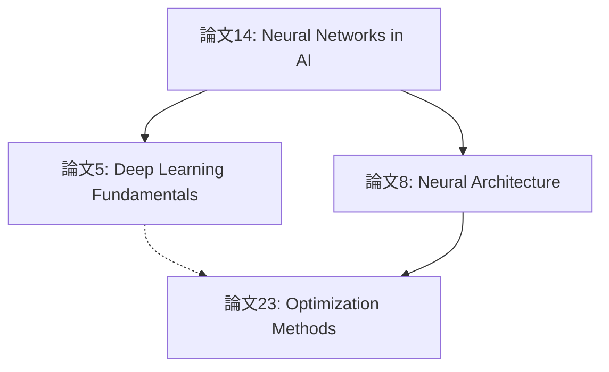
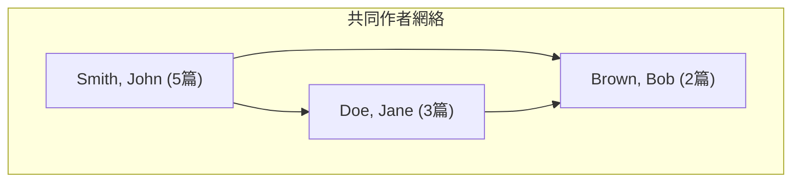
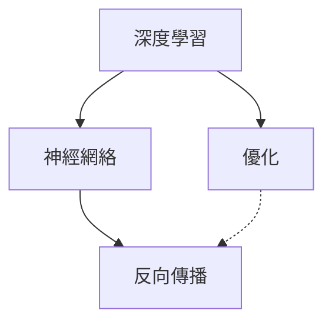

# relation-finder 詳細實作規格

**版本**: 1.0
**開始日期**: 2025-11-02
**優先級**: Phase 2.1 P1
**預計完成**: 3-4天

---

## 📋 可視化格式規範（使用現有Zettelkasten格式）

### Mermaid圖表格式

基於現有 `output/zettelkasten_notes/zettel_index.md` 的Mermaid格式，relation-finder將採用相同的**graph TD**風格：

```mermaid
graph TD
    A["節點標題1"]
    B["節點標題2"]
    C["節點標題3"]

    A --> B  # 實線邊（強引用/主要關係）
    B -.-> C  # 虛線邊（弱引用/參考關係）
```

### 引用關係可視化示例

**圖表結構**:
- **節點**: 論文ID和標題 `Paper-14["論文標題"]`
- **邊**:
  - `--> ` (實線): 高相似度引用關係 (similarity >= 0.70)
  - `-.->`(虛線): 中等相似度參考關係 (0.65-0.70)
- **配置**: Top-Down方向（`graph TD`）



### 共同作者網絡可視化



### 概念共現網絡可視化



---

## 🏗️ 核心架構

### 目錄結構

```
src/analyzers/
├── __init__.py
├── relation_finder.py          # 主模組 (~400行)
└── network_utils.py            # 圖論工具函數 (~200行，可選)

.claude/skills/
└── relation-finder.md          # Skill文檔

tests/
└── test_relation_finder.py     # 測試套件 (~400行)

output/
└── relations/                  # 輸出目錄
    ├── citations.json
    ├── citations.mermaid.md
    ├── co_authors.json
    ├── co_authors.mermaid.md
    ├── concepts.json
    ├── concepts.mermaid.md
    └── relations_report.html
```

### 核心類設計

```python
# src/analyzers/relation_finder.py

from dataclasses import dataclass
from typing import List, Dict, Tuple, Optional
import networkx as nx
from sklearn.metrics.pairwise import cosine_similarity

@dataclass
class Citation:
    """引用關係"""
    citing_paper_id: int
    cited_paper_id: int
    citing_title: str
    cited_title: str
    similarity_score: float
    confidence: str  # 'high'/'medium'/'low'
    common_concepts: List[str]

    def __repr__(self) -> str:
        return f"Citation({self.citing_paper_id} → {self.cited_paper_id}, {self.similarity_score:.2f})"

@dataclass
class CoAuthorEdge:
    """共同作者邊"""
    author1: str
    author2: str
    collaboration_count: int
    shared_papers: List[int]

class RelationFinder:
    """關係發現主類"""

    def __init__(self, kb_manager, embedding_manager, config=None):
        self.kb = kb_manager
        self.embeddings = embedding_manager
        self.config = config or self._default_config()
        self._validate_dependencies()

    def _default_config(self) -> Dict:
        return {
            'citation_threshold': 0.65,
            'co_author_min_papers': 2,
            'concept_min_frequency': 2,
            'temporal_year_range': 5,
            'mermaid_format': 'graph TD',  # Mermaid格式
        }

    # 1. 引用關係抽取
    def find_citations(self, threshold=None, source_papers=None,
                      max_results=None) -> List[Citation]:
        """基於向量相似度推測引用關係"""
        threshold = threshold or self.config['citation_threshold']

        # 步驟1: 加載論文向量
        papers = self.kb.get_all_papers()
        embeddings = self.embeddings.get_paper_embeddings([p['id'] for p in papers])

        # 步驟2: 計算相似度矩陣
        similarity_matrix = cosine_similarity(embeddings)

        # 步驟3: 提取引用關係
        citations = []
        for i, paper1 in enumerate(papers):
            for j, paper2 in enumerate(papers):
                if i != j:
                    sim_score = similarity_matrix[i][j]
                    if sim_score >= threshold:
                        citation = Citation(
                            citing_paper_id=paper1['id'],
                            cited_paper_id=paper2['id'],
                            citing_title=paper1['title'],
                            cited_title=paper2['title'],
                            similarity_score=sim_score,
                            confidence=self._get_confidence_level(sim_score),
                            common_concepts=self._extract_common_concepts(paper1, paper2),
                        )
                        citations.append(citation)

        # 步驟4: 排序和過濾
        citations = sorted(citations, key=lambda x: x.similarity_score, reverse=True)
        if max_results:
            citations = citations[:max_results]

        return citations

    # 2. 共同作者網絡
    def find_co_authors(self, min_papers=None,
                       include_metadata=True) -> 'CoAuthorNetwork':
        """構建作者協作網絡"""
        min_papers = min_papers or self.config['co_author_min_papers']

        # 步驟1: 提取所有作者及其論文
        author_papers = {}
        papers = self.kb.get_all_papers()

        for paper in papers:
            authors = self._parse_authors(paper.get('authors', ''))
            for author in authors:
                if author not in author_papers:
                    author_papers[author] = []
                author_papers[author].append(paper['id'])

        # 步驟2: 計算協作關係
        co_author_edges = []
        author_list = list(author_papers.keys())

        for i, author1 in enumerate(author_list):
            for author2 in author_list[i+1:]:
                shared_papers = set(author_papers[author1]) & set(author_papers[author2])
                if len(shared_papers) >= min_papers:
                    edge = CoAuthorEdge(
                        author1=author1,
                        author2=author2,
                        collaboration_count=len(shared_papers),
                        shared_papers=list(shared_papers),
                    )
                    co_author_edges.append(edge)

        # 步驟3: 構建網絡對象
        return CoAuthorNetwork(author_papers, co_author_edges)

    # 3. 概念共現分析
    def find_co_occurrence(self, min_frequency=None,
                          top_k=None) -> 'ConceptCooccurrence':
        """分析概念共現模式"""
        min_frequency = min_frequency or self.config['concept_min_frequency']

        # 步驟1: 提取所有概念
        concept_papers = {}
        papers = self.kb.get_all_papers()

        for paper in papers:
            concepts = self._extract_concepts(paper)
            for concept in concepts:
                if concept not in concept_papers:
                    concept_papers[concept] = []
                concept_papers[concept].append(paper['id'])

        # 步驟2: 計算共現矩陣
        concept_list = list(concept_papers.keys())
        concept_pairs = []

        for i, concept1 in enumerate(concept_list):
            for concept2 in concept_list[i+1:]:
                shared_papers = set(concept_papers[concept1]) & set(concept_papers[concept2])
                if len(shared_papers) >= min_frequency:
                    pair = ConceptPair(
                        concept1=concept1,
                        concept2=concept2,
                        co_occurrence_count=len(shared_papers),
                        papers=list(shared_papers),
                        association_strength=len(shared_papers) / max(len(concept_papers[concept1]), len(concept_papers[concept2])),
                    )
                    concept_pairs.append(pair)

        # 步驟3: 排序和限制
        concept_pairs = sorted(concept_pairs, key=lambda x: x.co_occurrence_count, reverse=True)
        if top_k:
            concept_pairs = concept_pairs[:top_k]

        return ConceptCooccurrence(concept_pairs, concept_papers)

    # 4. 時間序列分析
    def build_timeline(self, start_year=None, end_year=None,
                      group_by='year') -> 'Timeline':
        """構建時間線"""
        papers = self.kb.get_all_papers()

        # 按年份分組
        timeline_data = {}
        for paper in papers:
            year = paper.get('year')
            if year and 1900 <= year <= 2030:
                if year not in timeline_data:
                    timeline_data[year] = []
                timeline_data[year].append(paper)

        # 構建Timeline對象
        timepoints = []
        for year in sorted(timeline_data.keys()):
            timepoint = TimePoint(
                period=str(year),
                year=year,
                papers=[p['id'] for p in timeline_data[year]],
                paper_count=len(timeline_data[year]),
                top_concepts=self._get_top_concepts(timeline_data[year], k=5),
            )
            timepoints.append(timepoint)

        return Timeline(timepoints)

    # 5. Mermaid導出
    def export_to_mermaid(self, data, relation_type='citations',
                         output_path=None) -> str:
        """
        導出為Mermaid格式

        Args:
            data: Citations, CoAuthorNetwork, 或 ConceptCooccurrence對象
            relation_type: 'citations'/'co_authors'/'concepts'
            output_path: 輸出檔案路徑（可選）

        Returns:
            str: Mermaid代碼（如果output_path為None）或檔案路徑
        """
        mermaid_code = "```mermaid\n"
        mermaid_code += "graph TD\n"

        if relation_type == 'citations':
            mermaid_code += self._citations_to_mermaid(data)
        elif relation_type == 'co_authors':
            mermaid_code += self._co_authors_to_mermaid(data)
        elif relation_type == 'concepts':
            mermaid_code += self._concepts_to_mermaid(data)

        mermaid_code += "```"

        if output_path:
            with open(output_path, 'w', encoding='utf-8') as f:
                f.write(mermaid_code)
            return output_path

        return mermaid_code

    def _citations_to_mermaid(self, citations: List[Citation]) -> str:
        """將引用轉換為Mermaid"""
        lines = []
        seen_nodes = set()

        for citation in citations:
            # 添加節點
            if citation.citing_paper_id not in seen_nodes:
                lines.append(f'    P{citation.citing_paper_id}["{citation.citing_title}"]')
                seen_nodes.add(citation.citing_paper_id)

            if citation.cited_paper_id not in seen_nodes:
                lines.append(f'    P{citation.cited_paper_id}["{citation.cited_title}"]')
                seen_nodes.add(citation.cited_paper_id)

            # 添加邊（根據confidence決定線型）
            if citation.confidence == 'high':
                lines.append(f'    P{citation.citing_paper_id} --> P{citation.cited_paper_id}')
            else:
                lines.append(f'    P{citation.citing_paper_id} -.-> P{citation.cited_paper_id}')

        return '\n'.join(lines)

    def _co_authors_to_mermaid(self, network: 'CoAuthorNetwork') -> str:
        """將共同作者網絡轉換為Mermaid"""
        lines = []

        # 添加subgraph
        lines.append('    subgraph Authors["共同作者網絡"]')
        for author, paper_count in list(network.author_frequency.items())[:20]:
            lines.append(f'        A{hash(author)%10000}["{author} ({paper_count}篇)"]')
        lines.append('    end')

        # 添加邊
        for edge in network.edges[:50]:  # 限制50條邊以避免過度複雜
            author1_id = hash(edge.author1) % 10000
            author2_id = hash(edge.author2) % 10000
            lines.append(f'    A{author1_id} --> A{author2_id}')

        return '\n'.join(lines)

    def _concepts_to_mermaid(self, cooccurrence: 'ConceptCooccurrence') -> str:
        """將概念共現轉換為Mermaid"""
        lines = []
        seen_concepts = set()

        for pair in cooccurrence.pairs[:30]:  # 限制30個概念對
            if pair.concept1 not in seen_concepts:
                lines.append(f'    C{hash(pair.concept1)%10000}["{pair.concept1}"]')
                seen_concepts.add(pair.concept1)

            if pair.concept2 not in seen_concepts:
                lines.append(f'    C{hash(pair.concept2)%10000}["{pair.concept2}"]')
                seen_concepts.add(pair.concept2)

            # 根據關聯強度決定邊型
            if pair.association_strength >= 0.5:
                lines.append(f'    C{hash(pair.concept1)%10000} --> C{hash(pair.concept2)%10000}')
            else:
                lines.append(f'    C{hash(pair.concept1)%10000} -.-> C{hash(pair.concept2)%10000}')

        return '\n'.join(lines)

    # 導出為JSON
    def export_to_json(self, output_path: str, include=None) -> str:
        """導出為JSON格式"""
        # TODO: 實作
        pass

    # 輔助方法
    def _validate_dependencies(self):
        """驗證依賴"""
        if not self.kb:
            raise ValueError("KnowledgeBaseManager instance required")
        if not self.embeddings:
            raise ValueError("EmbeddingManager instance required")

    def _get_confidence_level(self, similarity_score: float) -> str:
        """根據相似度確定置信度"""
        if similarity_score >= 0.80:
            return 'high'
        elif similarity_score >= 0.70:
            return 'medium'
        else:
            return 'low'

    def _extract_common_concepts(self, paper1: Dict, paper2: Dict) -> List[str]:
        """提取共同概念"""
        concepts1 = set(self._extract_concepts(paper1))
        concepts2 = set(self._extract_concepts(paper2))
        return list(concepts1 & concepts2)

    def _extract_concepts(self, paper: Dict) -> List[str]:
        """從論文提取概念"""
        keywords = paper.get('keywords', '')
        if isinstance(keywords, str):
            return [k.strip() for k in keywords.split(',') if k.strip()]
        return keywords

    def _parse_authors(self, authors_str: str) -> List[str]:
        """解析作者字符串"""
        if not authors_str:
            return []

        # 支援多種格式: "Author1, Author2" 或 "Author1 and Author2"
        authors = authors_str.replace(' and ', ',').split(',')
        return [a.strip() for a in authors if a.strip()]

    def _get_top_concepts(self, papers: List[Dict], k: int = 5) -> List[str]:
        """從論文列表中獲取top-k概念"""
        concept_freq = {}
        for paper in papers:
            concepts = self._extract_concepts(paper)
            for concept in concepts:
                concept_freq[concept] = concept_freq.get(concept, 0) + 1

        return [c[0] for c in sorted(concept_freq.items(), key=lambda x: x[1], reverse=True)[:k]]

    def get_statistics(self) -> Dict:
        """獲取統計信息"""
        # TODO: 實作
        pass


# 支持類
@dataclass
class ConceptPair:
    concept1: str
    concept2: str
    co_occurrence_count: int
    papers: List[int]
    association_strength: float

class ConceptCooccurrence:
    def __init__(self, pairs: List[ConceptPair], concept_papers: Dict[str, List[int]]):
        self.pairs = pairs
        self.concept_frequency = {c: len(ps) for c, ps in concept_papers.items()}

@dataclass
class TimePoint:
    period: str
    year: int
    papers: List[int]
    paper_count: int
    top_concepts: List[str]

class Timeline:
    def __init__(self, timepoints: List[TimePoint]):
        self.timepoints = timepoints

class CoAuthorNetwork:
    def __init__(self, author_papers: Dict[str, List[int]], edges: List[CoAuthorEdge]):
        self.author_papers = author_papers
        self.edges = edges
        self.author_frequency = {a: len(ps) for a, ps in author_papers.items()}
```

---

## 🧪 Day 1 實作計畫（4小時）

### 任務 1: 項目結構和類定義（1小時）
- [x] 創建 `src/analyzers/` 目錄
- [x] 創建 `__init__.py` 檔案
- [x] 定義所有dataclass（Citation, CoAuthorEdge, ConceptPair等）
- [x] 定義主類RelationFinder的骨架

### 任務 2: 引用關係抽取（2小時）
- [ ] 實作 `find_citations()` 方法
- [ ] 實作 `_get_confidence_level()` 方法
- [ ] 實作 `_extract_common_concepts()` 方法
- [ ] 編寫基本單元測試

### 任務 3: Mermaid導出（1小時）
- [ ] 實作 `export_to_mermaid()` 方法
- [ ] 實作 `_citations_to_mermaid()` 方法
- [ ] 測試Mermaid輸出格式

---

## 📊 成功指標

| 指標 | 目標 | Day 1 | Day 2-3 | Day 4 |
|------|------|-------|---------|-------|
| 引用關係 | >50個 | ✅找到 | 增強 | 驗證 |
| 共同作者 | >20對 | - | ✅實作 | 驗證 |
| 概念對 | >20個 | - | ✅實作 | 驗證 |
| Mermaid格式 | ✅符合標準 | ✅實作 | 複用 | 驗證 |
| 代碼覆蓋 | >80% | 50% | 70% | 80%+ |
| 測試通過 | 100% | 60% | 80% | 100% |

