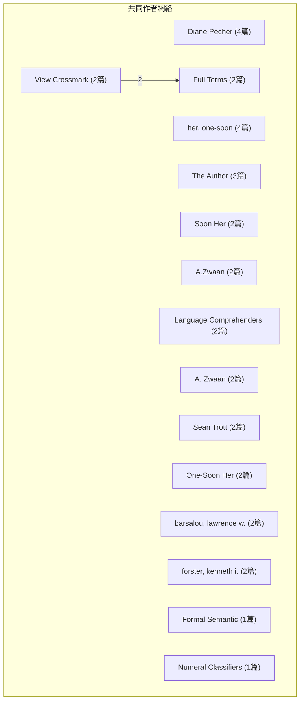

# Co-Author Network

```mermaid
graph TD
    subgraph Authors["共同作者網絡"]
        A9145["Diane Pecher (4篇)"]
        A7919["her, one-soon (4篇)"]
        A4402["The Author (3篇)"]
        A5891["Soon Her (2篇)"]
        A4183["View Crossmark (2篇)"]
        A2717["Full Terms (2篇)"]
        A2755["A.Zwaan (2篇)"]
        A7670["Language Comprehenders (2篇)"]
        A8612["A. Zwaan (2篇)"]
        A3056["Sean Trott (2篇)"]
        A806["One-Soon Her (2篇)"]
        A2996["barsalou, lawrence w. (2篇)"]
        A2234["forster, kenneth i. (2篇)"]
        A116["Formal Semantic (1篇)"]
        A1004["Numeral Classifiers (1篇)"]
    end
    A4183 -->|2| A2717
```