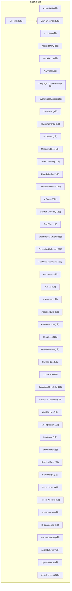

```mermaid
graph TD
    subgraph Authors["共同作者網絡"]
        A0["A. Stanfield (1篇)"]
        A1["H. Yaxley (1篇)"]
        A2["Abstract Many (1篇)"]
        A3["Max Planck (1篇)"]
        A4["A. Zwaan (2篇)"]
        A5["Language Comprehende (2篇)"]
        A6["Psychological Scienc (1篇)"]
        A7["View Crossmark (2篇)"]
        A8["The Author (3篇)"]
        A9["Revisiting Mental (1篇)"]
        A10["Full Terms (2篇)"]
        A11["A. Zwaana (1篇)"]
        A12["Original Articles (1篇)"]
        A13["Leiden University (1篇)"]
        A14["Encode Implied (1篇)"]
        A15["Mentally Represent (1篇)"]
        A16["A.Zwaan (2篇)"]
        A17["Erasmus University (1篇)"]
        A18["Sean Trott (1篇)"]
        A19["Experimental Educati (1篇)"]
        A20["Perception Understan (1篇)"]
        A21["Keywords Objectstate (1篇)"]
        A22["Adil Ishagc (1篇)"]
        A23["Duo Liu (1篇)"]
        A24["H. Poletiekb (1篇)"]
        A25["Accepted Date (1篇)"]
        A26["An International (1篇)"]
        A27["Hong Kong (1篇)"]
        A28["Verbal Learning (1篇)"]
        A29["Revised Date (1篇)"]
        A30["Journal Pre (1篇)"]
        A31["Educational Psycholo (1篇)"]
        A32["Participant Nonnaive (1篇)"]
        A33["Child Studies (1篇)"]
        A34["Six Replication (1篇)"]
        A35["M.Altmann (1篇)"]
        A36["Email Alerts (1篇)"]
        A37["Received Date (1篇)"]
        A38["Falk Huettiga (1篇)"]
        A39["Diane Pecher (4篇)"]
        A40["Markus Ostareka (1篇)"]
        A41["H.Joergensen (1篇)"]
        A42["R. Bocanegraa (1篇)"]
        A43["Mechanical Turk (1篇)"]
        A44["Verbal Behavior (1篇)"]
        A45["Open Science (1篇)"]
        A46["Dennis Joosena (1篇)"]
    end

    A10 --> A7

```