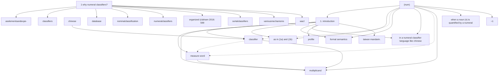

```mermaid
graph TD

    C3068["(num)"]
    C6586["1 why numeral classifiers?"]
    C6344["1. introduction"]
    C1555["as in (1a) and (1b)"]
    C1664["aselementsandexpe-"]
    C932["chinese"]
    C5375["classifier"]
    C5808["classifiers"]
    C6721["database"]
    C2256["formal semantics"]
    C8223["in a numeral classifier language like chinese"]
    C5863["measure word"]
    C1853["multiplicand"]
    C3087["nominalclassification"]
    C6217["numeralclassifiers"]
    C8150["organized (clahsen 2016: 599"]
    C1073["profile"]
    C9250["sortalclassifiers"]
    C2929["taiwan mandarin."]
    C4563["variousmechanisms"]
    C7764["wacl"]
    C9412["when a noun (n) is quantified by a numeral"]
    C586["¬1"]

    C6344 --> C5375
    C6344 --> C5863
    C6344 --> C1853
    C932 --> C5375
    C5375 -.-> C5863
    C5375 --> C1853
    C5863 --> C1853
    C3068 --> C6344
    C3068 --> C1555
    C3068 -.-> C5375
    C3068 --> C2256
    C3068 --> C8223
    C3068 -.-> C5863
    C3068 --> C1853
    C3068 --> C9412
    C3068 --> C586
    C6586 --> C1664
    C6586 --> C5808
    C6586 --> C6721
    C6586 --> C3087
    C6586 --> C6217
    C6586 --> C8150
    C6586 --> C9250
    C6586 --> C4563
    C6586 --> C7764
    C6344 --> C1555
    C6344 --> C2256
    C6344 --> C8223
    C6344 --> C1073
    C6344 --> C2929

```