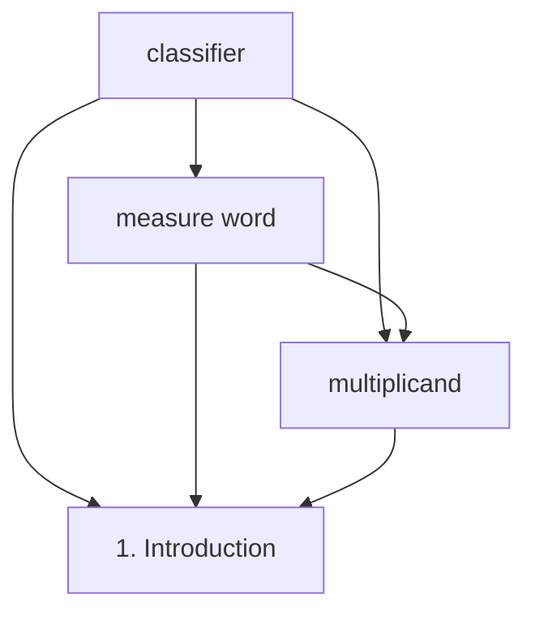

# Concept Co-Occurrence Network

```mermaid
graph TD
    C5370["classifier"]
    C7683["measure word"]
    C5370 --> C7683
    C1510["multiplicand"]
    C5370 --> C1510
    C216["1. Introduction"]
    C5370 --> C216
    C7683 --> C1510
    C7683 --> C216
    C1510 --> C216
```