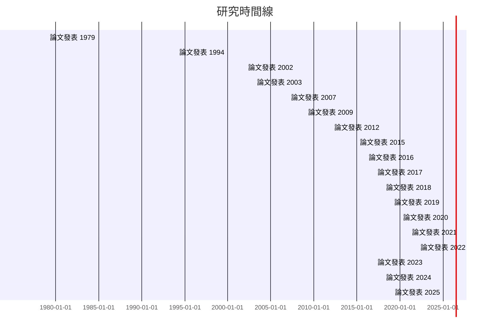

```mermaid
gantt
    title 研究時間線
    dateFormat YYYY

    論文發表 1979: crit, 1979, 1979, 1篇
    論文發表 1994: crit, 1994, 1994, 1篇
    論文發表 2002: crit, 2002, 2002, 1篇
    論文發表 2003: crit, 2003, 2003, 1篇
    論文發表 2007: crit, 2007, 2007, 1篇
    論文發表 2009: crit, 2009, 2009, 2篇
    論文發表 2012: crit, 2012, 2012, 2篇
    論文發表 2015: crit, 2015, 2015, 1篇
    論文發表 2016: crit, 2016, 2016, 1篇
    論文發表 2017: crit, 2017, 2017, 2篇
    論文發表 2018: crit, 2018, 2018, 1篇
    論文發表 2019: crit, 2019, 2019, 3篇
    論文發表 2020: crit, 2020, 2020, 2篇
    論文發表 2021: crit, 2021, 2021, 1篇
    論文發表 2022: crit, 2022, 2022, 4篇
    論文發表 2023: crit, 2023, 2023, 1篇
    論文發表 2024: crit, 2024, 2024, 5篇
    論文發表 2025: crit, 2025, 2025, 1篇

```