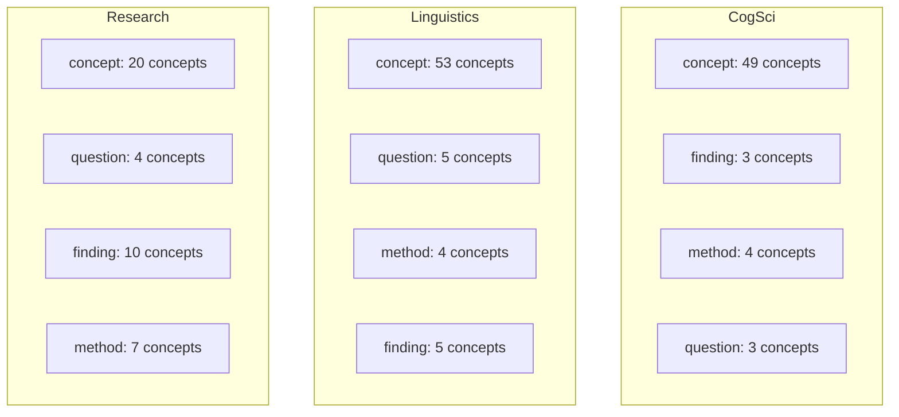

# Concept Hierarchy by Domain

```mermaid
graph TD
    subgraph D_CogSci["CogSci"]
        D_CogSci_concept["concept: 49 concepts"]
        D_CogSci_finding["finding: 3 concepts"]
        D_CogSci_method["method: 4 concepts"]
        D_CogSci_question["question: 3 concepts"]
    end
    subgraph D_Linguistics["Linguistics"]
        D_Linguistics_concept["concept: 53 concepts"]
        D_Linguistics_question["question: 5 concepts"]
        D_Linguistics_method["method: 4 concepts"]
        D_Linguistics_finding["finding: 5 concepts"]
    end
    subgraph D_Research["Research"]
        D_Research_concept["concept: 20 concepts"]
        D_Research_question["question: 4 concepts"]
        D_Research_finding["finding: 10 concepts"]
        D_Research_method["method: 7 concepts"]
    end
```