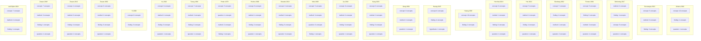

# Concept Hierarchy by Domain

```mermaid
graph TD
    subgraph D_Ahrens-2016["Ahrens-2016"]
        D_Ahrens-2016_concept["concept: 10 concepts"]
        D_Ahrens-2016_finding["finding: 1 concepts"]
        D_Ahrens-2016_question["question: 1 concepts"]
    end
    subgraph D_Bocanegra-2022["Bocanegra-2022"]
        D_Bocanegra-2022_concept["concept: 5 concepts"]
        D_Bocanegra-2022_method["method: 3 concepts"]
        D_Bocanegra-2022_finding["finding: 3 concepts"]
    end
    subgraph D_DeKoning-2017["DeKoning-2017"]
        D_DeKoning-2017_method["method: 2 concepts"]
        D_DeKoning-2017_finding["finding: 4 concepts"]
        D_DeKoning-2017_concept["concept: 5 concepts"]
        D_DeKoning-2017_question["question: 1 concepts"]
    end
    subgraph D_Forster-1994["Forster-1994"]
        D_Forster-1994_concept["concept: 5 concepts"]
        D_Forster-1994_finding["finding: 3 concepts"]
        D_Forster-1994_method["method: 3 concepts"]
        D_Forster-1994_question["question: 1 concepts"]
    end
    subgraph D_Glenberg-2002["Glenberg-2002"]
        D_Glenberg-2002_concept["concept: 7 concepts"]
        D_Glenberg-2002_finding["finding: 2 concepts"]
        D_Glenberg-2002_method["method: 1 concepts"]
        D_Glenberg-2002_question["question: 2 concepts"]
    end
    subgraph D_Her-2022["Her-2022"]
        D_Her-2022_concept["concept: 5 concepts"]
        D_Her-2022_method["method: 2 concepts"]
        D_Her-2022_finding["finding: 4 concepts"]
        D_Her-2022_question["question: 1 concepts"]
    end
    subgraph D_Horchak-2024["Horchak-2024"]
        D_Horchak-2024_concept["concept: 6 concepts"]
        D_Horchak-2024_method["method: 1 concepts"]
        D_Horchak-2024_finding["finding: 3 concepts"]
        D_Horchak-2024_question["question: 1 concepts"]
    end
    subgraph D_Huang-2003["Huang-2003"]
        D_Huang-2003_concept["concept: 10 concepts"]
        D_Huang-2003_finding["finding: 2 concepts"]
    end
    subgraph D_Huang-2015["Huang-2015"]
        D_Huang-2015_concept["concept: 6 concepts"]
        D_Huang-2015_finding["finding: 4 concepts"]
        D_Huang-2015_hypothesis["hypothesis: 1 concepts"]
    end
    subgraph D_Jiang-2001["Jiang-2001"]
        D_Jiang-2001_concept["concept: 9 concepts"]
        D_Jiang-2001_method["method: 2 concepts"]
        D_Jiang-2001_question["question: 1 concepts"]
    end
    subgraph D_Kang-2020["Kang-2020"]
        D_Kang-2020_concept["concept: 6 concepts"]
        D_Kang-2020_method["method: 2 concepts"]
        D_Kang-2020_finding["finding: 3 concepts"]
        D_Kang-2020_question["question: 1 concepts"]
    end
    subgraph D_Liu-2024["Liu-2024"]
        D_Liu-2024_concept["concept: 6 concepts"]
        D_Liu-2024_method["method: 2 concepts"]
        D_Liu-2024_finding["finding: 3 concepts"]
        D_Liu-2024_question["question: 1 concepts"]
    end
    subgraph D_Mok-2009["Mok-2009"]
        D_Mok-2009_concept["concept: 5 concepts"]
        D_Mok-2009_method["method: 3 concepts"]
        D_Mok-2009_question["question: 3 concepts"]
        D_Mok-2009_finding["finding: 1 concepts"]
    end
    subgraph D_Ostarek-2019["Ostarek-2019"]
        D_Ostarek-2019_concept["concept: 3 concepts"]
        D_Ostarek-2019_method["method: 3 concepts"]
        D_Ostarek-2019_finding["finding: 3 concepts"]
        D_Ostarek-2019_question["question: 3 concepts"]
    end
    subgraph D_Pecher-2009["Pecher-2009"]
        D_Pecher-2009_concept["concept: 8 concepts"]
        D_Pecher-2009_method["method: 1 concepts"]
        D_Pecher-2009_finding["finding: 2 concepts"]
        D_Pecher-2009_question["question: 1 concepts"]
    end
    subgraph D_Potter-1979["Potter-1979"]
        D_Potter-1979_concept["concept: 5 concepts"]
        D_Potter-1979_question["question: 1 concepts"]
        D_Potter-1979_method["method: 2 concepts"]
        D_Potter-1979_finding["finding: 4 concepts"]
    end
    subgraph D_Tzeng-1991["Tzeng-1991"]
        D_Tzeng-1991_concept["concept: 7 concepts"]
        D_Tzeng-1991_method["method: 2 concepts"]
        D_Tzeng-1991_finding["finding: 2 concepts"]
        D_Tzeng-1991_question["question: 1 concepts"]
    end
    subgraph D_Xu-2022["Xu-2022"]
        D_Xu-2022_concept["concept: 6 concepts"]
        D_Xu-2022_method["method: 2 concepts"]
        D_Xu-2022_finding["finding: 3 concepts"]
        D_Xu-2022_question["question: 1 concepts"]
    end
    subgraph D_Yi-2009["Yi-2009"]
        D_Yi-2009_concept["concept: 8 concepts"]
        D_Yi-2009_finding["finding: 3 concepts"]
    end
    subgraph D_Zwaan-2002["Zwaan-2002"]
        D_Zwaan-2002_concept["concept: 6 concepts"]
        D_Zwaan-2002_method["method: 2 concepts"]
        D_Zwaan-2002_finding["finding: 3 concepts"]
        D_Zwaan-2002_question["question: 1 concepts"]
    end
    subgraph D_Zwaan-2012["Zwaan-2012"]
        D_Zwaan-2012_concept["concept: 4 concepts"]
        D_Zwaan-2012_method["method: 2 concepts"]
        D_Zwaan-2012_finding["finding: 4 concepts"]
        D_Zwaan-2012_question["question: 2 concepts"]
    end
    subgraph D_Zwaan-2018["Zwaan-2018"]
        D_Zwaan-2018_concept["concept: 7 concepts"]
        D_Zwaan-2018_method["method: 3 concepts"]
        D_Zwaan-2018_finding["finding: 1 concepts"]
        D_Zwaan-2018_question["question: 1 concepts"]
    end
    subgraph D_vanZuijlen-2024["vanZuijlen-2024"]
        D_vanZuijlen-2024_concept["concept: 7 concepts"]
        D_vanZuijlen-2024_method["method: 4 concepts"]
        D_vanZuijlen-2024_finding["finding: 1 concepts"]
    end
```