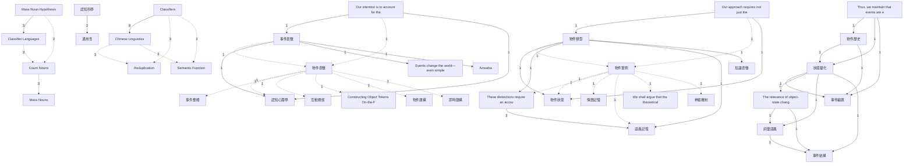

# Zettelkasten Concept Network

```mermaid
graph TD
    C6512["Classifiers"]
    C9293["Chinese Linguistics"]
    C6512 -->|8| C9293
    C4206["Mass Noun Hypothesis"]
    C1769["Classifier Languages"]
    C4206 -->|3| C1769
    C1451["Count Nouns"]
    C1769 -.->|3| C1451
    C8317["Mass Nouns"]
    C1451 -.->|3| C8317
    C6615["Reduplication"]
    C6512 -.->|3| C6615
    C9293 -.->|3| C6615
    C5698["These distinctions require an accou"]
    C5585["語義記憶"]
    C5698 -->|2| C5585
    C4206 -.->|2| C1451
    C8774["Semantic Function"]
    C6512 -.->|2| C8774
    C9293 -.->|2| C8774
    C5479["認知科學"]
    C846["通用性"]
    C5479 -->|2| C846
    C6314["Our intention is to account for the"]
    C9097["事件表徵"]
    C6314 -->|1| C9097
    C8314["物件表徵"]
    C6314 -.->|1| C8314
    C6084["認知心理學"]
    C6314 -->|1| C6084
    C9097 -.->|1| C8314
    C9097 -->|1| C6084
    C468["Events change the world—even simple"]
    C9097 -->|1| C468
    C1116["Amoeba"]
    C9097 -->|1| C1116
    C8314 -.->|1| C6084
    C6003["事件整體"]
    C8314 -.->|1| C6003
    C1792["互動關係"]
    C8314 -.->|1| C1792
    C8357["Constructing Object Tokens On-the-F"]
    C8314 -.->|1| C8357
    C3269["物件建構"]
    C8314 -.->|1| C3269
    C6038["即時建構"]
    C8314 -.->|1| C6038
    C5021["Thus, we maintain that events are e"]
    C404["物件歷史"]
    C5021 -->|1| C404
    C4399["狀態變化"]
    C5021 -->|1| C4399
    C1203["事件編碼"]
    C5021 -->|1| C1203
    C404 -->|1| C4399
    C404 -->|1| C1203
    C4399 -->|1| C1203
    C2868["The relevance of object-state chang"]
    C4399 -->|1| C2868
    C6841["詞彙語義"]
    C4399 -->|1| C6841
    C5127["事件結構"]
    C4399 -->|1| C5127
    C8474["Our approach requires not just the "]
    C3676["物件類型"]
    C8474 -->|1| C3676
    C4672["物件實例"]
    C8474 -.->|1| C4672
    C2055["物件狀態"]
    C8474 -->|1| C2055
    C3676 -.->|1| C4672
    C3676 -->|1| C2055
    C3676 -->|1| C5698
    C3676 -->|1| C5585
    C6068["知識表徵"]
    C3676 -->|1| C6068
    C4672 -.->|1| C2055
    C4672 -.->|1| C5698
    C9666["情節記憶"]
    C4672 -.->|1| C9666
    C4672 -.->|1| C5585
    C8735["We shall argue that the theoretical"]
    C4672 -.->|1| C8735
    C2060["神經機制"]
    C4672 -.->|1| C2060
    C2868 -->|1| C6841
    C2868 -->|1| C5127
    C6841 -->|1| C5127
```