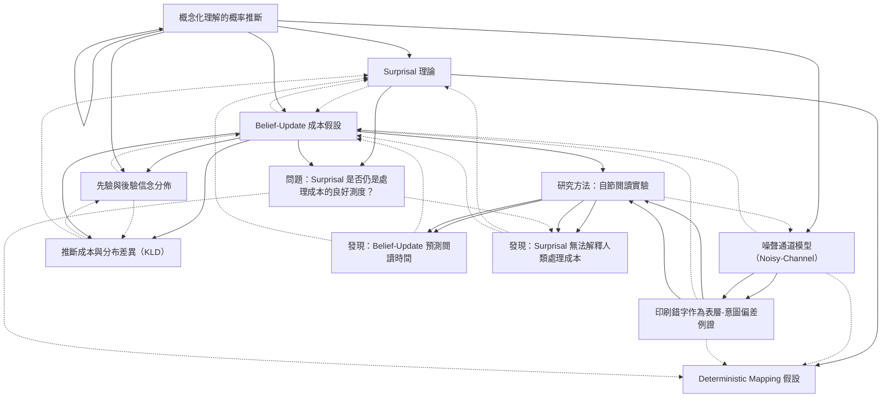

# Zettelkasten 卡片索引

**來源論文**: Comprehension effort
**作者**: 
**年份**: 2025
**生成日期**: 2025-10-31 00:23
**卡片總數**: 12

---

## 📚 卡片清單

### 1. [概念化理解的概率推斷](zettel_cards/CogSci-20251031-001.md)
- **ID**: `CogSci-20251031-001`
- **類型**: 
- **核心**: "comprehension as probabilistic inference over latent interpretations given linguistic input."
- **標籤**: `概念化`, `推斷`, `語言理解`

### 2. [Surprisal 理論](zettel_cards/CogSci-20251031-002.md)
- **ID**: `CogSci-20251031-002`
- **類型**: 
- **核心**: "processing cost be measured with surprisal, an information‑theoretic quantity defined as the negative log probability of a word, in context."
- **標籤**: `Surprisal`, `信息量`, `語言成本`

### 3. [Belief‑Update 成本假設](zettel_cards/CogSci-20251031-003.md)
- **ID**: `CogSci-20251031-003`
- **類型**: 
- **核心**: "processing cost be quantified with the magnitude of belief‑update in a probabilistic inference setting."
- **標籤**: `Belief‑Update`, `推斷成本`, `信息更新`

### 4. [Deterministic Mapping 假設](zettel_cards/CogSci-20251031-004.md)
- **ID**: `CogSci-20251031-004`
- **類型**: 
- **核心**: "Levy (2008a) explicitly relied on an assumption that latent meaning representations have a deterministic relationship to observable strings."
- **標籤**: `Deterministic`, `觀測`, `先驗假設`

### 5. [噪聲通道模型（Noisy‑Channel）](zettel_cards/CogSci-20251031-005.md)
- **ID**: `CogSci-20251031-005`
- **類型**: 
- **核心**: "in a noisy‑channel model of comprehension as inference about intended words, an intuitive simple setting where latent states (intended words) do not deterministically relate to the observed input."
- **標籤**: `噪聲通道`, `偏差`, `語音錯誤`

### 6. [印刷錯字作為表層-意圖偏差例證](zettel_cards/CogSci-20251031-006.md)
- **ID**: `CogSci-20251031-006`
- **類型**: 
- **核心**: "We focus on typographical errors because they create a clear case where surface forms diverge from intended meanings."
- **標籤**: `typographic error`, `表層偏差`, `研究對象`

### 7. [先驗與後驗信念分佈](zettel_cards/CogSci-20251031-007.md)
- **ID**: `CogSci-20251031-007`
- **類型**: 
- **核心**: "In inference we update prior beliefs p(Z) to posterior beliefs p(Z|u) given observed input u."
- **標籤**: `先驗`, `後驗`, `Bayes 理論`

### 8. [推斷成本與分布差異（KLD）](zettel_cards/CogSci-20251031-008.md)
- **ID**: `CogSci-20251031-008`
- **類型**: 
- **核心**: "The cost of inference can be quantified by the magnitude of this belief‑update."
- **標籤**: `推斷成本`, `KL 散度`, `信息更新`

### 9. [研究方法：自節閱讀實驗](zettel_cards/CogSci-20251031-009.md)
- **ID**: `CogSci-20251031-009`
- **類型**: 
- **核心**: "We conduct a self‑paced reading time study targeting words with orthographic errors."
- **標籤**: `自節閱讀`, `實驗設計`, `眼動追蹤`

### 10. [發現：Belief‑Update 預測閱讀時間](zettel_cards/CogSci-20251031-010.md)
- **ID**: `CogSci-20251031-010`
- **類型**: 
- **核心**: "Reading times on these items pattern as predicted by belief‑update, rather than surprisal."
- **標籤**: `實證結果`, `視覺閱讀`, `信念更新`

### 11. [發現：Surprisal 無法解釋人類處理成本](zettel_cards/CogSci-20251031-011.md)
- **ID**: `CogSci-20251031-011`
- **類型**: 
- **核心**: "Our results demonstrate a clear case where surface surprisal cannot explain human processing cost."
- **標籤**: `實證`, `Surprisal`, `認知限制`

### 12. [問題：Surprisal 是否仍是處理成本的良好測度？](zettel_cards/CogSci-20251031-012.md)
- **ID**: `CogSci-20251031-012`
- **類型**: 
- **核心**: "Is surprisal a good measure of processing cost, even when this assumption does not hold?"
- **標籤**: `理論疑問`, `Surprisal`, `評估`

---

## 🗺️ 概念網絡圖

---

## 🏷️ 標籤索引

### 概念化
- [[CogSci-20251031-001]] 概念化理解的概率推斷

### 推斷
- [[CogSci-20251031-001]] 概念化理解的概率推斷

### 語言理解
- [[CogSci-20251031-001]] 概念化理解的概率推斷

### Surprisal
- [[CogSci-20251031-002]] Surprisal 理論
- [[CogSci-20251031-011]] 發現：Surprisal 無法解釋人類處理成本
- [[CogSci-20251031-012]] 問題：Surprisal 是否仍是處理成本的良好測度？

### 信息量
- [[CogSci-20251031-002]] Surprisal 理論

### 語言成本
- [[CogSci-20251031-002]] Surprisal 理論

### Belief‑Update
- [[CogSci-20251031-003]] Belief‑Update 成本假設

### 推斷成本
- [[CogSci-20251031-003]] Belief‑Update 成本假設
- [[CogSci-20251031-008]] 推斷成本與分布差異（KLD）

### 信息更新
- [[CogSci-20251031-003]] Belief‑Update 成本假設
- [[CogSci-20251031-008]] 推斷成本與分布差異（KLD）

### Deterministic
- [[CogSci-20251031-004]] Deterministic Mapping 假設

### 觀測
- [[CogSci-20251031-004]] Deterministic Mapping 假設

### 先驗假設
- [[CogSci-20251031-004]] Deterministic Mapping 假設

### 噪聲通道
- [[CogSci-20251031-005]] 噪聲通道模型（Noisy‑Channel）

### 偏差
- [[CogSci-20251031-005]] 噪聲通道模型（Noisy‑Channel）

### 語音錯誤
- [[CogSci-20251031-005]] 噪聲通道模型（Noisy‑Channel）

### typographic error
- [[CogSci-20251031-006]] 印刷錯字作為表層-意圖偏差例證

### 表層偏差
- [[CogSci-20251031-006]] 印刷錯字作為表層-意圖偏差例證

### 研究對象
- [[CogSci-20251031-006]] 印刷錯字作為表層-意圖偏差例證

### 先驗
- [[CogSci-20251031-007]] 先驗與後驗信念分佈

### 後驗
- [[CogSci-20251031-007]] 先驗與後驗信念分佈

### Bayes 理論
- [[CogSci-20251031-007]] 先驗與後驗信念分佈

### KL 散度
- [[CogSci-20251031-008]] 推斷成本與分布差異（KLD）

### 自節閱讀
- [[CogSci-20251031-009]] 研究方法：自節閱讀實驗

### 實驗設計
- [[CogSci-20251031-009]] 研究方法：自節閱讀實驗

### 眼動追蹤
- [[CogSci-20251031-009]] 研究方法：自節閱讀實驗

### 實證結果
- [[CogSci-20251031-010]] 發現：Belief‑Update 預測閱讀時間

### 視覺閱讀
- [[CogSci-20251031-010]] 發現：Belief‑Update 預測閱讀時間

### 信念更新
- [[CogSci-20251031-010]] 發現：Belief‑Update 預測閱讀時間

### 實證
- [[CogSci-20251031-011]] 發現：Surprisal 無法解釋人類處理成本

### 認知限制
- [[CogSci-20251031-011]] 發現：Surprisal 無法解釋人類處理成本

### 理論疑問
- [[CogSci-20251031-012]] 問題：Surprisal 是否仍是處理成本的良好測度？

### 評估
- [[CogSci-20251031-012]] 問題：Surprisal 是否仍是處理成本的良好測度？

---

## 📖 閱讀建議順序

1. [[CogSci-20251031-004]] Deterministic Mapping 假設

2. [[CogSci-20251031-007]] 先驗與後驗信念分佈

3. [[CogSci-20251031-008]] 推斷成本與分布差異（KLD）

4. [[CogSci-20251031-010]] 發現：Belief‑Update 預測閱讀時間

5. [[CogSci-20251031-011]] 發現：Surprisal 無法解釋人類處理成本

6. [[CogSci-20251031-012]] 問題：Surprisal 是否仍是處理成本的良好測度？

7. [[CogSci-20251031-005]] 噪聲通道模型（Noisy‑Channel）

8. [[CogSci-20251031-006]] 印刷錯字作為表層-意圖偏差例證

9. [[CogSci-20251031-002]] Surprisal 理論

10. [[CogSci-20251031-009]] 研究方法：自節閱讀實驗

11. [[CogSci-20251031-003]] Belief‑Update 成本假設

12. [[CogSci-20251031-001]] 概念化理解的概率推斷

---

*本索引由 Knowledge Production System 自動生成*