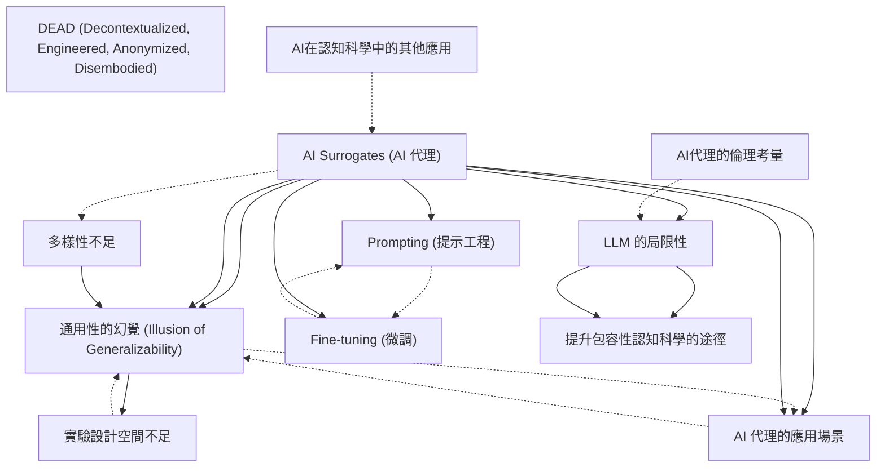

# Zettelkasten 卡片索引

**來源論文**: AI Surrogates
**作者**: 
**年份**: 2025
**生成日期**: 2025-10-28 22:59
**卡片總數**: 12

---

## 📚 卡片清單

### 1. [AI Surrogates (AI 代理)](zettel_cards/CogSci-20251028-001.md)
- **ID**: `CogSci-20251028-001`
- **類型**: 
- **核心**: AI 代理是指旨在模擬人類研究參與者的 AI 模型，用於產生關於人類認知和行為的新知識。
- **標籤**: `AI`, `認知科學`, `模擬`, `通用性`

### 2. [通用性的幻覺 (Illusion of Generalizability)](zettel_cards/CogSci-20251028-002.md)
- **ID**: `CogSci-20251028-002`
- **類型**: 
- **核心**: 通用性的幻覺是指研究者誤以為研究結果比實際情況更具通用性，可能因 AI 代理的應用而加劇。
- **標籤**: `通用性`, `偏見`, `認知科學`, `方法論`

### 3. [AI 代理的應用場景](zettel_cards/CogSci-20251028-003.md)
- **ID**: `CogSci-20251028-003`
- **類型**: 
- **核心**: AI 代理可用於評估研究的可重複性、測試實驗設計以及模擬複雜的社會現象。
- **標籤**: `AI`, `模擬`, `實驗設計`, `可重複性`

### 4. [LLM 的局限性](zettel_cards/CogSci-20251028-004.md)
- **ID**: `CogSci-20251028-004`
- **類型**: 
- **核心**: 基於 LLM 的 AI 代理可能存在過度代表主流觀點、缺乏反應多樣性以及難以解釋和不穩定的問題。
- **標籤**: `LLM`, `偏見`, `可解釋性`, `穩定性`

### 5. [Prompting (提示工程)](zettel_cards/CogSci-20251028-005.md)
- **ID**: `CogSci-20251028-005`
- **類型**: 
- **核心**: Prompting 是指通過書面指令引導 LLM 扮演特定身份、立場或社會角色。
- **標籤**: `LLM`, `提示工程`, `行為模擬`

### 6. [Fine-tuning (微調)](zettel_cards/CogSci-20251028-006.md)
- **ID**: `CogSci-20251028-006`
- **類型**: 
- **核心**: Fine-tuning 是指通過額外的訓練調整 LLM 的參數，使其適應特定任務領域。
- **標籤**: `LLM`, `微調`, `模型訓練`

### 7. [多樣性不足](zettel_cards/CogSci-20251028-007.md)
- **ID**: `CogSci-20251028-007`
- **類型**: 
- **核心**: 現有的參與者樣本通常不夠多樣化，難以支持關於普遍認知過程的聲稱，而AI代理本意是解決此問題。
- **標籤**: `多樣性`, `參與者`, `樣本`, `認知科學`

### 8. [實驗設計空間不足](zettel_cards/CogSci-20251028-008.md)
- **ID**: `CogSci-20251028-008`
- **類型**: 
- **核心**: 單個實驗室實驗探索的刺激和情境不足以支持對認知和行為的廣泛聲稱。
- **標籤**: `實驗設計`, `情境`, `刺激`, `認知科學`

### 9. [DEAD (Decontextualized, Engineered, Anonymized, Disembodied)](zettel_cards/CogSci-20251028-009.md)
- **ID**: `CogSci-20251028-009`
- **類型**: 
- **核心**: DEAD 是一個縮寫，用於批判許多人類受試者實驗的局限性，即去情境化、人為設計、匿名化和脫離具體身體。
- **標籤**: `實驗設計`, `批判`, `情境`, `人類受試者`

### 10. [提升包容性認知科學的途徑](zettel_cards/CogSci-20251028-010.md)
- **ID**: `CogSci-20251028-010`
- **類型**: 
- **核心**: 如何通過社會和技術手段解決認知科學研究的基礎性局限性，從而實現更具包容性的認知科學。
- **標籤**: `包容性`, `認知科學`, `方法論`, `社會`

### 11. [AI在認知科學中的其他應用](zettel_cards/CogSci-20251028-011.md)
- **ID**: `CogSci-20251028-011`
- **類型**: 
- **核心**: 除了 AI 代理，AI 模型還可以用於探測 AI 模型本身的能力，以及作為探索人類認知特定維度的有用抽象工具。
- **標籤**: `人工智能`, `認知科學`, `應用`, `工具`

### 12. [AI代理的倫理考量](zettel_cards/CogSci-20251028-012.md)
- **ID**: `CogSci-20251028-012`
- **類型**: 
- **核心**: 使用 AI 代理模擬人類行為引發了哪些倫理問題？
- **標籤**: `倫理`, `人工智能`, `道德`, `責任`

---

## 🗺️ 概念網絡圖

---

## 🏷️ 標籤索引

### AI
- [[CogSci-20251028-001]] AI Surrogates (AI 代理)
- [[CogSci-20251028-003]] AI 代理的應用場景

### 認知科學
- [[CogSci-20251028-001]] AI Surrogates (AI 代理)
- [[CogSci-20251028-002]] 通用性的幻覺 (Illusion of Generalizability)
- [[CogSci-20251028-007]] 多樣性不足
- [[CogSci-20251028-008]] 實驗設計空間不足
- [[CogSci-20251028-010]] 提升包容性認知科學的途徑
- [[CogSci-20251028-011]] AI在認知科學中的其他應用

### 模擬
- [[CogSci-20251028-001]] AI Surrogates (AI 代理)
- [[CogSci-20251028-003]] AI 代理的應用場景

### 通用性
- [[CogSci-20251028-001]] AI Surrogates (AI 代理)
- [[CogSci-20251028-002]] 通用性的幻覺 (Illusion of Generalizability)

### 偏見
- [[CogSci-20251028-002]] 通用性的幻覺 (Illusion of Generalizability)
- [[CogSci-20251028-004]] LLM 的局限性

### 方法論
- [[CogSci-20251028-002]] 通用性的幻覺 (Illusion of Generalizability)
- [[CogSci-20251028-010]] 提升包容性認知科學的途徑

### 實驗設計
- [[CogSci-20251028-003]] AI 代理的應用場景
- [[CogSci-20251028-008]] 實驗設計空間不足
- [[CogSci-20251028-009]] DEAD (Decontextualized, Engineered, Anonymized, Disembodied)

### 可重複性
- [[CogSci-20251028-003]] AI 代理的應用場景

### LLM
- [[CogSci-20251028-004]] LLM 的局限性
- [[CogSci-20251028-005]] Prompting (提示工程)
- [[CogSci-20251028-006]] Fine-tuning (微調)

### 可解釋性
- [[CogSci-20251028-004]] LLM 的局限性

### 穩定性
- [[CogSci-20251028-004]] LLM 的局限性

### 提示工程
- [[CogSci-20251028-005]] Prompting (提示工程)

### 行為模擬
- [[CogSci-20251028-005]] Prompting (提示工程)

### 微調
- [[CogSci-20251028-006]] Fine-tuning (微調)

### 模型訓練
- [[CogSci-20251028-006]] Fine-tuning (微調)

### 多樣性
- [[CogSci-20251028-007]] 多樣性不足

### 參與者
- [[CogSci-20251028-007]] 多樣性不足

### 樣本
- [[CogSci-20251028-007]] 多樣性不足

### 情境
- [[CogSci-20251028-008]] 實驗設計空間不足
- [[CogSci-20251028-009]] DEAD (Decontextualized, Engineered, Anonymized, Disembodied)

### 刺激
- [[CogSci-20251028-008]] 實驗設計空間不足

### 批判
- [[CogSci-20251028-009]] DEAD (Decontextualized, Engineered, Anonymized, Disembodied)

### 人類受試者
- [[CogSci-20251028-009]] DEAD (Decontextualized, Engineered, Anonymized, Disembodied)

### 包容性
- [[CogSci-20251028-010]] 提升包容性認知科學的途徑

### 社會
- [[CogSci-20251028-010]] 提升包容性認知科學的途徑

### 人工智能
- [[CogSci-20251028-011]] AI在認知科學中的其他應用
- [[CogSci-20251028-012]] AI代理的倫理考量

### 應用
- [[CogSci-20251028-011]] AI在認知科學中的其他應用

### 工具
- [[CogSci-20251028-011]] AI在認知科學中的其他應用

### 倫理
- [[CogSci-20251028-012]] AI代理的倫理考量

### 道德
- [[CogSci-20251028-012]] AI代理的倫理考量

### 責任
- [[CogSci-20251028-012]] AI代理的倫理考量

---

## 📖 閱讀建議順序

1. [[CogSci-20251028-002]] 通用性的幻覺 (Illusion of Generalizability)

2. [[CogSci-20251028-003]] AI 代理的應用場景

3. [[CogSci-20251028-005]] Prompting (提示工程)

4. [[CogSci-20251028-006]] Fine-tuning (微調)

5. [[CogSci-20251028-007]] 多樣性不足

6. [[CogSci-20251028-008]] 實驗設計空間不足

7. [[CogSci-20251028-009]] DEAD (Decontextualized, Engineered, Anonymized, Disembodied)

8. [[CogSci-20251028-010]] 提升包容性認知科學的途徑

9. [[CogSci-20251028-011]] AI在認知科學中的其他應用

10. [[CogSci-20251028-012]] AI代理的倫理考量

11. [[CogSci-20251028-004]] LLM 的局限性

12. [[CogSci-20251028-001]] AI Surrogates (AI 代理)

---

*本索引由 Knowledge Production System 自動生成*