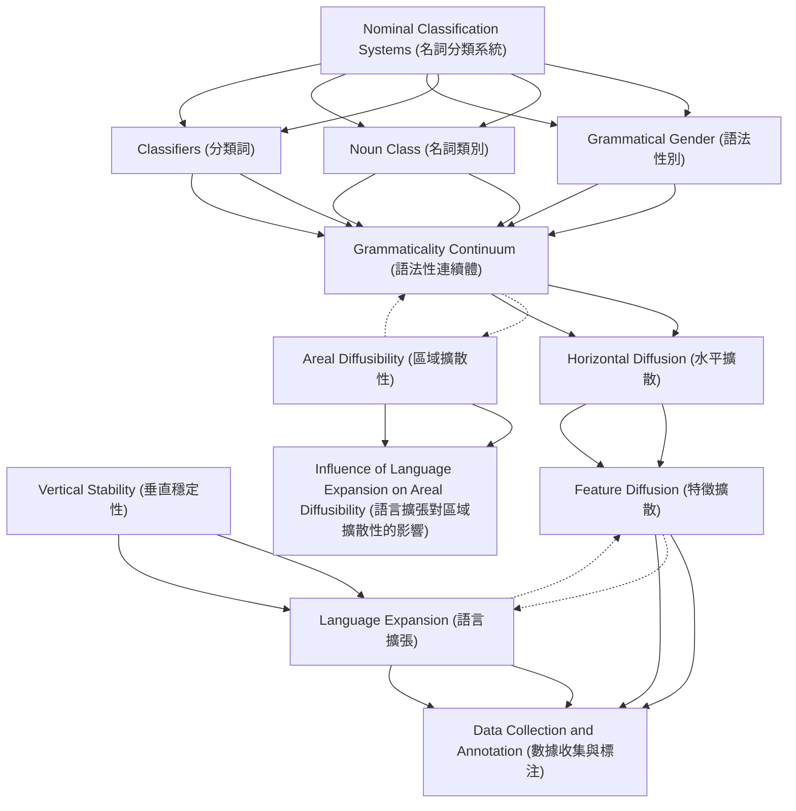

# Zettelkasten 卡片索引

**來源論文**: Noun Categorization Systems
**作者**: 
**年份**: 2025
**生成日期**: 2025-10-28 23:19
**卡片總數**: 12

---

## 📚 卡片清單

### 1. [Nominal Classification Systems (名詞分類系統)](zettel_cards/Linguistics-20251028-001.md)
- **ID**: `Linguistics-20251028-001`
- **類型**: 
- **核心**: "Globally, there are three major types of linguistic systems that mirror the cognitive process of categorizing objects within our environment (Lakoff and Johnson, 2013: 162–163; Kemmerer, 2014, 2017a, 2017b)."
- **標籤**: `名詞分類`, `語法`, `詞彙`, `認知`

### 2. [Grammatical Gender (語法性別)](zettel_cards/Linguistics-20251028-002.md)
- **ID**: `Linguistics-20251028-002`
- **類型**: 
- **核心**: "The first type is grammatical gender (Corbett, 1991, 2013), such as the masculine/feminine distinction in French or the masculine/ feminine/neuter distinction in German."
- **標籤**: `語法性別`, `名詞分類`, `語法`, `法語`, `德語`

### 3. [Noun Class (名詞類別)](zettel_cards/Linguistics-20251028-003.md)
- **ID**: `Linguistics-20251028-003`
- **類型**: 
- **核心**: "The second type is noun classes (Corbett, 1991; Grinevald and Seifart, 2004), such as the semantic-based distinction of more than 15 classes in Swahili."
- **標籤**: `名詞類別`, `名詞分類`, `語法`, `斯瓦希里語`, `語義`

### 4. [Classifiers (分類詞)](zettel_cards/Linguistics-20251028-004.md)
- **ID**: `Linguistics-20251028-004`
- **類型**: 
- **核心**: "The third type is classifiers (Aikhenvald, 2000; Grinevald, 2015), such as the shape-based distinctions in Mandarin (see Supplementary material 1.1 for further details on the definitions)."
- **標籤**: `分類詞`, `名詞分類`, `詞彙`, `漢語`, `語義`

### 5. [Grammaticality Continuum (語法性連續體)](zettel_cards/Linguistics-20251028-005.md)
- **ID**: `Linguistics-20251028-005`
- **類型**: 
- **核心**: "Grammaticality can be viewed as a continuum, ranging from the most grammatical items of grammar (frequent function words of low transparency) to the least grammatical items of the lexicon (cultural and non-frequent content words of high transparency) (Matras and Sakel, 2007)."
- **標籤**: `語法性`, `詞彙`, `語法`, `連續體`, `透明度`

### 6. [Horizontal Diffusion (水平擴散)](zettel_cards/Linguistics-20251028-006.md)
- **ID**: `Linguistics-20251028-006`
- **類型**: 
- **核心**: "Generally, different feature types vary with respect to their inherent stability (Nichols, 1992; Dediu and Cysouw, 2013), which may reflect their functional role and cognitive preference."
- **標籤**: `水平擴散`, `語言接觸`, `語言演變`, `語言類型學`

### 7. [Vertical Stability (垂直穩定性)](zettel_cards/Linguistics-20251028-007.md)
- **ID**: `Linguistics-20251028-007`
- **類型**: 
- **核心**: "The distribution of linguistic features in the more than 7000 languages of the world (Hammarström, 2016; Hammarström et al., 2019) reflects a scenario where some features may have emerged and spread by horizontal diffusion, whereas others are represented by vertical stability within their lineage."
- **標籤**: `垂直穩定性`, `語言演變`, `語言系屬`, `語言類型學`

### 8. [Feature Diffusion (特徵擴散)](zettel_cards/Linguistics-20251028-008.md)
- **ID**: `Linguistics-20251028-008`
- **類型**: 
- **核心**: "Here, we suggest that the geographic distribution of features globally can be explained by two major pathways, which are generally not distinguished within quantitative typological models: feature diffusion and language expansion."
- **標籤**: `特徵擴散`, `語言傳播`, `語言類型學`, `地理分布`

### 9. [Language Expansion (語言擴張)](zettel_cards/Linguistics-20251028-009.md)
- **ID**: `Linguistics-20251028-009`
- **類型**: 
- **核心**: "The first pathway corresponds to the contact scenario described above, while the second occurs when speakers of genetically related languages migrate."
- **標籤**: `語言擴張`, `語言傳播`, `語言類型學`, `歷史語言學`

### 10. [Areal Diffusibility (區域擴散性)](zettel_cards/Linguistics-20251028-010.md)
- **ID**: `Linguistics-20251028-010`
- **類型**: 
- **核心**: "Our results indicate that quantitative models measuring the areal diffusibility and stability of linguistic features are likely to be affected by language expansion that occurs by historical coincidence."
- **標籤**: `區域擴散性`, `穩定性`, `語言類型學`, `統計模型`

### 11. [Data Collection and Annotation (數據收集與標注)](zettel_cards/Linguistics-20251028-011.md)
- **ID**: `Linguistics-20251028-011`
- **類型**: 
- **核心**: "We constructed a database of 3077 languages annotated with the presence/absence of gender, noun class, and classifier systems."
- **標籤**: `數據庫`, `語言學`, `語法`, `標注`, `自動提取`

### 12. [Influence of Language Expansion on Areal Diffusibility (語言擴張對區域擴散性的影響)](zettel_cards/Linguistics-20251028-012.md)
- **ID**: `Linguistics-20251028-012`
- **類型**: 
- **核心**: "Our results indicate that quantitative models measuring the areal diffusibility and stability of linguistic features are likely to be affected by language expansion that occurs by historical coincidence."
- **標籤**: `語言擴張`, `區域擴散性`, `語言類型學`, `統計模型`

---

## 🗺️ 概念網絡圖

---

## 🏷️ 標籤索引

### 名詞分類
- [[Linguistics-20251028-001]] Nominal Classification Systems (名詞分類系統)
- [[Linguistics-20251028-002]] Grammatical Gender (語法性別)
- [[Linguistics-20251028-003]] Noun Class (名詞類別)
- [[Linguistics-20251028-004]] Classifiers (分類詞)

### 語法
- [[Linguistics-20251028-001]] Nominal Classification Systems (名詞分類系統)
- [[Linguistics-20251028-002]] Grammatical Gender (語法性別)
- [[Linguistics-20251028-003]] Noun Class (名詞類別)
- [[Linguistics-20251028-005]] Grammaticality Continuum (語法性連續體)
- [[Linguistics-20251028-011]] Data Collection and Annotation (數據收集與標注)

### 詞彙
- [[Linguistics-20251028-001]] Nominal Classification Systems (名詞分類系統)
- [[Linguistics-20251028-004]] Classifiers (分類詞)
- [[Linguistics-20251028-005]] Grammaticality Continuum (語法性連續體)

### 認知
- [[Linguistics-20251028-001]] Nominal Classification Systems (名詞分類系統)

### 語法性別
- [[Linguistics-20251028-002]] Grammatical Gender (語法性別)

### 法語
- [[Linguistics-20251028-002]] Grammatical Gender (語法性別)

### 德語
- [[Linguistics-20251028-002]] Grammatical Gender (語法性別)

### 名詞類別
- [[Linguistics-20251028-003]] Noun Class (名詞類別)

### 斯瓦希里語
- [[Linguistics-20251028-003]] Noun Class (名詞類別)

### 語義
- [[Linguistics-20251028-003]] Noun Class (名詞類別)
- [[Linguistics-20251028-004]] Classifiers (分類詞)

### 分類詞
- [[Linguistics-20251028-004]] Classifiers (分類詞)

### 漢語
- [[Linguistics-20251028-004]] Classifiers (分類詞)

### 語法性
- [[Linguistics-20251028-005]] Grammaticality Continuum (語法性連續體)

### 連續體
- [[Linguistics-20251028-005]] Grammaticality Continuum (語法性連續體)

### 透明度
- [[Linguistics-20251028-005]] Grammaticality Continuum (語法性連續體)

### 水平擴散
- [[Linguistics-20251028-006]] Horizontal Diffusion (水平擴散)

### 語言接觸
- [[Linguistics-20251028-006]] Horizontal Diffusion (水平擴散)

### 語言演變
- [[Linguistics-20251028-006]] Horizontal Diffusion (水平擴散)
- [[Linguistics-20251028-007]] Vertical Stability (垂直穩定性)

### 語言類型學
- [[Linguistics-20251028-006]] Horizontal Diffusion (水平擴散)
- [[Linguistics-20251028-007]] Vertical Stability (垂直穩定性)
- [[Linguistics-20251028-008]] Feature Diffusion (特徵擴散)
- [[Linguistics-20251028-009]] Language Expansion (語言擴張)
- [[Linguistics-20251028-010]] Areal Diffusibility (區域擴散性)
- [[Linguistics-20251028-012]] Influence of Language Expansion on Areal Diffusibility (語言擴張對區域擴散性的影響)

### 垂直穩定性
- [[Linguistics-20251028-007]] Vertical Stability (垂直穩定性)

### 語言系屬
- [[Linguistics-20251028-007]] Vertical Stability (垂直穩定性)

### 特徵擴散
- [[Linguistics-20251028-008]] Feature Diffusion (特徵擴散)

### 語言傳播
- [[Linguistics-20251028-008]] Feature Diffusion (特徵擴散)
- [[Linguistics-20251028-009]] Language Expansion (語言擴張)

### 地理分布
- [[Linguistics-20251028-008]] Feature Diffusion (特徵擴散)

### 語言擴張
- [[Linguistics-20251028-009]] Language Expansion (語言擴張)
- [[Linguistics-20251028-012]] Influence of Language Expansion on Areal Diffusibility (語言擴張對區域擴散性的影響)

### 歷史語言學
- [[Linguistics-20251028-009]] Language Expansion (語言擴張)

### 區域擴散性
- [[Linguistics-20251028-010]] Areal Diffusibility (區域擴散性)
- [[Linguistics-20251028-012]] Influence of Language Expansion on Areal Diffusibility (語言擴張對區域擴散性的影響)

### 穩定性
- [[Linguistics-20251028-010]] Areal Diffusibility (區域擴散性)

### 統計模型
- [[Linguistics-20251028-010]] Areal Diffusibility (區域擴散性)
- [[Linguistics-20251028-012]] Influence of Language Expansion on Areal Diffusibility (語言擴張對區域擴散性的影響)

### 數據庫
- [[Linguistics-20251028-011]] Data Collection and Annotation (數據收集與標注)

### 語言學
- [[Linguistics-20251028-011]] Data Collection and Annotation (數據收集與標注)

### 標注
- [[Linguistics-20251028-011]] Data Collection and Annotation (數據收集與標注)

### 自動提取
- [[Linguistics-20251028-011]] Data Collection and Annotation (數據收集與標注)

---

## 📖 閱讀建議順序

1. [[Linguistics-20251028-011]] Data Collection and Annotation (數據收集與標注)

2. [[Linguistics-20251028-012]] Influence of Language Expansion on Areal Diffusibility (語言擴張對區域擴散性的影響)

3. [[Linguistics-20251028-002]] Grammatical Gender (語法性別)

4. [[Linguistics-20251028-003]] Noun Class (名詞類別)

5. [[Linguistics-20251028-004]] Classifiers (分類詞)

6. [[Linguistics-20251028-005]] Grammaticality Continuum (語法性連續體)

7. [[Linguistics-20251028-006]] Horizontal Diffusion (水平擴散)

8. [[Linguistics-20251028-007]] Vertical Stability (垂直穩定性)

9. [[Linguistics-20251028-008]] Feature Diffusion (特徵擴散)

10. [[Linguistics-20251028-009]] Language Expansion (語言擴張)

11. [[Linguistics-20251028-010]] Areal Diffusibility (區域擴散性)

12. [[Linguistics-20251028-001]] Nominal Classification Systems (名詞分類系統)

---

*本索引由 Knowledge Production System 自動生成*