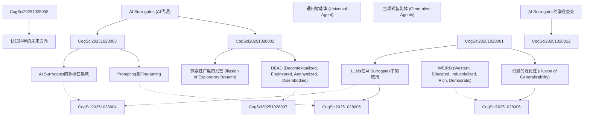

# Zettelkasten 卡片索引

**來源論文**: AI Surrogates 認知科學
**作者**: 
**年份**: 2025
**生成日期**: 2025-10-28 22:56
**卡片總數**: 12

---

## 📚 卡片清單

### 1. [AI Surrogates (AI代理)](zettel_cards/CogSci-20251028-001.md)
- **ID**: `CogSci-20251028-001`
- **類型**: 
- **核心**: AI Surrogates是指用於模擬人類研究參與者的AI模型，以生成關於人類認知和行為的新知識。
- **標籤**: `AI`, `認知科學`, `模擬`, `人類行為`

### 2. [幻覺的泛化性 (Illusion of Generalizability)](zettel_cards/CogSci-20251028-002.md)
- **ID**: `CogSci-20251028-002`
- **類型**: 
- **核心**: 幻覺的泛化性是指研究者誤認為研究結果比實際情況更具有廣泛適用性，特別是在使用AI Surrogates時，更容易產生這種錯覺。
- **標籤**: `泛化性`, `認知科學`, `AI`, `偏見`

### 3. [LLMs在AI Surrogates中的應用](zettel_cards/CogSci-20251028-003.md)
- **ID**: `CogSci-20251028-003`
- **類型**: 
- **核心**: 大型語言模型(LLMs)是目前AI Surrogates中最常用的模型，可以用於模擬人類的語言、決策和行為。
- **標籤**: `LLM`, `AI`, `自然語言處理`, `模擬`

### 4. [Prompting和Fine-tuning](zettel_cards/CogSci-20251028-004.md)
- **ID**: `CogSci-20251028-004`
- **類型**: 
- **核心**: Prompting (提示)和Fine-tuning (微調)是用於調整LLMs行為的兩種主要方法，使其更接近目標人類群體的行為。
- **標籤**: `LLM`, `提示工程`, `微調`, `AI訓練`

### 5. [AI Surrogates的多樣性挑戰](zettel_cards/CogSci-20251028-005.md)
- **ID**: `CogSci-20251028-005`
- **類型**: 
- **核心**: AI Surrogates可能無法充分代表人類群體的多樣性，因為它們的訓練數據可能存在偏差，或者模型的架構本身存在限制。
- **標籤**: `多樣性`, `偏見`, `AI`, `倫理`

### 6. [DEAD (Decontextualized, Engineered, Anonymized, Disembodied)](zettel_cards/CogSci-20251028-006.md)
- **ID**: `CogSci-20251028-006`
- **類型**: 
- **核心**: DEAD是一种对人类受试者实验局限性的批判性提醒，强调其缺乏情境化、人为设计、匿名化和去身体化的特征。
- **標籤**: `認知科學`, `方法論`, `局限性`, `批判`

### 7. [WEIRD (Western, Educated, Industrialized, Rich, Democratic)](zettel_cards/CogSci-20251028-007.md)
- **ID**: `CogSci-20251028-007`
- **類型**: 
- **核心**: WEIRD描述了认知科学研究中受试者来源的局限性，主要来自西方、受过教育、工业化、富裕和民主社会。
- **標籤**: `认知科学`, `局限性`, `抽样`, `偏见`

### 8. [AI Surrogates的潜在益处](zettel_cards/CogSci-20251028-008.md)
- **ID**: `CogSci-20251028-008`
- **類型**: 
- **核心**: AI Surrogates 可以帮助暴露当前研究范式的局限性，并促进社会和技术解决方案的发展。
- **標籤**: `益处`, `认知科学`, `研究范式`, `局限性`

### 9. [通用智能体 (Universal Agent)](zettel_cards/CogSci-20251028-009.md)
- **ID**: `CogSci-20251028-009`
- **類型**: 
- **核心**: 通用智能体指的是一种能够捕捉人类思维整体的模型，是AI Surrogates研究的一个目标。
- **標籤**: `AI`, `智能体`, `模型`, `认知`

### 10. [生成式智能体 (Generative Agents)](zettel_cards/CogSci-20251028-010.md)
- **ID**: `CogSci-20251028-010`
- **類型**: 
- **核心**: 生成式智能体指的是被提示代表特定个体的LLM，可以被指示随着时间的推移采取行动和互动，作为人类行为的 proposed model。
- **標籤**: `LLM`, `智能体`, `个体`, `行为`

### 11. [探索性广度的幻觉 (Illusion of Exploratory Breadth)](zettel_cards/CogSci-20251028-011.md)
- **ID**: `CogSci-20251028-011`
- **類型**: 
- **核心**: 探索性广度的幻觉 指的是科学家错误地认为他们正在探索可测试假设的完整空间，而实际上，他们只在使用 AI 工具探索一个狭窄的空间。
- **標籤**: `方法论`, `局限性`, `假设`, `认知科学`

### 12. [认知科学的未来方向](zettel_cards/CogSci-20251028-012.md)
- **ID**: `CogSci-20251028-012`
- **類型**: 
- **核心**: 如何利用 AI Surrogates 的优势，同时避免其潜在的风险，从而推动认知科学的发展？
- **標籤**: `认知科学`, `未来`, `AI`, `方法论`

---

## 🗺️ 概念網絡圖

---

## 🏷️ 標籤索引

### AI
- [[CogSci-20251028-001]] AI Surrogates (AI代理)
- [[CogSci-20251028-002]] 幻覺的泛化性 (Illusion of Generalizability)
- [[CogSci-20251028-003]] LLMs在AI Surrogates中的應用
- [[CogSci-20251028-005]] AI Surrogates的多樣性挑戰
- [[CogSci-20251028-009]] 通用智能体 (Universal Agent)
- [[CogSci-20251028-012]] 认知科学的未来方向

### 認知科學
- [[CogSci-20251028-001]] AI Surrogates (AI代理)
- [[CogSci-20251028-002]] 幻覺的泛化性 (Illusion of Generalizability)
- [[CogSci-20251028-006]] DEAD (Decontextualized, Engineered, Anonymized, Disembodied)

### 模擬
- [[CogSci-20251028-001]] AI Surrogates (AI代理)
- [[CogSci-20251028-003]] LLMs在AI Surrogates中的應用

### 人類行為
- [[CogSci-20251028-001]] AI Surrogates (AI代理)

### 泛化性
- [[CogSci-20251028-002]] 幻覺的泛化性 (Illusion of Generalizability)

### 偏見
- [[CogSci-20251028-002]] 幻覺的泛化性 (Illusion of Generalizability)
- [[CogSci-20251028-005]] AI Surrogates的多樣性挑戰

### LLM
- [[CogSci-20251028-003]] LLMs在AI Surrogates中的應用
- [[CogSci-20251028-004]] Prompting和Fine-tuning
- [[CogSci-20251028-010]] 生成式智能体 (Generative Agents)

### 自然語言處理
- [[CogSci-20251028-003]] LLMs在AI Surrogates中的應用

### 提示工程
- [[CogSci-20251028-004]] Prompting和Fine-tuning

### 微調
- [[CogSci-20251028-004]] Prompting和Fine-tuning

### AI訓練
- [[CogSci-20251028-004]] Prompting和Fine-tuning

### 多樣性
- [[CogSci-20251028-005]] AI Surrogates的多樣性挑戰

### 倫理
- [[CogSci-20251028-005]] AI Surrogates的多樣性挑戰

### 方法論
- [[CogSci-20251028-006]] DEAD (Decontextualized, Engineered, Anonymized, Disembodied)

### 局限性
- [[CogSci-20251028-006]] DEAD (Decontextualized, Engineered, Anonymized, Disembodied)
- [[CogSci-20251028-007]] WEIRD (Western, Educated, Industrialized, Rich, Democratic)
- [[CogSci-20251028-008]] AI Surrogates的潜在益处
- [[CogSci-20251028-011]] 探索性广度的幻觉 (Illusion of Exploratory Breadth)

### 批判
- [[CogSci-20251028-006]] DEAD (Decontextualized, Engineered, Anonymized, Disembodied)

### 认知科学
- [[CogSci-20251028-007]] WEIRD (Western, Educated, Industrialized, Rich, Democratic)
- [[CogSci-20251028-008]] AI Surrogates的潜在益处
- [[CogSci-20251028-011]] 探索性广度的幻觉 (Illusion of Exploratory Breadth)
- [[CogSci-20251028-012]] 认知科学的未来方向

### 抽样
- [[CogSci-20251028-007]] WEIRD (Western, Educated, Industrialized, Rich, Democratic)

### 偏见
- [[CogSci-20251028-007]] WEIRD (Western, Educated, Industrialized, Rich, Democratic)

### 益处
- [[CogSci-20251028-008]] AI Surrogates的潜在益处

### 研究范式
- [[CogSci-20251028-008]] AI Surrogates的潜在益处

### 智能体
- [[CogSci-20251028-009]] 通用智能体 (Universal Agent)
- [[CogSci-20251028-010]] 生成式智能体 (Generative Agents)

### 模型
- [[CogSci-20251028-009]] 通用智能体 (Universal Agent)

### 认知
- [[CogSci-20251028-009]] 通用智能体 (Universal Agent)

### 个体
- [[CogSci-20251028-010]] 生成式智能体 (Generative Agents)

### 行为
- [[CogSci-20251028-010]] 生成式智能体 (Generative Agents)

### 方法论
- [[CogSci-20251028-011]] 探索性广度的幻觉 (Illusion of Exploratory Breadth)
- [[CogSci-20251028-012]] 认知科学的未来方向

### 假设
- [[CogSci-20251028-011]] 探索性广度的幻觉 (Illusion of Exploratory Breadth)

### 未来
- [[CogSci-20251028-012]] 认知科学的未来方向

---

## 📖 閱讀建議順序

1. [[CogSci-20251028-001]] AI Surrogates (AI代理)

2. [[CogSci-20251028-002]] 幻覺的泛化性 (Illusion of Generalizability)

3. [[CogSci-20251028-003]] LLMs在AI Surrogates中的應用

4. [[CogSci-20251028-004]] Prompting和Fine-tuning

5. [[CogSci-20251028-005]] AI Surrogates的多樣性挑戰

6. [[CogSci-20251028-006]] DEAD (Decontextualized, Engineered, Anonymized, Disembodied)

7. [[CogSci-20251028-007]] WEIRD (Western, Educated, Industrialized, Rich, Democratic)

8. [[CogSci-20251028-008]] AI Surrogates的潜在益处

9. [[CogSci-20251028-009]] 通用智能体 (Universal Agent)

10. [[CogSci-20251028-010]] 生成式智能体 (Generative Agents)

11. [[CogSci-20251028-011]] 探索性广度的幻觉 (Illusion of Exploratory Breadth)

12. [[CogSci-20251028-012]] 认知科学的未来方向

---

*本索引由 Knowledge Production System 自動生成*