# Zettelkasten 卡片索引

**來源論文**: 神經語言學研究
**作者**: 
**年份**: 2025
**生成日期**: 2025-11-04 13:39
**卡片總數**: 20

---

## 📚 卡片清單

### 1. [目標設定理論 (Goal-Setting Theory)](zettel_cards/Linguistics-20251104-001.md)
- **ID**: `Linguistics-20251104-001`
- **類型**: 
- **核心**: Locke and Latham offer a well-developed goal-setting theory of motivation, which explains why some people perform better than others on tasks linked to their work.
- **標籤**: `目標設定`, `動機`, `工作表現`

### 2. [目標複雜度與績效的線性關係](zettel_cards/Linguistics-20251104-002.md)
- **ID**: `Linguistics-20251104-002`
- **類型**: 
- **核心**: In the notion of goal setting, a goal is the intended outcome of an action, which corresponds to the desired level of performance in the job. According to research, the degree of goal complexity and performance have a linear relationship (Locke 1967), that is, more performance is achieved with specific, challenging goals than with no goals or abstract goals like “do your best”.
- **標籤**: `目標複雜度`, `績效`, `線性關係`

### 3. [「盡力而為」目標的局限性](zettel_cards/Linguistics-20251104-003.md)
- **ID**: `Linguistics-20251104-003`
- **類型**: 
- **核心**: The issue with a do-best goal is its obscurity about performance effectiveness.
- **標籤**: `目標設定`, `目標不明確`, `績效`

### 4. [目標設定在群眾外包中的應用](zettel_cards/Linguistics-20251104-004.md)
- **ID**: `Linguistics-20251104-004`
- **類型**: 
- **核心**: Given that goal-setting is essential in increasing people’s motivation toward the task (Locke 1996), researchers from crowdsourcing have studied goal setting to improve task performance (Lim, Lee, and Kim 2021) and learning (Rechkemmer and Yin 2020) and increase the quantity and quality of contributions (Ling et al. 2005).
- **標籤**: `群眾外包`, `目標設定`, `任務表現`, `學習`

### 5. [群眾工作者的多樣性動機](zettel_cards/Linguistics-20251104-005.md)
- **ID**: `Linguistics-20251104-005`
- **類型**: 
- **核心**: Given that crowdworkers are a diverse and multifaceted population with various motives and experiences (Kittur et al. 2013), there is a lack of a comprehensive understanding of their goal-setting behaviors considering the diversity of motivations as stated above.
- **標籤**: `群眾工作者`, `多樣性`, `動機`, `目標設定`

### 6. [改善群眾外包輸出品質的方法](zettel_cards/Linguistics-20251104-006.md)
- **ID**: `Linguistics-20251104-006`
- **類型**: 
- **核心**: Researchers have developed several methods to improve output quality, such as mentoring novice workers with experienced workers (Dow et al. 2011), increasing self-awareness of workers’ competencies (Gadiraju et al. 2017), training workers (Abbas et al. 2020), variable monetary incentives (Bonner et al. 2000), dynamically assigning tasks (Kobren et al. 2015), workflow patterns (Bernstein et al. 2010), among others.
- **標籤**: `群眾外包`, `輸出品質`, `方法`, `改善`

### 7. [缺乏對群眾工作者動機的關注](zettel_cards/Linguistics-20251104-007.md)
- **ID**: `Linguistics-20251104-007`
- **類型**: 
- **核心**: However, despite their benefits, proposed methods have concentrated on the task itself and neglected to address how to “motivate” workers to perform better (Lim, Lee, and Kim 2021).
- **標籤**: `群眾外包`, `動機`, `忽略`, `任務`

### 8. [研究目標：了解群眾工作者的目標設定行為](zettel_cards/Linguistics-20251104-008.md)
- **ID**: `Linguistics-20251104-008`
- **類型**: 
- **核心**: This lack of comprehension prompted us to investigate the following overarching questions:
- **標籤**: `研究目標`, `群眾工作者`, `目標設定`, `行為`

### 9. [研究問題1：目標類型及其原因](zettel_cards/Linguistics-20251104-009.md)
- **ID**: `Linguistics-20251104-009`
- **類型**: 
- **核心**: RQ1: What type of goals do workers wish to create for themselves and why?
- **標籤**: `研究問題`, `目標類型`, `原因`, `群眾工作者`

### 10. [研究問題2：目標設定頻率和時長](zettel_cards/Linguistics-20251104-010.md)
- **ID**: `Linguistics-20251104-010`
- **類型**: 
- **核心**: RQ2: How often and for how long do workers set goals?
- **標籤**: `研究問題`, `目標設定`, `頻率`, `時長`

### 11. [研究問題3：目標實現策略和障礙](zettel_cards/Linguistics-20251104-011.md)
- **ID**: `Linguistics-20251104-011`
- **類型**: 
- **核心**: RQ3: What do crowd workers do to achieve their goals, and what potential barriers prevent workers from reaching their goals?
- **標籤**: `研究問題`, `目標實現`, `策略`, `障礙`

### 12. [研究問題4：技術輔助目標實現](zettel_cards/Linguistics-20251104-012.md)
- **ID**: `Linguistics-20251104-012`
- **類型**: 
- **核心**: RQ4: How can we use technology to assist workers in achieving their goals?
- **標籤**: `研究問題`, `技術輔助`, `目標實現`, `工具`

### 13. [研究對象](zettel_cards/Linguistics-20251104-013.md)
- **ID**: `Linguistics-20251104-013`
- **類型**: 
- **核心**: To address these research questions, we recruited 205 workers from MTurk (N = 105) and Prolific (N = 100), two well-known platforms for crowdsourcing that host hundreds of thousands of on-demand workers around the clock.
- **標籤**: `研究對象`, `MTurk`, `Prolific`, `群眾外包`

### 14. [研究方法：問卷調查](zettel_cards/Linguistics-20251104-014.md)
- **ID**: `Linguistics-20251104-014`
- **類型**: 
- **核心**: We designed a 14-item questionnaire based on prior literature on person-focused strategies that incorporate goal setting (Javadi et al. 2018), and workplace learning (Fontana et al. 2015a).
- **標籤**: `研究方法`, `問卷調查`, `目標設定`, `工作場所學習`

### 15. [目標設定對在線社群的影響](zettel_cards/Linguistics-20251104-015.md)
- **ID**: `Linguistics-20251104-015`
- **類型**: 
- **核心**: Goal-setting has also been applied to online production communities and citizen science to boost the crowd’s quantity and quality of contributions.
- **標籤**: `目標設定`, `在線社群`, `公民科學`, `貢獻`

### 16. [MTurk 工作者的職業目標研究](zettel_cards/Linguistics-20251104-016.md)
- **ID**: `Linguistics-20251104-016`
- **類型**: 
- **核心**: For instance, Rivera and Lee (2021) investigated the career goals of MTurk workers through qualitative research, the obstacles they face in achieving their goals, and the potential factors that support or impede workers’ pursuit of their goals.
- **標籤**: `MTurk`, `職業目標`, `質性研究`, `障礙`

### 17. [學習目標管理能力的重要性](zettel_cards/Linguistics-20251104-017.md)
- **ID**: `Linguistics-20251104-017`
- **類型**: 
- **核心**: In another study connected to this topic, Cedefop (2021) showed that workers who are better at managing their learning goals
- **標籤**: `學習目標`, `目標管理`, `能力`, `工作者`

### 18. [量化目標的重要性](zettel_cards/Linguistics-20251104-018.md)
- **ID**: `Linguistics-20251104-018`
- **類型**: 
- **核心**: For instance, Ling et al. (2005) shown that workers with clear quantitative goals performed better on movie rating tasks than those with generic goals.
- **標籤**: `量化目標`, `績效`, `電影評分`, `任務`

### 19. [群體目標對比個人目標](zettel_cards/Linguistics-20251104-019.md)
- **ID**: `Linguistics-20251104-019`
- **類型**: 
- **核心**: In addition, participants with group-level goals rated more films than those with individual goals.
- **標籤**: `群體目標`, `個人目標`, `電影評分`, `參與者`

### 20. [COTW維基計畫中的群體目標設定](zettel_cards/Linguistics-20251104-020.md)
- **ID**: `Linguistics-20251104-020`
- **類型**: 
- **核心**: Another study (Zhu, Kraut, and Kittur 2012) that examined the group goal setting in CollaborationsoftheWeek (COTW) wikiproject indicated comparable outcomes.
- **標籤**: `維基百科`, `群體目標`, `協作`, `COTW`

---

## 🗺️ 概念網絡圖

```mermaid
graph TD

    Linguistics-20251104-001["目標設定理論 (Goal-Setting Theory)"]

    Linguistics-20251104-002["目標複雜度與績效的線性關係"]

    Linguistics-20251104-003["「盡力而為」目標的局限性"]

    Linguistics-20251104-004["目標設定在群眾外包中的應用"]

    Linguistics-20251104-005["群眾工作者的多樣性動機"]

    Linguistics-20251104-006["改善群眾外包輸出品質的方法"]

    Linguistics-20251104-007["缺乏對群眾工作者動機的關注"]

    Linguistics-20251104-008["研究目標：了解群眾工作者的目標設定行為"]

    Linguistics-20251104-009["研究問題1：目標類型及其原因"]

    Linguistics-20251104-010["研究問題2：目標設定頻率和時長"]

    Linguistics-20251104-011["研究問題3：目標實現策略和障礙"]

    Linguistics-20251104-012["研究問題4：技術輔助目標實現"]

    Linguistics-20251104-013["研究對象"]

    Linguistics-20251104-014["研究方法：問卷調查"]

    Linguistics-20251104-015["目標設定對在線社群的影響"]

    Linguistics-20251104-016["MTurk 工作者的職業目標研究"]

    Linguistics-20251104-017["學習目標管理能力的重要性"]

    Linguistics-20251104-018["量化目標的重要性"]

    Linguistics-20251104-019["群體目標對比個人目標"]

    Linguistics-20251104-020["COTW維基計畫中的群體目標設定"]






    Linguistics-20251104-001 --> Linguistics-20251104-002

    Linguistics-20251104-001 --> Linguistics-20251104-003






    Linguistics-20251104-001 --> Linguistics-20251104-002




    Linguistics-20251104-002 --> Linguistics-20251104-004






    Linguistics-20251104-001 --> Linguistics-20251104-003







    Linguistics-20251104-001 --> Linguistics-20251104-004

    Linguistics-20251104-002 --> Linguistics-20251104-004




    Linguistics-20251104-004 --> Linguistics-20251104-005







    Linguistics-20251104-005 --> Linguistics-20251104-016

    Linguistics-20251104-005 --> Linguistics-20251104-017








    Linguistics-20251104-006 -.-> Linguistics-20251104-007







    Linguistics-20251104-007 -.-> Linguistics-20251104-006






    Linguistics-20251104-008 --> Linguistics-20251104-009

    Linguistics-20251104-008 --> Linguistics-20251104-010

    Linguistics-20251104-008 --> Linguistics-20251104-011

    Linguistics-20251104-008 --> Linguistics-20251104-012






    Linguistics-20251104-008 --> Linguistics-20251104-009







    Linguistics-20251104-008 --> Linguistics-20251104-010







    Linguistics-20251104-008 --> Linguistics-20251104-011







    Linguistics-20251104-008 --> Linguistics-20251104-012









    Linguistics-20251104-013 -.-> Linguistics-20251104-014







    Linguistics-20251104-014 -.-> Linguistics-20251104-013






    Linguistics-20251104-015 --> Linguistics-20251104-018






    Linguistics-20251104-005 --> Linguistics-20251104-016







    Linguistics-20251104-005 --> Linguistics-20251104-017







    Linguistics-20251104-015 --> Linguistics-20251104-018













```

---

## 🏷️ 標籤索引

### 目標設定
- [[Linguistics-20251104-001]] 目標設定理論 (Goal-Setting Theory)
- [[Linguistics-20251104-003]] 「盡力而為」目標的局限性
- [[Linguistics-20251104-004]] 目標設定在群眾外包中的應用
- [[Linguistics-20251104-005]] 群眾工作者的多樣性動機
- [[Linguistics-20251104-008]] 研究目標：了解群眾工作者的目標設定行為
- [[Linguistics-20251104-010]] 研究問題2：目標設定頻率和時長
- [[Linguistics-20251104-014]] 研究方法：問卷調查
- [[Linguistics-20251104-015]] 目標設定對在線社群的影響

### 動機
- [[Linguistics-20251104-001]] 目標設定理論 (Goal-Setting Theory)
- [[Linguistics-20251104-005]] 群眾工作者的多樣性動機
- [[Linguistics-20251104-007]] 缺乏對群眾工作者動機的關注

### 工作表現
- [[Linguistics-20251104-001]] 目標設定理論 (Goal-Setting Theory)

### 目標複雜度
- [[Linguistics-20251104-002]] 目標複雜度與績效的線性關係

### 績效
- [[Linguistics-20251104-002]] 目標複雜度與績效的線性關係
- [[Linguistics-20251104-003]] 「盡力而為」目標的局限性
- [[Linguistics-20251104-018]] 量化目標的重要性

### 線性關係
- [[Linguistics-20251104-002]] 目標複雜度與績效的線性關係

### 目標不明確
- [[Linguistics-20251104-003]] 「盡力而為」目標的局限性

### 群眾外包
- [[Linguistics-20251104-004]] 目標設定在群眾外包中的應用
- [[Linguistics-20251104-006]] 改善群眾外包輸出品質的方法
- [[Linguistics-20251104-007]] 缺乏對群眾工作者動機的關注
- [[Linguistics-20251104-013]] 研究對象

### 任務表現
- [[Linguistics-20251104-004]] 目標設定在群眾外包中的應用

### 學習
- [[Linguistics-20251104-004]] 目標設定在群眾外包中的應用

### 群眾工作者
- [[Linguistics-20251104-005]] 群眾工作者的多樣性動機
- [[Linguistics-20251104-008]] 研究目標：了解群眾工作者的目標設定行為
- [[Linguistics-20251104-009]] 研究問題1：目標類型及其原因

### 多樣性
- [[Linguistics-20251104-005]] 群眾工作者的多樣性動機

### 輸出品質
- [[Linguistics-20251104-006]] 改善群眾外包輸出品質的方法

### 方法
- [[Linguistics-20251104-006]] 改善群眾外包輸出品質的方法

### 改善
- [[Linguistics-20251104-006]] 改善群眾外包輸出品質的方法

### 忽略
- [[Linguistics-20251104-007]] 缺乏對群眾工作者動機的關注

### 任務
- [[Linguistics-20251104-007]] 缺乏對群眾工作者動機的關注
- [[Linguistics-20251104-018]] 量化目標的重要性

### 研究目標
- [[Linguistics-20251104-008]] 研究目標：了解群眾工作者的目標設定行為

### 行為
- [[Linguistics-20251104-008]] 研究目標：了解群眾工作者的目標設定行為

### 研究問題
- [[Linguistics-20251104-009]] 研究問題1：目標類型及其原因
- [[Linguistics-20251104-010]] 研究問題2：目標設定頻率和時長
- [[Linguistics-20251104-011]] 研究問題3：目標實現策略和障礙
- [[Linguistics-20251104-012]] 研究問題4：技術輔助目標實現

### 目標類型
- [[Linguistics-20251104-009]] 研究問題1：目標類型及其原因

### 原因
- [[Linguistics-20251104-009]] 研究問題1：目標類型及其原因

### 頻率
- [[Linguistics-20251104-010]] 研究問題2：目標設定頻率和時長

### 時長
- [[Linguistics-20251104-010]] 研究問題2：目標設定頻率和時長

### 目標實現
- [[Linguistics-20251104-011]] 研究問題3：目標實現策略和障礙
- [[Linguistics-20251104-012]] 研究問題4：技術輔助目標實現

### 策略
- [[Linguistics-20251104-011]] 研究問題3：目標實現策略和障礙

### 障礙
- [[Linguistics-20251104-011]] 研究問題3：目標實現策略和障礙
- [[Linguistics-20251104-016]] MTurk 工作者的職業目標研究

### 技術輔助
- [[Linguistics-20251104-012]] 研究問題4：技術輔助目標實現

### 工具
- [[Linguistics-20251104-012]] 研究問題4：技術輔助目標實現

### 研究對象
- [[Linguistics-20251104-013]] 研究對象

### MTurk
- [[Linguistics-20251104-013]] 研究對象
- [[Linguistics-20251104-016]] MTurk 工作者的職業目標研究

### Prolific
- [[Linguistics-20251104-013]] 研究對象

### 研究方法
- [[Linguistics-20251104-014]] 研究方法：問卷調查

### 問卷調查
- [[Linguistics-20251104-014]] 研究方法：問卷調查

### 工作場所學習
- [[Linguistics-20251104-014]] 研究方法：問卷調查

### 在線社群
- [[Linguistics-20251104-015]] 目標設定對在線社群的影響

### 公民科學
- [[Linguistics-20251104-015]] 目標設定對在線社群的影響

### 貢獻
- [[Linguistics-20251104-015]] 目標設定對在線社群的影響

### 職業目標
- [[Linguistics-20251104-016]] MTurk 工作者的職業目標研究

### 質性研究
- [[Linguistics-20251104-016]] MTurk 工作者的職業目標研究

### 學習目標
- [[Linguistics-20251104-017]] 學習目標管理能力的重要性

### 目標管理
- [[Linguistics-20251104-017]] 學習目標管理能力的重要性

### 能力
- [[Linguistics-20251104-017]] 學習目標管理能力的重要性

### 工作者
- [[Linguistics-20251104-017]] 學習目標管理能力的重要性

### 量化目標
- [[Linguistics-20251104-018]] 量化目標的重要性

### 電影評分
- [[Linguistics-20251104-018]] 量化目標的重要性
- [[Linguistics-20251104-019]] 群體目標對比個人目標

### 群體目標
- [[Linguistics-20251104-019]] 群體目標對比個人目標
- [[Linguistics-20251104-020]] COTW維基計畫中的群體目標設定

### 個人目標
- [[Linguistics-20251104-019]] 群體目標對比個人目標

### 參與者
- [[Linguistics-20251104-019]] 群體目標對比個人目標

### 維基百科
- [[Linguistics-20251104-020]] COTW維基計畫中的群體目標設定

### 協作
- [[Linguistics-20251104-020]] COTW維基計畫中的群體目標設定

### COTW
- [[Linguistics-20251104-020]] COTW維基計畫中的群體目標設定

---

## 📖 閱讀建議順序

1. [[Linguistics-20251104-003]] 「盡力而為」目標的局限性

2. [[Linguistics-20251104-004]] 目標設定在群眾外包中的應用

3. [[Linguistics-20251104-006]] 改善群眾外包輸出品質的方法

4. [[Linguistics-20251104-007]] 缺乏對群眾工作者動機的關注

5. [[Linguistics-20251104-009]] 研究問題1：目標類型及其原因

6. [[Linguistics-20251104-010]] 研究問題2：目標設定頻率和時長

7. [[Linguistics-20251104-011]] 研究問題3：目標實現策略和障礙

8. [[Linguistics-20251104-012]] 研究問題4：技術輔助目標實現

9. [[Linguistics-20251104-013]] 研究對象

10. [[Linguistics-20251104-014]] 研究方法：問卷調查

11. [[Linguistics-20251104-016]] MTurk 工作者的職業目標研究

12. [[Linguistics-20251104-017]] 學習目標管理能力的重要性

13. [[Linguistics-20251104-018]] 量化目標的重要性

14. [[Linguistics-20251104-019]] 群體目標對比個人目標

15. [[Linguistics-20251104-020]] COTW維基計畫中的群體目標設定

16. [[Linguistics-20251104-002]] 目標複雜度與績效的線性關係

17. [[Linguistics-20251104-015]] 目標設定對在線社群的影響

18. [[Linguistics-20251104-005]] 群眾工作者的多樣性動機

19. [[Linguistics-20251104-001]] 目標設定理論 (Goal-Setting Theory)

20. [[Linguistics-20251104-008]] 研究目標：了解群眾工作者的目標設定行為

---

*本索引由 Knowledge Production System 自動生成*