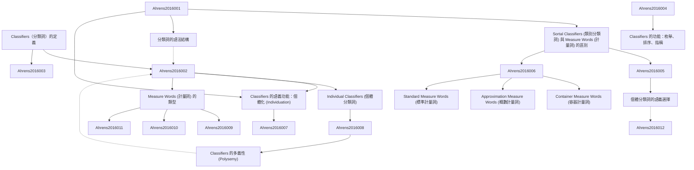

# Zettelkasten 卡片索引

**來源論文**: Classifiers
**作者**: Kathleen Ahrensand
**年份**: 2016
**生成日期**: 2025-11-04 14:53
**卡片總數**: 12

---

## 📚 卡片清單

### 1. [Classifiers（分類詞）的定義](zettel_cards/Ahrens-2016-001.md)
- **ID**: `Ahrens-2016-001`
- **類型**: 
- **核心**: "Classifiers [CL] in this chapter refer to the morphosyntactic category serving the semantic function of marking noun classes."
- **標籤**: `[分類詞]`, `[名詞類別]`, `[詞彙語法]`

### 2. [Sortal Classifiers (類別分類詞) 與 Measure Words (計量詞) 的區別](zettel_cards/Ahrens-2016-002.md)
- **ID**: `Ahrens-2016-002`
- **類型**: 
- **核心**: "Anounmayselectonlyoneclassifier(eitherasortalclassifierorameasureword)inanygivencontext."
- **標籤**: `[類別分類詞]`, `[計量詞]`, `[互補分布]`

### 3. [分類詞的語法結構](zettel_cards/Ahrens-2016-003.md)
- **ID**: `Ahrens-2016-003`
- **類型**: 
- **核心**: "Determiner(Det)/Number(Num)/Quantifier(Q)–Classifier(CL)–Noun(N)"
- **標籤**: `[語法結構]`, `[名詞詞組]`, `[漢語語法]`

### 4. [Classifiers 的語義功能：個體化 (Individuation)](zettel_cards/Ahrens-2016-004.md)
- **ID**: `Ahrens-2016-004`
- **類型**: 
- **核心**: "The primary semantic function of classifiers, including both sortal classifiers and measure words, is to individuate; that is, to identify the units for enumeration or reference."
- **標籤**: `[個體化]`, `[語義功能]`, `[枚舉]`, `[指稱]`

### 5. [Individual Classifiers (個體分類詞)](zettel_cards/Ahrens-2016-005.md)
- **ID**: `Ahrens-2016-005`
- **類型**: 
- **核心**: "Individual classifiers, also known as general classifiers, classify both concrete objects, such as, (cid:15)(cid:18)(cid:15) zhe4 ke1 shu4 ‘this tree,’ and abstract objects, such as (cid:21)(cid:25)(cid:16)(cid:2) yi1 ge4 xiang3fa3 ‘one thought.’"
- **標籤**: `[個體分類詞]`, `[一般分類詞]`, `[具體名詞]`, `[抽象名詞]`

### 6. [Measure Words (計量詞) 的類型](zettel_cards/Ahrens-2016-006.md)
- **ID**: `Ahrens-2016-006`
- **類型**: 
- **核心**: "measure words can be divided into three types based on their measuring functions: container measure words, approximation measure words, and standard measure words."
- **標籤**: `[計量詞]`, `[容器計量詞]`, `[概數計量詞]`, `[標準計量詞]`

### 7. [Classifiers 的功能：枚舉、排序、指稱](zettel_cards/Ahrens-2016-007.md)
- **ID**: `Ahrens-2016-007`
- **類型**: 
- **核心**: "This primary function leads to three types of the most frequent usages of classifiers in Chinese NPs: enumerating, ordering, and referring."
- **標籤**: `[枚舉]`, `[排序]`, `[指稱]`, `[名詞詞組]`

### 8. [個體分類詞的語義選擇](zettel_cards/Ahrens-2016-008.md)
- **ID**: `Ahrens-2016-008`
- **類型**: 
- **核心**: "Sortalclassifierselectionmaybemotivatedbytheinherentpropertiesofthenoun,whichareoftenconceptuallysalient and intuitive, as (cid:2) zhi1 selects animals, whereas (cid:10) zhang1 selects thin, broad objects."
- **標籤**: `[語義選擇]`, `[内在属性]`, `[動物]`, `[平面物體]`

### 9. [Container Measure Words (容器計量詞)](zettel_cards/Ahrens-2016-009.md)
- **ID**: `Ahrens-2016-009`
- **類型**: 
- **核心**: "Container measure words are derived from a subset of container nouns. They specify quantity in terms of the number of containers that hold the objects, as in (cid:21)(cid:12)(cid:4) yi1 wan3 fan4 ‘a bowl of rice.’"
- **標籤**: `[容器計量詞]`, `[數量]`, `[容器]`, `[名詞]`

### 10. [Approximation Measure Words (概數計量詞)](zettel_cards/Ahrens-2016-010.md)
- **ID**: `Ahrens-2016-010`
- **類型**: 
- **核心**: "Approximation measure words refer to an approximate quantity and typically are preceded by the number one, as in (cid:21)(cid:2)(cid:27) yi1 shen1 han4 ‘body full of sweat’ or (cid:21)3(cid:8)(cid:3) yi1 fen4 xin1yi4 ‘a sign of appreciation.’"
- **標籤**: `[概數計量詞]`, `[約略數量]`, `[數量詞]`

### 11. [Standard Measure Words (標準計量詞)](zettel_cards/Ahrens-2016-011.md)
- **ID**: `Ahrens-2016-011`
- **類型**: 
- **核心**: "Standard measure words measure concrete objects in terms of a specific standard measurement for length, area, weight, volume, and time, as in (cid:21)(cid:10)(cid:11)(cid:25) ba1 bai3 gong1chi3 ‘eight hundred meters,’"
- **標籤**: `[標準計量詞]`, `[測量]`, `[長度]`, `[面積]`, `[重量]`, `[體積]`, `[時間]`

### 12. [Classifiers 的多義性 (Polysemy)](zettel_cards/Ahrens-2016-012.md)
- **ID**: `Ahrens-2016-012`
- **類型**: 
- **核心**: "In section 7.7, we will discuss polysemous classifiersthathavedifferentclassifiersenses."
- **標籤**: `[多義性]`, `[語義]`, `[分类词]`

---

## 🗺️ 概念網絡圖

---

## 🏷️ 標籤索引

### [分類詞]
- [[Ahrens-2016-001]] Classifiers（分類詞）的定義

### [名詞類別]
- [[Ahrens-2016-001]] Classifiers（分類詞）的定義

### [詞彙語法]
- [[Ahrens-2016-001]] Classifiers（分類詞）的定義

### [類別分類詞]
- [[Ahrens-2016-002]] Sortal Classifiers (類別分類詞) 與 Measure Words (計量詞) 的區別

### [計量詞]
- [[Ahrens-2016-002]] Sortal Classifiers (類別分類詞) 與 Measure Words (計量詞) 的區別
- [[Ahrens-2016-006]] Measure Words (計量詞) 的類型

### [互補分布]
- [[Ahrens-2016-002]] Sortal Classifiers (類別分類詞) 與 Measure Words (計量詞) 的區別

### [語法結構]
- [[Ahrens-2016-003]] 分類詞的語法結構

### [名詞詞組]
- [[Ahrens-2016-003]] 分類詞的語法結構
- [[Ahrens-2016-007]] Classifiers 的功能：枚舉、排序、指稱

### [漢語語法]
- [[Ahrens-2016-003]] 分類詞的語法結構

### [個體化]
- [[Ahrens-2016-004]] Classifiers 的語義功能：個體化 (Individuation)

### [語義功能]
- [[Ahrens-2016-004]] Classifiers 的語義功能：個體化 (Individuation)

### [枚舉]
- [[Ahrens-2016-004]] Classifiers 的語義功能：個體化 (Individuation)
- [[Ahrens-2016-007]] Classifiers 的功能：枚舉、排序、指稱

### [指稱]
- [[Ahrens-2016-004]] Classifiers 的語義功能：個體化 (Individuation)
- [[Ahrens-2016-007]] Classifiers 的功能：枚舉、排序、指稱

### [個體分類詞]
- [[Ahrens-2016-005]] Individual Classifiers (個體分類詞)

### [一般分類詞]
- [[Ahrens-2016-005]] Individual Classifiers (個體分類詞)

### [具體名詞]
- [[Ahrens-2016-005]] Individual Classifiers (個體分類詞)

### [抽象名詞]
- [[Ahrens-2016-005]] Individual Classifiers (個體分類詞)

### [容器計量詞]
- [[Ahrens-2016-006]] Measure Words (計量詞) 的類型
- [[Ahrens-2016-009]] Container Measure Words (容器計量詞)

### [概數計量詞]
- [[Ahrens-2016-006]] Measure Words (計量詞) 的類型
- [[Ahrens-2016-010]] Approximation Measure Words (概數計量詞)

### [標準計量詞]
- [[Ahrens-2016-006]] Measure Words (計量詞) 的類型
- [[Ahrens-2016-011]] Standard Measure Words (標準計量詞)

### [排序]
- [[Ahrens-2016-007]] Classifiers 的功能：枚舉、排序、指稱

### [語義選擇]
- [[Ahrens-2016-008]] 個體分類詞的語義選擇

### [内在属性]
- [[Ahrens-2016-008]] 個體分類詞的語義選擇

### [動物]
- [[Ahrens-2016-008]] 個體分類詞的語義選擇

### [平面物體]
- [[Ahrens-2016-008]] 個體分類詞的語義選擇

### [數量]
- [[Ahrens-2016-009]] Container Measure Words (容器計量詞)

### [容器]
- [[Ahrens-2016-009]] Container Measure Words (容器計量詞)

### [名詞]
- [[Ahrens-2016-009]] Container Measure Words (容器計量詞)

### [約略數量]
- [[Ahrens-2016-010]] Approximation Measure Words (概數計量詞)

### [數量詞]
- [[Ahrens-2016-010]] Approximation Measure Words (概數計量詞)

### [測量]
- [[Ahrens-2016-011]] Standard Measure Words (標準計量詞)

### [長度]
- [[Ahrens-2016-011]] Standard Measure Words (標準計量詞)

### [面積]
- [[Ahrens-2016-011]] Standard Measure Words (標準計量詞)

### [重量]
- [[Ahrens-2016-011]] Standard Measure Words (標準計量詞)

### [體積]
- [[Ahrens-2016-011]] Standard Measure Words (標準計量詞)

### [時間]
- [[Ahrens-2016-011]] Standard Measure Words (標準計量詞)

### [多義性]
- [[Ahrens-2016-012]] Classifiers 的多義性 (Polysemy)

### [語義]
- [[Ahrens-2016-012]] Classifiers 的多義性 (Polysemy)

### [分类词]
- [[Ahrens-2016-012]] Classifiers 的多義性 (Polysemy)

---

## 📖 閱讀建議順序

1. [[Ahrens-2016-001]] Classifiers（分類詞）的定義

2. [[Ahrens-2016-002]] Sortal Classifiers (類別分類詞) 與 Measure Words (計量詞) 的區別

3. [[Ahrens-2016-003]] 分類詞的語法結構

4. [[Ahrens-2016-004]] Classifiers 的語義功能：個體化 (Individuation)

5. [[Ahrens-2016-005]] Individual Classifiers (個體分類詞)

6. [[Ahrens-2016-006]] Measure Words (計量詞) 的類型

7. [[Ahrens-2016-007]] Classifiers 的功能：枚舉、排序、指稱

8. [[Ahrens-2016-008]] 個體分類詞的語義選擇

9. [[Ahrens-2016-009]] Container Measure Words (容器計量詞)

10. [[Ahrens-2016-010]] Approximation Measure Words (概數計量詞)

11. [[Ahrens-2016-011]] Standard Measure Words (標準計量詞)

12. [[Ahrens-2016-012]] Classifiers 的多義性 (Polysemy)

---

*本索引由 Knowledge Production System 自動生成*