# Zettelkasten 卡片索引

**來源論文**: Ahrens2016_Reference_Grammar
**作者**: 
**年份**: 2016
**生成日期**: 2025-10-29 15:57
**卡片總數**: 20

---

## 📚 卡片清單

### 1. [Classifiers (量詞) 的定義](zettel_cards/Linguistics-20251029-001.md)
- **ID**: `Linguistics-20251029-001`
- **類型**: 
- **核心**: "Classifiers [CL] inthischapter refer tothemorphosyntacticcategory servingthe semanticfunctionofmarkingnounclasses."
- **標籤**: `Chinese Linguistics`, `Classifiers`, `Noun Classes`, `Morphology`

### 2. [名詞短語結構中的量詞位置](zettel_cards/Linguistics-20251029-002.md)
- **ID**: `Linguistics-20251029-002`
- **類型**: 
- **核心**: "Determiner(Det)/Number(Num)/Quantifier(Q)–Classifier(CL)–Noun(N)"
- **標籤**: `Chinese Linguistics`, `Classifiers`, `Noun Phrase Structure`, `Syntax`

### 3. [Sortal Classifiers (個體量詞) vs. Measure Words (度量詞)](zettel_cards/Linguistics-20251029-003.md)
- **ID**: `Linguistics-20251029-003`
- **類型**: 
- **核心**: "Anounmayselectonlyoneclassifier(eitherasortalclassifierorameasureword) inanygivencontext."
- **標籤**: `Chinese Linguistics`, `Sortal Classifiers`, `Measure Words`, `Classification`

### 4. [Sortal Classifiers (個體量詞) 的語義功能](zettel_cards/Linguistics-20251029-004.md)
- **ID**: `Linguistics-20251029-004`
- **類型**: 
- **核心**: "Sortalclassifiers(oftenreferredtoas(cid:5)(cid:2)(cid:2)fen1lei4ci2‘classifier’inChineselitera- ture)areusuallyconsideredtheprototypicaltypeofclassifier,astheylinguistically markconventionalizedconceptualnounclasses."
- **標籤**: `Chinese Linguistics`, `Sortal Classifiers`, `Semantic Function`, `Noun Classes`

### 5. [Measure Words (度量詞) 的語義功能](zettel_cards/Linguistics-20251029-005.md)
- **ID**: `Linguistics-20251029-005`
- **類型**: 
- **核心**: "Measure words, on the other hand, are not typical classifiers, as they do not directly refer to noun classes. Instead, they provide a measuring unit, which may or may not directly depend on the inherent properties of the noun."
- **標籤**: `Chinese Linguistics`, `Measure Words`, `Semantic Function`, `Measuring Unit`

### 6. [Classifiers 的分類](zettel_cards/Linguistics-20251029-006.md)
- **ID**: `Linguistics-20251029-006`
- **類型**: 
- **核心**: [基於圖表7.1] (需要基於圖表總結，但文字描述不夠直接引用)
- **標籤**: `Chinese Linguistics`, `Classifiers`, `Taxonomy`, `Semantic Classes`

### 7. [個體量詞 (Individual Classifiers)](zettel_cards/Linguistics-20251029-007.md)
- **ID**: `Linguistics-20251029-007`
- **類型**: 
- **核心**: [論文中未直接提供個體量詞的定義句，需要總結] (總結: 個體量詞用於可數的名詞個體。)
- **標籤**: `Chinese Linguistics`, `Sortal Classifiers`, `Individual Classifiers`, `Count Nouns`

### 8. [容器量詞 (Container Measure Words)](zettel_cards/Linguistics-20251029-008.md)
- **ID**: `Linguistics-20251029-008`
- **類型**: 
- **核心**: [論文中未直接提供容器量詞的定義句，需要總結] (總結: 容器量詞用於以容器為單位計量的名詞。)
- **標籤**: `Chinese Linguistics`, `Measure Words`, `Container Measure Words`, `Units of Measurement`

### 9. [事件量詞 (Event Classifiers)](zettel_cards/Linguistics-20251029-009.md)
- **ID**: `Linguistics-20251029-009`
- **類型**: 
- **核心**: [論文中未直接提供事件量詞的定義句，需要總結] (總結: 事件量詞用於計算事件的次數。)
- **標籤**: `Chinese Linguistics`, `Sortal Classifiers`, `Event Classifiers`, `Event Quantification`

### 10. [種類量詞 (Kind Classifiers)](zettel_cards/Linguistics-20251029-010.md)
- **ID**: `Linguistics-20251029-010`
- **類型**: 
- **核心**: [論文中未直接提供種類量詞的定義句，需要總結] (總結: 種類量詞用於指稱事物的種類。)
- **標籤**: `Chinese Linguistics`, `Sortal Classifiers`, `Kind Classifiers`, `Generic Reference`

### 11. [概數量詞 (Approximation Measure Words)](zettel_cards/Linguistics-20251029-011.md)
- **ID**: `Linguistics-20251029-011`
- **類型**: 
- **核心**: [論文中未直接提供概數量詞的定義句，需要總結] (總結: 概數量詞用於表示大概的數量。)
- **標籤**: `Chinese Linguistics`, `Measure Words`, `Approximation Measure Words`, `Approximate Quantity`

### 12. [標準量詞 (Standard Measure Words)](zettel_cards/Linguistics-20251029-012.md)
- **ID**: `Linguistics-20251029-012`
- **類型**: 
- **核心**: [論文中未直接提供標準量詞的定義句，需要總結] (總結: 標準量詞用於表示標準的計量單位，例如長度，重量等等。)
- **標籤**: `Chinese Linguistics`, `Measure Words`, `Standard Measure Words`, `Units of Measurement`

### 13. [Classifiers 的個體化功能](zettel_cards/Linguistics-20251029-013.md)
- **ID**: `Linguistics-20251029-013`
- **類型**: 
- **核心**: "The primary semantic function of classifiers, including both sortal classifiers andmeasurewords,istoindividuate;thatis,toidentifytheunitsforenumera- tion or reference."
- **標籤**: `Chinese Linguistics`, `Classifiers`, `Individuation`, `Semantic Function`

### 14. [Classifiers 在名詞短語中的三種用法](zettel_cards/Linguistics-20251029-014.md)
- **ID**: `Linguistics-20251029-014`
- **類型**: 
- **核心**: "This primary function leads to threetypesofthemostfrequentusagesofclassifiersinChineseNPs:enumerating, ordering,andreferring."
- **標籤**: `Chinese Linguistics`, `Classifiers`, `Noun Phrases`, `Usage`

### 15. [計數用法 (Enumerating Usage)](zettel_cards/Linguistics-20251029-015.md)
- **ID**: `Linguistics-20251029-015`
- **類型**: 
- **核心**: "Intheenumeratingusage,aclassifierprecedesthenoun andisprecededbynumerals,forexample,(cid:31)(cid:2)(cid:8)(cid:5)san1zhi1lao3hu3‘threetigers.’"
- **標籤**: `Chinese Linguistics`, `Classifiers`, `Enumerating Usage`, `Numerals`

### 16. [排序用法 (Ordering Usage)](zettel_cards/Linguistics-20251029-016.md)
- **ID**: `Linguistics-20251029-016`
- **類型**: 
- **核心**: "In the ordering usage, a classifier precedes the noun and is preceded by ordinal numbers, as in (cid:3)(cid:31)(cid:2)(cid:8)(cid:5) di4san1 zhi1 lao3hu3 ‘the third tiger.’"
- **標籤**: `Chinese Linguistics`, `Classifiers`, `Ordering Usage`, `Ordinal Numbers`

### 17. [指稱用法 (Referring Usage)](zettel_cards/Linguistics-20251029-017.md)
- **ID**: `Linguistics-20251029-017`
- **類型**: 
- **核心**: "In the referring usage,aclassifierprecedesthenounandisprecededbydemonstrativesfollowed byanoptionalnumeral,asin(cid:6) (cid:2)(cid:8)(cid:5)na4liang3zhi1lao3hu3‘thosetwotigers’ and(cid:6)(cid:2)(cid:8)(cid:5)na4zhi1lao3hu3‘thattiger.’"
- **標籤**: `Chinese Linguistics`, `Classifiers`, `Referring Usage`, `Demonstratives`

### 18. [Classifiers 的重疊 (Reduplication)](zettel_cards/Linguistics-20251029-018.md)
- **ID**: `Linguistics-20251029-018`
- **類型**: 
- **核心**: "Boththeclassifier andthenumeral-classifier compoundcanbereduplicated for differentsemanticfunctions."
- **標籤**: `Chinese Linguistics`, `Classifiers`, `Reduplication`, `Semantic Function`

### 19. [量詞重疊 (Classifier Reduplication)](zettel_cards/Linguistics-20251029-019.md)
- **ID**: `Linguistics-20251029-019`
- **類型**: 
- **核心**: "In examples like(cid:16)(cid:12)(cid:4)(cid:12)(cid:11)(cid:2)(cid:3)(cid:21)(cid:16)(cid:16)((cid:2))(cid:5) (cid:12) wu1zi0 li3 dao4chu4 dou1 shi4 yi1 kuai4 kuai4 (de0) jin1zi0 ‘there are nuggets and nuggetsofgoldeverywhereinthehouse,’theemphasisisonboththeindividuated natureoftheobjectandtheimplicationthattherearemanyofthem."
- **標籤**: `Chinese Linguistics`, `Classifiers`, `Reduplication`, `Emphasis`

### 20. [數詞-量詞組合重疊 (Numeral-Classifier Compound Reduplication)](zettel_cards/Linguistics-20251029-020.md)
- **ID**: `Linguistics-20251029-020`
- **類型**: 
- **核心**: "whenanumeral–classifiercompoundisreduplicated,itismostcommonlyused asanadverbtofocusontherepeatableandquantifiablestagesofameasured-out event in terms of the incremental amount of the participant role involved."
- **標籤**: `Chinese Linguistics`, `Classifiers`, `Reduplication`, `Adverbial Function`

---

## 🗺️ 概念網絡圖

```mermaid
graph TD

    Linguistics-20251029-001["Classifiers (量詞) 的定義"]

    Linguistics-20251029-002["名詞短語結構中的量詞位置"]

    Linguistics-20251029-003["Sortal Classifiers (個體量詞) vs. Measure Words (度量詞)"]

    Linguistics-20251029-004["Sortal Classifiers (個體量詞) 的語義功能"]

    Linguistics-20251029-005["Measure Words (度量詞) 的語義功能"]

    Linguistics-20251029-006["Classifiers 的分類"]

    Linguistics-20251029-007["個體量詞 (Individual Classifiers)"]

    Linguistics-20251029-008["容器量詞 (Container Measure Words)"]

    Linguistics-20251029-009["事件量詞 (Event Classifiers)"]

    Linguistics-20251029-010["種類量詞 (Kind Classifiers)"]

    Linguistics-20251029-011["概數量詞 (Approximation Measure Words)"]

    Linguistics-20251029-012["標準量詞 (Standard Measure Words)"]

    Linguistics-20251029-013["Classifiers 的個體化功能"]

    Linguistics-20251029-014["Classifiers 在名詞短語中的三種用法"]

    Linguistics-20251029-015["計數用法 (Enumerating Usage)"]

    Linguistics-20251029-016["排序用法 (Ordering Usage)"]

    Linguistics-20251029-017["指稱用法 (Referring Usage)"]

    Linguistics-20251029-018["Classifiers 的重疊 (Reduplication)"]

    Linguistics-20251029-019["量詞重疊 (Classifier Reduplication)"]

    Linguistics-20251029-020["數詞-量詞組合重疊 (Numeral-Classifier Compound Reduplication)"]






    Linguistics-20251029-001 --> Linguistics-20251029-002

    Linguistics-20251029-001 --> Linguistics-20251029-003






    Linguistics-20251029-001 --> Linguistics-20251029-002





    Linguistics-20251029-002 -.-> Linguistics-20251029-003





    Linguistics-20251029-001 --> Linguistics-20251029-003







    Linguistics-20251029-003 --> Linguistics-20251029-004




    Linguistics-20251029-004 --> Linguistics-20251029-007






    Linguistics-20251029-003 --> Linguistics-20251029-005




    Linguistics-20251029-005 --> Linguistics-20251029-008






    Linguistics-20251029-003 --> Linguistics-20251029-006




    Linguistics-20251029-006 --> Linguistics-20251029-007

    Linguistics-20251029-006 --> Linguistics-20251029-008

    Linguistics-20251029-006 --> Linguistics-20251029-009

    Linguistics-20251029-006 --> Linguistics-20251029-010

    Linguistics-20251029-006 --> Linguistics-20251029-011

    Linguistics-20251029-006 --> Linguistics-20251029-012






    Linguistics-20251029-006 --> Linguistics-20251029-007





    Linguistics-20251029-007 -.-> Linguistics-20251029-004





    Linguistics-20251029-006 --> Linguistics-20251029-008





    Linguistics-20251029-008 -.-> Linguistics-20251029-005





    Linguistics-20251029-006 --> Linguistics-20251029-009





    Linguistics-20251029-009 -.-> Linguistics-20251029-004





    Linguistics-20251029-006 --> Linguistics-20251029-010





    Linguistics-20251029-010 -.-> Linguistics-20251029-004





    Linguistics-20251029-006 --> Linguistics-20251029-011





    Linguistics-20251029-011 -.-> Linguistics-20251029-005





    Linguistics-20251029-006 --> Linguistics-20251029-012





    Linguistics-20251029-012 -.-> Linguistics-20251029-005





    Linguistics-20251029-001 --> Linguistics-20251029-013




    Linguistics-20251029-013 --> Linguistics-20251029-014






    Linguistics-20251029-013 --> Linguistics-20251029-014




    Linguistics-20251029-014 --> Linguistics-20251029-015

    Linguistics-20251029-014 --> Linguistics-20251029-016

    Linguistics-20251029-014 --> Linguistics-20251029-017






    Linguistics-20251029-014 --> Linguistics-20251029-015







    Linguistics-20251029-014 --> Linguistics-20251029-016







    Linguistics-20251029-014 --> Linguistics-20251029-017








    Linguistics-20251029-018 --> Linguistics-20251029-019

    Linguistics-20251029-018 --> Linguistics-20251029-020






    Linguistics-20251029-018 --> Linguistics-20251029-019







    Linguistics-20251029-018 --> Linguistics-20251029-020





```

---

## 🏷️ 標籤索引

### Chinese Linguistics
- [[Linguistics-20251029-001]] Classifiers (量詞) 的定義
- [[Linguistics-20251029-002]] 名詞短語結構中的量詞位置
- [[Linguistics-20251029-003]] Sortal Classifiers (個體量詞) vs. Measure Words (度量詞)
- [[Linguistics-20251029-004]] Sortal Classifiers (個體量詞) 的語義功能
- [[Linguistics-20251029-005]] Measure Words (度量詞) 的語義功能
- [[Linguistics-20251029-006]] Classifiers 的分類
- [[Linguistics-20251029-007]] 個體量詞 (Individual Classifiers)
- [[Linguistics-20251029-008]] 容器量詞 (Container Measure Words)
- [[Linguistics-20251029-009]] 事件量詞 (Event Classifiers)
- [[Linguistics-20251029-010]] 種類量詞 (Kind Classifiers)
- [[Linguistics-20251029-011]] 概數量詞 (Approximation Measure Words)
- [[Linguistics-20251029-012]] 標準量詞 (Standard Measure Words)
- [[Linguistics-20251029-013]] Classifiers 的個體化功能
- [[Linguistics-20251029-014]] Classifiers 在名詞短語中的三種用法
- [[Linguistics-20251029-015]] 計數用法 (Enumerating Usage)
- [[Linguistics-20251029-016]] 排序用法 (Ordering Usage)
- [[Linguistics-20251029-017]] 指稱用法 (Referring Usage)
- [[Linguistics-20251029-018]] Classifiers 的重疊 (Reduplication)
- [[Linguistics-20251029-019]] 量詞重疊 (Classifier Reduplication)
- [[Linguistics-20251029-020]] 數詞-量詞組合重疊 (Numeral-Classifier Compound Reduplication)

### Classifiers
- [[Linguistics-20251029-001]] Classifiers (量詞) 的定義
- [[Linguistics-20251029-002]] 名詞短語結構中的量詞位置
- [[Linguistics-20251029-006]] Classifiers 的分類
- [[Linguistics-20251029-013]] Classifiers 的個體化功能
- [[Linguistics-20251029-014]] Classifiers 在名詞短語中的三種用法
- [[Linguistics-20251029-015]] 計數用法 (Enumerating Usage)
- [[Linguistics-20251029-016]] 排序用法 (Ordering Usage)
- [[Linguistics-20251029-017]] 指稱用法 (Referring Usage)
- [[Linguistics-20251029-018]] Classifiers 的重疊 (Reduplication)
- [[Linguistics-20251029-019]] 量詞重疊 (Classifier Reduplication)
- [[Linguistics-20251029-020]] 數詞-量詞組合重疊 (Numeral-Classifier Compound Reduplication)

### Noun Classes
- [[Linguistics-20251029-001]] Classifiers (量詞) 的定義
- [[Linguistics-20251029-004]] Sortal Classifiers (個體量詞) 的語義功能

### Morphology
- [[Linguistics-20251029-001]] Classifiers (量詞) 的定義

### Noun Phrase Structure
- [[Linguistics-20251029-002]] 名詞短語結構中的量詞位置

### Syntax
- [[Linguistics-20251029-002]] 名詞短語結構中的量詞位置

### Sortal Classifiers
- [[Linguistics-20251029-003]] Sortal Classifiers (個體量詞) vs. Measure Words (度量詞)
- [[Linguistics-20251029-004]] Sortal Classifiers (個體量詞) 的語義功能
- [[Linguistics-20251029-007]] 個體量詞 (Individual Classifiers)
- [[Linguistics-20251029-009]] 事件量詞 (Event Classifiers)
- [[Linguistics-20251029-010]] 種類量詞 (Kind Classifiers)

### Measure Words
- [[Linguistics-20251029-003]] Sortal Classifiers (個體量詞) vs. Measure Words (度量詞)
- [[Linguistics-20251029-005]] Measure Words (度量詞) 的語義功能
- [[Linguistics-20251029-008]] 容器量詞 (Container Measure Words)
- [[Linguistics-20251029-011]] 概數量詞 (Approximation Measure Words)
- [[Linguistics-20251029-012]] 標準量詞 (Standard Measure Words)

### Classification
- [[Linguistics-20251029-003]] Sortal Classifiers (個體量詞) vs. Measure Words (度量詞)

### Semantic Function
- [[Linguistics-20251029-004]] Sortal Classifiers (個體量詞) 的語義功能
- [[Linguistics-20251029-005]] Measure Words (度量詞) 的語義功能
- [[Linguistics-20251029-013]] Classifiers 的個體化功能
- [[Linguistics-20251029-018]] Classifiers 的重疊 (Reduplication)

### Measuring Unit
- [[Linguistics-20251029-005]] Measure Words (度量詞) 的語義功能

### Taxonomy
- [[Linguistics-20251029-006]] Classifiers 的分類

### Semantic Classes
- [[Linguistics-20251029-006]] Classifiers 的分類

### Individual Classifiers
- [[Linguistics-20251029-007]] 個體量詞 (Individual Classifiers)

### Count Nouns
- [[Linguistics-20251029-007]] 個體量詞 (Individual Classifiers)

### Container Measure Words
- [[Linguistics-20251029-008]] 容器量詞 (Container Measure Words)

### Units of Measurement
- [[Linguistics-20251029-008]] 容器量詞 (Container Measure Words)
- [[Linguistics-20251029-012]] 標準量詞 (Standard Measure Words)

### Event Classifiers
- [[Linguistics-20251029-009]] 事件量詞 (Event Classifiers)

### Event Quantification
- [[Linguistics-20251029-009]] 事件量詞 (Event Classifiers)

### Kind Classifiers
- [[Linguistics-20251029-010]] 種類量詞 (Kind Classifiers)

### Generic Reference
- [[Linguistics-20251029-010]] 種類量詞 (Kind Classifiers)

### Approximation Measure Words
- [[Linguistics-20251029-011]] 概數量詞 (Approximation Measure Words)

### Approximate Quantity
- [[Linguistics-20251029-011]] 概數量詞 (Approximation Measure Words)

### Standard Measure Words
- [[Linguistics-20251029-012]] 標準量詞 (Standard Measure Words)

### Individuation
- [[Linguistics-20251029-013]] Classifiers 的個體化功能

### Noun Phrases
- [[Linguistics-20251029-014]] Classifiers 在名詞短語中的三種用法

### Usage
- [[Linguistics-20251029-014]] Classifiers 在名詞短語中的三種用法

### Enumerating Usage
- [[Linguistics-20251029-015]] 計數用法 (Enumerating Usage)

### Numerals
- [[Linguistics-20251029-015]] 計數用法 (Enumerating Usage)

### Ordering Usage
- [[Linguistics-20251029-016]] 排序用法 (Ordering Usage)

### Ordinal Numbers
- [[Linguistics-20251029-016]] 排序用法 (Ordering Usage)

### Referring Usage
- [[Linguistics-20251029-017]] 指稱用法 (Referring Usage)

### Demonstratives
- [[Linguistics-20251029-017]] 指稱用法 (Referring Usage)

### Reduplication
- [[Linguistics-20251029-018]] Classifiers 的重疊 (Reduplication)
- [[Linguistics-20251029-019]] 量詞重疊 (Classifier Reduplication)
- [[Linguistics-20251029-020]] 數詞-量詞組合重疊 (Numeral-Classifier Compound Reduplication)

### Emphasis
- [[Linguistics-20251029-019]] 量詞重疊 (Classifier Reduplication)

### Adverbial Function
- [[Linguistics-20251029-020]] 數詞-量詞組合重疊 (Numeral-Classifier Compound Reduplication)

---

## 📖 閱讀建議順序

1. [[Linguistics-20251029-002]] 名詞短語結構中的量詞位置

2. [[Linguistics-20251029-004]] Sortal Classifiers (個體量詞) 的語義功能

3. [[Linguistics-20251029-005]] Measure Words (度量詞) 的語義功能

4. [[Linguistics-20251029-007]] 個體量詞 (Individual Classifiers)

5. [[Linguistics-20251029-008]] 容器量詞 (Container Measure Words)

6. [[Linguistics-20251029-009]] 事件量詞 (Event Classifiers)

7. [[Linguistics-20251029-010]] 種類量詞 (Kind Classifiers)

8. [[Linguistics-20251029-011]] 概數量詞 (Approximation Measure Words)

9. [[Linguistics-20251029-012]] 標準量詞 (Standard Measure Words)

10. [[Linguistics-20251029-015]] 計數用法 (Enumerating Usage)

11. [[Linguistics-20251029-016]] 排序用法 (Ordering Usage)

12. [[Linguistics-20251029-017]] 指稱用法 (Referring Usage)

13. [[Linguistics-20251029-019]] 量詞重疊 (Classifier Reduplication)

14. [[Linguistics-20251029-020]] 數詞-量詞組合重疊 (Numeral-Classifier Compound Reduplication)

15. [[Linguistics-20251029-013]] Classifiers 的個體化功能

16. [[Linguistics-20251029-018]] Classifiers 的重疊 (Reduplication)

17. [[Linguistics-20251029-001]] Classifiers (量詞) 的定義

18. [[Linguistics-20251029-003]] Sortal Classifiers (個體量詞) vs. Measure Words (度量詞)

19. [[Linguistics-20251029-014]] Classifiers 在名詞短語中的三種用法

20. [[Linguistics-20251029-006]] Classifiers 的分類

---

*本索引由 Knowledge Production System 自動生成*