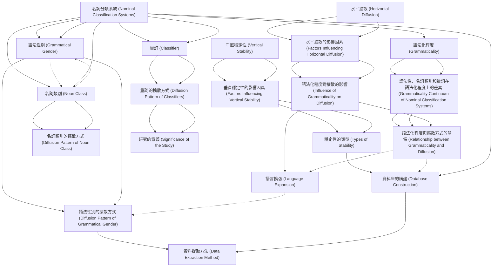

# Zettelkasten 卡片索引

**來源論文**: Allassonniere2021_Expansion_Migration
**作者**: 
**年份**: 2025
**生成日期**: 2025-10-29 15:59
**卡片總數**: 20

---

## 📚 卡片清單

### 1. [水平擴散 (Horizontal Diffusion)](zettel_cards/Linguistics-20251029-001.md)
- **ID**: `Linguistics-20251029-001`
- **類型**: 
- **核心**: "Generally, different feature types vary with respect to their inherent stability (Nichols, 1992; Dediu and Cysouw, 2013), which may reflect their functional role and cognitive preference."
- **標籤**: `[語言接觸]`, `[語言演化]`, `[類型學]`

### 2. [垂直穩定性 (Vertical Stability)](zettel_cards/Linguistics-20251029-002.md)
- **ID**: `Linguistics-20251029-002`
- **類型**: 
- **核心**: "others are represented by vertical stability within their lineage."
- **標籤**: `[語言演化]`, `[譜系分類]`, `[語言類型學]`

### 3. [名詞分類系統 (Nominal Classification Systems)](zettel_cards/Linguistics-20251029-003.md)
- **ID**: `Linguistics-20251029-003`
- **類型**: 
- **核心**: "We take the worldwide distribution of nominal classification systems (grammatical gender, noun class, and classifier) as a case study"
- **標籤**: `[語法性別]`, `[名詞類別]`, `[量詞]`, `[類型學]`

### 4. [語法化程度 (Grammaticality)](zettel_cards/Linguistics-20251029-004.md)
- **ID**: `Linguistics-20251029-004`
- **類型**: 
- **核心**: "Grammaticality can be viewed as a con- tinuum, ranging from the most grammatical items of grammar (frequent function words of low transparency) to the least grammatical items of the lexicon (cultural and non-frequent content words of high transparency)"
- **標籤**: `[語法]`, `[詞彙]`, `[語法化]`, `[連續統]`

### 5. [水平擴散的影響因素 (Factors Influencing Horizontal Diffusion)](zettel_cards/Linguistics-20251029-005.md)
- **ID**: `Linguistics-20251029-005`
- **類型**: 
- **核心**: "speakers of two or more languages interact and influence each other’s languages, and in this interaction, more grammaticalized features tend to be more resistant to diffusion compared to features of more lexical content."
- **標籤**: `[語言接觸]`, `[語法]`, `[詞彙]`, `[擴散阻力]`

### 6. [垂直穩定性的影響因素 (Factors Influencing Vertical Stability)](zettel_cards/Linguistics-20251029-006.md)
- **ID**: `Linguistics-20251029-006`
- **類型**: 
- **核心**: "In the evolutionary dynamics of language, high stability implies that a feature has high gain and low death rates (attractor feature) whereas low stability implies that a feature has high gain and loss rates (unstable feature), or alternatively low gain and high death rates (recessive feature)."
- **標籤**: `[語言演化]`, `[穩定性]`, `[增益率]`, `[衰減率]`

### 7. [語法性別 (Grammatical Gender)](zettel_cards/Linguistics-20251029-007.md)
- **ID**: `Linguistics-20251029-007`
- **類型**: 
- **核心**: "The first type is grammatical gender (Corbett, 1991, 2013), such as the masculine/feminine distinction in French or the masculine/ feminine/neuter distinction in German."
- **標籤**: `[名詞分類]`, `[語法]`, `[性]`, `[法語]`, `[德語]`

### 8. [名詞類別 (Noun Class)](zettel_cards/Linguistics-20251029-008.md)
- **ID**: `Linguistics-20251029-008`
- **類型**: 
- **核心**: "The second type is noun classes (Corbett, 1991; Grinevald and Seifart, 2004), such as the semantic-based distinction of more than 15 classes in Swahili."
- **標籤**: `[名詞分類]`, `[語法]`, `[斯瓦希里語]`, `[語義]`

### 9. [量詞 (Classifier)](zettel_cards/Linguistics-20251029-009.md)
- **ID**: `Linguistics-20251029-009`
- **類型**: 
- **核心**: "The third type is classifiers (Aikhenvald, 2000; Grinevald, 2015), such as the shape-based distinctions in Mandarin (see Supplementary material 1.1 for further details on the definitions)."
- **標籤**: `[名詞分類]`, `[詞彙]`, `[量詞]`, `[漢語]`, `[形狀]`

### 10. [語法性、名詞類別和量詞在語法化程度上的差異 (Grammaticality Continuum of Nominal Classification Systems)](zettel_cards/Linguistics-20251029-010.md)
- **ID**: `Linguistics-20251029-010`
- **類型**: 
- **核心**: "On a grammaticality continuum, gender and noun class markers are thus typical examples of ‘grammatical items’, while classifiers are relatively closer to ‘lexical items’, or ‘content words’."
- **標籤**: `[語法性]`, `[名詞類別]`, `[量詞]`, `[語法化]`

### 11. [語法化程度對擴散的影響 (Influence of Grammaticality on Diffusion)](zettel_cards/Linguistics-20251029-011.md)
- **ID**: `Linguistics-20251029-011`
- **類型**: 
- **核心**: "more grammaticalized features tend to be more resistant to diffusion compared to features of more lexical content."
- **標籤**: `[擴散]`, `[語法化]`, `[詞彙]`, `[語法]`

### 12. [穩定性的類型 (Types of Stability)](zettel_cards/Linguistics-20251029-012.md)
- **ID**: `Linguistics-20251029-012`
- **類型**: 
- **核心**: "Due to their cognitive preference, features of high stability can be both stable in lineage and diffuse by contact, but as a rule, features bound by morphology show a tendency to higher stability in the lineage (Carling and Cathcart, 2021)."
- **標籤**: `[穩定性]`, `[譜系]`, `[接觸]`, `[形態]`

### 13. [語法性別的擴散方式 (Diffusion Pattern of Grammatical Gender)](zettel_cards/Linguistics-20251029-013.md)
- **ID**: `Linguistics-20251029-013`
- **類型**: 
- **核心**: "Our results indicate that quantitative models measuring the areal diffusibility and stability of linguistic features are likely to be affected by language expansion that occurs by historical coincidence."
- **標籤**: `[語法性別]`, `[擴散]`, `[語言擴張]`, `[歷史巧合]`

### 14. [名詞類別的擴散方式 (Diffusion Pattern of Noun Class)](zettel_cards/Linguistics-20251029-014.md)
- **ID**: `Linguistics-20251029-014`
- **類型**: 
- **核心**: (Data suggests noun classes are less frequent than gender and classifiers, but the text doesn't explicitly state its diffusion method. It is implied to be similar to gender, with more vertical inheritance.)
- **標籤**: `[名詞類別]`, `[擴散]`, `[垂直繼承]`

### 15. [量詞的擴散方式 (Diffusion Pattern of Classifiers)](zettel_cards/Linguistics-20251029-015.md)
- **ID**: `Linguistics-20251029-015`
- **類型**: 
- **核心**: "whereas the latter spread more by feature diffusion."
- **標籤**: `[量詞]`, `[擴散]`, `[特徵擴散]`, `[語言接觸]`

### 16. [語法化程度與擴散方式的關係 (Relationship between Grammaticality and Diffusion)](zettel_cards/Linguistics-20251029-016.md)
- **ID**: `Linguistics-20251029-016`
- **類型**: 
- **核心**: "the former spread more by language expansion historically, whereas the latter spread more by feature diffusion."
- **標籤**: `[語法化]`, `[擴散]`, `[語言擴張]`, `[特徵擴散]`

### 17. [語言擴張 (Language Expansion)](zettel_cards/Linguistics-20251029-017.md)
- **ID**: `Linguistics-20251029-017`
- **類型**: 
- **核心**: "Here, we suggest that the geographic distribution of features globally can be explained by two major pathways, which are generally not distinguished within quantitative typological models: feature diffusion and language expansion."
- **標籤**: `[擴散]`, `[語言]`, `[地理分佈]`, `[類型學]`, `[量化模型]`

### 18. [資料庫的構建 (Database Construction)](zettel_cards/Linguistics-20251029-018.md)
- **ID**: `Linguistics-20251029-018`
- **類型**: 
- **核心**: "We constructed a database of 3077 languages annotated with the presence/absence of gender, noun class, and classifier systems."
- **標籤**: `[資料庫]`, `[語言學]`, `[語法性別]`, `[名詞類別]`, `[量詞]`

### 19. [資料提取方法 (Data Extraction Method)](zettel_cards/Linguistics-20251029-019.md)
- **ID**: `Linguistics-20251029-019`
- **類型**: 
- **核心**: "Data were first extracted from language grammars and grammar sketches using a lightweight keyword-extraction technique (Supplementary material 1.3)."
- **標籤**: `[資料提取]`, `[語法]`, `[關鍵字提取]`

### 20. [研究的意義 (Significance of the Study)](zettel_cards/Linguistics-20251029-020.md)
- **ID**: `Linguistics-20251029-020`
- **類型**: 
- **核心**: "We anticipate that our findings will support studies of language diversity in a more sophisticated way, with relevance to other parts of language, such as phonology."
- **標籤**: `[語言多樣性]`, `[類型學]`, `[音韻學]`

---

## 🗺️ 概念網絡圖

---

## 🏷️ 標籤索引

### [語言接觸]
- [[Linguistics-20251029-001]] 水平擴散 (Horizontal Diffusion)
- [[Linguistics-20251029-005]] 水平擴散的影響因素 (Factors Influencing Horizontal Diffusion)
- [[Linguistics-20251029-015]] 量詞的擴散方式 (Diffusion Pattern of Classifiers)

### [語言演化]
- [[Linguistics-20251029-001]] 水平擴散 (Horizontal Diffusion)
- [[Linguistics-20251029-002]] 垂直穩定性 (Vertical Stability)
- [[Linguistics-20251029-006]] 垂直穩定性的影響因素 (Factors Influencing Vertical Stability)

### [類型學]
- [[Linguistics-20251029-001]] 水平擴散 (Horizontal Diffusion)
- [[Linguistics-20251029-003]] 名詞分類系統 (Nominal Classification Systems)
- [[Linguistics-20251029-017]] 語言擴張 (Language Expansion)
- [[Linguistics-20251029-020]] 研究的意義 (Significance of the Study)

### [譜系分類]
- [[Linguistics-20251029-002]] 垂直穩定性 (Vertical Stability)

### [語言類型學]
- [[Linguistics-20251029-002]] 垂直穩定性 (Vertical Stability)

### [語法性別]
- [[Linguistics-20251029-003]] 名詞分類系統 (Nominal Classification Systems)
- [[Linguistics-20251029-013]] 語法性別的擴散方式 (Diffusion Pattern of Grammatical Gender)
- [[Linguistics-20251029-018]] 資料庫的構建 (Database Construction)

### [名詞類別]
- [[Linguistics-20251029-003]] 名詞分類系統 (Nominal Classification Systems)
- [[Linguistics-20251029-010]] 語法性、名詞類別和量詞在語法化程度上的差異 (Grammaticality Continuum of Nominal Classification Systems)
- [[Linguistics-20251029-014]] 名詞類別的擴散方式 (Diffusion Pattern of Noun Class)
- [[Linguistics-20251029-018]] 資料庫的構建 (Database Construction)

### [量詞]
- [[Linguistics-20251029-003]] 名詞分類系統 (Nominal Classification Systems)
- [[Linguistics-20251029-009]] 量詞 (Classifier)
- [[Linguistics-20251029-010]] 語法性、名詞類別和量詞在語法化程度上的差異 (Grammaticality Continuum of Nominal Classification Systems)
- [[Linguistics-20251029-015]] 量詞的擴散方式 (Diffusion Pattern of Classifiers)
- [[Linguistics-20251029-018]] 資料庫的構建 (Database Construction)

### [語法]
- [[Linguistics-20251029-004]] 語法化程度 (Grammaticality)
- [[Linguistics-20251029-005]] 水平擴散的影響因素 (Factors Influencing Horizontal Diffusion)
- [[Linguistics-20251029-007]] 語法性別 (Grammatical Gender)
- [[Linguistics-20251029-008]] 名詞類別 (Noun Class)
- [[Linguistics-20251029-011]] 語法化程度對擴散的影響 (Influence of Grammaticality on Diffusion)
- [[Linguistics-20251029-019]] 資料提取方法 (Data Extraction Method)

### [詞彙]
- [[Linguistics-20251029-004]] 語法化程度 (Grammaticality)
- [[Linguistics-20251029-005]] 水平擴散的影響因素 (Factors Influencing Horizontal Diffusion)
- [[Linguistics-20251029-009]] 量詞 (Classifier)
- [[Linguistics-20251029-011]] 語法化程度對擴散的影響 (Influence of Grammaticality on Diffusion)

### [語法化]
- [[Linguistics-20251029-004]] 語法化程度 (Grammaticality)
- [[Linguistics-20251029-010]] 語法性、名詞類別和量詞在語法化程度上的差異 (Grammaticality Continuum of Nominal Classification Systems)
- [[Linguistics-20251029-011]] 語法化程度對擴散的影響 (Influence of Grammaticality on Diffusion)
- [[Linguistics-20251029-016]] 語法化程度與擴散方式的關係 (Relationship between Grammaticality and Diffusion)

### [連續統]
- [[Linguistics-20251029-004]] 語法化程度 (Grammaticality)

### [擴散阻力]
- [[Linguistics-20251029-005]] 水平擴散的影響因素 (Factors Influencing Horizontal Diffusion)

### [穩定性]
- [[Linguistics-20251029-006]] 垂直穩定性的影響因素 (Factors Influencing Vertical Stability)
- [[Linguistics-20251029-012]] 穩定性的類型 (Types of Stability)

### [增益率]
- [[Linguistics-20251029-006]] 垂直穩定性的影響因素 (Factors Influencing Vertical Stability)

### [衰減率]
- [[Linguistics-20251029-006]] 垂直穩定性的影響因素 (Factors Influencing Vertical Stability)

### [名詞分類]
- [[Linguistics-20251029-007]] 語法性別 (Grammatical Gender)
- [[Linguistics-20251029-008]] 名詞類別 (Noun Class)
- [[Linguistics-20251029-009]] 量詞 (Classifier)

### [性]
- [[Linguistics-20251029-007]] 語法性別 (Grammatical Gender)

### [法語]
- [[Linguistics-20251029-007]] 語法性別 (Grammatical Gender)

### [德語]
- [[Linguistics-20251029-007]] 語法性別 (Grammatical Gender)

### [斯瓦希里語]
- [[Linguistics-20251029-008]] 名詞類別 (Noun Class)

### [語義]
- [[Linguistics-20251029-008]] 名詞類別 (Noun Class)

### [漢語]
- [[Linguistics-20251029-009]] 量詞 (Classifier)

### [形狀]
- [[Linguistics-20251029-009]] 量詞 (Classifier)

### [語法性]
- [[Linguistics-20251029-010]] 語法性、名詞類別和量詞在語法化程度上的差異 (Grammaticality Continuum of Nominal Classification Systems)

### [擴散]
- [[Linguistics-20251029-011]] 語法化程度對擴散的影響 (Influence of Grammaticality on Diffusion)
- [[Linguistics-20251029-013]] 語法性別的擴散方式 (Diffusion Pattern of Grammatical Gender)
- [[Linguistics-20251029-014]] 名詞類別的擴散方式 (Diffusion Pattern of Noun Class)
- [[Linguistics-20251029-015]] 量詞的擴散方式 (Diffusion Pattern of Classifiers)
- [[Linguistics-20251029-016]] 語法化程度與擴散方式的關係 (Relationship between Grammaticality and Diffusion)
- [[Linguistics-20251029-017]] 語言擴張 (Language Expansion)

### [譜系]
- [[Linguistics-20251029-012]] 穩定性的類型 (Types of Stability)

### [接觸]
- [[Linguistics-20251029-012]] 穩定性的類型 (Types of Stability)

### [形態]
- [[Linguistics-20251029-012]] 穩定性的類型 (Types of Stability)

### [語言擴張]
- [[Linguistics-20251029-013]] 語法性別的擴散方式 (Diffusion Pattern of Grammatical Gender)
- [[Linguistics-20251029-016]] 語法化程度與擴散方式的關係 (Relationship between Grammaticality and Diffusion)

### [歷史巧合]
- [[Linguistics-20251029-013]] 語法性別的擴散方式 (Diffusion Pattern of Grammatical Gender)

### [垂直繼承]
- [[Linguistics-20251029-014]] 名詞類別的擴散方式 (Diffusion Pattern of Noun Class)

### [特徵擴散]
- [[Linguistics-20251029-015]] 量詞的擴散方式 (Diffusion Pattern of Classifiers)
- [[Linguistics-20251029-016]] 語法化程度與擴散方式的關係 (Relationship between Grammaticality and Diffusion)

### [語言]
- [[Linguistics-20251029-017]] 語言擴張 (Language Expansion)

### [地理分佈]
- [[Linguistics-20251029-017]] 語言擴張 (Language Expansion)

### [量化模型]
- [[Linguistics-20251029-017]] 語言擴張 (Language Expansion)

### [資料庫]
- [[Linguistics-20251029-018]] 資料庫的構建 (Database Construction)

### [語言學]
- [[Linguistics-20251029-018]] 資料庫的構建 (Database Construction)

### [資料提取]
- [[Linguistics-20251029-019]] 資料提取方法 (Data Extraction Method)

### [關鍵字提取]
- [[Linguistics-20251029-019]] 資料提取方法 (Data Extraction Method)

### [語言多樣性]
- [[Linguistics-20251029-020]] 研究的意義 (Significance of the Study)

### [音韻學]
- [[Linguistics-20251029-020]] 研究的意義 (Significance of the Study)

---

## 📖 閱讀建議順序

1. [[Linguistics-20251029-012]] 穩定性的類型 (Types of Stability)

2. [[Linguistics-20251029-013]] 語法性別的擴散方式 (Diffusion Pattern of Grammatical Gender)

3. [[Linguistics-20251029-014]] 名詞類別的擴散方式 (Diffusion Pattern of Noun Class)

4. [[Linguistics-20251029-016]] 語法化程度與擴散方式的關係 (Relationship between Grammaticality and Diffusion)

5. [[Linguistics-20251029-017]] 語言擴張 (Language Expansion)

6. [[Linguistics-20251029-019]] 資料提取方法 (Data Extraction Method)

7. [[Linguistics-20251029-020]] 研究的意義 (Significance of the Study)

8. [[Linguistics-20251029-001]] 水平擴散 (Horizontal Diffusion)

9. [[Linguistics-20251029-002]] 垂直穩定性 (Vertical Stability)

10. [[Linguistics-20251029-004]] 語法化程度 (Grammaticality)

11. [[Linguistics-20251029-005]] 水平擴散的影響因素 (Factors Influencing Horizontal Diffusion)

12. [[Linguistics-20251029-006]] 垂直穩定性的影響因素 (Factors Influencing Vertical Stability)

13. [[Linguistics-20251029-007]] 語法性別 (Grammatical Gender)

14. [[Linguistics-20251029-008]] 名詞類別 (Noun Class)

15. [[Linguistics-20251029-009]] 量詞 (Classifier)

16. [[Linguistics-20251029-010]] 語法性、名詞類別和量詞在語法化程度上的差異 (Grammaticality Continuum of Nominal Classification Systems)

17. [[Linguistics-20251029-011]] 語法化程度對擴散的影響 (Influence of Grammaticality on Diffusion)

18. [[Linguistics-20251029-015]] 量詞的擴散方式 (Diffusion Pattern of Classifiers)

19. [[Linguistics-20251029-018]] 資料庫的構建 (Database Construction)

20. [[Linguistics-20251029-003]] 名詞分類系統 (Nominal Classification Systems)

---

*本索引由 Knowledge Production System 自動生成*