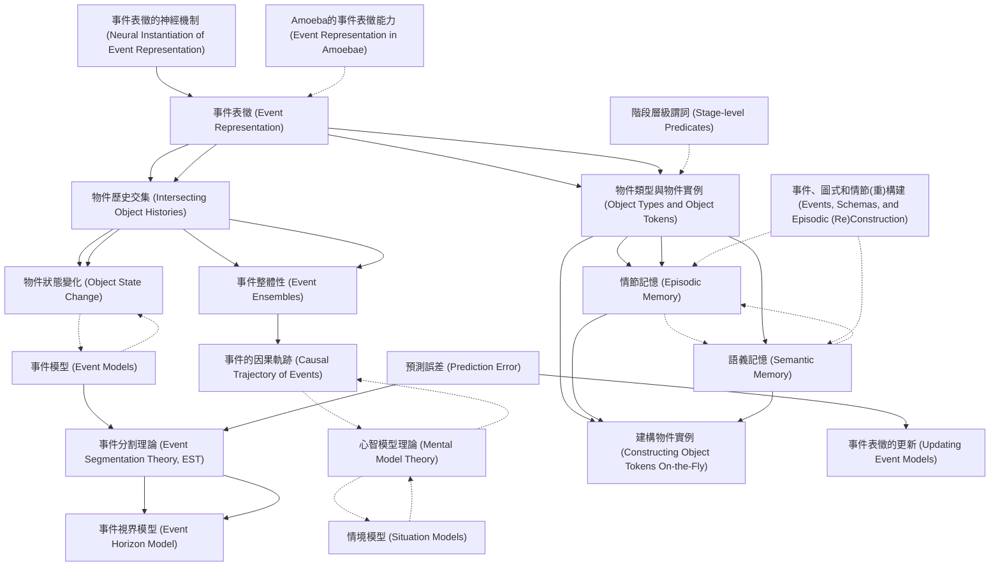

# Zettelkasten 卡片索引

**來源論文**: Altmann2019_Mental_Simulation
**作者**: 
**年份**: 2025
**生成日期**: 2025-10-29 16:14
**卡片總數**: 20

---

## 📚 卡片清單

### 1. [事件表徵 (Event Representation)](zettel_cards/CogSci-20251029-001.md)
- **ID**: `CogSci-20251029-001`
- **類型**: 
- **核心**: "Our intention is to account for the content of event representations."
- **標籤**: `事件表徵`, `物件表徵`, `認知心理學`

### 2. [物件歷史交集 (Intersecting Object Histories)](zettel_cards/CogSci-20251029-002.md)
- **ID**: `CogSci-20251029-002`
- **類型**: 
- **核心**: "Thus, we maintain that events are encoded as “ensembles of intersecting object histories” in which one or more objects change state."
- **標籤**: `物件歷史`, `狀態變化`, `事件編碼`

### 3. [物件類型與物件實例 (Object Types and Object Tokens)](zettel_cards/CogSci-20251029-003.md)
- **ID**: `CogSci-20251029-003`
- **類型**: 
- **核心**: "Our approach requires not just the distinction between object types and object tokens, but also between tokens and token-states (e.g., between that specific onion and its different states before, during, and after the chopping)."
- **標籤**: `物件類型`, `物件實例`, `物件狀態`

### 4. [物件狀態變化 (Object State Change)](zettel_cards/CogSci-20251029-004.md)
- **ID**: `CogSci-20251029-004`
- **類型**: 
- **核心**: "The relevance of object-state change for event representation is recognized within the linguistic tradition..."
- **標籤**: `狀態變化`, `詞彙語義`, `事件結構`

### 5. [事件整體性 (Event Ensembles)](zettel_cards/CogSci-20251029-005.md)
- **ID**: `CogSci-20251029-005`
- **類型**: 
- **核心**: "...events are, as alluded to above, ensembles of object representations that encode the multiplicity of interactions and dependencies that, taken together, constitute the event."
- **標籤**: `事件整體`, `物件表徵`, `互動關係`

### 6. [情節記憶 (Episodic Memory)](zettel_cards/CogSci-20251029-006.md)
- **ID**: `CogSci-20251029-006`
- **類型**: 
- **核心**: "These distinctions require an account of how object tokens are represented within the context of episodic and semantic memory..."
- **標籤**: `情節記憶`, `語義記憶`, `物件實例`

### 7. [語義記憶 (Semantic Memory)](zettel_cards/CogSci-20251029-007.md)
- **ID**: `CogSci-20251029-007`
- **類型**: 
- **核心**: "These distinctions require an account of how object tokens are represented within the context of episodic and semantic memory..."
- **標籤**: `語義記憶`, `物件類型`, `知識表徵`

### 8. [心智模型理論 (Mental Model Theory)](zettel_cards/CogSci-20251029-008.md)
- **ID**: `CogSci-20251029-008`
- **類型**: 
- **核心**: "Mental Model theory (Johnson-Laird, 1983) and theories of situation models...consider event representation as a part of the construction of a mental situation—a “simulation” of relevant aspects of the world."
- **標籤**: `心智模型`, `情境模型`, `模擬`

### 9. [情境模型 (Situation Models)](zettel_cards/CogSci-20251029-009.md)
- **ID**: `CogSci-20251029-009`
- **類型**: 
- **核心**: "...events are fundamental components of situation models, and are indexed, encoded, and updated on each of (at least) five dimensions: time, space, protagonists, causation, and intentionality."
- **標籤**: `情境模型`, `事件索引`, `五個維度`

### 10. [事件模型 (Event Models)](zettel_cards/CogSci-20251029-010.md)
- **ID**: `CogSci-20251029-010`
- **類型**: 
- **核心**: "Event models (see Radvansky & Zacks, 2011, 2014) focus more on the events themselves rather than, specifically, their integration into situation or mental models..."
- **標籤**: `事件模型`, `事件分割`, `預測`

### 11. [事件分割理論 (Event Segmentation Theory, EST)](zettel_cards/CogSci-20251029-011.md)
- **ID**: `CogSci-20251029-011`
- **類型**: 
- **核心**: "EST defines an event as “a segment of time at a given location that is conceived by an observer to have a beginning and an end” (Zacks & Tversky, 2001, p. 3)."
- **標籤**: `事件分割`, `時間片段`, `開始與結束`

### 12. [事件視界模型 (Event Horizon Model)](zettel_cards/CogSci-20251029-012.md)
- **ID**: `CogSci-20251029-012`
- **類型**: 
- **核心**: "The Event Horizon Model takes EST as its starting point and proposes a number of principles that govern how event models are structured, how they are recalled, and when shifts occur between one and another..."
- **標籤**: `事件視界`, `模型結構`, `記憶提取`

### 13. [預測誤差 (Prediction Error)](zettel_cards/CogSci-20251029-013.md)
- **ID**: `CogSci-20251029-013`
- **類型**: 
- **核心**: "...within an event, prediction error will be low (i.e., what will happen next is relatively predictable), but prediction error will increase as the immediate future becomes less certain, as happens at the boundaries between events."
- **標籤**: `預測`, `不確定性`, `事件邊界`

### 14. [階段層級謂詞 (Stage-level Predicates)](zettel_cards/CogSci-20251029-014.md)
- **ID**: `CogSci-20251029-014`
- **類型**: 
- **核心**: "While the linguistic (and philosophical) tradition is respect of the distinction between types, tokens, and token-states, Kratzer (1995) points out a distinction relevant for understanding certain linguistic phenomena between “stage-level” and “individual-level” predicates that refer, broadly speaking, to properties associated with token-states (stage-level) or tokens and types (individual-level)."
- **標籤**: `階段層級`, `個體層級`, `謂詞`

### 15. [事件、圖式和情節(重)構建 (Events, Schemas, and Episodic (Re)Construction)](zettel_cards/CogSci-20251029-015.md)
- **ID**: `CogSci-20251029-015`
- **類型**: 
- **核心**: "...the relationships between one event and another (see Events, Schemas, and Episodic (Re)Construction)."
- **標籤**: `事件`, `圖式`, `情節記憶重構`

### 16. [事件的因果軌跡 (Causal Trajectory of Events)](zettel_cards/CogSci-20251029-016.md)
- **ID**: `CogSci-20251029-016`
- **類型**: 
- **核心**: "Moens and Steedman (1988) developed an account of the mapping from language onto structures that reflect contingencies between events, which they describe in terms of a tripartite structure consisting of the goal event (the “culmination”), a “preparatory process” (loosely, a causal antecedent), and a “consequent state”..."
- **標籤**: `因果關係`, `事件結構`, `目標事件`

### 17. [建構物件實例 (Constructing Object Tokens On-the-Fly)](zettel_cards/CogSci-20251029-017.md)
- **ID**: `CogSci-20251029-017`
- **類型**: 
- **核心**: "Constructing Object Tokens On-the-Fly extends work presented in Altmann (2017)."
- **標籤**: `物件建構`, `即時建構`, `物件表徵`

### 18. [事件表徵的神經機制 (Neural Instantiation of Event Representation)](zettel_cards/CogSci-20251029-018.md)
- **ID**: `CogSci-20251029-018`
- **類型**: 
- **核心**: "We shall argue that the theoretical pieces, and their neural instantiation, are in place to develop a unified account of event representation in which such representation is simply a consequence of the mechanism for generating object tokens, their histories, and the binding of one to the other."
- **標籤**: `神經機制`, `物件實例`, `聯結`

### 19. [Amoeba的事件表徵能力 (Event Representation in Amoebae)](zettel_cards/CogSci-20251029-019.md)
- **ID**: `CogSci-20251029-019`
- **類型**: 
- **核心**: "Events change the world—even simple organisms like amoebae encode, anticipate, and react to change (e.g., Saigusa, Tero, Nakagaki, & Kuramoto, 2008)."
- **標籤**: `Amoeba`, `事件表徵`, `反應`

### 20. [事件表徵的更新 (Updating Event Models)](zettel_cards/CogSci-20251029-020.md)
- **ID**: `CogSci-20251029-020`
- **類型**: 
- **核心**: "Increases in prediction error trigger the updating of the current event model (if the prediction were perfect, there would be nothing to update—we return to this below), and this in turn leads to the perception of an event boundary (e.g., Zacks et al., 2007)."
- **標籤**: `模型更新`, `預測誤差`, `事件邊界感知`

---

## 🗺️ 概念網絡圖

---

## 🏷️ 標籤索引

### 事件表徵
- [[CogSci-20251029-001]] 事件表徵 (Event Representation)
- [[CogSci-20251029-019]] Amoeba的事件表徵能力 (Event Representation in Amoebae)

### 物件表徵
- [[CogSci-20251029-001]] 事件表徵 (Event Representation)
- [[CogSci-20251029-005]] 事件整體性 (Event Ensembles)
- [[CogSci-20251029-017]] 建構物件實例 (Constructing Object Tokens On-the-Fly)

### 認知心理學
- [[CogSci-20251029-001]] 事件表徵 (Event Representation)

### 物件歷史
- [[CogSci-20251029-002]] 物件歷史交集 (Intersecting Object Histories)

### 狀態變化
- [[CogSci-20251029-002]] 物件歷史交集 (Intersecting Object Histories)
- [[CogSci-20251029-004]] 物件狀態變化 (Object State Change)

### 事件編碼
- [[CogSci-20251029-002]] 物件歷史交集 (Intersecting Object Histories)

### 物件類型
- [[CogSci-20251029-003]] 物件類型與物件實例 (Object Types and Object Tokens)
- [[CogSci-20251029-007]] 語義記憶 (Semantic Memory)

### 物件實例
- [[CogSci-20251029-003]] 物件類型與物件實例 (Object Types and Object Tokens)
- [[CogSci-20251029-006]] 情節記憶 (Episodic Memory)
- [[CogSci-20251029-018]] 事件表徵的神經機制 (Neural Instantiation of Event Representation)

### 物件狀態
- [[CogSci-20251029-003]] 物件類型與物件實例 (Object Types and Object Tokens)

### 詞彙語義
- [[CogSci-20251029-004]] 物件狀態變化 (Object State Change)

### 事件結構
- [[CogSci-20251029-004]] 物件狀態變化 (Object State Change)
- [[CogSci-20251029-016]] 事件的因果軌跡 (Causal Trajectory of Events)

### 事件整體
- [[CogSci-20251029-005]] 事件整體性 (Event Ensembles)

### 互動關係
- [[CogSci-20251029-005]] 事件整體性 (Event Ensembles)

### 情節記憶
- [[CogSci-20251029-006]] 情節記憶 (Episodic Memory)

### 語義記憶
- [[CogSci-20251029-006]] 情節記憶 (Episodic Memory)
- [[CogSci-20251029-007]] 語義記憶 (Semantic Memory)

### 知識表徵
- [[CogSci-20251029-007]] 語義記憶 (Semantic Memory)

### 心智模型
- [[CogSci-20251029-008]] 心智模型理論 (Mental Model Theory)

### 情境模型
- [[CogSci-20251029-008]] 心智模型理論 (Mental Model Theory)
- [[CogSci-20251029-009]] 情境模型 (Situation Models)

### 模擬
- [[CogSci-20251029-008]] 心智模型理論 (Mental Model Theory)

### 事件索引
- [[CogSci-20251029-009]] 情境模型 (Situation Models)

### 五個維度
- [[CogSci-20251029-009]] 情境模型 (Situation Models)

### 事件模型
- [[CogSci-20251029-010]] 事件模型 (Event Models)

### 事件分割
- [[CogSci-20251029-010]] 事件模型 (Event Models)
- [[CogSci-20251029-011]] 事件分割理論 (Event Segmentation Theory, EST)

### 預測
- [[CogSci-20251029-010]] 事件模型 (Event Models)
- [[CogSci-20251029-013]] 預測誤差 (Prediction Error)

### 時間片段
- [[CogSci-20251029-011]] 事件分割理論 (Event Segmentation Theory, EST)

### 開始與結束
- [[CogSci-20251029-011]] 事件分割理論 (Event Segmentation Theory, EST)

### 事件視界
- [[CogSci-20251029-012]] 事件視界模型 (Event Horizon Model)

### 模型結構
- [[CogSci-20251029-012]] 事件視界模型 (Event Horizon Model)

### 記憶提取
- [[CogSci-20251029-012]] 事件視界模型 (Event Horizon Model)

### 不確定性
- [[CogSci-20251029-013]] 預測誤差 (Prediction Error)

### 事件邊界
- [[CogSci-20251029-013]] 預測誤差 (Prediction Error)

### 階段層級
- [[CogSci-20251029-014]] 階段層級謂詞 (Stage-level Predicates)

### 個體層級
- [[CogSci-20251029-014]] 階段層級謂詞 (Stage-level Predicates)

### 謂詞
- [[CogSci-20251029-014]] 階段層級謂詞 (Stage-level Predicates)

### 事件
- [[CogSci-20251029-015]] 事件、圖式和情節(重)構建 (Events, Schemas, and Episodic (Re)Construction)

### 圖式
- [[CogSci-20251029-015]] 事件、圖式和情節(重)構建 (Events, Schemas, and Episodic (Re)Construction)

### 情節記憶重構
- [[CogSci-20251029-015]] 事件、圖式和情節(重)構建 (Events, Schemas, and Episodic (Re)Construction)

### 因果關係
- [[CogSci-20251029-016]] 事件的因果軌跡 (Causal Trajectory of Events)

### 目標事件
- [[CogSci-20251029-016]] 事件的因果軌跡 (Causal Trajectory of Events)

### 物件建構
- [[CogSci-20251029-017]] 建構物件實例 (Constructing Object Tokens On-the-Fly)

### 即時建構
- [[CogSci-20251029-017]] 建構物件實例 (Constructing Object Tokens On-the-Fly)

### 神經機制
- [[CogSci-20251029-018]] 事件表徵的神經機制 (Neural Instantiation of Event Representation)

### 聯結
- [[CogSci-20251029-018]] 事件表徵的神經機制 (Neural Instantiation of Event Representation)

### Amoeba
- [[CogSci-20251029-019]] Amoeba的事件表徵能力 (Event Representation in Amoebae)

### 反應
- [[CogSci-20251029-019]] Amoeba的事件表徵能力 (Event Representation in Amoebae)

### 模型更新
- [[CogSci-20251029-020]] 事件表徵的更新 (Updating Event Models)

### 預測誤差
- [[CogSci-20251029-020]] 事件表徵的更新 (Updating Event Models)

### 事件邊界感知
- [[CogSci-20251029-020]] 事件表徵的更新 (Updating Event Models)

---

## 📖 閱讀建議順序

1. [[CogSci-20251029-004]] 物件狀態變化 (Object State Change)

2. [[CogSci-20251029-005]] 事件整體性 (Event Ensembles)

3. [[CogSci-20251029-008]] 心智模型理論 (Mental Model Theory)

4. [[CogSci-20251029-009]] 情境模型 (Situation Models)

5. [[CogSci-20251029-012]] 事件視界模型 (Event Horizon Model)

6. [[CogSci-20251029-014]] 階段層級謂詞 (Stage-level Predicates)

7. [[CogSci-20251029-015]] 事件、圖式和情節(重)構建 (Events, Schemas, and Episodic (Re)Construction)

8. [[CogSci-20251029-016]] 事件的因果軌跡 (Causal Trajectory of Events)

9. [[CogSci-20251029-017]] 建構物件實例 (Constructing Object Tokens On-the-Fly)

10. [[CogSci-20251029-018]] 事件表徵的神經機制 (Neural Instantiation of Event Representation)

11. [[CogSci-20251029-019]] Amoeba的事件表徵能力 (Event Representation in Amoebae)

12. [[CogSci-20251029-020]] 事件表徵的更新 (Updating Event Models)

13. [[CogSci-20251029-006]] 情節記憶 (Episodic Memory)

14. [[CogSci-20251029-007]] 語義記憶 (Semantic Memory)

15. [[CogSci-20251029-010]] 事件模型 (Event Models)

16. [[CogSci-20251029-011]] 事件分割理論 (Event Segmentation Theory, EST)

17. [[CogSci-20251029-013]] 預測誤差 (Prediction Error)

18. [[CogSci-20251029-001]] 事件表徵 (Event Representation)

19. [[CogSci-20251029-002]] 物件歷史交集 (Intersecting Object Histories)

20. [[CogSci-20251029-003]] 物件類型與物件實例 (Object Types and Object Tokens)

---

*本索引由 Knowledge Production System 自動生成*