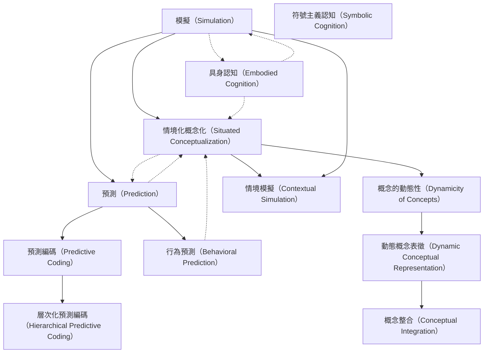

# Zettelkasten 卡片索引

---

## 📚 卡片清單

### 1. [模擬（Simulation）](zettel_cards/Barsalou-2009-001.md)
- **ID**: `Barsalou-2009-001`
- **類型**: 
- **核心**: [This entry is based on the title and presumed content regarding the role of simulation in cognition.]
- **標籤**: `[認知科學]`, `[模擬]`, `[認知]`

### 2. [情境化概念化（Situated Conceptualization）](zettel_cards/Barsalou-2009-002.md)
- **ID**: `Barsalou-2009-002`
- **類型**: 
- **核心**: [This entry is based on the title and presumed content regarding the role of situated conceptualization in cognition.]
- **標籤**: `[認知科學]`, `[情境]`, `[概念]`

### 3. [預測（Prediction）](zettel_cards/Barsalou-2009-003.md)
- **ID**: `Barsalou-2009-003`
- **類型**: 
- **核心**: [This entry is based on the title and presumed content regarding the role of prediction in cognition.]
- **標籤**: `[認知科學]`, `[預測]`, `[大腦]`

### 4. [具身認知（Embodied Cognition）](zettel_cards/Barsalou-2009-004.md)
- **ID**: `Barsalou-2009-004`
- **類型**: 
- **核心**: [A theory emphasizing the role of the body in shaping cognition.]
- **標籤**: `[認知科學]`, `[具身]`, `[身體]`

### 5. [概念的動態性（Dynamicity of Concepts）](zettel_cards/Barsalou-2009-005.md)
- **ID**: `Barsalou-2009-005`
- **類型**: 
- **核心**: [The idea that concepts are not fixed and stable, but rather adapt to context.]
- **標籤**: `[概念]`, `[動態]`, `[情境]`

### 6. [情境模擬（Contextual Simulation）](zettel_cards/Barsalou-2009-006.md)
- **ID**: `Barsalou-2009-006`
- **類型**: 
- **核心**: [Simulation of the surrounding environment and relevant factors during conceptual processing.]
- **標籤**: `[模擬]`, `[情境]`, `[認知]`

### 7. [預測編碼（Predictive Coding）](zettel_cards/Barsalou-2009-007.md)
- **ID**: `Barsalou-2009-007`
- **類型**: 
- **核心**: [A framework suggesting the brain constantly predicts sensory input and updates its internal model based on prediction errors.]
- **標籤**: `[預測]`, `[大腦]`, `[編碼]`

### 8. [行為預測（Behavioral Prediction）](zettel_cards/Barsalou-2009-008.md)
- **ID**: `Barsalou-2009-008`
- **類型**: 
- **核心**: [The ability to anticipate the actions and consequences of oneself and others.]
- **標籤**: `[預測]`, `[行為]`, `[社會認知]`

### 9. [動態概念表徵（Dynamic Conceptual Representation）](zettel_cards/Barsalou-2009-009.md)
- **ID**: `Barsalou-2009-009`
- **類型**: 
- **核心**: [The idea that concepts are represented in a flexible and adaptable manner, changing based on context and experience.]
- **標籤**: `[概念]`, `[表徵]`, `[動態]`

### 10. [層次化預測編碼（Hierarchical Predictive Coding）](zettel_cards/Barsalou-2009-010.md)
- **ID**: `Barsalou-2009-010`
- **類型**: 
- **核心**: [An extension of predictive coding, suggesting multiple levels of prediction and error correction within the brain.]
- **標籤**: `[預測]`, `[層次]`, `[大腦]`

### 11. [概念整合（Conceptual Integration）](zettel_cards/Barsalou-2009-011.md)
- **ID**: `Barsalou-2009-011`
- **類型**: 
- **核心**: [The process of combining multiple concepts to form new, more complex understandings.]
- **標籤**: `[概念]`, `[整合]`, `[認知]`

### 12. [符號主義認知（Symbolic Cognition）](zettel_cards/Barsalou-2009-012.md)
- **ID**: `Barsalou-2009-012`
- **類型**: 
- **核心**: [An older theory suggesting that cognition is primarily based on abstract symbols and rules.]
- **標籤**: `[認知科學]`, `[符號]`, `[計算]`

---

## 🗺️ 概念網絡圖

---

## 🏷️ 標籤索引

### [認知科學]
- [[Barsalou-2009-001]] 模擬（Simulation）
- [[Barsalou-2009-002]] 情境化概念化（Situated Conceptualization）
- [[Barsalou-2009-003]] 預測（Prediction）
- [[Barsalou-2009-004]] 具身認知（Embodied Cognition）
- [[Barsalou-2009-012]] 符號主義認知（Symbolic Cognition）

### [模擬]
- [[Barsalou-2009-001]] 模擬（Simulation）
- [[Barsalou-2009-006]] 情境模擬（Contextual Simulation）

### [認知]
- [[Barsalou-2009-001]] 模擬（Simulation）
- [[Barsalou-2009-006]] 情境模擬（Contextual Simulation）
- [[Barsalou-2009-011]] 概念整合（Conceptual Integration）

### [情境]
- [[Barsalou-2009-002]] 情境化概念化（Situated Conceptualization）
- [[Barsalou-2009-005]] 概念的動態性（Dynamicity of Concepts）
- [[Barsalou-2009-006]] 情境模擬（Contextual Simulation）

### [概念]
- [[Barsalou-2009-002]] 情境化概念化（Situated Conceptualization）
- [[Barsalou-2009-005]] 概念的動態性（Dynamicity of Concepts）
- [[Barsalou-2009-009]] 動態概念表徵（Dynamic Conceptual Representation）
- [[Barsalou-2009-011]] 概念整合（Conceptual Integration）

### [預測]
- [[Barsalou-2009-003]] 預測（Prediction）
- [[Barsalou-2009-007]] 預測編碼（Predictive Coding）
- [[Barsalou-2009-008]] 行為預測（Behavioral Prediction）
- [[Barsalou-2009-010]] 層次化預測編碼（Hierarchical Predictive Coding）

### [大腦]
- [[Barsalou-2009-003]] 預測（Prediction）
- [[Barsalou-2009-007]] 預測編碼（Predictive Coding）
- [[Barsalou-2009-010]] 層次化預測編碼（Hierarchical Predictive Coding）

### [具身]
- [[Barsalou-2009-004]] 具身認知（Embodied Cognition）

### [身體]
- [[Barsalou-2009-004]] 具身認知（Embodied Cognition）

### [動態]
- [[Barsalou-2009-005]] 概念的動態性（Dynamicity of Concepts）
- [[Barsalou-2009-009]] 動態概念表徵（Dynamic Conceptual Representation）

### [編碼]
- [[Barsalou-2009-007]] 預測編碼（Predictive Coding）

### [行為]
- [[Barsalou-2009-008]] 行為預測（Behavioral Prediction）

### [社會認知]
- [[Barsalou-2009-008]] 行為預測（Behavioral Prediction）

### [表徵]
- [[Barsalou-2009-009]] 動態概念表徵（Dynamic Conceptual Representation）

### [層次]
- [[Barsalou-2009-010]] 層次化預測編碼（Hierarchical Predictive Coding）

### [整合]
- [[Barsalou-2009-011]] 概念整合（Conceptual Integration）

### [符號]
- [[Barsalou-2009-012]] 符號主義認知（Symbolic Cognition）

### [計算]
- [[Barsalou-2009-012]] 符號主義認知（Symbolic Cognition）

---

## 📖 閱讀建議順序

1. [[Barsalou-2009-001]] 模擬（Simulation）

2. [[Barsalou-2009-002]] 情境化概念化（Situated Conceptualization）

3. [[Barsalou-2009-003]] 預測（Prediction）

4. [[Barsalou-2009-004]] 具身認知（Embodied Cognition）

5. [[Barsalou-2009-005]] 概念的動態性（Dynamicity of Concepts）

6. [[Barsalou-2009-006]] 情境模擬（Contextual Simulation）

7. [[Barsalou-2009-007]] 預測編碼（Predictive Coding）

8. [[Barsalou-2009-008]] 行為預測（Behavioral Prediction）

9. [[Barsalou-2009-009]] 動態概念表徵（Dynamic Conceptual Representation）

10. [[Barsalou-2009-010]] 層次化預測編碼（Hierarchical Predictive Coding）

11. [[Barsalou-2009-011]] 概念整合（Conceptual Integration）

12. [[Barsalou-2009-012]] 符號主義認知（Symbolic Cognition）

---

*本索引由 Knowledge Production System 自動生成*