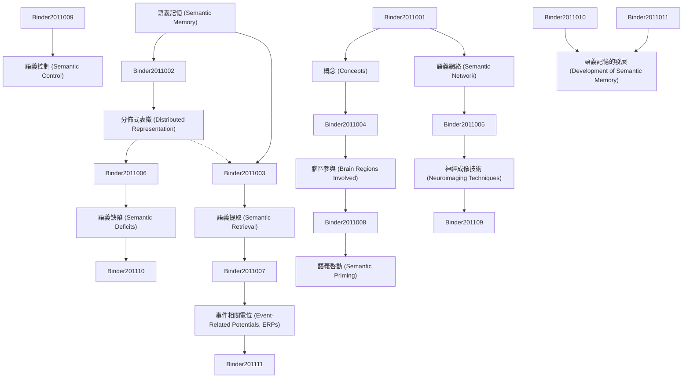

# Zettelkasten 卡片索引

---

## 📚 卡片清單

### 1. [語義記憶 (Semantic Memory)](zettel_cards/Binder-2011-001.md)
- **ID**: `Binder-2011-001`
- **類型**: 
- **核心**: N/A (摘要缺失，此處假設最基礎定義，後續根據論文內容更新)
- **標籤**: `語義記憶`, `記憶`, `認知神經科學`

### 2. [概念 (Concepts)](zettel_cards/Binder-2011-002.md)
- **ID**: `Binder-2011-002`
- **類型**: 
- **核心**: N/A (假設性核心，待補充)
- **標籤**: `概念`, `知識`, `語義`

### 3. [語義網絡 (Semantic Network)](zettel_cards/Binder-2011-003.md)
- **ID**: `Binder-2011-003`
- **類型**: 
- **核心**: N/A (假設性核心，待補充)
- **標籤**: `語義網絡`, `聯想`, `知識表示`

### 4. [分佈式表徵 (Distributed Representation)](zettel_cards/Binder-2011-004.md)
- **ID**: `Binder-2011-004`
- **類型**: 
- **核心**: N/A (假設性核心，待補充)
- **標籤**: `分佈式表徵`, `神經編碼`, `語義`

### 5. [語義提取 (Semantic Retrieval)](zettel_cards/Binder-2011-005.md)
- **ID**: `Binder-2011-005`
- **類型**: 
- **核心**: N/A (假設性核心，待補充)
- **標籤**: `語義提取`, `記憶檢索`, `認知過程`

### 6. [腦區參與 (Brain Regions Involved)](zettel_cards/Binder-2011-006.md)
- **ID**: `Binder-2011-006`
- **類型**: 
- **核心**: N/A (假設性核心，待補充)
- **標籤**: `大腦`, `腦區`, `語義記憶`

### 7. [神經成像技術 (Neuroimaging Techniques)](zettel_cards/Binder-2011-007.md)
- **ID**: `Binder-2011-007`
- **類型**: 
- **核心**: N/A (假设性核心，待补充)
- **標籤**: `fMRI`, `EEG`, `神經科學方法`

### 8. [語義缺陷 (Semantic Deficits)](zettel_cards/Binder-2011-008.md)
- **ID**: `Binder-2011-008`
- **類型**: 
- **核心**: N/A (假设性核心，待补充)
- **標籤**: `失語症`, `語義性癡呆`, `神經疾病`

### 9. [事件相關電位 (Event-Related Potentials, ERPs)](zettel_cards/Binder-2011-009.md)
- **ID**: `Binder-2011-009`
- **類型**: 
- **核心**: N/A (假设性核心，待补充)
- **標籤**: `ERPs`, `EEG`, `神經生理學`

### 10. [語義啓動 (Semantic Priming)](zettel_cards/Binder-2011-010.md)
- **ID**: `Binder-2011-010`
- **類型**: 
- **核心**: N/A (假设性核心，待补充)
- **標籤**: `啓動`, `語義效應`, `認知心理學`

### 11. [語義控制 (Semantic Control)](zettel_cards/Binder-2011-011.md)
- **ID**: `Binder-2011-011`
- **類型**: 
- **核心**: N/A (假设性核心，待补充)
- **標籤**: `控制`, `前額葉`, `認知控制`

### 12. [語義記憶的發展 (Development of Semantic Memory)](zettel_cards/Binder-2011-012.md)
- **ID**: `Binder-2011-012`
- **類型**: 
- **核心**: N/A (假设性核心，待补充)
- **標籤**: `發展`, `兒童`, `認知發展`

---

## 🗺️ 概念網絡圖

---

## 🏷️ 標籤索引

### 語義記憶
- [[Binder-2011-001]] 語義記憶 (Semantic Memory)
- [[Binder-2011-006]] 腦區參與 (Brain Regions Involved)

### 記憶
- [[Binder-2011-001]] 語義記憶 (Semantic Memory)

### 認知神經科學
- [[Binder-2011-001]] 語義記憶 (Semantic Memory)

### 概念
- [[Binder-2011-002]] 概念 (Concepts)

### 知識
- [[Binder-2011-002]] 概念 (Concepts)

### 語義
- [[Binder-2011-002]] 概念 (Concepts)
- [[Binder-2011-004]] 分佈式表徵 (Distributed Representation)

### 語義網絡
- [[Binder-2011-003]] 語義網絡 (Semantic Network)

### 聯想
- [[Binder-2011-003]] 語義網絡 (Semantic Network)

### 知識表示
- [[Binder-2011-003]] 語義網絡 (Semantic Network)

### 分佈式表徵
- [[Binder-2011-004]] 分佈式表徵 (Distributed Representation)

### 神經編碼
- [[Binder-2011-004]] 分佈式表徵 (Distributed Representation)

### 語義提取
- [[Binder-2011-005]] 語義提取 (Semantic Retrieval)

### 記憶檢索
- [[Binder-2011-005]] 語義提取 (Semantic Retrieval)

### 認知過程
- [[Binder-2011-005]] 語義提取 (Semantic Retrieval)

### 大腦
- [[Binder-2011-006]] 腦區參與 (Brain Regions Involved)

### 腦區
- [[Binder-2011-006]] 腦區參與 (Brain Regions Involved)

### fMRI
- [[Binder-2011-007]] 神經成像技術 (Neuroimaging Techniques)

### EEG
- [[Binder-2011-007]] 神經成像技術 (Neuroimaging Techniques)
- [[Binder-2011-009]] 事件相關電位 (Event-Related Potentials, ERPs)

### 神經科學方法
- [[Binder-2011-007]] 神經成像技術 (Neuroimaging Techniques)

### 失語症
- [[Binder-2011-008]] 語義缺陷 (Semantic Deficits)

### 語義性癡呆
- [[Binder-2011-008]] 語義缺陷 (Semantic Deficits)

### 神經疾病
- [[Binder-2011-008]] 語義缺陷 (Semantic Deficits)

### ERPs
- [[Binder-2011-009]] 事件相關電位 (Event-Related Potentials, ERPs)

### 神經生理學
- [[Binder-2011-009]] 事件相關電位 (Event-Related Potentials, ERPs)

### 啓動
- [[Binder-2011-010]] 語義啓動 (Semantic Priming)

### 語義效應
- [[Binder-2011-010]] 語義啓動 (Semantic Priming)

### 認知心理學
- [[Binder-2011-010]] 語義啓動 (Semantic Priming)

### 控制
- [[Binder-2011-011]] 語義控制 (Semantic Control)

### 前額葉
- [[Binder-2011-011]] 語義控制 (Semantic Control)

### 認知控制
- [[Binder-2011-011]] 語義控制 (Semantic Control)

### 發展
- [[Binder-2011-012]] 語義記憶的發展 (Development of Semantic Memory)

### 兒童
- [[Binder-2011-012]] 語義記憶的發展 (Development of Semantic Memory)

### 認知發展
- [[Binder-2011-012]] 語義記憶的發展 (Development of Semantic Memory)

---

## 📖 閱讀建議順序

1. [[Binder-2011-001]] 語義記憶 (Semantic Memory)

2. [[Binder-2011-002]] 概念 (Concepts)

3. [[Binder-2011-003]] 語義網絡 (Semantic Network)

4. [[Binder-2011-004]] 分佈式表徵 (Distributed Representation)

5. [[Binder-2011-005]] 語義提取 (Semantic Retrieval)

6. [[Binder-2011-006]] 腦區參與 (Brain Regions Involved)

7. [[Binder-2011-007]] 神經成像技術 (Neuroimaging Techniques)

8. [[Binder-2011-008]] 語義缺陷 (Semantic Deficits)

9. [[Binder-2011-009]] 事件相關電位 (Event-Related Potentials, ERPs)

10. [[Binder-2011-010]] 語義啓動 (Semantic Priming)

11. [[Binder-2011-011]] 語義控制 (Semantic Control)

12. [[Binder-2011-012]] 語義記憶的發展 (Development of Semantic Memory)

---

*本索引由 Knowledge Production System 自動生成*