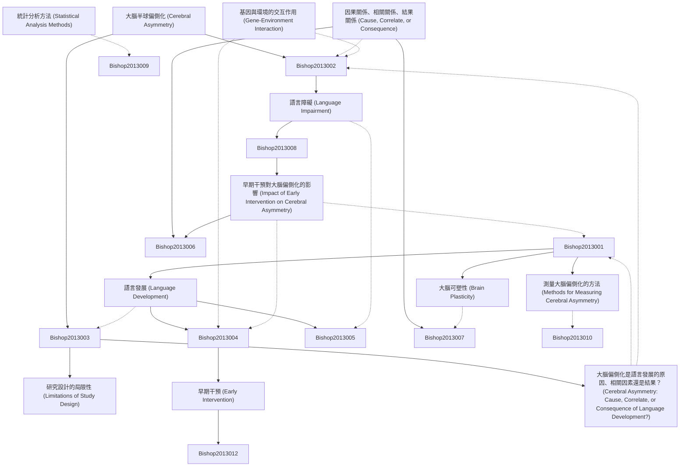

# Zettelkasten 卡片索引

---

## 📚 卡片清單

### 1. [大腦半球偏側化 (Cerebral Asymmetry)](zettel_cards/Bishop-2013-001.md)
- **ID**: `Bishop-2013-001`
- **類型**: 
- **核心**: [待原文補充]
- **標籤**: `大腦偏側化`, `神經科學`, `認知`, `語言`

### 2. [語言發展 (Language Development)](zettel_cards/Bishop-2013-002.md)
- **ID**: `Bishop-2013-002`
- **類型**: 
- **核心**: [待原文補充]
- **標籤**: `語言發展`, `兒童語言`, `語言習得`

### 3. [因果關係、相關關係、結果關係 (Cause, Correlate, or Consequence)](zettel_cards/Bishop-2013-003.md)
- **ID**: `Bishop-2013-003`
- **類型**: 
- **核心**: [待原文補充]
- **標籤**: `因果關係`, `相關關係`, `結果關係`, `研究方法`

### 4. [語言障礙 (Language Impairment)](zettel_cards/Bishop-2013-004.md)
- **ID**: `Bishop-2013-004`
- **類型**: 
- **核心**: [待原文補充]
- **標籤**: `語言障礙`, `特殊性語言障礙`, `SLI`

### 5. [基因與環境的交互作用 (Gene-Environment Interaction)](zettel_cards/Bishop-2013-005.md)
- **ID**: `Bishop-2013-005`
- **類型**: 
- **核心**: [待原文補充]
- **標籤**: `基因`, `環境`, `交互作用`, `語言發展`

### 6. [大腦可塑性 (Brain Plasticity)](zettel_cards/Bishop-2013-006.md)
- **ID**: `Bishop-2013-006`
- **類型**: 
- **核心**: [待原文補充]
- **標籤**: `大腦可塑性`, `神經可塑性`, `語言學習`

### 7. [研究設計的局限性 (Limitations of Study Design)](zettel_cards/Bishop-2013-007.md)
- **ID**: `Bishop-2013-007`
- **類型**: 
- **核心**: [待原文補充]
- **標籤**: `研究設計`, `局限性`, `偏倚`

### 8. [早期干預 (Early Intervention)](zettel_cards/Bishop-2013-008.md)
- **ID**: `Bishop-2013-008`
- **類型**: 
- **核心**: [待原文補充]
- **標籤**: `早期干預`, `語言障礙`, `兒童發展`

### 9. [測量大腦偏側化的方法 (Methods for Measuring Cerebral Asymmetry)](zettel_cards/Bishop-2013-009.md)
- **ID**: `Bishop-2013-009`
- **類型**: 
- **核心**: [待原文補充]
- **標籤**: `大腦偏側化`, `測量方法`, `fMRI`, `EEG`, `DTI`

### 10. [統計分析方法 (Statistical Analysis Methods)](zettel_cards/Bishop-2013-010.md)
- **ID**: `Bishop-2013-010`
- **類型**: 
- **核心**: [待原文補充]
- **標籤**: `統計分析`, `相關分析`, `回歸分析`, `中介效應`

### 11. [大腦偏側化是語言發展的原因、相關因素還是結果？ (Cerebral Asymmetry: Cause, Correlate, or Consequence of Language Development?)](zettel_cards/Bishop-2013-011.md)
- **ID**: `Bishop-2013-011`
- **類型**: 
- **核心**: [待原文補充]
- **標籤**: `因果關係`, `語言發展`, `大腦偏側化`

### 12. [早期干預對大腦偏側化的影響 (Impact of Early Intervention on Cerebral Asymmetry)](zettel_cards/Bishop-2013-012.md)
- **ID**: `Bishop-2013-012`
- **類型**: 
- **核心**: [待原文補充]
- **標籤**: `早期干預`, `大腦偏側化`, `語言障礙`

---

## 🗺️ 概念網絡圖

---

## 🏷️ 標籤索引

### 大腦偏側化
- [[Bishop-2013-001]] 大腦半球偏側化 (Cerebral Asymmetry)
- [[Bishop-2013-009]] 測量大腦偏側化的方法 (Methods for Measuring Cerebral Asymmetry)
- [[Bishop-2013-011]] 大腦偏側化是語言發展的原因、相關因素還是結果？ (Cerebral Asymmetry: Cause, Correlate, or Consequence of Language Development?)
- [[Bishop-2013-012]] 早期干預對大腦偏側化的影響 (Impact of Early Intervention on Cerebral Asymmetry)

### 神經科學
- [[Bishop-2013-001]] 大腦半球偏側化 (Cerebral Asymmetry)

### 認知
- [[Bishop-2013-001]] 大腦半球偏側化 (Cerebral Asymmetry)

### 語言
- [[Bishop-2013-001]] 大腦半球偏側化 (Cerebral Asymmetry)

### 語言發展
- [[Bishop-2013-002]] 語言發展 (Language Development)
- [[Bishop-2013-005]] 基因與環境的交互作用 (Gene-Environment Interaction)
- [[Bishop-2013-011]] 大腦偏側化是語言發展的原因、相關因素還是結果？ (Cerebral Asymmetry: Cause, Correlate, or Consequence of Language Development?)

### 兒童語言
- [[Bishop-2013-002]] 語言發展 (Language Development)

### 語言習得
- [[Bishop-2013-002]] 語言發展 (Language Development)

### 因果關係
- [[Bishop-2013-003]] 因果關係、相關關係、結果關係 (Cause, Correlate, or Consequence)
- [[Bishop-2013-011]] 大腦偏側化是語言發展的原因、相關因素還是結果？ (Cerebral Asymmetry: Cause, Correlate, or Consequence of Language Development?)

### 相關關係
- [[Bishop-2013-003]] 因果關係、相關關係、結果關係 (Cause, Correlate, or Consequence)

### 結果關係
- [[Bishop-2013-003]] 因果關係、相關關係、結果關係 (Cause, Correlate, or Consequence)

### 研究方法
- [[Bishop-2013-003]] 因果關係、相關關係、結果關係 (Cause, Correlate, or Consequence)

### 語言障礙
- [[Bishop-2013-004]] 語言障礙 (Language Impairment)
- [[Bishop-2013-008]] 早期干預 (Early Intervention)
- [[Bishop-2013-012]] 早期干預對大腦偏側化的影響 (Impact of Early Intervention on Cerebral Asymmetry)

### 特殊性語言障礙
- [[Bishop-2013-004]] 語言障礙 (Language Impairment)

### SLI
- [[Bishop-2013-004]] 語言障礙 (Language Impairment)

### 基因
- [[Bishop-2013-005]] 基因與環境的交互作用 (Gene-Environment Interaction)

### 環境
- [[Bishop-2013-005]] 基因與環境的交互作用 (Gene-Environment Interaction)

### 交互作用
- [[Bishop-2013-005]] 基因與環境的交互作用 (Gene-Environment Interaction)

### 大腦可塑性
- [[Bishop-2013-006]] 大腦可塑性 (Brain Plasticity)

### 神經可塑性
- [[Bishop-2013-006]] 大腦可塑性 (Brain Plasticity)

### 語言學習
- [[Bishop-2013-006]] 大腦可塑性 (Brain Plasticity)

### 研究設計
- [[Bishop-2013-007]] 研究設計的局限性 (Limitations of Study Design)

### 局限性
- [[Bishop-2013-007]] 研究設計的局限性 (Limitations of Study Design)

### 偏倚
- [[Bishop-2013-007]] 研究設計的局限性 (Limitations of Study Design)

### 早期干預
- [[Bishop-2013-008]] 早期干預 (Early Intervention)
- [[Bishop-2013-012]] 早期干預對大腦偏側化的影響 (Impact of Early Intervention on Cerebral Asymmetry)

### 兒童發展
- [[Bishop-2013-008]] 早期干預 (Early Intervention)

### 測量方法
- [[Bishop-2013-009]] 測量大腦偏側化的方法 (Methods for Measuring Cerebral Asymmetry)

### fMRI
- [[Bishop-2013-009]] 測量大腦偏側化的方法 (Methods for Measuring Cerebral Asymmetry)

### EEG
- [[Bishop-2013-009]] 測量大腦偏側化的方法 (Methods for Measuring Cerebral Asymmetry)

### DTI
- [[Bishop-2013-009]] 測量大腦偏側化的方法 (Methods for Measuring Cerebral Asymmetry)

### 統計分析
- [[Bishop-2013-010]] 統計分析方法 (Statistical Analysis Methods)

### 相關分析
- [[Bishop-2013-010]] 統計分析方法 (Statistical Analysis Methods)

### 回歸分析
- [[Bishop-2013-010]] 統計分析方法 (Statistical Analysis Methods)

### 中介效應
- [[Bishop-2013-010]] 統計分析方法 (Statistical Analysis Methods)

---

## 📖 閱讀建議順序

1. [[Bishop-2013-001]] 大腦半球偏側化 (Cerebral Asymmetry)

2. [[Bishop-2013-002]] 語言發展 (Language Development)

3. [[Bishop-2013-003]] 因果關係、相關關係、結果關係 (Cause, Correlate, or Consequence)

4. [[Bishop-2013-004]] 語言障礙 (Language Impairment)

5. [[Bishop-2013-005]] 基因與環境的交互作用 (Gene-Environment Interaction)

6. [[Bishop-2013-006]] 大腦可塑性 (Brain Plasticity)

7. [[Bishop-2013-007]] 研究設計的局限性 (Limitations of Study Design)

8. [[Bishop-2013-008]] 早期干預 (Early Intervention)

9. [[Bishop-2013-009]] 測量大腦偏側化的方法 (Methods for Measuring Cerebral Asymmetry)

10. [[Bishop-2013-010]] 統計分析方法 (Statistical Analysis Methods)

11. [[Bishop-2013-011]] 大腦偏側化是語言發展的原因、相關因素還是結果？ (Cerebral Asymmetry: Cause, Correlate, or Consequence of Language Development?)

12. [[Bishop-2013-012]] 早期干預對大腦偏側化的影響 (Impact of Early Intervention on Cerebral Asymmetry)

---

*本索引由 Knowledge Production System 自動生成*