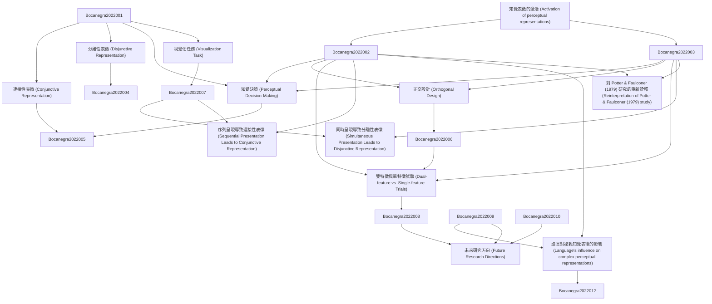

# Zettelkasten 卡片索引

---

## 📚 卡片清單

### 1. [知覺表徵的激活 (Activation of perceptual representations)](zettel_cards/Bocanegra-2022-001.md)
- **ID**: `Bocanegra-2022-001`
- **類型**: 
- **核心**: "Although many studies have investigated the activation of perceptual representations during language"
- **標籤**: `語言理解`, `知覺`, `表徵`, `激活`

### 2. [連接性表徵 (Conjunctive Representation)](zettel_cards/Bocanegra-2022-002.md)
- **ID**: `Bocanegra-2022-002`
- **類型**: 
- **核心**: "We define a conjunctive representation as the selective representation of an intersection of two sets of features"
- **標籤**: `表徵`, `連接`, `特徵`, `集合論`

### 3. [分離性表徵 (Disjunctive Representation)](zettel_cards/Bocanegra-2022-003.md)
- **ID**: `Bocanegra-2022-003`
- **類型**: 
- **核心**: "a disjunctive representation as a general representation of the union of two sets of features"
- **標籤**: `表徵`, `分離`, `特徵`, `集合論`

### 4. [知覺決策 (Perceptual Decision-Making)](zettel_cards/Bocanegra-2022-004.md)
- **ID**: `Bocanegra-2022-004`
- **類型**: 
- **核心**: "the process of perceptual decision-making (e. g., the process of target identification by matching the shape and color dimensions of a target to those encoded in the representation)"
- **標籤**: `知覺`, `決策`, `目標辨識`, `匹配`

### 5. [正交設計 (Orthogonal Design)](zettel_cards/Bocanegra-2022-005.md)
- **ID**: `Bocanegra-2022-005`
- **類型**: 
- **核心**: "Using randomized orthogonal designs, we observe evidence for disjunctive perceptual representations when participants represent feature combinations simultaneously (in several experiments; N =469), and we observe evidence for conjunctive perceptual repre- sentations when participants represent feature combinations sequentially (In several experiments; N =628)."
- **標籤**: `實驗設計`, `正交性`, `隨機化`, `特徵組合`

### 6. [視覺化任務 (Visualization Task)](zettel_cards/Bocanegra-2022-006.md)
- **ID**: `Bocanegra-2022-006`
- **類型**: 
- **核心**: "In our tasks, participants were presented a verbal cue and instructed to visualize the object described by the cue in terms of its color and shape."
- **標籤**: `實驗任務`, `視覺化`, `提示`, `顏色`, `形狀`

### 7. [雙特徵與單特徵試驗 (Dual-feature vs. Single-feature Trials)](zettel_cards/Bocanegra-2022-007.md)
- **ID**: `Bocanegra-2022-007`
- **類型**: 
- **核心**: "Our critical comparison is between single-feature trials where participants were asked to visualize a one visual feature (i.e., “red”, “square”, “green” or “diamond”) and dual- feature trials where participants were asked to visualize two visual fea-tures simultaneously (i.e., “red square”, “green diamond”, “red dia-mond” or “green square”)."
- **標籤**: `實驗操作`, `雙特徵`, `單特徵`, `視覺化`

### 8. [同時呈現導致分離性表徵 (Simultaneous Presentation Leads to Disjunctive Representation)](zettel_cards/Bocanegra-2022-008.md)
- **ID**: `Bocanegra-2022-008`
- **類型**: 
- **核心**: "we observe evidence for disjunctive perceptual representations when participants represent feature combinations simultaneously"
- **標籤**: `研究發現`, `同時呈現`, `分離性表徵`, `知覺`

### 9. [序列呈現導致連接性表徵 (Sequential Presentation Leads to Conjunctive Representation)](zettel_cards/Bocanegra-2022-009.md)
- **ID**: `Bocanegra-2022-009`
- **類型**: 
- **核心**: "we observe evidence for conjunctive perceptual repre- sentations when participants represent feature combinations sequentially"
- **標籤**: `研究發現`, `序列呈現`, `連接性表徵`, `知覺`

### 10. [語言對複雜知覺表徵的影響 (Language's influence on complex perceptual representations)](zettel_cards/Bocanegra-2022-010.md)
- **ID**: `Bocanegra-2022-010`
- **類型**: 
- **核心**: "Our findings show that the generation of conjunctive representations during comprehension depends on the concatenation of linguistic cues, and thus suggest the construction of elaborate perceptual representations may critically depend on language."
- **標籤**: `研究發現`, `語言`, `連接性表徵`, `知覺`, `影響`

### 11. [對 Potter & Faulconer (1979) 研究的重新詮釋 (Reinterpretation of Potter & Faulconer (1979) study)](zettel_cards/Bocanegra-2022-011.md)
- **ID**: `Bocanegra-2022-011`
- **類型**: 
- **核心**: "Although this finding shows that participants were generating a representation using both the adjective and the noun, their experimental design did not allow one to differentiate between a conjunctive representation of the inter- section of two sets of features and a disjunctive representation of the union of two sets of features"
- **標籤**: `經典研究`, `詮釋`, `連接性`, `分離性`, `實驗設計`

### 12. [未來研究方向 (Future Research Directions)](zettel_cards/Bocanegra-2022-012.md)
- **ID**: `Bocanegra-2022-012`
- **類型**: 
- **核心**: (由於論文本身沒有明確列出未來研究方向，這裡基於內容總結一個)
- **標籤**: `未來研究`, `語言`, `知覺`, `表徵`, `時間`

---

## 🗺️ 概念網絡圖

---

## 🏷️ 標籤索引

### 語言理解
- [[Bocanegra-2022-001]] 知覺表徵的激活 (Activation of perceptual representations)

### 知覺
- [[Bocanegra-2022-001]] 知覺表徵的激活 (Activation of perceptual representations)
- [[Bocanegra-2022-004]] 知覺決策 (Perceptual Decision-Making)
- [[Bocanegra-2022-008]] 同時呈現導致分離性表徵 (Simultaneous Presentation Leads to Disjunctive Representation)
- [[Bocanegra-2022-009]] 序列呈現導致連接性表徵 (Sequential Presentation Leads to Conjunctive Representation)
- [[Bocanegra-2022-010]] 語言對複雜知覺表徵的影響 (Language's influence on complex perceptual representations)
- [[Bocanegra-2022-012]] 未來研究方向 (Future Research Directions)

### 表徵
- [[Bocanegra-2022-001]] 知覺表徵的激活 (Activation of perceptual representations)
- [[Bocanegra-2022-002]] 連接性表徵 (Conjunctive Representation)
- [[Bocanegra-2022-003]] 分離性表徵 (Disjunctive Representation)
- [[Bocanegra-2022-012]] 未來研究方向 (Future Research Directions)

### 激活
- [[Bocanegra-2022-001]] 知覺表徵的激活 (Activation of perceptual representations)

### 連接
- [[Bocanegra-2022-002]] 連接性表徵 (Conjunctive Representation)

### 特徵
- [[Bocanegra-2022-002]] 連接性表徵 (Conjunctive Representation)
- [[Bocanegra-2022-003]] 分離性表徵 (Disjunctive Representation)

### 集合論
- [[Bocanegra-2022-002]] 連接性表徵 (Conjunctive Representation)
- [[Bocanegra-2022-003]] 分離性表徵 (Disjunctive Representation)

### 分離
- [[Bocanegra-2022-003]] 分離性表徵 (Disjunctive Representation)

### 決策
- [[Bocanegra-2022-004]] 知覺決策 (Perceptual Decision-Making)

### 目標辨識
- [[Bocanegra-2022-004]] 知覺決策 (Perceptual Decision-Making)

### 匹配
- [[Bocanegra-2022-004]] 知覺決策 (Perceptual Decision-Making)

### 實驗設計
- [[Bocanegra-2022-005]] 正交設計 (Orthogonal Design)
- [[Bocanegra-2022-011]] 對 Potter & Faulconer (1979) 研究的重新詮釋 (Reinterpretation of Potter & Faulconer (1979) study)

### 正交性
- [[Bocanegra-2022-005]] 正交設計 (Orthogonal Design)

### 隨機化
- [[Bocanegra-2022-005]] 正交設計 (Orthogonal Design)

### 特徵組合
- [[Bocanegra-2022-005]] 正交設計 (Orthogonal Design)

### 實驗任務
- [[Bocanegra-2022-006]] 視覺化任務 (Visualization Task)

### 視覺化
- [[Bocanegra-2022-006]] 視覺化任務 (Visualization Task)
- [[Bocanegra-2022-007]] 雙特徵與單特徵試驗 (Dual-feature vs. Single-feature Trials)

### 提示
- [[Bocanegra-2022-006]] 視覺化任務 (Visualization Task)

### 顏色
- [[Bocanegra-2022-006]] 視覺化任務 (Visualization Task)

### 形狀
- [[Bocanegra-2022-006]] 視覺化任務 (Visualization Task)

### 實驗操作
- [[Bocanegra-2022-007]] 雙特徵與單特徵試驗 (Dual-feature vs. Single-feature Trials)

### 雙特徵
- [[Bocanegra-2022-007]] 雙特徵與單特徵試驗 (Dual-feature vs. Single-feature Trials)

### 單特徵
- [[Bocanegra-2022-007]] 雙特徵與單特徵試驗 (Dual-feature vs. Single-feature Trials)

### 研究發現
- [[Bocanegra-2022-008]] 同時呈現導致分離性表徵 (Simultaneous Presentation Leads to Disjunctive Representation)
- [[Bocanegra-2022-009]] 序列呈現導致連接性表徵 (Sequential Presentation Leads to Conjunctive Representation)
- [[Bocanegra-2022-010]] 語言對複雜知覺表徵的影響 (Language's influence on complex perceptual representations)

### 同時呈現
- [[Bocanegra-2022-008]] 同時呈現導致分離性表徵 (Simultaneous Presentation Leads to Disjunctive Representation)

### 分離性表徵
- [[Bocanegra-2022-008]] 同時呈現導致分離性表徵 (Simultaneous Presentation Leads to Disjunctive Representation)

### 序列呈現
- [[Bocanegra-2022-009]] 序列呈現導致連接性表徵 (Sequential Presentation Leads to Conjunctive Representation)

### 連接性表徵
- [[Bocanegra-2022-009]] 序列呈現導致連接性表徵 (Sequential Presentation Leads to Conjunctive Representation)
- [[Bocanegra-2022-010]] 語言對複雜知覺表徵的影響 (Language's influence on complex perceptual representations)

### 語言
- [[Bocanegra-2022-010]] 語言對複雜知覺表徵的影響 (Language's influence on complex perceptual representations)
- [[Bocanegra-2022-012]] 未來研究方向 (Future Research Directions)

### 影響
- [[Bocanegra-2022-010]] 語言對複雜知覺表徵的影響 (Language's influence on complex perceptual representations)

### 經典研究
- [[Bocanegra-2022-011]] 對 Potter & Faulconer (1979) 研究的重新詮釋 (Reinterpretation of Potter & Faulconer (1979) study)

### 詮釋
- [[Bocanegra-2022-011]] 對 Potter & Faulconer (1979) 研究的重新詮釋 (Reinterpretation of Potter & Faulconer (1979) study)

### 連接性
- [[Bocanegra-2022-011]] 對 Potter & Faulconer (1979) 研究的重新詮釋 (Reinterpretation of Potter & Faulconer (1979) study)

### 分離性
- [[Bocanegra-2022-011]] 對 Potter & Faulconer (1979) 研究的重新詮釋 (Reinterpretation of Potter & Faulconer (1979) study)

### 未來研究
- [[Bocanegra-2022-012]] 未來研究方向 (Future Research Directions)

### 時間
- [[Bocanegra-2022-012]] 未來研究方向 (Future Research Directions)

---

## 📖 閱讀建議順序

1. [[Bocanegra-2022-001]] 知覺表徵的激活 (Activation of perceptual representations)

2. [[Bocanegra-2022-002]] 連接性表徵 (Conjunctive Representation)

3. [[Bocanegra-2022-003]] 分離性表徵 (Disjunctive Representation)

4. [[Bocanegra-2022-004]] 知覺決策 (Perceptual Decision-Making)

5. [[Bocanegra-2022-005]] 正交設計 (Orthogonal Design)

6. [[Bocanegra-2022-006]] 視覺化任務 (Visualization Task)

7. [[Bocanegra-2022-007]] 雙特徵與單特徵試驗 (Dual-feature vs. Single-feature Trials)

8. [[Bocanegra-2022-008]] 同時呈現導致分離性表徵 (Simultaneous Presentation Leads to Disjunctive Representation)

9. [[Bocanegra-2022-009]] 序列呈現導致連接性表徵 (Sequential Presentation Leads to Conjunctive Representation)

10. [[Bocanegra-2022-010]] 語言對複雜知覺表徵的影響 (Language's influence on complex perceptual representations)

11. [[Bocanegra-2022-011]] 對 Potter & Faulconer (1979) 研究的重新詮釋 (Reinterpretation of Potter & Faulconer (1979) study)

12. [[Bocanegra-2022-012]] 未來研究方向 (Future Research Directions)

---

*本索引由 Knowledge Production System 自動生成*