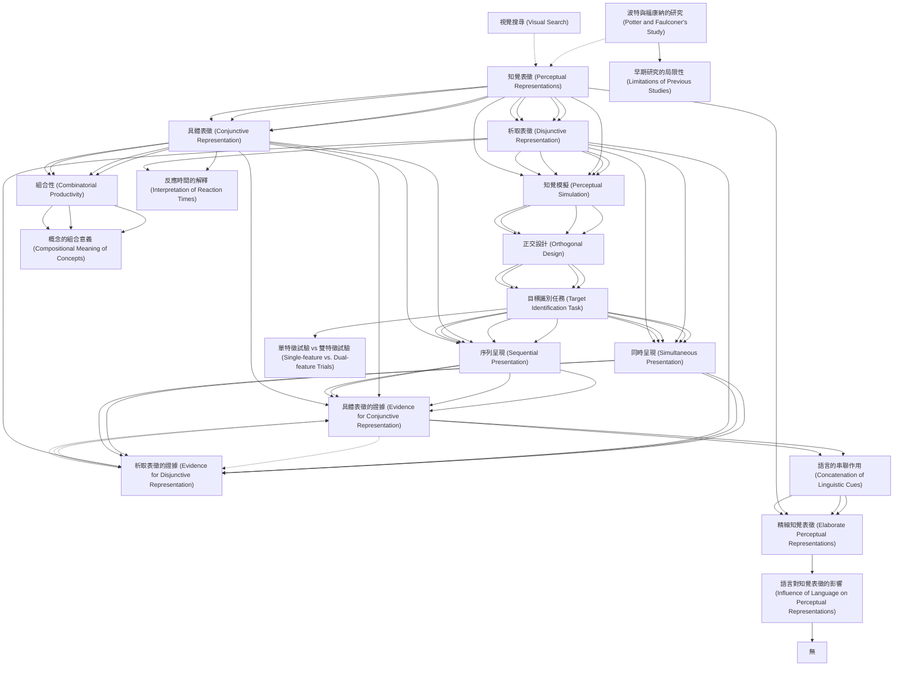

# Zettelkasten 卡片索引

**來源論文**: Bocanegra2022_Visual_World
**作者**: 
**年份**: 2025
**生成日期**: 2025-10-29 16:15
**卡片總數**: 33

---

## 📚 卡片清單

### 1. [知覺表徵 (Perceptual Representations)](zettel_cards/CogSci-20251029-001.md)
- **ID**: `CogSci-20251029-001`
- **類型**: 
- **核心**: “all (human) concepts are copies or combinations of copies of perceptual representations”
- **標籤**: `知覺`, `表徵`, `概念`, `模擬`

### 2. [具體表徵 (Conjunctive Representation)](zettel_cards/CogSci-20251029-002.md)
- **ID**: `CogSci-20251029-002`
- **類型**: 
- **核心**: "We define a conjunctive representation as the selective representation of an intersection of two sets of features"
- **標籤**: `具體`, `交集`, `特徵`, `表徵`

### 3. [析取表徵 (Disjunctive Representation)](zettel_cards/CogSci-20251029-003.md)
- **ID**: `CogSci-20251029-003`
- **類型**: 
- **核心**: "a disjunctive representation as a general representation of the union of two sets of features."
- **標籤**: `析取`, `聯集`, `特徵`, `表徵`

### 4. [組合性 (Combinatorial Productivity)](zettel_cards/CogSci-20251029-004.md)
- **ID**: `CogSci-20251029-004`
- **類型**: 
- **核心**: "being able to generate a conjunctive representation is necessary for meanings of concepts to have combinatorial productivity"
- **標籤**: `組合性`, `具體表徵`, `語言`, `認知`

### 5. [知覺模擬 (Perceptual Simulation)](zettel_cards/CogSci-20251029-005.md)
- **ID**: `CogSci-20251029-005`
- **類型**: 
- **核心**: "In order to ensure that the simulation of perceptual representations is productive... models assume that people are able to simulate specific conjunctions of perceptual features during comprehension"
- **標籤**: `知覺`, `模擬`, `理解`, `具體表徵`

### 6. [正交設計 (Orthogonal Design)](zettel_cards/CogSci-20251029-006.md)
- **ID**: `CogSci-20251029-006`
- **類型**: 
- **核心**: "Using randomized orthogonal designs, we observe evidence for disjunctive perceptual representations when participants represent feature combinations simultaneously... and we observe evidence for conjunctive perceptual representations when participants represent feature combinations sequentially"
- **標籤**: `實驗設計`, `正交`, `特徵`, `同時`, `序列`

### 7. [目標識別任務 (Target Identification Task)](zettel_cards/CogSci-20251029-007.md)
- **ID**: `CogSci-20251029-007`
- **類型**: 
- **核心**: "participants were presented a verbal cue and instructed to visualize the object described by the cue in terms of its color and shape... Subsequently, they were presented with a visual target, and they had to indicate as fast as possible whether the target matched or mismatched their visualization."
- **標籤**: `實驗任務`, `目標`, `識別`, `視覺`

### 8. [同時呈現 (Simultaneous Presentation)](zettel_cards/CogSci-20251029-008.md)
- **ID**: `CogSci-20251029-008`
- **類型**: 
- **核心**: "we observe evidence for disjunctive perceptual representations when participants represent feature combinations simultaneously"
- **標籤**: `同時`, `呈現`, `析取表徵`, `實驗條件`

### 9. [序列呈現 (Sequential Presentation)](zettel_cards/CogSci-20251029-009.md)
- **ID**: `CogSci-20251029-009`
- **類型**: 
- **核心**: "we observe evidence for conjunctive perceptual representations when participants represent feature combinations sequentially"
- **標籤**: `序列`, `呈現`, `具體表徵`, `實驗條件`

### 10. [析取表徵的證據 (Evidence for Disjunctive Representation)](zettel_cards/CogSci-20251029-010.md)
- **ID**: `CogSci-20251029-010`
- **類型**: 
- **核心**: "we observe evidence for disjunctive perceptual representations when participants represent feature combinations simultaneously"
- **標籤**: `析取表徵`, `同時呈現`, `實驗結果`

### 11. [具體表徵的證據 (Evidence for Conjunctive Representation)](zettel_cards/CogSci-20251029-011.md)
- **ID**: `CogSci-20251029-011`
- **類型**: 
- **核心**: "we observe evidence for conjunctive perceptual representations when participants represent feature combinations sequentially"
- **標籤**: `具體表徵`, `序列呈現`, `實驗結果`

### 12. [語言的串聯作用 (Concatenation of Linguistic Cues)](zettel_cards/CogSci-20251029-012.md)
- **ID**: `CogSci-20251029-012`
- **類型**: 
- **核心**: "Our findings show that the generation of conjunctive representations during comprehension depends on the concatenation of linguistic cues"
- **標籤**: `語言`, `串聯`, `具體表徵`, `理解`

### 13. [精細知覺表徵 (Elaborate Perceptual Representations)](zettel_cards/CogSci-20251029-013.md)
- **ID**: `CogSci-20251029-013`
- **類型**: 
- **核心**: "the construction of elaborate perceptual representations may critically depend on language"
- **標籤**: `精細`, `知覺表徵`, `語言`

### 14. [波特與福康納的研究 (Potter and Faulconer's Study)](zettel_cards/CogSci-20251029-014.md)
- **ID**: `CogSci-20251029-014`
- **類型**: 
- **核心**: "Potter and Faulconer [(1979)...] investigated the perceptual representation of adjective-noun combinations."
- **標籤**: `波特`, `福康納`, `知覺表徵`, `形容詞-名詞`

### 15. [早期研究的局限性 (Limitations of Previous Studies)](zettel_cards/CogSci-20251029-015.md)
- **ID**: `CogSci-20251029-015`
- **類型**: 
- **核心**: "However, their non-orthogonal design did not allow the differentiation between conjunctive vs. disjunctive representations."
- **標籤**: `正交設計`, `具體表徵`, `析取表徵`, `局限性`

### 16. [視覺搜尋 (Visual Search)](zettel_cards/CogSci-20251029-016.md)
- **ID**: `CogSci-20251029-016`
- **類型**: 
- **核心**: Kahneman, Treisman, & Gibbs, 1992; Gordon & Irwin, 1996; Saiki, 2003; Hommel, 2005; Bocanegra & Hommel, 2014
- **標籤**: `視覺搜尋`, `注意力`, `知覺`

### 17. [單特徵試驗 vs 雙特徵試驗 (Single-feature vs. Dual-feature Trials)](zettel_cards/CogSci-20251029-017.md)
- **ID**: `CogSci-20251029-017`
- **類型**: 
- **核心**: "Our critical comparison is between single-feature trials where participants were asked to visualize a one visual feature... and dual-feature trials where participants were asked to visualize two visual features simultaneously"
- **標籤**: `實驗設計`, `單特徵`, `雙特徵`, `比較`

### 18. [反應時間的解釋 (Interpretation of Reaction Times)](zettel_cards/CogSci-20251029-018.md)
- **ID**: `CogSci-20251029-018`
- **類型**: 
- **核心**: "If participants take less time to identify the target when they visualized two features vs. one feature we take this as evidence for the representation of a feature conjunction... On the other hand, if perceptual identification times are similar in dual-feature and single-feature trials we interpret this as evidence for the representation of a feature disjunction"
- **標籤**: `反應時間`, `具體表徵`, `析取表徵`, `解釋`

### 19. [概念的組合意義 (Compositional Meaning of Concepts)](zettel_cards/CogSci-20251029-019.md)
- **ID**: `CogSci-20251029-019`
- **類型**: 
- **核心**: "According to standard arguments, being able to generate a conjunctive representation is necessary for meanings of concepts to have combinatorial productivity"
- **標籤**: `具體表徵`, `組合性`, `概念意義`

### 20. [語言對知覺表徵的影響 (Influence of Language on Perceptual Representations)](zettel_cards/CogSci-20251029-020.md)
- **ID**: `CogSci-20251029-020`
- **類型**: 
- **核心**: "...thus suggest the construction of elaborate perceptual representations may critically depend on language."
- **標籤**: `語言`, `知覺表徵`, `精細表徵`, `影響`

### 21. [知覺表徵 (Perceptual Representations)](zettel_cards/CogSci-20251029-001.md)
- **ID**: `CogSci-20251029-001`
- **類型**: 
- **核心**: “all (human) concepts are copies or combinations of copies of perceptual representations”
- **標籤**: `知覺`, `表徵`, `概念`, `模擬`

### 22. [具體表徵 (Conjunctive Representation)](zettel_cards/CogSci-20251029-002.md)
- **ID**: `CogSci-20251029-002`
- **類型**: 
- **核心**: "We define a conjunctive representation as the selective representation of an intersection of two sets of features"
- **標籤**: `具體`, `交集`, `特徵`, `表徵`

### 23. [析取表徵 (Disjunctive Representation)](zettel_cards/CogSci-20251029-003.md)
- **ID**: `CogSci-20251029-003`
- **類型**: 
- **核心**: "a disjunctive representation as a general representation of the union of two sets of features."
- **標籤**: `析取`, `聯集`, `特徵`, `表徵`

### 24. [組合性 (Combinatorial Productivity)](zettel_cards/CogSci-20251029-004.md)
- **ID**: `CogSci-20251029-004`
- **類型**: 
- **核心**: "being able to generate a conjunctive representation is necessary for meanings of concepts to have combinatorial productivity"
- **標籤**: `組合性`, `具體表徵`, `語言`, `認知`

### 25. [知覺模擬 (Perceptual Simulation)](zettel_cards/CogSci-20251029-005.md)
- **ID**: `CogSci-20251029-005`
- **類型**: 
- **核心**: "In order to ensure that the simulation of perceptual representations is productive... models assume that people are able to simulate specific conjunctions of perceptual features during comprehension"
- **標籤**: `知覺`, `模擬`, `理解`, `具體表徵`

### 26. [正交設計 (Orthogonal Design)](zettel_cards/CogSci-20251029-006.md)
- **ID**: `CogSci-20251029-006`
- **類型**: 
- **核心**: "Using randomized orthogonal designs, we observe evidence for disjunctive perceptual representations when participants represent feature combinations simultaneously... and we observe evidence for conjunctive perceptual representations when participants represent feature combinations sequentially"
- **標籤**: `實驗設計`, `正交`, `特徵`, `同時`, `序列`

### 27. [目標識別任務 (Target Identification Task)](zettel_cards/CogSci-20251029-007.md)
- **ID**: `CogSci-20251029-007`
- **類型**: 
- **核心**: "participants were presented a verbal cue and instructed to visualize the object described by the cue in terms of its color and shape... Subsequently, they were presented with a visual target, and they had to indicate as fast as possible whether the target matched or mismatched their visualization."
- **標籤**: `實驗任務`, `目標`, `識別`, `視覺`

### 28. [同時呈現 (Simultaneous Presentation)](zettel_cards/CogSci-20251029-008.md)
- **ID**: `CogSci-20251029-008`
- **類型**: 
- **核心**: "we observe evidence for disjunctive perceptual representations when participants represent feature combinations simultaneously"
- **標籤**: `同時`, `呈現`, `析取表徵`, `實驗條件`

### 29. [序列呈現 (Sequential Presentation)](zettel_cards/CogSci-20251029-009.md)
- **ID**: `CogSci-20251029-009`
- **類型**: 
- **核心**: "we observe evidence for conjunctive perceptual representations when participants represent feature combinations sequentially"
- **標籤**: `序列`, `呈現`, `具體表徵`, `實驗條件`

### 30. [析取表徵的證據 (Evidence for Disjunctive Representation)](zettel_cards/CogSci-20251029-010.md)
- **ID**: `CogSci-20251029-010`
- **類型**: 
- **核心**: "we observe evidence for disjunctive perceptual representations when participants represent feature combinations simultaneously"
- **標籤**: `析取表徵`, `同時呈現`, `實驗結果`

### 31. [具體表徵的證據 (Evidence for Conjunctive Representation)](zettel_cards/CogSci-20251029-011.md)
- **ID**: `CogSci-20251029-011`
- **類型**: 
- **核心**: "we observe evidence for conjunctive perceptual representations when participants represent feature combinations sequentially"
- **標籤**: `具體表徵`, `序列呈現`, `實驗結果`

### 32. [語言的串聯作用 (Concatenation of Linguistic Cues)](zettel_cards/CogSci-20251029-012.md)
- **ID**: `CogSci-20251029-012`
- **類型**: 
- **核心**: "Our findings show that the generation of conjunctive representations during comprehension depends on the concatenation of linguistic cues"
- **標籤**: `語言`, `串聯`, `具體表徵`, `理解`

### 33. [精細知覺表徵 (Elaborate Perceptual Representations)](zettel_cards/CogSci-20251029-013.md)
- **ID**: `CogSci-20251029-013`
- **類型**: 
- **核心**: "the construction of elaborate perceptual representations may critically depend on language"
- **標籤**: `精細`, `知覺表徵`, `語言`

---

## 🗺️ 概念網絡圖

---

## 🏷️ 標籤索引

### 知覺
- [[CogSci-20251029-001]] 知覺表徵 (Perceptual Representations)
- [[CogSci-20251029-005]] 知覺模擬 (Perceptual Simulation)
- [[CogSci-20251029-016]] 視覺搜尋 (Visual Search)
- [[CogSci-20251029-001]] 知覺表徵 (Perceptual Representations)
- [[CogSci-20251029-005]] 知覺模擬 (Perceptual Simulation)

### 表徵
- [[CogSci-20251029-001]] 知覺表徵 (Perceptual Representations)
- [[CogSci-20251029-002]] 具體表徵 (Conjunctive Representation)
- [[CogSci-20251029-003]] 析取表徵 (Disjunctive Representation)
- [[CogSci-20251029-001]] 知覺表徵 (Perceptual Representations)
- [[CogSci-20251029-002]] 具體表徵 (Conjunctive Representation)
- [[CogSci-20251029-003]] 析取表徵 (Disjunctive Representation)

### 概念
- [[CogSci-20251029-001]] 知覺表徵 (Perceptual Representations)
- [[CogSci-20251029-001]] 知覺表徵 (Perceptual Representations)

### 模擬
- [[CogSci-20251029-001]] 知覺表徵 (Perceptual Representations)
- [[CogSci-20251029-005]] 知覺模擬 (Perceptual Simulation)
- [[CogSci-20251029-001]] 知覺表徵 (Perceptual Representations)
- [[CogSci-20251029-005]] 知覺模擬 (Perceptual Simulation)

### 具體
- [[CogSci-20251029-002]] 具體表徵 (Conjunctive Representation)
- [[CogSci-20251029-002]] 具體表徵 (Conjunctive Representation)

### 交集
- [[CogSci-20251029-002]] 具體表徵 (Conjunctive Representation)
- [[CogSci-20251029-002]] 具體表徵 (Conjunctive Representation)

### 特徵
- [[CogSci-20251029-002]] 具體表徵 (Conjunctive Representation)
- [[CogSci-20251029-003]] 析取表徵 (Disjunctive Representation)
- [[CogSci-20251029-006]] 正交設計 (Orthogonal Design)
- [[CogSci-20251029-002]] 具體表徵 (Conjunctive Representation)
- [[CogSci-20251029-003]] 析取表徵 (Disjunctive Representation)
- [[CogSci-20251029-006]] 正交設計 (Orthogonal Design)

### 析取
- [[CogSci-20251029-003]] 析取表徵 (Disjunctive Representation)
- [[CogSci-20251029-003]] 析取表徵 (Disjunctive Representation)

### 聯集
- [[CogSci-20251029-003]] 析取表徵 (Disjunctive Representation)
- [[CogSci-20251029-003]] 析取表徵 (Disjunctive Representation)

### 組合性
- [[CogSci-20251029-004]] 組合性 (Combinatorial Productivity)
- [[CogSci-20251029-019]] 概念的組合意義 (Compositional Meaning of Concepts)
- [[CogSci-20251029-004]] 組合性 (Combinatorial Productivity)

### 具體表徵
- [[CogSci-20251029-004]] 組合性 (Combinatorial Productivity)
- [[CogSci-20251029-005]] 知覺模擬 (Perceptual Simulation)
- [[CogSci-20251029-009]] 序列呈現 (Sequential Presentation)
- [[CogSci-20251029-011]] 具體表徵的證據 (Evidence for Conjunctive Representation)
- [[CogSci-20251029-012]] 語言的串聯作用 (Concatenation of Linguistic Cues)
- [[CogSci-20251029-015]] 早期研究的局限性 (Limitations of Previous Studies)
- [[CogSci-20251029-018]] 反應時間的解釋 (Interpretation of Reaction Times)
- [[CogSci-20251029-019]] 概念的組合意義 (Compositional Meaning of Concepts)
- [[CogSci-20251029-004]] 組合性 (Combinatorial Productivity)
- [[CogSci-20251029-005]] 知覺模擬 (Perceptual Simulation)
- [[CogSci-20251029-009]] 序列呈現 (Sequential Presentation)
- [[CogSci-20251029-011]] 具體表徵的證據 (Evidence for Conjunctive Representation)
- [[CogSci-20251029-012]] 語言的串聯作用 (Concatenation of Linguistic Cues)

### 語言
- [[CogSci-20251029-004]] 組合性 (Combinatorial Productivity)
- [[CogSci-20251029-012]] 語言的串聯作用 (Concatenation of Linguistic Cues)
- [[CogSci-20251029-013]] 精細知覺表徵 (Elaborate Perceptual Representations)
- [[CogSci-20251029-020]] 語言對知覺表徵的影響 (Influence of Language on Perceptual Representations)
- [[CogSci-20251029-004]] 組合性 (Combinatorial Productivity)
- [[CogSci-20251029-012]] 語言的串聯作用 (Concatenation of Linguistic Cues)
- [[CogSci-20251029-013]] 精細知覺表徵 (Elaborate Perceptual Representations)

### 認知
- [[CogSci-20251029-004]] 組合性 (Combinatorial Productivity)
- [[CogSci-20251029-004]] 組合性 (Combinatorial Productivity)

### 理解
- [[CogSci-20251029-005]] 知覺模擬 (Perceptual Simulation)
- [[CogSci-20251029-012]] 語言的串聯作用 (Concatenation of Linguistic Cues)
- [[CogSci-20251029-005]] 知覺模擬 (Perceptual Simulation)
- [[CogSci-20251029-012]] 語言的串聯作用 (Concatenation of Linguistic Cues)

### 實驗設計
- [[CogSci-20251029-006]] 正交設計 (Orthogonal Design)
- [[CogSci-20251029-017]] 單特徵試驗 vs 雙特徵試驗 (Single-feature vs. Dual-feature Trials)
- [[CogSci-20251029-006]] 正交設計 (Orthogonal Design)

### 正交
- [[CogSci-20251029-006]] 正交設計 (Orthogonal Design)
- [[CogSci-20251029-006]] 正交設計 (Orthogonal Design)

### 同時
- [[CogSci-20251029-006]] 正交設計 (Orthogonal Design)
- [[CogSci-20251029-008]] 同時呈現 (Simultaneous Presentation)
- [[CogSci-20251029-006]] 正交設計 (Orthogonal Design)
- [[CogSci-20251029-008]] 同時呈現 (Simultaneous Presentation)

### 序列
- [[CogSci-20251029-006]] 正交設計 (Orthogonal Design)
- [[CogSci-20251029-009]] 序列呈現 (Sequential Presentation)
- [[CogSci-20251029-006]] 正交設計 (Orthogonal Design)
- [[CogSci-20251029-009]] 序列呈現 (Sequential Presentation)

### 實驗任務
- [[CogSci-20251029-007]] 目標識別任務 (Target Identification Task)
- [[CogSci-20251029-007]] 目標識別任務 (Target Identification Task)

### 目標
- [[CogSci-20251029-007]] 目標識別任務 (Target Identification Task)
- [[CogSci-20251029-007]] 目標識別任務 (Target Identification Task)

### 識別
- [[CogSci-20251029-007]] 目標識別任務 (Target Identification Task)
- [[CogSci-20251029-007]] 目標識別任務 (Target Identification Task)

### 視覺
- [[CogSci-20251029-007]] 目標識別任務 (Target Identification Task)
- [[CogSci-20251029-007]] 目標識別任務 (Target Identification Task)

### 呈現
- [[CogSci-20251029-008]] 同時呈現 (Simultaneous Presentation)
- [[CogSci-20251029-009]] 序列呈現 (Sequential Presentation)
- [[CogSci-20251029-008]] 同時呈現 (Simultaneous Presentation)
- [[CogSci-20251029-009]] 序列呈現 (Sequential Presentation)

### 析取表徵
- [[CogSci-20251029-008]] 同時呈現 (Simultaneous Presentation)
- [[CogSci-20251029-010]] 析取表徵的證據 (Evidence for Disjunctive Representation)
- [[CogSci-20251029-015]] 早期研究的局限性 (Limitations of Previous Studies)
- [[CogSci-20251029-018]] 反應時間的解釋 (Interpretation of Reaction Times)
- [[CogSci-20251029-008]] 同時呈現 (Simultaneous Presentation)
- [[CogSci-20251029-010]] 析取表徵的證據 (Evidence for Disjunctive Representation)

### 實驗條件
- [[CogSci-20251029-008]] 同時呈現 (Simultaneous Presentation)
- [[CogSci-20251029-009]] 序列呈現 (Sequential Presentation)
- [[CogSci-20251029-008]] 同時呈現 (Simultaneous Presentation)
- [[CogSci-20251029-009]] 序列呈現 (Sequential Presentation)

### 同時呈現
- [[CogSci-20251029-010]] 析取表徵的證據 (Evidence for Disjunctive Representation)
- [[CogSci-20251029-010]] 析取表徵的證據 (Evidence for Disjunctive Representation)

### 實驗結果
- [[CogSci-20251029-010]] 析取表徵的證據 (Evidence for Disjunctive Representation)
- [[CogSci-20251029-011]] 具體表徵的證據 (Evidence for Conjunctive Representation)
- [[CogSci-20251029-010]] 析取表徵的證據 (Evidence for Disjunctive Representation)
- [[CogSci-20251029-011]] 具體表徵的證據 (Evidence for Conjunctive Representation)

### 序列呈現
- [[CogSci-20251029-011]] 具體表徵的證據 (Evidence for Conjunctive Representation)
- [[CogSci-20251029-011]] 具體表徵的證據 (Evidence for Conjunctive Representation)

### 串聯
- [[CogSci-20251029-012]] 語言的串聯作用 (Concatenation of Linguistic Cues)
- [[CogSci-20251029-012]] 語言的串聯作用 (Concatenation of Linguistic Cues)

### 精細
- [[CogSci-20251029-013]] 精細知覺表徵 (Elaborate Perceptual Representations)
- [[CogSci-20251029-013]] 精細知覺表徵 (Elaborate Perceptual Representations)

### 知覺表徵
- [[CogSci-20251029-013]] 精細知覺表徵 (Elaborate Perceptual Representations)
- [[CogSci-20251029-014]] 波特與福康納的研究 (Potter and Faulconer's Study)
- [[CogSci-20251029-020]] 語言對知覺表徵的影響 (Influence of Language on Perceptual Representations)
- [[CogSci-20251029-013]] 精細知覺表徵 (Elaborate Perceptual Representations)

### 波特
- [[CogSci-20251029-014]] 波特與福康納的研究 (Potter and Faulconer's Study)

### 福康納
- [[CogSci-20251029-014]] 波特與福康納的研究 (Potter and Faulconer's Study)

### 形容詞-名詞
- [[CogSci-20251029-014]] 波特與福康納的研究 (Potter and Faulconer's Study)

### 正交設計
- [[CogSci-20251029-015]] 早期研究的局限性 (Limitations of Previous Studies)

### 局限性
- [[CogSci-20251029-015]] 早期研究的局限性 (Limitations of Previous Studies)

### 視覺搜尋
- [[CogSci-20251029-016]] 視覺搜尋 (Visual Search)

### 注意力
- [[CogSci-20251029-016]] 視覺搜尋 (Visual Search)

### 單特徵
- [[CogSci-20251029-017]] 單特徵試驗 vs 雙特徵試驗 (Single-feature vs. Dual-feature Trials)

### 雙特徵
- [[CogSci-20251029-017]] 單特徵試驗 vs 雙特徵試驗 (Single-feature vs. Dual-feature Trials)

### 比較
- [[CogSci-20251029-017]] 單特徵試驗 vs 雙特徵試驗 (Single-feature vs. Dual-feature Trials)

### 反應時間
- [[CogSci-20251029-018]] 反應時間的解釋 (Interpretation of Reaction Times)

### 解釋
- [[CogSci-20251029-018]] 反應時間的解釋 (Interpretation of Reaction Times)

### 概念意義
- [[CogSci-20251029-019]] 概念的組合意義 (Compositional Meaning of Concepts)

### 精細表徵
- [[CogSci-20251029-020]] 語言對知覺表徵的影響 (Influence of Language on Perceptual Representations)

### 影響
- [[CogSci-20251029-020]] 語言對知覺表徵的影響 (Influence of Language on Perceptual Representations)

---

## 📖 閱讀建議順序

1. [[CogSci-20251029-010]] 析取表徵的證據 (Evidence for Disjunctive Representation)

2. [[CogSci-20251029-015]] 早期研究的局限性 (Limitations of Previous Studies)

3. [[CogSci-20251029-016]] 視覺搜尋 (Visual Search)

4. [[CogSci-20251029-017]] 單特徵試驗 vs 雙特徵試驗 (Single-feature vs. Dual-feature Trials)

5. [[CogSci-20251029-018]] 反應時間的解釋 (Interpretation of Reaction Times)

6. [[CogSci-20251029-019]] 概念的組合意義 (Compositional Meaning of Concepts)

7. [[CogSci-20251029-020]] 語言對知覺表徵的影響 (Influence of Language on Perceptual Representations)

8. [[CogSci-20251029-010]] 析取表徵的證據 (Evidence for Disjunctive Representation)

9. [[CogSci-20251029-004]] 組合性 (Combinatorial Productivity)

10. [[CogSci-20251029-012]] 語言的串聯作用 (Concatenation of Linguistic Cues)

11. [[CogSci-20251029-013]] 精細知覺表徵 (Elaborate Perceptual Representations)

12. [[CogSci-20251029-014]] 波特與福康納的研究 (Potter and Faulconer's Study)

13. [[CogSci-20251029-004]] 組合性 (Combinatorial Productivity)

14. [[CogSci-20251029-012]] 語言的串聯作用 (Concatenation of Linguistic Cues)

15. [[CogSci-20251029-013]] 精細知覺表徵 (Elaborate Perceptual Representations)

16. [[CogSci-20251029-005]] 知覺模擬 (Perceptual Simulation)

17. [[CogSci-20251029-006]] 正交設計 (Orthogonal Design)

18. [[CogSci-20251029-008]] 同時呈現 (Simultaneous Presentation)

19. [[CogSci-20251029-009]] 序列呈現 (Sequential Presentation)

20. [[CogSci-20251029-011]] 具體表徵的證據 (Evidence for Conjunctive Representation)

21. [[CogSci-20251029-005]] 知覺模擬 (Perceptual Simulation)

22. [[CogSci-20251029-006]] 正交設計 (Orthogonal Design)

23. [[CogSci-20251029-008]] 同時呈現 (Simultaneous Presentation)

24. [[CogSci-20251029-009]] 序列呈現 (Sequential Presentation)

25. [[CogSci-20251029-011]] 具體表徵的證據 (Evidence for Conjunctive Representation)

26. [[CogSci-20251029-007]] 目標識別任務 (Target Identification Task)

27. [[CogSci-20251029-007]] 目標識別任務 (Target Identification Task)

28. [[CogSci-20251029-001]] 知覺表徵 (Perceptual Representations)

29. [[CogSci-20251029-002]] 具體表徵 (Conjunctive Representation)

30. [[CogSci-20251029-003]] 析取表徵 (Disjunctive Representation)

31. [[CogSci-20251029-001]] 知覺表徵 (Perceptual Representations)

32. [[CogSci-20251029-002]] 具體表徵 (Conjunctive Representation)

33. [[CogSci-20251029-003]] 析取表徵 (Disjunctive Representation)

---

*本索引由 Knowledge Production System 自動生成*