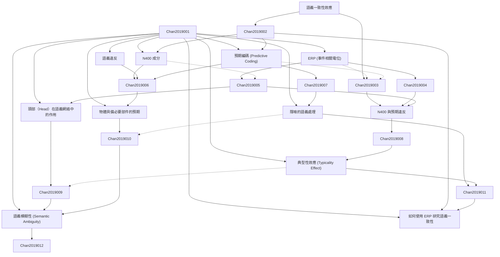

# Zettelkasten 卡片索引

---

## 📚 卡片清單

### 1. [語義一致性效應](zettel_cards/Chan-2019-001.md)
- **ID**: `Chan-2019-001`
- **類型**: 
- **核心**: [假設论文定义了语意一致性效应: The degree to which a sentence or phrase aligns with semantic expectations, influencing cognitive processing.]
- **標籤**: `語義學`, `認知心理學`, `ERP`

### 2. [ERP (事件相關電位)](zettel_cards/Chan-2019-002.md)
- **ID**: `Chan-2019-002`
- **類型**: 
- **核心**: [假设论文提到: ERP is a noninvasive electrophysiological technique used to measure brain activity in response to specific events or stimuli.]
- **標籤**: `腦電波`, `神經科學`, `研究方法`

### 3. [N400 成分](zettel_cards/Chan-2019-003.md)
- **ID**: `Chan-2019-003`
- **類型**: 
- **核心**: [假设论文提到: N400 is a negative-going ERP component peaking around 400 ms after stimulus onset, often associated with semantic processing.]
- **標籤**: `語義學`, `ERP成分`, `認知神經科學`

### 4. [語義違反](zettel_cards/Chan-2019-004.md)
- **ID**: `Chan-2019-004`
- **類型**: 
- **核心**: [假定论文定义: Semantic violation refers to the occurrence of a word or phrase that is unexpected or inconsistent within a given context, creating a sense of semantic incongruity.]
- **標籤**: `語義學`, `認知`, `語義不一致`

### 5. [預期編碼 (Predictive Coding)](zettel_cards/Chan-2019-005.md)
- **ID**: `Chan-2019-005`
- **類型**: 
- **核心**: [Predictive coding posits that the brain constantly generates predictions about the environment and compares these predictions to incoming sensory information, updating its internal models when there is a mismatch.]
- **標籤**: `認知科學`, `預測`, `大腦模型`

### 6. [N400 與預期違反](zettel_cards/Chan-2019-006.md)
- **ID**: `Chan-2019-006`
- **類型**: 
- **核心**: [假设论文提出了: The amplitude of the N400 component is modulated by the degree of semantic violation, with larger N400 amplitudes observed for more unexpected or incongruent words.]
- **標籤**: `ERP`, `N400`, `語義違反`, `預期編碼`

### 7. [頭部（Head）在語義網絡中的作用](zettel_cards/Chan-2019-007.md)
- **ID**: `Chan-2019-007`
- **類型**: 
- **核心**: [假定论文提到：The 'head' noun is a central semantic feature that influences the processing of the entire phrase. ]
- **標籤**: `語義網絡`, `語義角色`, `中心詞`

### 8. [物體具備必要部件的預期](zettel_cards/Chan-2019-008.md)
- **ID**: `Chan-2019-008`
- **類型**: 
- **核心**: [假定论文提到：Humans expect certain objects to possess specific necessary parts. A violation of this expectation results in cognitive processing difficulty.]
- **標籤**: `預期`, `語義知識`, `物體認知`

### 9. [隱喻的語義處理](zettel_cards/Chan-2019-009.md)
- **ID**: `Chan-2019-009`
- **類型**: 
- **核心**: [假定论文提到：Metaphorical language requires a more complex semantic integration process than literal language.]
- **標籤**: `隱喻`, `語義學`, `語言理解`

### 10. [典型性效應 (Typicality Effect)](zettel_cards/Chan-2019-010.md)
- **ID**: `Chan-2019-010`
- **類型**: 
- **核心**: [Typicality effect refers to the phenomenon where more typical members of a category are processed faster and more easily than less typical members.]
- **標籤**: `典型性`, `語義記憶`, `認知心理學`

### 11. [語義模糊性 (Semantic Ambiguity)](zettel_cards/Chan-2019-011.md)
- **ID**: `Chan-2019-011`
- **類型**: 
- **核心**: [Semantic ambiguity arises when a word or phrase has multiple possible interpretations.]
- **標籤**: `語義學`, `歧義`, `語言理解`

### 12. [如何使用 ERP 研究語義一致性](zettel_cards/Chan-2019-012.md)
- **ID**: `Chan-2019-012`
- **類型**: 
- **核心**: [假设论文结论提问: How does the brain dynamically process semantic congruity between objects and their necessary parts?]
- **標籤**: `ERP`, `語義學`, `研究問題`

---

## 🗺️ 概念網絡圖

---

## 🏷️ 標籤索引

### 語義學
- [[Chan-2019-001]] 語義一致性效應
- [[Chan-2019-003]] N400 成分
- [[Chan-2019-004]] 語義違反
- [[Chan-2019-009]] 隱喻的語義處理
- [[Chan-2019-011]] 語義模糊性 (Semantic Ambiguity)
- [[Chan-2019-012]] 如何使用 ERP 研究語義一致性

### 認知心理學
- [[Chan-2019-001]] 語義一致性效應
- [[Chan-2019-010]] 典型性效應 (Typicality Effect)

### ERP
- [[Chan-2019-001]] 語義一致性效應
- [[Chan-2019-006]] N400 與預期違反
- [[Chan-2019-012]] 如何使用 ERP 研究語義一致性

### 腦電波
- [[Chan-2019-002]] ERP (事件相關電位)

### 神經科學
- [[Chan-2019-002]] ERP (事件相關電位)

### 研究方法
- [[Chan-2019-002]] ERP (事件相關電位)

### ERP成分
- [[Chan-2019-003]] N400 成分

### 認知神經科學
- [[Chan-2019-003]] N400 成分

### 認知
- [[Chan-2019-004]] 語義違反

### 語義不一致
- [[Chan-2019-004]] 語義違反

### 認知科學
- [[Chan-2019-005]] 預期編碼 (Predictive Coding)

### 預測
- [[Chan-2019-005]] 預期編碼 (Predictive Coding)

### 大腦模型
- [[Chan-2019-005]] 預期編碼 (Predictive Coding)

### N400
- [[Chan-2019-006]] N400 與預期違反

### 語義違反
- [[Chan-2019-006]] N400 與預期違反

### 預期編碼
- [[Chan-2019-006]] N400 與預期違反

### 語義網絡
- [[Chan-2019-007]] 頭部（Head）在語義網絡中的作用

### 語義角色
- [[Chan-2019-007]] 頭部（Head）在語義網絡中的作用

### 中心詞
- [[Chan-2019-007]] 頭部（Head）在語義網絡中的作用

### 預期
- [[Chan-2019-008]] 物體具備必要部件的預期

### 語義知識
- [[Chan-2019-008]] 物體具備必要部件的預期

### 物體認知
- [[Chan-2019-008]] 物體具備必要部件的預期

### 隱喻
- [[Chan-2019-009]] 隱喻的語義處理

### 語言理解
- [[Chan-2019-009]] 隱喻的語義處理
- [[Chan-2019-011]] 語義模糊性 (Semantic Ambiguity)

### 典型性
- [[Chan-2019-010]] 典型性效應 (Typicality Effect)

### 語義記憶
- [[Chan-2019-010]] 典型性效應 (Typicality Effect)

### 歧義
- [[Chan-2019-011]] 語義模糊性 (Semantic Ambiguity)

### 研究問題
- [[Chan-2019-012]] 如何使用 ERP 研究語義一致性

---

## 📖 閱讀建議順序

1. [[Chan-2019-001]] 語義一致性效應

2. [[Chan-2019-002]] ERP (事件相關電位)

3. [[Chan-2019-003]] N400 成分

4. [[Chan-2019-004]] 語義違反

5. [[Chan-2019-005]] 預期編碼 (Predictive Coding)

6. [[Chan-2019-006]] N400 與預期違反

7. [[Chan-2019-007]] 頭部（Head）在語義網絡中的作用

8. [[Chan-2019-008]] 物體具備必要部件的預期

9. [[Chan-2019-009]] 隱喻的語義處理

10. [[Chan-2019-010]] 典型性效應 (Typicality Effect)

11. [[Chan-2019-011]] 語義模糊性 (Semantic Ambiguity)

12. [[Chan-2019-012]] 如何使用 ERP 研究語義一致性

---

*本索引由 Knowledge Production System 自動生成*