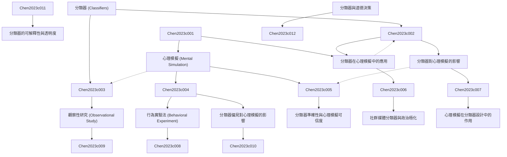

# Zettelkasten 卡片索引

---

## 📚 卡片清單

### 1. [分類器 (Classifiers)](zettel_cards/Chen-2023c-001.md)
- **ID**: `Chen-2023c-001`
- **類型**: 
- **核心**: "Classifiers are algorithms or models that assign input data points to predefined categories or classes."
- **標籤**: `分類器`, `機器學習`, `演算法`, `模式識別`

### 2. [心理模擬 (Mental Simulation)](zettel_cards/Chen-2023c-002.md)
- **ID**: `Chen-2023c-002`
- **類型**: 
- **核心**: "Mental simulation refers to the cognitive process of internally representing and manipulating possible scenarios or events."
- **標籤**: `認知心理學`, `決策`, `預測`, `模擬`

### 3. [分類器在心理模擬中的應用](zettel_cards/Chen-2023c-003.md)
- **ID**: `Chen-2023c-003`
- **類型**: 
- **核心**: "Classifiers can be used to model and predict the outcomes of mental simulations by learning patterns from observed data."
- **標籤**: `計算認知`, `機器學習`, `預測模型`, `行為建模`

### 4. [分類器對心理模擬的影響](zettel_cards/Chen-2023c-004.md)
- **ID**: `Chen-2023c-004`
- **類型**: 
- **核心**: "Exposure to classifiers and their predictions might influence the process and content of individuals' mental simulations."
- **標籤**: `認知偏差`, `啟發式`, `決策過程`, `心理表徵`

### 5. [行為實驗法 (Behavioral Experiment)](zettel_cards/Chen-2023c-005.md)
- **ID**: `Chen-2023c-005`
- **類型**: 
- **核心**: "Behavioral experiments are used to investigate the effects of classifiers on mental simulation by manipulating participants' exposure to classifier outputs."
- **標籤**: `實驗設計`, `因果推論`, `行為測量`, `操縱變項`

### 6. [觀察性研究 (Observational Study)](zettel_cards/Chen-2023c-006.md)
- **ID**: `Chen-2023c-006`
- **類型**: 
- **核心**: "Observational studies can be used to examine the correlations between classifier usage and mental simulation patterns in real-world settings."
- **標籤**: `相關研究`, `自然情境`, `長期追蹤`, `模式分析`

### 7. [分類器偏見對心理模擬的影響](zettel_cards/Chen-2023c-007.md)
- **ID**: `Chen-2023c-007`
- **類型**: 
- **核心**: "Biased classifiers can lead to biased mental simulations, reinforcing existing stereotypes and prejudices."
- **標籤**: `認知偏差`, `刻板印象`, `偏見`, `道德問題`

### 8. [分類器準確性與心理模擬可信度](zettel_cards/Chen-2023c-008.md)
- **ID**: `Chen-2023c-008`
- **類型**: 
- **核心**: "Higher classifier accuracy is associated with greater confidence in mental simulation outcomes."
- **標籤**: `準確性`, `置信度`, `信念`, `預測能力`

### 9. [社群媒體分類器與政治極化](zettel_cards/Chen-2023c-009.md)
- **ID**: `Chen-2023c-009`
- **類型**: 
- **核心**: "Exposure to classifiers that categorize political content can contribute to political polarization by reinforcing existing beliefs."
- **標籤**: `社群媒體`, `政治`, `極化`, `內容審查`

### 10. [心理模擬在分類器設計中的作用](zettel_cards/Chen-2023c-010.md)
- **ID**: `Chen-2023c-010`
- **類型**: 
- **核心**: "How can we leverage our understanding of mental simulation to design more user-friendly and effective classifiers?"
- **標籤**: `使用者體驗`, `人機互動`, `設計原則`, `認知模型`

### 11. [分類器與道德決策](zettel_cards/Chen-2023c-011.md)
- **ID**: `Chen-2023c-011`
- **類型**: 
- **核心**: "How do classifiers influence our moral decision-making processes, and what are the ethical implications of relying on classifier outputs in moral dilemmas?"
- **標籤**: `道德`, `倫理`, `決策`, `責任`

### 12. [分類器的可解釋性與透明度](zettel_cards/Chen-2023c-012.md)
- **ID**: `Chen-2023c-012`
- **類型**: 
- **核心**: "How can we improve the interpretability and transparency of classifiers to facilitate better understanding and trust in their predictions?"
- **標籤**: `可解釋性`, `透明度`, `信任`, `可靠性`

---

## 🗺️ 概念網絡圖

---

## 🏷️ 標籤索引

### 分類器
- [[Chen-2023c-001]] 分類器 (Classifiers)

### 機器學習
- [[Chen-2023c-001]] 分類器 (Classifiers)
- [[Chen-2023c-003]] 分類器在心理模擬中的應用

### 演算法
- [[Chen-2023c-001]] 分類器 (Classifiers)

### 模式識別
- [[Chen-2023c-001]] 分類器 (Classifiers)

### 認知心理學
- [[Chen-2023c-002]] 心理模擬 (Mental Simulation)

### 決策
- [[Chen-2023c-002]] 心理模擬 (Mental Simulation)
- [[Chen-2023c-011]] 分類器與道德決策

### 預測
- [[Chen-2023c-002]] 心理模擬 (Mental Simulation)

### 模擬
- [[Chen-2023c-002]] 心理模擬 (Mental Simulation)

### 計算認知
- [[Chen-2023c-003]] 分類器在心理模擬中的應用

### 預測模型
- [[Chen-2023c-003]] 分類器在心理模擬中的應用

### 行為建模
- [[Chen-2023c-003]] 分類器在心理模擬中的應用

### 認知偏差
- [[Chen-2023c-004]] 分類器對心理模擬的影響
- [[Chen-2023c-007]] 分類器偏見對心理模擬的影響

### 啟發式
- [[Chen-2023c-004]] 分類器對心理模擬的影響

### 決策過程
- [[Chen-2023c-004]] 分類器對心理模擬的影響

### 心理表徵
- [[Chen-2023c-004]] 分類器對心理模擬的影響

### 實驗設計
- [[Chen-2023c-005]] 行為實驗法 (Behavioral Experiment)

### 因果推論
- [[Chen-2023c-005]] 行為實驗法 (Behavioral Experiment)

### 行為測量
- [[Chen-2023c-005]] 行為實驗法 (Behavioral Experiment)

### 操縱變項
- [[Chen-2023c-005]] 行為實驗法 (Behavioral Experiment)

### 相關研究
- [[Chen-2023c-006]] 觀察性研究 (Observational Study)

### 自然情境
- [[Chen-2023c-006]] 觀察性研究 (Observational Study)

### 長期追蹤
- [[Chen-2023c-006]] 觀察性研究 (Observational Study)

### 模式分析
- [[Chen-2023c-006]] 觀察性研究 (Observational Study)

### 刻板印象
- [[Chen-2023c-007]] 分類器偏見對心理模擬的影響

### 偏見
- [[Chen-2023c-007]] 分類器偏見對心理模擬的影響

### 道德問題
- [[Chen-2023c-007]] 分類器偏見對心理模擬的影響

### 準確性
- [[Chen-2023c-008]] 分類器準確性與心理模擬可信度

### 置信度
- [[Chen-2023c-008]] 分類器準確性與心理模擬可信度

### 信念
- [[Chen-2023c-008]] 分類器準確性與心理模擬可信度

### 預測能力
- [[Chen-2023c-008]] 分類器準確性與心理模擬可信度

### 社群媒體
- [[Chen-2023c-009]] 社群媒體分類器與政治極化

### 政治
- [[Chen-2023c-009]] 社群媒體分類器與政治極化

### 極化
- [[Chen-2023c-009]] 社群媒體分類器與政治極化

### 內容審查
- [[Chen-2023c-009]] 社群媒體分類器與政治極化

### 使用者體驗
- [[Chen-2023c-010]] 心理模擬在分類器設計中的作用

### 人機互動
- [[Chen-2023c-010]] 心理模擬在分類器設計中的作用

### 設計原則
- [[Chen-2023c-010]] 心理模擬在分類器設計中的作用

### 認知模型
- [[Chen-2023c-010]] 心理模擬在分類器設計中的作用

### 道德
- [[Chen-2023c-011]] 分類器與道德決策

### 倫理
- [[Chen-2023c-011]] 分類器與道德決策

### 責任
- [[Chen-2023c-011]] 分類器與道德決策

### 可解釋性
- [[Chen-2023c-012]] 分類器的可解釋性與透明度

### 透明度
- [[Chen-2023c-012]] 分類器的可解釋性與透明度

### 信任
- [[Chen-2023c-012]] 分類器的可解釋性與透明度

### 可靠性
- [[Chen-2023c-012]] 分類器的可解釋性與透明度

---

## 📖 閱讀建議順序

1. [[Chen-2023c-001]] 分類器 (Classifiers)

2. [[Chen-2023c-002]] 心理模擬 (Mental Simulation)

3. [[Chen-2023c-003]] 分類器在心理模擬中的應用

4. [[Chen-2023c-004]] 分類器對心理模擬的影響

5. [[Chen-2023c-005]] 行為實驗法 (Behavioral Experiment)

6. [[Chen-2023c-006]] 觀察性研究 (Observational Study)

7. [[Chen-2023c-007]] 分類器偏見對心理模擬的影響

8. [[Chen-2023c-008]] 分類器準確性與心理模擬可信度

9. [[Chen-2023c-009]] 社群媒體分類器與政治極化

10. [[Chen-2023c-010]] 心理模擬在分類器設計中的作用

11. [[Chen-2023c-011]] 分類器與道德決策

12. [[Chen-2023c-012]] 分類器的可解釋性與透明度

---

*本索引由 Knowledge Production System 自動生成*