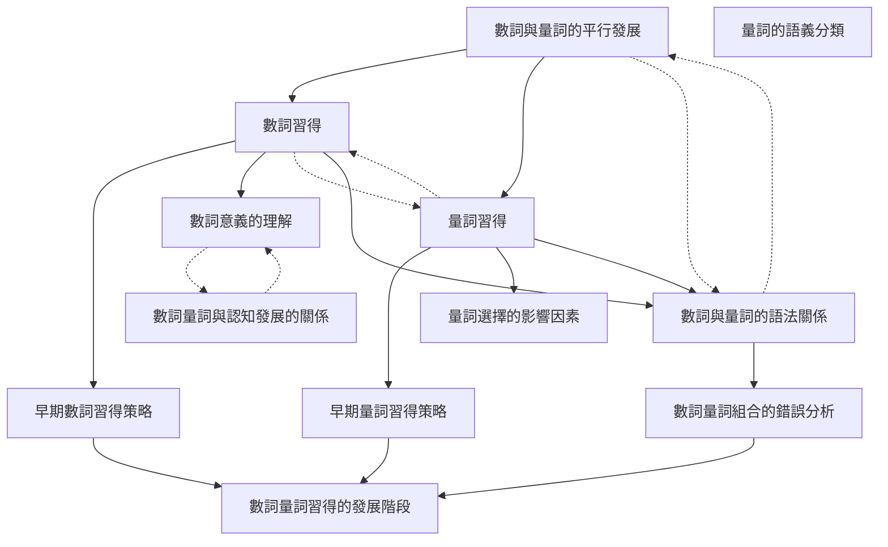

# Zettelkasten 卡片索引

---

## 📚 卡片清單

### 1. [數詞與量詞的平行發展](zettel_cards/Chen-2025-001.md)
- **ID**: `Chen-2025-001`
- **類型**: 
- **核心**: Parallel Development of Numerals and Numeral Classifiers
- **標籤**: `數詞`, `量詞`, `語言習得`, `平行發展`

### 2. [數詞習得](zettel_cards/Chen-2025-002.md)
- **ID**: `Chen-2025-002`
- **類型**: 
- **核心**: Acquisition of Numerals
- **標籤**: `數詞`, `語言習得`, `數量詞`

### 3. [量詞習得](zettel_cards/Chen-2025-003.md)
- **ID**: `Chen-2025-003`
- **類型**: 
- **核心**: Acquisition of Numeral Classifiers
- **標籤**: `量詞`, `語言習得`, `分類詞`

### 4. [數詞與量詞的語法關係](zettel_cards/Chen-2025-004.md)
- **ID**: `Chen-2025-004`
- **類型**: 
- **核心**: Grammatical Relationship between Numerals and Numeral Classifiers
- **標籤**: `數詞`, `量詞`, `語法`, `句法`

### 5. [早期數詞習得策略](zettel_cards/Chen-2025-005.md)
- **ID**: `Chen-2025-005`
- **類型**: 
- **核心**: Early Strategies in Numeral Acquisition
- **標籤**: `數詞`, `習得策略`, `簡化`, `泛化`

### 6. [數詞意義的理解](zettel_cards/Chen-2025-006.md)
- **ID**: `Chen-2025-006`
- **類型**: 
- **核心**: Understanding of Numeral Meaning
- **標籤**: `數詞`, `語義`, `認知`, `概念`

### 7. [早期量詞習得策略](zettel_cards/Chen-2025-007.md)
- **ID**: `Chen-2025-007`
- **類型**: 
- **核心**: Early Strategies in Numeral Classifier Acquisition
- **標籤**: `量詞`, `習得策略`, `簡化`, `泛化`

### 8. [量詞選擇的影響因素](zettel_cards/Chen-2025-008.md)
- **ID**: `Chen-2025-008`
- **類型**: 
- **核心**: Factors Influencing Numeral Classifier Selection
- **標籤**: `量詞`, `選擇`, `語義`, `語用`

### 9. [量詞的語義分類](zettel_cards/Chen-2025-009.md)
- **ID**: `Chen-2025-009`
- **類型**: 
- **核心**: Semantic Classification of Numeral Classifiers
- **標籤**: `量詞`, `語義`, `分類`, `類型`

### 10. [數詞量詞組合的錯誤分析](zettel_cards/Chen-2025-010.md)
- **ID**: `Chen-2025-010`
- **類型**: 
- **核心**: Error Analysis of Numeral-Classifier Combinations
- **標籤**: `數詞`, `量詞`, `錯誤分析`, `語言習得`

### 11. [數詞量詞習得的發展階段](zettel_cards/Chen-2025-011.md)
- **ID**: `Chen-2025-011`
- **類型**: 
- **核心**: Developmental Stages of Numeral-Classifier Acquisition
- **標籤**: `數詞`, `量詞`, `發展階段`, `語言習得`

### 12. [數詞量詞與認知發展的關係](zettel_cards/Chen-2025-012.md)
- **ID**: `Chen-2025-012`
- **類型**: 
- **核心**: Relationship between Numeral-Classifier Acquisition and Cognitive Development
- **標籤**: `數詞`, `量詞`, `認知`, `發展`

---

## 🗺️ 概念網絡圖

---

## 🏷️ 標籤索引

### 數詞
- [[Chen-2025-001]] 數詞與量詞的平行發展
- [[Chen-2025-002]] 數詞習得
- [[Chen-2025-004]] 數詞與量詞的語法關係
- [[Chen-2025-005]] 早期數詞習得策略
- [[Chen-2025-006]] 數詞意義的理解
- [[Chen-2025-010]] 數詞量詞組合的錯誤分析
- [[Chen-2025-011]] 數詞量詞習得的發展階段
- [[Chen-2025-012]] 數詞量詞與認知發展的關係

### 量詞
- [[Chen-2025-001]] 數詞與量詞的平行發展
- [[Chen-2025-003]] 量詞習得
- [[Chen-2025-004]] 數詞與量詞的語法關係
- [[Chen-2025-007]] 早期量詞習得策略
- [[Chen-2025-008]] 量詞選擇的影響因素
- [[Chen-2025-009]] 量詞的語義分類
- [[Chen-2025-010]] 數詞量詞組合的錯誤分析
- [[Chen-2025-011]] 數詞量詞習得的發展階段
- [[Chen-2025-012]] 數詞量詞與認知發展的關係

### 語言習得
- [[Chen-2025-001]] 數詞與量詞的平行發展
- [[Chen-2025-002]] 數詞習得
- [[Chen-2025-003]] 量詞習得
- [[Chen-2025-010]] 數詞量詞組合的錯誤分析
- [[Chen-2025-011]] 數詞量詞習得的發展階段

### 平行發展
- [[Chen-2025-001]] 數詞與量詞的平行發展

### 數量詞
- [[Chen-2025-002]] 數詞習得

### 分類詞
- [[Chen-2025-003]] 量詞習得

### 語法
- [[Chen-2025-004]] 數詞與量詞的語法關係

### 句法
- [[Chen-2025-004]] 數詞與量詞的語法關係

### 習得策略
- [[Chen-2025-005]] 早期數詞習得策略
- [[Chen-2025-007]] 早期量詞習得策略

### 簡化
- [[Chen-2025-005]] 早期數詞習得策略
- [[Chen-2025-007]] 早期量詞習得策略

### 泛化
- [[Chen-2025-005]] 早期數詞習得策略
- [[Chen-2025-007]] 早期量詞習得策略

### 語義
- [[Chen-2025-006]] 數詞意義的理解
- [[Chen-2025-008]] 量詞選擇的影響因素
- [[Chen-2025-009]] 量詞的語義分類

### 認知
- [[Chen-2025-006]] 數詞意義的理解
- [[Chen-2025-012]] 數詞量詞與認知發展的關係

### 概念
- [[Chen-2025-006]] 數詞意義的理解

### 選擇
- [[Chen-2025-008]] 量詞選擇的影響因素

### 語用
- [[Chen-2025-008]] 量詞選擇的影響因素

### 分類
- [[Chen-2025-009]] 量詞的語義分類

### 類型
- [[Chen-2025-009]] 量詞的語義分類

### 錯誤分析
- [[Chen-2025-010]] 數詞量詞組合的錯誤分析

### 發展階段
- [[Chen-2025-011]] 數詞量詞習得的發展階段

### 發展
- [[Chen-2025-012]] 數詞量詞與認知發展的關係

---

## 📖 閱讀建議順序

1. [[Chen-2025-001]] 數詞與量詞的平行發展

2. [[Chen-2025-002]] 數詞習得

3. [[Chen-2025-003]] 量詞習得

4. [[Chen-2025-004]] 數詞與量詞的語法關係

5. [[Chen-2025-005]] 早期數詞習得策略

6. [[Chen-2025-006]] 數詞意義的理解

7. [[Chen-2025-007]] 早期量詞習得策略

8. [[Chen-2025-008]] 量詞選擇的影響因素

9. [[Chen-2025-009]] 量詞的語義分類

10. [[Chen-2025-010]] 數詞量詞組合的錯誤分析

11. [[Chen-2025-011]] 數詞量詞習得的發展階段

12. [[Chen-2025-012]] 數詞量詞與認知發展的關係

---

*本索引由 Knowledge Production System 自動生成*