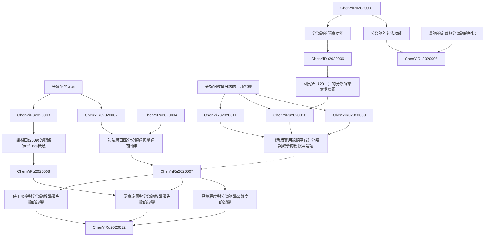

# Zettelkasten 卡片索引

---

## 📚 卡片清單

### 1. [分類詞的定義](zettel_cards/ChenYiRu-2020-001.md)
- **ID**: `ChenYiRu-2020-001`
- **類型**: 
- **核心**: 「分類詞的功能是彰顯名詞的本質特徵，其數學意義為被乘數，其值必然為數值1」
- **標籤**: `分類詞`, `量詞`, `漢語語言學`, `詞彙語義`

### 2. [分類詞的句法功能](zettel_cards/ChenYiRu-2020-002.md)
- **ID**: `ChenYiRu-2020-002`
- **類型**: 
- **核心**: 「在句法結構上，最根本的問題是：分類詞和量詞是否同屬一個詞類？」
- **標籤**: `句法`, `詞類`, `分類詞`, `量詞`

### 3. [分類詞的語意功能](zettel_cards/ChenYiRu-2020-003.md)
- **ID**: `ChenYiRu-2020-003`
- **類型**: 
- **核心**: 「在 [ 數詞 +K+ 名詞 ] 的詞組中，若 K 的語意特徵集合是該名詞語意特徵集合的子集合，則K為分類詞；否則K為量詞。」
- **標籤**: `語意`, `語意特徵`, `分類詞`, `量詞`

### 4. [量詞的定義與分類詞的對比](zettel_cards/ChenYiRu-2020-004.md)
- **ID**: `ChenYiRu-2020-004`
- **類型**: 
- **核心**: 「量詞之數學意義亦為被乘數，但可表數亦可表量，表數時其值為「1」之外的數值。」
- **標籤**: `量詞`, `分類詞`, `數值`, `語意`

### 5. [句法層面區分分類詞與量詞的困難](zettel_cards/ChenYiRu-2020-005.md)
- **ID**: `ChenYiRu-2020-005`
- **類型**: 
- **核心**: 「簡而言之，雖然分類詞和量詞的不同，已是語言學界的共識，但幾乎都只是在語意上的描述，少有精準的區分標準。」
- **標籤**: `分類詞`, `量詞`, `區分標準`, `句法`

### 6. [謝禎田(2009)的彰顯(profiling)概念](zettel_cards/ChenYiRu-2020-006.md)
- **ID**: `ChenYiRu-2020-006`
- **類型**: 
- **核心**: 「分類詞是預先強調，或突顯 (highlight) 名詞的某些內建的語意特徵。因此，有助聽者對於名詞語意的正確解讀」
- **標籤**: `彰顯`, `語意`, `解讀`, `分類詞`

### 7. [分類詞教學分級的三項指標](zettel_cards/ChenYiRu-2020-007.md)
- **ID**: `ChenYiRu-2020-007`
- **類型**: 
- **核心**: 「本文主張以三項指標為分級依據。一是具象程度，這與認知的難易度有關，具象的分類詞在教學上應先於抽象的分類詞；二是語意範圍，這指的是分類詞所涵蓋的語意廣度越大，實用性越高，應優先教學；三是使用頻率，頻率越高的實用性也越高，在教學上也應優先。」
- **標籤**: `教學分級`, `具象程度`, `語意範圍`, `使用頻率`, `對外漢語教學`

### 8. [賴宛君（2011）的分類詞語意階層圖](zettel_cards/ChenYiRu-2020-008.md)
- **ID**: `ChenYiRu-2020-008`
- **類型**: 
- **核心**: 「此語意階層的劃分，是採取由下而上的方式，找出各分類詞所屬的語意範圍，向上建立高階階層，較高層的分類詞，適用的語意範圍較廣，能搭配的名詞較多。」
- **標籤**: `語意階層`, `分類詞`, `語意範圍`, `賴宛君(2011)`

### 9. [具象程度對分類詞學習難度的影響](zettel_cards/ChenYiRu-2020-009.md)
- **ID**: `ChenYiRu-2020-009`
- **類型**: 
- **核心**: 「只與具體名詞搭配的分類詞，較容易理解，因此積分最高，歸類為3分。若只能與抽象名詞搭配，較難理解，因此積分最低，為1分。若兩者皆可為2分。」
- **標籤**: `具象程度`, `學習難度`, `分類詞`, `認知心理學`

### 10. [語意範圍對分類詞教學優先級的影響](zettel_cards/ChenYiRu-2020-010.md)
- **ID**: `ChenYiRu-2020-010`
- **類型**: 
- **核心**: 「能夠涵蓋的名詞範圍最廣，因此較有實用價值，也值得先納入教學；最下層的類別，涵蓋的名詞較獨特，也比較少，在教學上可以考慮較晚介紹。」
- **標籤**: `語意範圍`, `教學優先級`, `分類詞`, `實用性`

### 11. [使用頻率對分類詞教學優先級的影響](zettel_cards/ChenYiRu-2020-011.md)
- **ID**: `ChenYiRu-2020-011`
- **類型**: 
- **核心**: 「頻率越高的實用性也越高，在教學上也應優先。」
- **標籤**: `使用頻率`, `教學優先級`, `分類詞`, `語料庫語言學`

### 12. [《新版實用視聽華語》分類詞教學的檢視與建議](zettel_cards/ChenYiRu-2020-012.md)
- **ID**: `ChenYiRu-2020-012`
- **類型**: 
- **核心**: 「《視華》把這18個在具象程度、語意範圍、使用頻率三個項目上都應該屬於中級的分類詞，編入了初級，是依循什麼原則，教材並未說明。」
- **標籤**: `教材分析`, `分類詞教學`, `新版實用視聽華語`, `對外漢語教學`

---

## 🗺️ 概念網絡圖

---

## 🏷️ 標籤索引

### 分類詞
- [[ChenYiRu-2020-001]] 分類詞的定義
- [[ChenYiRu-2020-002]] 分類詞的句法功能
- [[ChenYiRu-2020-003]] 分類詞的語意功能
- [[ChenYiRu-2020-004]] 量詞的定義與分類詞的對比
- [[ChenYiRu-2020-005]] 句法層面區分分類詞與量詞的困難
- [[ChenYiRu-2020-006]] 謝禎田(2009)的彰顯(profiling)概念
- [[ChenYiRu-2020-008]] 賴宛君（2011）的分類詞語意階層圖
- [[ChenYiRu-2020-009]] 具象程度對分類詞學習難度的影響
- [[ChenYiRu-2020-010]] 語意範圍對分類詞教學優先級的影響
- [[ChenYiRu-2020-011]] 使用頻率對分類詞教學優先級的影響

### 量詞
- [[ChenYiRu-2020-001]] 分類詞的定義
- [[ChenYiRu-2020-002]] 分類詞的句法功能
- [[ChenYiRu-2020-003]] 分類詞的語意功能
- [[ChenYiRu-2020-004]] 量詞的定義與分類詞的對比
- [[ChenYiRu-2020-005]] 句法層面區分分類詞與量詞的困難

### 漢語語言學
- [[ChenYiRu-2020-001]] 分類詞的定義

### 詞彙語義
- [[ChenYiRu-2020-001]] 分類詞的定義

### 句法
- [[ChenYiRu-2020-002]] 分類詞的句法功能
- [[ChenYiRu-2020-005]] 句法層面區分分類詞與量詞的困難

### 詞類
- [[ChenYiRu-2020-002]] 分類詞的句法功能

### 語意
- [[ChenYiRu-2020-003]] 分類詞的語意功能
- [[ChenYiRu-2020-004]] 量詞的定義與分類詞的對比
- [[ChenYiRu-2020-006]] 謝禎田(2009)的彰顯(profiling)概念

### 語意特徵
- [[ChenYiRu-2020-003]] 分類詞的語意功能

### 數值
- [[ChenYiRu-2020-004]] 量詞的定義與分類詞的對比

### 區分標準
- [[ChenYiRu-2020-005]] 句法層面區分分類詞與量詞的困難

### 彰顯
- [[ChenYiRu-2020-006]] 謝禎田(2009)的彰顯(profiling)概念

### 解讀
- [[ChenYiRu-2020-006]] 謝禎田(2009)的彰顯(profiling)概念

### 教學分級
- [[ChenYiRu-2020-007]] 分類詞教學分級的三項指標

### 具象程度
- [[ChenYiRu-2020-007]] 分類詞教學分級的三項指標
- [[ChenYiRu-2020-009]] 具象程度對分類詞學習難度的影響

### 語意範圍
- [[ChenYiRu-2020-007]] 分類詞教學分級的三項指標
- [[ChenYiRu-2020-008]] 賴宛君（2011）的分類詞語意階層圖
- [[ChenYiRu-2020-010]] 語意範圍對分類詞教學優先級的影響

### 使用頻率
- [[ChenYiRu-2020-007]] 分類詞教學分級的三項指標
- [[ChenYiRu-2020-011]] 使用頻率對分類詞教學優先級的影響

### 對外漢語教學
- [[ChenYiRu-2020-007]] 分類詞教學分級的三項指標
- [[ChenYiRu-2020-012]] 《新版實用視聽華語》分類詞教學的檢視與建議

### 語意階層
- [[ChenYiRu-2020-008]] 賴宛君（2011）的分類詞語意階層圖

### 賴宛君(2011)
- [[ChenYiRu-2020-008]] 賴宛君（2011）的分類詞語意階層圖

### 學習難度
- [[ChenYiRu-2020-009]] 具象程度對分類詞學習難度的影響

### 認知心理學
- [[ChenYiRu-2020-009]] 具象程度對分類詞學習難度的影響

### 教學優先級
- [[ChenYiRu-2020-010]] 語意範圍對分類詞教學優先級的影響
- [[ChenYiRu-2020-011]] 使用頻率對分類詞教學優先級的影響

### 實用性
- [[ChenYiRu-2020-010]] 語意範圍對分類詞教學優先級的影響

### 語料庫語言學
- [[ChenYiRu-2020-011]] 使用頻率對分類詞教學優先級的影響

### 教材分析
- [[ChenYiRu-2020-012]] 《新版實用視聽華語》分類詞教學的檢視與建議

### 分類詞教學
- [[ChenYiRu-2020-012]] 《新版實用視聽華語》分類詞教學的檢視與建議

### 新版實用視聽華語
- [[ChenYiRu-2020-012]] 《新版實用視聽華語》分類詞教學的檢視與建議

---

## 📖 閱讀建議順序

1. [[ChenYiRu-2020-001]] 分類詞的定義

2. [[ChenYiRu-2020-002]] 分類詞的句法功能

3. [[ChenYiRu-2020-003]] 分類詞的語意功能

4. [[ChenYiRu-2020-004]] 量詞的定義與分類詞的對比

5. [[ChenYiRu-2020-005]] 句法層面區分分類詞與量詞的困難

6. [[ChenYiRu-2020-006]] 謝禎田(2009)的彰顯(profiling)概念

7. [[ChenYiRu-2020-007]] 分類詞教學分級的三項指標

8. [[ChenYiRu-2020-008]] 賴宛君（2011）的分類詞語意階層圖

9. [[ChenYiRu-2020-009]] 具象程度對分類詞學習難度的影響

10. [[ChenYiRu-2020-010]] 語意範圍對分類詞教學優先級的影響

11. [[ChenYiRu-2020-011]] 使用頻率對分類詞教學優先級的影響

12. [[ChenYiRu-2020-012]] 《新版實用視聽華語》分類詞教學的檢視與建議

---

*本索引由 Knowledge Production System 自動生成*