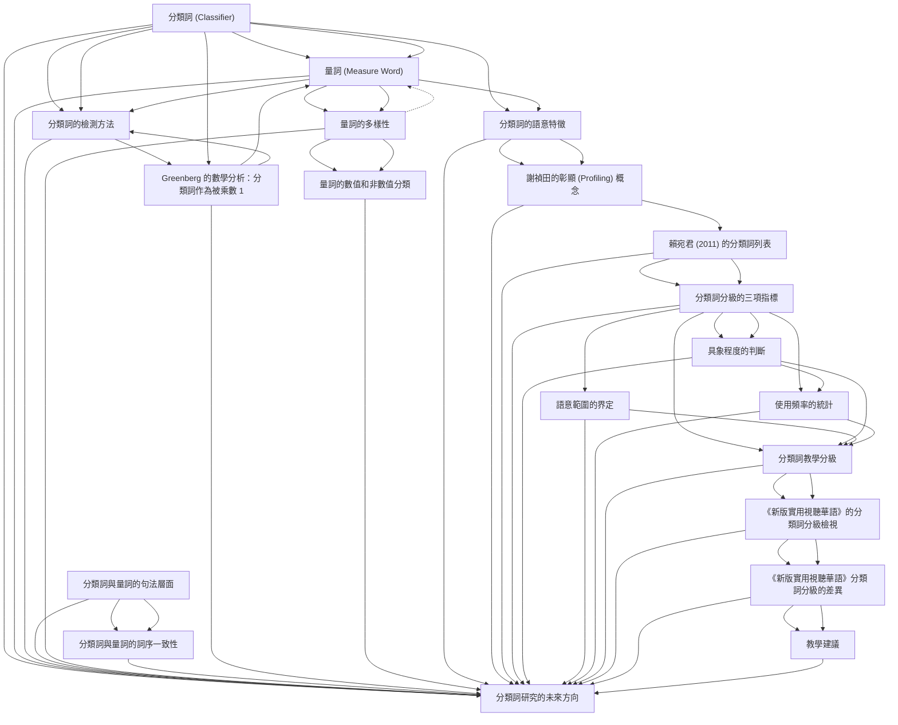

# Zettelkasten 卡片索引

**來源論文**: ChenYiRu2020_Chinese_Classifier_Teaching
**作者**: 
**年份**: 2025
**生成日期**: 2025-10-29 15:53
**卡片總數**: 20

---

## 📚 卡片清單

### 1. [分類詞 (Classifier)](zettel_cards/Linguistics-20251029-001.md)
- **ID**: `Linguistics-20251029-001`
- **類型**: 
- **核心**: "分類詞的功能是彰顯名詞的本質特徵，其數學意義為被乘數，其值必然為數值1。"
- **標籤**: `分類詞`, `量詞`, `華語教學`, `語法`

### 2. [量詞 (Measure Word)](zettel_cards/Linguistics-20251029-002.md)
- **ID**: `Linguistics-20251029-002`
- **類型**: 
- **核心**: "量詞之數學意義亦為被乘數，但可表數亦可表量，表數時其值為「1」之外的數值。"
- **標籤**: `量詞`, `分類詞`, `華語教學`, `語法`

### 3. [分類詞的檢測方法](zettel_cards/Linguistics-20251029-003.md)
- **ID**: `Linguistics-20251029-003`
- **類型**: 
- **核心**: "在此基礎上，華語分類詞可清楚地檢測。"
- **標籤**: `分類詞`, `量詞`, `檢測`, `華語語法`

### 4. [分類詞與量詞的句法層面](zettel_cards/Linguistics-20251029-004.md)
- **ID**: `Linguistics-20251029-004`
- **類型**: 
- **核心**: "在句法結構上，最根本的問題是：分類詞和量詞是否同屬一個詞類？"
- **標籤**: `句法`, `分類詞`, `量詞`, `詞類`

### 5. [量詞的多樣性](zettel_cards/Linguistics-20251029-005.md)
- **ID**: `Linguistics-20251029-005`
- **類型**: 
- **核心**: "何萬順與林昆翰（2015）將量詞更進一步的依據兩個變項，予以區分出四類，請見表一。"
- **標籤**: `量詞`, `分類`, `數值`, `華語語法`

### 6. [分類詞與量詞的詞序一致性](zettel_cards/Linguistics-20251029-006.md)
- **ID**: `Linguistics-20251029-006`
- **類型**: 
- **核心**: "只要是有分類詞和量詞的語言，這兩者和數詞與名詞的相關詞序必然一致，至今尚未有發現例外 (Her, 2017a)。"
- **標籤**: `詞序`, `分類詞`, `量詞`, `跨語言`

### 7. [Greenberg 的數學分析：分類詞作為被乘數 1](zettel_cards/Linguistics-20251029-007.md)
- **ID**: `Linguistics-20251029-007`
- **類型**: 
- **核心**: "Greenberg (1990[1972]: 172) 精準的指出，分類詞在數學上的功能就是被乘數1，乘數當然就是數詞。"
- **標籤**: `數學分析`, `分類詞`, `被乘數`, `Greenberg`

### 8. [量詞的數值和非數值分類](zettel_cards/Linguistics-20251029-008.md)
- **ID**: `Linguistics-20251029-008`
- **類型**: 
- **核心**: "表一所呈現的量詞分類，充分利用了「數」和「量」兩個不同概念，兩者都可以是固定值或非固定值，因此是完整且自然的分類方法。"
- **標籤**: `量詞`, `分類`, `數值`, `非數值`

### 9. [分類詞的語意特徵](zettel_cards/Linguistics-20251029-009.md)
- **ID**: `Linguistics-20251029-009`
- **類型**: 
- **核心**: "在 [ 數詞 +K+ 名詞 ] 的詞組中，若 K 的語意特徵集合是該名詞語意特徵集合的子集合，則K為分類詞；否則K為量詞。"
- **標籤**: `語意`, `分類詞`, `量詞`, `特徵集合`

### 10. [謝禎田的彰顯 (Profiling) 概念](zettel_cards/Linguistics-20251029-010.md)
- **ID**: `Linguistics-20251029-010`
- **類型**: 
- **核心**: "分類詞是預先強調，或突顯 (highlight) 名詞的某些內建的語意特徵。"
- **標籤**: `彰顯`, `Profiling`, `語意`, `分類詞`, `謝禎田`

### 11. [賴宛君 (2011) 的分類詞列表](zettel_cards/Linguistics-20251029-011.md)
- **ID**: `Linguistics-20251029-011`
- **類型**: 
- **核心**: "賴宛君（2011）分析了五個探討漢語分類詞的重要文獻...整理出61個常用的分類詞。"
- **標籤**: `分類詞`, `列表`, `賴宛君`, `文獻分析`

### 12. [分類詞分級的三項指標](zettel_cards/Linguistics-20251029-012.md)
- **ID**: `Linguistics-20251029-012`
- **類型**: 
- **核心**: "本文主張以三項指標為分級依據。一是具象程度，這與認知的難易度有關，具象的分類詞在教學上應先於抽象的分類詞；二是語意範圍，這指的是分類詞所涵蓋的語意廣度越大，實用性越高，應優先教學；三是使用頻率，頻率越高的實用性也越高，在教學上也應優先。"
- **標籤**: `分級`, `教學`, `具象程度`, `語意範圍`, `使用頻率`

### 13. [具象程度的判斷](zettel_cards/Linguistics-20251029-013.md)
- **ID**: `Linguistics-20251029-013`
- **類型**: 
- **核心**: "本文採用「中央研究院平衡語料庫」，將詞類設定為nf（量詞）後，一一輸入本研究定義下的分類詞，檢視與該分類詞搭配的名詞為抽象或具體。"
- **標籤**: `具象程度`, `語料庫`, `抽象`, `具體`

### 14. [語意範圍的界定](zettel_cards/Linguistics-20251029-014.md)
- **ID**: `Linguistics-20251029-014`
- **類型**: 
- **核心**: "本文對於語意範圍的界定標準，是依據賴宛君（2011）的分類詞語意階層圖，請見圖一。"
- **標籤**: `語意範圍`, `語意階層圖`, `賴宛君`

### 15. [使用頻率的統計](zettel_cards/Linguistics-20251029-015.md)
- **ID**: `Linguistics-20251029-015`
- **類型**: 
- **核心**: "我們採用中央研究院的「現代漢語語料庫詞頻統計」，設定詞類為nf（ 名稱為「量詞」，包括了本文中的分類詞）後，記錄該詞的出現次數，再依次排序，定出頻率高、中、低三個等級。"
- **標籤**: `使用頻率`, `詞頻統計`, `語料庫`

### 16. [分類詞教學分級](zettel_cards/Linguistics-20251029-016.md)
- **ID**: `Linguistics-20251029-016`
- **類型**: 
- **核心**: "表四是研究得出的分類詞教學分級。"
- **標籤**: `分級`, `教學`, `分類詞`, `初級`, `中級`, `高級`

### 17. [《新版實用視聽華語》的分類詞分級檢視](zettel_cards/Linguistics-20251029-017.md)
- **ID**: `Linguistics-20251029-017`
- **類型**: 
- **核心**: "本文根據研究所得出的分級，對於分類詞在《新版實用視聽華語》（簡稱《視華》），一至五冊進行分析，結果請見表五與表六"
- **標籤**: `教材分析`, `分類詞`, `《新版實用視聽華語》`, `分級`

### 18. [《新版實用視聽華語》分類詞分級的差異](zettel_cards/Linguistics-20251029-018.md)
- **ID**: `Linguistics-20251029-018`
- **類型**: 
- **核心**: "《視華》在初級編入25個分類詞。若依照本研究提出的選擇標準，也就是「具象程度」、「語意範圍」、「使用頻率」，則這25個分類詞當中，有18個在本研究的分級表中乃是被歸類於中級，1個乃是高級。"
- **標籤**: `教材分析`, `分類詞`, `《新版實用視聽華語》`, `分級`, `差異`

### 19. [教學建議](zettel_cards/Linguistics-20251029-019.md)
- **ID**: `Linguistics-20251029-019`
- **類型**: 
- **核心**: (論文中未直接提取，總結性問題)
- **標籤**: `教學`, `分類詞`, `教材`, `建議`

### 20. [分類詞研究的未來方向](zettel_cards/Linguistics-20251029-020.md)
- **ID**: `Linguistics-20251029-020`
- **類型**: 
- **核心**: (論文中未直接提取，總結性問題)
- **標籤**: `未來研究`, `分類詞`, `華語教學`, `語言學`

---

## 🗺️ 概念網絡圖

---

## 🏷️ 標籤索引

### 分類詞
- [[Linguistics-20251029-001]] 分類詞 (Classifier)
- [[Linguistics-20251029-002]] 量詞 (Measure Word)
- [[Linguistics-20251029-003]] 分類詞的檢測方法
- [[Linguistics-20251029-004]] 分類詞與量詞的句法層面
- [[Linguistics-20251029-006]] 分類詞與量詞的詞序一致性
- [[Linguistics-20251029-007]] Greenberg 的數學分析：分類詞作為被乘數 1
- [[Linguistics-20251029-009]] 分類詞的語意特徵
- [[Linguistics-20251029-010]] 謝禎田的彰顯 (Profiling) 概念
- [[Linguistics-20251029-011]] 賴宛君 (2011) 的分類詞列表
- [[Linguistics-20251029-016]] 分類詞教學分級
- [[Linguistics-20251029-017]] 《新版實用視聽華語》的分類詞分級檢視
- [[Linguistics-20251029-018]] 《新版實用視聽華語》分類詞分級的差異
- [[Linguistics-20251029-019]] 教學建議
- [[Linguistics-20251029-020]] 分類詞研究的未來方向

### 量詞
- [[Linguistics-20251029-001]] 分類詞 (Classifier)
- [[Linguistics-20251029-002]] 量詞 (Measure Word)
- [[Linguistics-20251029-003]] 分類詞的檢測方法
- [[Linguistics-20251029-004]] 分類詞與量詞的句法層面
- [[Linguistics-20251029-005]] 量詞的多樣性
- [[Linguistics-20251029-006]] 分類詞與量詞的詞序一致性
- [[Linguistics-20251029-008]] 量詞的數值和非數值分類
- [[Linguistics-20251029-009]] 分類詞的語意特徵

### 華語教學
- [[Linguistics-20251029-001]] 分類詞 (Classifier)
- [[Linguistics-20251029-002]] 量詞 (Measure Word)
- [[Linguistics-20251029-020]] 分類詞研究的未來方向

### 語法
- [[Linguistics-20251029-001]] 分類詞 (Classifier)
- [[Linguistics-20251029-002]] 量詞 (Measure Word)

### 檢測
- [[Linguistics-20251029-003]] 分類詞的檢測方法

### 華語語法
- [[Linguistics-20251029-003]] 分類詞的檢測方法
- [[Linguistics-20251029-005]] 量詞的多樣性

### 句法
- [[Linguistics-20251029-004]] 分類詞與量詞的句法層面

### 詞類
- [[Linguistics-20251029-004]] 分類詞與量詞的句法層面

### 分類
- [[Linguistics-20251029-005]] 量詞的多樣性
- [[Linguistics-20251029-008]] 量詞的數值和非數值分類

### 數值
- [[Linguistics-20251029-005]] 量詞的多樣性
- [[Linguistics-20251029-008]] 量詞的數值和非數值分類

### 詞序
- [[Linguistics-20251029-006]] 分類詞與量詞的詞序一致性

### 跨語言
- [[Linguistics-20251029-006]] 分類詞與量詞的詞序一致性

### 數學分析
- [[Linguistics-20251029-007]] Greenberg 的數學分析：分類詞作為被乘數 1

### 被乘數
- [[Linguistics-20251029-007]] Greenberg 的數學分析：分類詞作為被乘數 1

### Greenberg
- [[Linguistics-20251029-007]] Greenberg 的數學分析：分類詞作為被乘數 1

### 非數值
- [[Linguistics-20251029-008]] 量詞的數值和非數值分類

### 語意
- [[Linguistics-20251029-009]] 分類詞的語意特徵
- [[Linguistics-20251029-010]] 謝禎田的彰顯 (Profiling) 概念

### 特徵集合
- [[Linguistics-20251029-009]] 分類詞的語意特徵

### 彰顯
- [[Linguistics-20251029-010]] 謝禎田的彰顯 (Profiling) 概念

### Profiling
- [[Linguistics-20251029-010]] 謝禎田的彰顯 (Profiling) 概念

### 謝禎田
- [[Linguistics-20251029-010]] 謝禎田的彰顯 (Profiling) 概念

### 列表
- [[Linguistics-20251029-011]] 賴宛君 (2011) 的分類詞列表

### 賴宛君
- [[Linguistics-20251029-011]] 賴宛君 (2011) 的分類詞列表
- [[Linguistics-20251029-014]] 語意範圍的界定

### 文獻分析
- [[Linguistics-20251029-011]] 賴宛君 (2011) 的分類詞列表

### 分級
- [[Linguistics-20251029-012]] 分類詞分級的三項指標
- [[Linguistics-20251029-016]] 分類詞教學分級
- [[Linguistics-20251029-017]] 《新版實用視聽華語》的分類詞分級檢視
- [[Linguistics-20251029-018]] 《新版實用視聽華語》分類詞分級的差異

### 教學
- [[Linguistics-20251029-012]] 分類詞分級的三項指標
- [[Linguistics-20251029-016]] 分類詞教學分級
- [[Linguistics-20251029-019]] 教學建議

### 具象程度
- [[Linguistics-20251029-012]] 分類詞分級的三項指標
- [[Linguistics-20251029-013]] 具象程度的判斷

### 語意範圍
- [[Linguistics-20251029-012]] 分類詞分級的三項指標
- [[Linguistics-20251029-014]] 語意範圍的界定

### 使用頻率
- [[Linguistics-20251029-012]] 分類詞分級的三項指標
- [[Linguistics-20251029-015]] 使用頻率的統計

### 語料庫
- [[Linguistics-20251029-013]] 具象程度的判斷
- [[Linguistics-20251029-015]] 使用頻率的統計

### 抽象
- [[Linguistics-20251029-013]] 具象程度的判斷

### 具體
- [[Linguistics-20251029-013]] 具象程度的判斷

### 語意階層圖
- [[Linguistics-20251029-014]] 語意範圍的界定

### 詞頻統計
- [[Linguistics-20251029-015]] 使用頻率的統計

### 初級
- [[Linguistics-20251029-016]] 分類詞教學分級

### 中級
- [[Linguistics-20251029-016]] 分類詞教學分級

### 高級
- [[Linguistics-20251029-016]] 分類詞教學分級

### 教材分析
- [[Linguistics-20251029-017]] 《新版實用視聽華語》的分類詞分級檢視
- [[Linguistics-20251029-018]] 《新版實用視聽華語》分類詞分級的差異

### 《新版實用視聽華語》
- [[Linguistics-20251029-017]] 《新版實用視聽華語》的分類詞分級檢視
- [[Linguistics-20251029-018]] 《新版實用視聽華語》分類詞分級的差異

### 差異
- [[Linguistics-20251029-018]] 《新版實用視聽華語》分類詞分級的差異

### 教材
- [[Linguistics-20251029-019]] 教學建議

### 建議
- [[Linguistics-20251029-019]] 教學建議

### 未來研究
- [[Linguistics-20251029-020]] 分類詞研究的未來方向

### 語言學
- [[Linguistics-20251029-020]] 分類詞研究的未來方向

---

## 📖 閱讀建議順序

1. [[Linguistics-20251029-020]] 分類詞研究的未來方向

2. [[Linguistics-20251029-003]] 分類詞的檢測方法

3. [[Linguistics-20251029-006]] 分類詞與量詞的詞序一致性

4. [[Linguistics-20251029-007]] Greenberg 的數學分析：分類詞作為被乘數 1

5. [[Linguistics-20251029-008]] 量詞的數值和非數值分類

6. [[Linguistics-20251029-010]] 謝禎田的彰顯 (Profiling) 概念

7. [[Linguistics-20251029-019]] 教學建議

8. [[Linguistics-20251029-004]] 分類詞與量詞的句法層面

9. [[Linguistics-20251029-005]] 量詞的多樣性

10. [[Linguistics-20251029-009]] 分類詞的語意特徵

11. [[Linguistics-20251029-011]] 賴宛君 (2011) 的分類詞列表

12. [[Linguistics-20251029-014]] 語意範圍的界定

13. [[Linguistics-20251029-015]] 使用頻率的統計

14. [[Linguistics-20251029-016]] 分類詞教學分級

15. [[Linguistics-20251029-017]] 《新版實用視聽華語》的分類詞分級檢視

16. [[Linguistics-20251029-018]] 《新版實用視聽華語》分類詞分級的差異

17. [[Linguistics-20251029-013]] 具象程度的判斷

18. [[Linguistics-20251029-002]] 量詞 (Measure Word)

19. [[Linguistics-20251029-001]] 分類詞 (Classifier)

20. [[Linguistics-20251029-012]] 分類詞分級的三項指標

---

*本索引由 Knowledge Production System 自動生成*