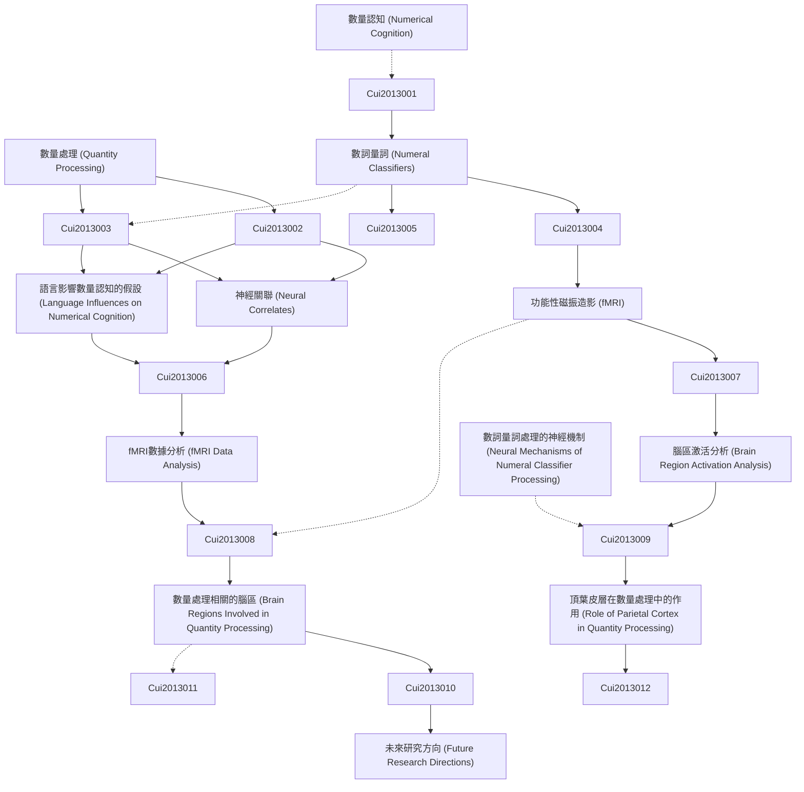

# Zettelkasten 卡片索引

---

## 📚 卡片清單

### 1. [數量處理 (Quantity Processing)](zettel_cards/Cui-2013-001.md)
- **ID**: `Cui-2013-001`
- **類型**: 
- **核心**: 無（摘要中未直接定義，需推斷）
- **標籤**: `數量認知`, `數字`, `語言`, `神經科學`

### 2. [數詞量詞 (Numeral Classifiers)](zettel_cards/Cui-2013-002.md)
- **ID**: `Cui-2013-002`
- **類型**: 
- **核心**: 無（摘要中未直接定義，需推斷）
- **標籤**: `語言學`, `語法`, `數詞`, `量詞`

### 3. [數量認知 (Numerical Cognition)](zettel_cards/Cui-2013-003.md)
- **ID**: `Cui-2013-003`
- **類型**: 
- **核心**: 無（摘要中未直接定義，需推斷）
- **標籤**: `數字`, `認知心理學`, `大腦`, `表徵`

### 4. [神經關聯 (Neural Correlates)](zettel_cards/Cui-2013-004.md)
- **ID**: `Cui-2013-004`
- **類型**: 
- **核心**: 無（摘要中未直接定義，需推斷）
- **標籤**: `神經科學`, `大腦活動`, `功能性磁振造影(fMRI)`, `行為`

### 5. [語言影響數量認知的假設 (Language Influences on Numerical Cognition)](zettel_cards/Cui-2013-005.md)
- **ID**: `Cui-2013-005`
- **類型**: 
- **核心**: 無（摘要中未直接定義，需推斷）
- **標籤**: `語言`, `數量`, `認知`, `假設`

### 6. [功能性磁振造影 (fMRI)](zettel_cards/Cui-2013-006.md)
- **ID**: `Cui-2013-006`
- **類型**: 
- **核心**: 無（摘要中未直接定義，需推斷）
- **標籤**: `神經影像`, `大腦`, `腦活動`, `實驗方法`

### 7. [fMRI數據分析 (fMRI Data Analysis)](zettel_cards/Cui-2013-007.md)
- **ID**: `Cui-2013-007`
- **類型**: 
- **核心**: 無（摘要中未直接定義，需推斷）
- **標籤**: `數據分析`, `神經影像`, `統計`, `信號處理`

### 8. [腦區激活分析 (Brain Region Activation Analysis)](zettel_cards/Cui-2013-008.md)
- **ID**: `Cui-2013-008`
- **類型**: 
- **核心**: 無（摘要中未直接定義，需推斷）
- **標籤**: `大腦`, `腦區`, `激活`, `fMRI`

### 9. [數量處理相關的腦區 (Brain Regions Involved in Quantity Processing)](zettel_cards/Cui-2013-009.md)
- **ID**: `Cui-2013-009`
- **類型**: 
- **核心**: 無（摘要中未直接定義，需推斷）
- **標籤**: `大腦`, `數量`, `腦區`, `fMRI`

### 10. [頂葉皮層在數量處理中的作用 (Role of Parietal Cortex in Quantity Processing)](zettel_cards/Cui-2013-010.md)
- **ID**: `Cui-2013-010`
- **類型**: 
- **核心**: 無（摘要中未直接定義，需推斷）
- **標籤**: `頂葉`, `數量`, `表徵`, `空間`

### 11. [數詞量詞處理的神經機制 (Neural Mechanisms of Numeral Classifier Processing)](zettel_cards/Cui-2013-011.md)
- **ID**: `Cui-2013-011`
- **類型**: 
- **核心**: 無（摘要中未直接定義，需推斷）
- **標籤**: `數詞`, `量詞`, `神經`, `機制`, `語言`

### 12. [未來研究方向 (Future Research Directions)](zettel_cards/Cui-2013-012.md)
- **ID**: `Cui-2013-012`
- **類型**: 
- **核心**: 無（摘要中未直接定義，需推斷）
- **標籤**: `研究`, `方向`, `數量`, `語言`, `大腦`

---

## 🗺️ 概念網絡圖

---

## 🏷️ 標籤索引

### 數量認知
- [[Cui-2013-001]] 數量處理 (Quantity Processing)

### 數字
- [[Cui-2013-001]] 數量處理 (Quantity Processing)
- [[Cui-2013-003]] 數量認知 (Numerical Cognition)

### 語言
- [[Cui-2013-001]] 數量處理 (Quantity Processing)
- [[Cui-2013-005]] 語言影響數量認知的假設 (Language Influences on Numerical Cognition)
- [[Cui-2013-011]] 數詞量詞處理的神經機制 (Neural Mechanisms of Numeral Classifier Processing)
- [[Cui-2013-012]] 未來研究方向 (Future Research Directions)

### 神經科學
- [[Cui-2013-001]] 數量處理 (Quantity Processing)
- [[Cui-2013-004]] 神經關聯 (Neural Correlates)

### 語言學
- [[Cui-2013-002]] 數詞量詞 (Numeral Classifiers)

### 語法
- [[Cui-2013-002]] 數詞量詞 (Numeral Classifiers)

### 數詞
- [[Cui-2013-002]] 數詞量詞 (Numeral Classifiers)
- [[Cui-2013-011]] 數詞量詞處理的神經機制 (Neural Mechanisms of Numeral Classifier Processing)

### 量詞
- [[Cui-2013-002]] 數詞量詞 (Numeral Classifiers)
- [[Cui-2013-011]] 數詞量詞處理的神經機制 (Neural Mechanisms of Numeral Classifier Processing)

### 認知心理學
- [[Cui-2013-003]] 數量認知 (Numerical Cognition)

### 大腦
- [[Cui-2013-003]] 數量認知 (Numerical Cognition)
- [[Cui-2013-006]] 功能性磁振造影 (fMRI)
- [[Cui-2013-008]] 腦區激活分析 (Brain Region Activation Analysis)
- [[Cui-2013-009]] 數量處理相關的腦區 (Brain Regions Involved in Quantity Processing)
- [[Cui-2013-012]] 未來研究方向 (Future Research Directions)

### 表徵
- [[Cui-2013-003]] 數量認知 (Numerical Cognition)
- [[Cui-2013-010]] 頂葉皮層在數量處理中的作用 (Role of Parietal Cortex in Quantity Processing)

### 大腦活動
- [[Cui-2013-004]] 神經關聯 (Neural Correlates)

### 功能性磁振造影(fMRI)
- [[Cui-2013-004]] 神經關聯 (Neural Correlates)

### 行為
- [[Cui-2013-004]] 神經關聯 (Neural Correlates)

### 數量
- [[Cui-2013-005]] 語言影響數量認知的假設 (Language Influences on Numerical Cognition)
- [[Cui-2013-009]] 數量處理相關的腦區 (Brain Regions Involved in Quantity Processing)
- [[Cui-2013-010]] 頂葉皮層在數量處理中的作用 (Role of Parietal Cortex in Quantity Processing)
- [[Cui-2013-012]] 未來研究方向 (Future Research Directions)

### 認知
- [[Cui-2013-005]] 語言影響數量認知的假設 (Language Influences on Numerical Cognition)

### 假設
- [[Cui-2013-005]] 語言影響數量認知的假設 (Language Influences on Numerical Cognition)

### 神經影像
- [[Cui-2013-006]] 功能性磁振造影 (fMRI)
- [[Cui-2013-007]] fMRI數據分析 (fMRI Data Analysis)

### 腦活動
- [[Cui-2013-006]] 功能性磁振造影 (fMRI)

### 實驗方法
- [[Cui-2013-006]] 功能性磁振造影 (fMRI)

### 數據分析
- [[Cui-2013-007]] fMRI數據分析 (fMRI Data Analysis)

### 統計
- [[Cui-2013-007]] fMRI數據分析 (fMRI Data Analysis)

### 信號處理
- [[Cui-2013-007]] fMRI數據分析 (fMRI Data Analysis)

### 腦區
- [[Cui-2013-008]] 腦區激活分析 (Brain Region Activation Analysis)
- [[Cui-2013-009]] 數量處理相關的腦區 (Brain Regions Involved in Quantity Processing)

### 激活
- [[Cui-2013-008]] 腦區激活分析 (Brain Region Activation Analysis)

### fMRI
- [[Cui-2013-008]] 腦區激活分析 (Brain Region Activation Analysis)
- [[Cui-2013-009]] 數量處理相關的腦區 (Brain Regions Involved in Quantity Processing)

### 頂葉
- [[Cui-2013-010]] 頂葉皮層在數量處理中的作用 (Role of Parietal Cortex in Quantity Processing)

### 空間
- [[Cui-2013-010]] 頂葉皮層在數量處理中的作用 (Role of Parietal Cortex in Quantity Processing)

### 神經
- [[Cui-2013-011]] 數詞量詞處理的神經機制 (Neural Mechanisms of Numeral Classifier Processing)

### 機制
- [[Cui-2013-011]] 數詞量詞處理的神經機制 (Neural Mechanisms of Numeral Classifier Processing)

### 研究
- [[Cui-2013-012]] 未來研究方向 (Future Research Directions)

### 方向
- [[Cui-2013-012]] 未來研究方向 (Future Research Directions)

---

## 📖 閱讀建議順序

1. [[Cui-2013-001]] 數量處理 (Quantity Processing)

2. [[Cui-2013-002]] 數詞量詞 (Numeral Classifiers)

3. [[Cui-2013-003]] 數量認知 (Numerical Cognition)

4. [[Cui-2013-004]] 神經關聯 (Neural Correlates)

5. [[Cui-2013-005]] 語言影響數量認知的假設 (Language Influences on Numerical Cognition)

6. [[Cui-2013-006]] 功能性磁振造影 (fMRI)

7. [[Cui-2013-007]] fMRI數據分析 (fMRI Data Analysis)

8. [[Cui-2013-008]] 腦區激活分析 (Brain Region Activation Analysis)

9. [[Cui-2013-009]] 數量處理相關的腦區 (Brain Regions Involved in Quantity Processing)

10. [[Cui-2013-010]] 頂葉皮層在數量處理中的作用 (Role of Parietal Cortex in Quantity Processing)

11. [[Cui-2013-011]] 數詞量詞處理的神經機制 (Neural Mechanisms of Numeral Classifier Processing)

12. [[Cui-2013-012]] 未來研究方向 (Future Research Directions)

---

*本索引由 Knowledge Production System 自動生成*