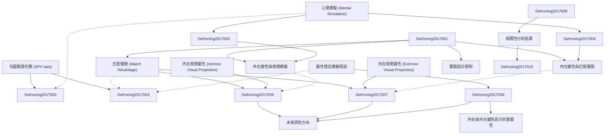

# Zettelkasten 卡片索引

**來源論文**: 
**作者**: 
**年份**: None
**生成日期**: 2025-11-04 16:37
**卡片總數**: 12

---

## 📚 卡片清單

### 1. [句圖驗證任務 (SPV task)](zettel_cards/DeKoning-2017-001.md)
- **ID**: `DeKoning-2017-001`
- **類型**: 
- **核心**: "Inthesentence–pictureverification(SPV)task,peoplereadsentencesimplyingtheshape/ size/colour/orientationofobjects."
- **標籤**: `[認知心理學]`, `[心理語言學]`, `[句圖驗證]`, `[實驗方法]`

### 2. [匹配優勢 (Match Advantage)](zettel_cards/DeKoning-2017-002.md)
- **ID**: `DeKoning-2017-002`
- **類型**: 
- **核心**: "Faster verification times on matching trials (match advantage) are considered supportive to the notion that readers perform mental simulations during sentence comprehension."
- **標籤**: `[認知心理學]`, `[心理語言學]`, `[句圖驗證]`, `[心理模擬]`

### 3. [心理模擬 (Mental Simulation)](zettel_cards/DeKoning-2017-003.md)
- **ID**: `DeKoning-2017-003`
- **類型**: 
- **核心**: "In capturing the meaning of text, readers mentally simulate the described situations and events through the reactivation of previously acquired real-world perceptual, motor, and affective experiences."
- **標籤**: `[認知心理學]`, `[心理語言學]`, `[具身認知]`, `[語言理解]`

### 4. [內在視覺屬性 (Intrinsic Visual Properties)](zettel_cards/DeKoning-2017-004.md)
- **ID**: `DeKoning-2017-004`
- **類型**: 
- **核心**: "Shape, size, and colour are intrinsic visual properties that distinguish an object from another."
- **標籤**: `[認知心理學]`, `[視覺認知]`, `[物體識別]`, `[屬性]`

### 5. [外在視覺屬性 (Extrinsic Visual Properties)](zettel_cards/DeKoning-2017-005.md)
- **ID**: `DeKoning-2017-005`
- **類型**: 
- **核心**: "Instead, orientation is an extrinsic visual property in that it is not inherent to an object, but rather varies depending on aspects like the observer...or the way an object is positioned"
- **標籤**: `[認知心理學]`, `[視覺認知]`, `[物體識別]`, `[屬性]`

### 6. [內在屬性與匹配優勢](zettel_cards/DeKoning-2017-006.md)
- **ID**: `DeKoning-2017-006`
- **類型**: 
- **核心**: "Together, these results show small to largematchadvantagesfortheintrinsicvisualproperties shape, size, and colour, and no match advantage for theextrinsic visual property orientation."
- **標籤**: `[認知心理學]`, `[句圖驗證]`, `[匹配優勢]`, `[內在屬性]`

### 7. [外在屬性與視覺模擬](zettel_cards/DeKoning-2017-007.md)
- **ID**: `DeKoning-2017-007`
- **類型**: 
- **核心**: "the extrinsic property orientation is the only visual object property that “falls out” to the fact that readers, depending on the sentence context, might recruit other modalities to which orientation is more relevant."
- **標籤**: `[認知心理學]`, `[句圖驗證]`, `[匹配優勢]`, `[外在屬性]`

### 8. [屬性穩定模擬假設](zettel_cards/DeKoning-2017-008.md)
- **ID**: `DeKoning-2017-008`
- **類型**: 
- **核心**: "Assumingthatanindividualconsistentlyengagesin mentalsimulationirrespectiveofwhichvisualobject property is involved...we could expect to find correlated match advantages across all visual object properties."
- **標籤**: `[認知心理學]`, `[心理語言學]`, `[心理模擬]`, `[假設]`

### 9. [相關性分析結果](zettel_cards/DeKoning-2017-009.md)
- **ID**: `DeKoning-2017-009`
- **類型**: 
- **核心**: "significant correlations were found between all of the three intrinsic visual object properties (i.e. shape, size, and colour); the extrinsic visual object propertyorientationappearednottobesignificantly correlated with any of the intrinsic visual object properties."
- **標籤**: `[認知心理學]`, `[句圖驗證]`, `[心理模擬]`, `[相關性]`

### 10. [內在與外在屬性區分的重要性](zettel_cards/DeKoning-2017-010.md)
- **ID**: `DeKoning-2017-010`
- **類型**: 
- **核心**: "Together, our findings suggest that it could advance the interpretation of match advantages if distinctions were made between the effects obtained for intrinsic visual object properties and those obtained for extrinsic ones."
- **標籤**: `[認知心理學]`, `[心理語言學]`, `[心理模擬]`, `[內在屬性]`, `[外在屬性]`

### 11. [實驗設計限制](zettel_cards/DeKoning-2017-011.md)
- **ID**: `DeKoning-2017-011`
- **類型**: 
- **核心**: "Even though we have tried to make all four SPV tasks as comparable as possible...we cannot exclude the possibility that differences between the four visual properties inthemagnitudeofthematchadvantageareinfluencedbytheparticular(differencesbetween)items that we have used."
- **標籤**: `[認知心理學]`, `[句圖驗證]`, `[實驗方法]`, `[限制]`

### 12. [未來研究方向](zettel_cards/DeKoning-2017-012.md)
- **ID**: `DeKoning-2017-012`
- **類型**: 
- **核心**: "Importantly, more research is required to substantiate this claim and to clarify what mechanisms are responsible for the fact that some visual object properties (shape, size, and colour) are strongly activated in the visualmodality during language comprehension, whilst others (orientation) are not."
- **標籤**: `[認知心理學]`, `[心理語言學]`, `[心理模擬]`, `[研究方向]`

---

## 🗺️ 概念網絡圖

---

## 🏷️ 標籤索引

### [認知心理學]
- [[DeKoning-2017-001]] 句圖驗證任務 (SPV task)
- [[DeKoning-2017-002]] 匹配優勢 (Match Advantage)
- [[DeKoning-2017-003]] 心理模擬 (Mental Simulation)
- [[DeKoning-2017-004]] 內在視覺屬性 (Intrinsic Visual Properties)
- [[DeKoning-2017-005]] 外在視覺屬性 (Extrinsic Visual Properties)
- [[DeKoning-2017-006]] 內在屬性與匹配優勢
- [[DeKoning-2017-007]] 外在屬性與視覺模擬
- [[DeKoning-2017-008]] 屬性穩定模擬假設
- [[DeKoning-2017-009]] 相關性分析結果
- [[DeKoning-2017-010]] 內在與外在屬性區分的重要性
- [[DeKoning-2017-011]] 實驗設計限制
- [[DeKoning-2017-012]] 未來研究方向

### [心理語言學]
- [[DeKoning-2017-001]] 句圖驗證任務 (SPV task)
- [[DeKoning-2017-002]] 匹配優勢 (Match Advantage)
- [[DeKoning-2017-003]] 心理模擬 (Mental Simulation)
- [[DeKoning-2017-008]] 屬性穩定模擬假設
- [[DeKoning-2017-010]] 內在與外在屬性區分的重要性
- [[DeKoning-2017-012]] 未來研究方向

### [句圖驗證]
- [[DeKoning-2017-001]] 句圖驗證任務 (SPV task)
- [[DeKoning-2017-002]] 匹配優勢 (Match Advantage)
- [[DeKoning-2017-006]] 內在屬性與匹配優勢
- [[DeKoning-2017-007]] 外在屬性與視覺模擬
- [[DeKoning-2017-009]] 相關性分析結果
- [[DeKoning-2017-011]] 實驗設計限制

### [實驗方法]
- [[DeKoning-2017-001]] 句圖驗證任務 (SPV task)
- [[DeKoning-2017-011]] 實驗設計限制

### [心理模擬]
- [[DeKoning-2017-002]] 匹配優勢 (Match Advantage)
- [[DeKoning-2017-008]] 屬性穩定模擬假設
- [[DeKoning-2017-009]] 相關性分析結果
- [[DeKoning-2017-010]] 內在與外在屬性區分的重要性
- [[DeKoning-2017-012]] 未來研究方向

### [具身認知]
- [[DeKoning-2017-003]] 心理模擬 (Mental Simulation)

### [語言理解]
- [[DeKoning-2017-003]] 心理模擬 (Mental Simulation)

### [視覺認知]
- [[DeKoning-2017-004]] 內在視覺屬性 (Intrinsic Visual Properties)
- [[DeKoning-2017-005]] 外在視覺屬性 (Extrinsic Visual Properties)

### [物體識別]
- [[DeKoning-2017-004]] 內在視覺屬性 (Intrinsic Visual Properties)
- [[DeKoning-2017-005]] 外在視覺屬性 (Extrinsic Visual Properties)

### [屬性]
- [[DeKoning-2017-004]] 內在視覺屬性 (Intrinsic Visual Properties)
- [[DeKoning-2017-005]] 外在視覺屬性 (Extrinsic Visual Properties)

### [匹配優勢]
- [[DeKoning-2017-006]] 內在屬性與匹配優勢
- [[DeKoning-2017-007]] 外在屬性與視覺模擬

### [內在屬性]
- [[DeKoning-2017-006]] 內在屬性與匹配優勢
- [[DeKoning-2017-010]] 內在與外在屬性區分的重要性

### [外在屬性]
- [[DeKoning-2017-007]] 外在屬性與視覺模擬
- [[DeKoning-2017-010]] 內在與外在屬性區分的重要性

### [假設]
- [[DeKoning-2017-008]] 屬性穩定模擬假設

### [相關性]
- [[DeKoning-2017-009]] 相關性分析結果

### [限制]
- [[DeKoning-2017-011]] 實驗設計限制

### [研究方向]
- [[DeKoning-2017-012]] 未來研究方向

---

## 📖 閱讀建議順序

1. [[DeKoning-2017-001]] 句圖驗證任務 (SPV task)

2. [[DeKoning-2017-002]] 匹配優勢 (Match Advantage)

3. [[DeKoning-2017-003]] 心理模擬 (Mental Simulation)

4. [[DeKoning-2017-004]] 內在視覺屬性 (Intrinsic Visual Properties)

5. [[DeKoning-2017-005]] 外在視覺屬性 (Extrinsic Visual Properties)

6. [[DeKoning-2017-006]] 內在屬性與匹配優勢

7. [[DeKoning-2017-007]] 外在屬性與視覺模擬

8. [[DeKoning-2017-008]] 屬性穩定模擬假設

9. [[DeKoning-2017-009]] 相關性分析結果

10. [[DeKoning-2017-010]] 內在與外在屬性區分的重要性

11. [[DeKoning-2017-011]] 實驗設計限制

12. [[DeKoning-2017-012]] 未來研究方向

---

*本索引由 Knowledge Production System 自動生成*