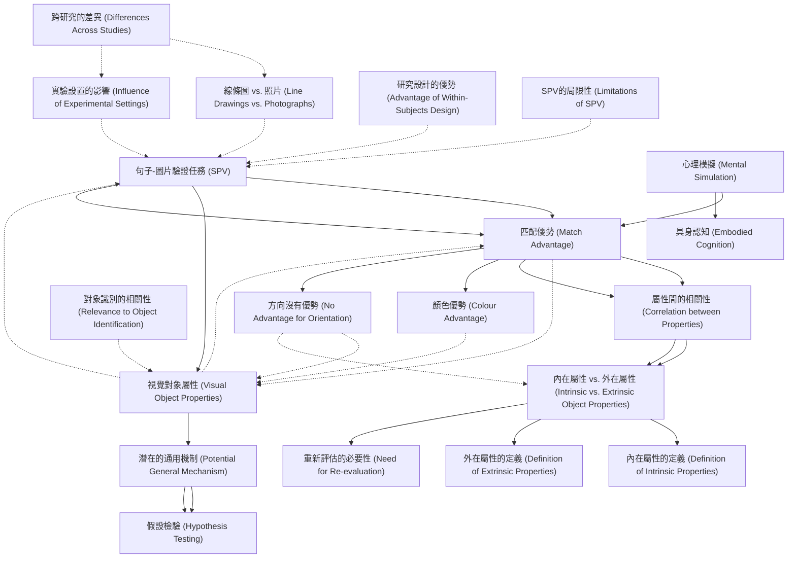

# Zettelkasten 卡片索引

**來源論文**: DeKoning2017_Mental_Simulation
**作者**: 
**年份**: 2025
**生成日期**: 2025-10-29 16:21
**卡片總數**: 20

---

## 📚 卡片清單

### 1. [句子-圖片驗證任務 (SPV)](zettel_cards/CogSci-20251029-001.md)
- **ID**: `CogSci-20251029-001`
- **類型**: 
- **核心**: "In the sentence–picture verification (SPV) task, people read sentences implying the shape/ size/colour/orientation of objects."
- **標籤**: `句子圖片驗證`, `SPV`, `心理語言學`

### 2. [匹配優勢 (Match Advantage)](zettel_cards/CogSci-20251029-002.md)
- **ID**: `CogSci-20251029-002`
- **類型**: 
- **核心**: "Faster verification times on matching trials (match advantage) are considered supportive to the notion that readers perform mental simulations during sentence comprehension."
- **標籤**: `匹配優勢`, `心理模擬`, `句子理解`

### 3. [心理模擬 (Mental Simulation)](zettel_cards/CogSci-20251029-003.md)
- **ID**: `CogSci-20251029-003`
- **類型**: 
- **核心**: "In capturing the meaning of text, readers mentally simulate the described situations and events through the reactivation of previously acquired real-world perceptual, motor, and affective experiences (Barsalou, 1999)."
- **標籤**: `心理模擬`, `具身認知`, `語言理解`

### 4. [具身認知 (Embodied Cognition)](zettel_cards/CogSci-20251029-004.md)
- **ID**: `CogSci-20251029-004`
- **類型**: 
- **核心**: "In such an embodied view to language comprehension, the representations involved in understanding sentences are of the same kind as the representations involved in having actual sensory and motor experiences."
- **標籤**: `具身認知`, `語言理解`, `感知運動`

### 5. [視覺對象屬性 (Visual Object Properties)](zettel_cards/CogSci-20251029-005.md)
- **ID**: `CogSci-20251029-005`
- **類型**: 
- **核心**: "... visual information related to an object’s properties—such as shape, size, colour, and orientation—is activated during sentence comprehension..."
- **標籤**: `視覺屬性`, `形狀`, `尺寸`, `顏色`, `方向`

### 6. [屬性間的相關性 (Correlation between Properties)](zettel_cards/CogSci-20251029-006.md)
- **ID**: `CogSci-20251029-006`
- **類型**: 
- **核心**: "Shape, size, and colour were significantly correlated, whereas there were no significant correlations with orientation."
- **標籤**: `視覺屬性`, `相關性`, `形狀`, `尺寸`, `顏色`, `方向`

### 7. [內在屬性 vs. 外在屬性 (Intrinsic vs. Extrinsic Object Properties)](zettel_cards/CogSci-20251029-007.md)
- **ID**: `CogSci-20251029-007`
- **類型**: 
- **核心**: "These findings suggest that interpretations of match advantages could benefit from a re-evaluation of mental simulation accounts by distinguishing between intrinsic (shape, size, and colour) and extrinsic (orientation) object properties."
- **標籤**: `內在屬性`, `外在屬性`, `形狀`, `尺寸`, `顏色`, `方向`

### 8. [線條圖 vs. 照片 (Line Drawings vs. Photographs)](zettel_cards/CogSci-20251029-008.md)
- **ID**: `CogSci-20251029-008`
- **類型**: 
- **核心**: "For example, studies differed in whether participants were presented with line drawings (e.g. Stanfield & Zwaan, 2001) or photographs (e.g. Engelen, Bouwmeester, de Bruin, & Zwaan, 2011) of objects."
- **標籤**: `線條圖`, `照片`, `視覺刺激`, `SPV`

### 9. [實驗設置的影響 (Influence of Experimental Settings)](zettel_cards/CogSci-20251029-009.md)
- **ID**: `CogSci-20251029-009`
- **類型**: 
- **核心**: "Also, these studies varied in the populations that were studied (primary school children, Engelen et al., 2011; undergraduate psychology students, Zwaan et al., 2002; broad age range of adults, Zwaan & Pecher, 2012), the settings in which they were tested (e.g. online platforms, Zwaan & Pecher, 2012; lab cubicles, Zwaan et al., 2002; school classrooms, Engelen et al., 2011; de Koning et al., 2016), and their data trimming procedures (see Zwaan & Pecher, 2012)."
- **標籤**: `實驗設置`, `參與者`, `環境`, `數據處理`

### 10. [潛在的通用機制 (Potential General Mechanism)](zettel_cards/CogSci-20251029-010.md)
- **ID**: `CogSci-20251029-010`
- **類型**: 
- **核心**: "This implies that readers routinely simulate all visual properties during comprehension of sentences, independently of, for example, their relevance to object identification, which is an important part of this particular task."
- **標籤**: `心理模擬`, `通用機制`, `視覺屬性`, `對象識別`

### 11. [內在屬性的定義 (Definition of Intrinsic Properties)](zettel_cards/CogSci-20251029-011.md)
- **ID**: `CogSci-20251029-011`
- **類型**: 
- **核心**: "Shape, size, and colour were significantly correlated, whereas there were no significant correlations with orientation."
- **標籤**: `形狀`, `大小`, `顏色`, `內在屬性`

### 12. [外在屬性的定義 (Definition of Extrinsic Properties)](zettel_cards/CogSci-20251029-012.md)
- **ID**: `CogSci-20251029-012`
- **類型**: 
- **核心**: "These findings suggest that interpretations of match advantages could benefit from a re-evaluation of mental simulation accounts by distinguishing between intrinsic (shape, size, and colour) and extrinsic (orientation) object properties."
- **標籤**: `方向`, `外在屬性`

### 13. [研究設計的優勢 (Advantage of Within-Subjects Design)](zettel_cards/CogSci-20251029-013.md)
- **ID**: `CogSci-20251029-013`
- **類型**: 
- **核心**: "The within-subjects design enables us to address at least two aspects related to the mental simulation of these visual object properties that research using the SPV task so far has not been able to answer."
- **標籤**: `實驗設計`, `組內設計`, `SPV`

### 14. [對象識別的相關性 (Relevance to Object Identification)](zettel_cards/CogSci-20251029-014.md)
- **ID**: `CogSci-20251029-014`
- **類型**: 
- **核心**: "... independently of, for example, their relevance to object identification, which is an important part of this particular task."
- **標籤**: `對象識別`, `心理模擬`, `視覺屬性`

### 15. [顏色優勢 (Colour Advantage)](zettel_cards/CogSci-20251029-015.md)
- **ID**: `CogSci-20251029-015`
- **類型**: 
- **核心**: "Results showed varying match advantages with colour showing the strongest effect, and no match advantage for orientation."
- **標籤**: `顏色`, `心理模擬`, `匹配優勢`

### 16. [方向沒有優勢 (No Advantage for Orientation)](zettel_cards/CogSci-20251029-016.md)
- **ID**: `CogSci-20251029-016`
- **類型**: 
- **核心**: "Results showed varying match advantages with colour showing the strongest effect, and no match advantage for orientation."
- **標籤**: `方向`, `心理模擬`, `匹配優勢`

### 17. [假設檢驗 (Hypothesis Testing)](zettel_cards/CogSci-20251029-017.md)
- **ID**: `CogSci-20251029-017`
- **類型**: 
- **核心**: "Stronger support for this assumption would be obtained if prior results on each of these individual visual object properties could be replicated in such a direct comparison."
- **標籤**: `假設檢驗`, `驗證`

### 18. [跨研究的差異 (Differences Across Studies)](zettel_cards/CogSci-20251029-018.md)
- **ID**: `CogSci-20251029-018`
- **類型**: 
- **核心**: "Whilst the findings derived from all of the SPV task studies so far seem straightforward, zooming in on these findings shows a less clear and less consistent pattern of results."
- **標籤**: `SPV`, `心理模擬`, `方法學`

### 19. [重新評估的必要性 (Need for Re-evaluation)](zettel_cards/CogSci-20251029-019.md)
- **ID**: `CogSci-20251029-019`
- **類型**: 
- **核心**: "These findings suggest that interpretations of match advantages could benefit from a re-evaluation of mental simulation accounts by distinguishing between intrinsic (shape, size, and colour) and extrinsic (orientation) object properties."
- **標籤**: `內在屬性`, `外在屬性`, `心理模擬`

### 20. [SPV的局限性 (Limitations of SPV)](zettel_cards/CogSci-20251029-020.md)
- **ID**: `CogSci-20251029-020`
- **類型**: 
- **核心**: "Importantly, simply verifying whether the depicted object is mentioned in the sentence does not necessarily require mental simulation processes or even sentence context."
- **標籤**: `SPV`, `心理模擬`

---

## 🗺️ 概念網絡圖

---

## 🏷️ 標籤索引

### 句子圖片驗證
- [[CogSci-20251029-001]] 句子-圖片驗證任務 (SPV)

### SPV
- [[CogSci-20251029-001]] 句子-圖片驗證任務 (SPV)
- [[CogSci-20251029-008]] 線條圖 vs. 照片 (Line Drawings vs. Photographs)
- [[CogSci-20251029-013]] 研究設計的優勢 (Advantage of Within-Subjects Design)
- [[CogSci-20251029-018]] 跨研究的差異 (Differences Across Studies)
- [[CogSci-20251029-020]] SPV的局限性 (Limitations of SPV)

### 心理語言學
- [[CogSci-20251029-001]] 句子-圖片驗證任務 (SPV)

### 匹配優勢
- [[CogSci-20251029-002]] 匹配優勢 (Match Advantage)
- [[CogSci-20251029-015]] 顏色優勢 (Colour Advantage)
- [[CogSci-20251029-016]] 方向沒有優勢 (No Advantage for Orientation)

### 心理模擬
- [[CogSci-20251029-002]] 匹配優勢 (Match Advantage)
- [[CogSci-20251029-003]] 心理模擬 (Mental Simulation)
- [[CogSci-20251029-010]] 潛在的通用機制 (Potential General Mechanism)
- [[CogSci-20251029-014]] 對象識別的相關性 (Relevance to Object Identification)
- [[CogSci-20251029-015]] 顏色優勢 (Colour Advantage)
- [[CogSci-20251029-016]] 方向沒有優勢 (No Advantage for Orientation)
- [[CogSci-20251029-018]] 跨研究的差異 (Differences Across Studies)
- [[CogSci-20251029-019]] 重新評估的必要性 (Need for Re-evaluation)
- [[CogSci-20251029-020]] SPV的局限性 (Limitations of SPV)

### 句子理解
- [[CogSci-20251029-002]] 匹配優勢 (Match Advantage)

### 具身認知
- [[CogSci-20251029-003]] 心理模擬 (Mental Simulation)
- [[CogSci-20251029-004]] 具身認知 (Embodied Cognition)

### 語言理解
- [[CogSci-20251029-003]] 心理模擬 (Mental Simulation)
- [[CogSci-20251029-004]] 具身認知 (Embodied Cognition)

### 感知運動
- [[CogSci-20251029-004]] 具身認知 (Embodied Cognition)

### 視覺屬性
- [[CogSci-20251029-005]] 視覺對象屬性 (Visual Object Properties)
- [[CogSci-20251029-006]] 屬性間的相關性 (Correlation between Properties)
- [[CogSci-20251029-010]] 潛在的通用機制 (Potential General Mechanism)
- [[CogSci-20251029-014]] 對象識別的相關性 (Relevance to Object Identification)

### 形狀
- [[CogSci-20251029-005]] 視覺對象屬性 (Visual Object Properties)
- [[CogSci-20251029-006]] 屬性間的相關性 (Correlation between Properties)
- [[CogSci-20251029-007]] 內在屬性 vs. 外在屬性 (Intrinsic vs. Extrinsic Object Properties)
- [[CogSci-20251029-011]] 內在屬性的定義 (Definition of Intrinsic Properties)

### 尺寸
- [[CogSci-20251029-005]] 視覺對象屬性 (Visual Object Properties)
- [[CogSci-20251029-006]] 屬性間的相關性 (Correlation between Properties)
- [[CogSci-20251029-007]] 內在屬性 vs. 外在屬性 (Intrinsic vs. Extrinsic Object Properties)

### 顏色
- [[CogSci-20251029-005]] 視覺對象屬性 (Visual Object Properties)
- [[CogSci-20251029-006]] 屬性間的相關性 (Correlation between Properties)
- [[CogSci-20251029-007]] 內在屬性 vs. 外在屬性 (Intrinsic vs. Extrinsic Object Properties)
- [[CogSci-20251029-011]] 內在屬性的定義 (Definition of Intrinsic Properties)
- [[CogSci-20251029-015]] 顏色優勢 (Colour Advantage)

### 方向
- [[CogSci-20251029-005]] 視覺對象屬性 (Visual Object Properties)
- [[CogSci-20251029-006]] 屬性間的相關性 (Correlation between Properties)
- [[CogSci-20251029-007]] 內在屬性 vs. 外在屬性 (Intrinsic vs. Extrinsic Object Properties)
- [[CogSci-20251029-012]] 外在屬性的定義 (Definition of Extrinsic Properties)
- [[CogSci-20251029-016]] 方向沒有優勢 (No Advantage for Orientation)

### 相關性
- [[CogSci-20251029-006]] 屬性間的相關性 (Correlation between Properties)

### 內在屬性
- [[CogSci-20251029-007]] 內在屬性 vs. 外在屬性 (Intrinsic vs. Extrinsic Object Properties)
- [[CogSci-20251029-011]] 內在屬性的定義 (Definition of Intrinsic Properties)
- [[CogSci-20251029-019]] 重新評估的必要性 (Need for Re-evaluation)

### 外在屬性
- [[CogSci-20251029-007]] 內在屬性 vs. 外在屬性 (Intrinsic vs. Extrinsic Object Properties)
- [[CogSci-20251029-012]] 外在屬性的定義 (Definition of Extrinsic Properties)
- [[CogSci-20251029-019]] 重新評估的必要性 (Need for Re-evaluation)

### 線條圖
- [[CogSci-20251029-008]] 線條圖 vs. 照片 (Line Drawings vs. Photographs)

### 照片
- [[CogSci-20251029-008]] 線條圖 vs. 照片 (Line Drawings vs. Photographs)

### 視覺刺激
- [[CogSci-20251029-008]] 線條圖 vs. 照片 (Line Drawings vs. Photographs)

### 實驗設置
- [[CogSci-20251029-009]] 實驗設置的影響 (Influence of Experimental Settings)

### 參與者
- [[CogSci-20251029-009]] 實驗設置的影響 (Influence of Experimental Settings)

### 環境
- [[CogSci-20251029-009]] 實驗設置的影響 (Influence of Experimental Settings)

### 數據處理
- [[CogSci-20251029-009]] 實驗設置的影響 (Influence of Experimental Settings)

### 通用機制
- [[CogSci-20251029-010]] 潛在的通用機制 (Potential General Mechanism)

### 對象識別
- [[CogSci-20251029-010]] 潛在的通用機制 (Potential General Mechanism)
- [[CogSci-20251029-014]] 對象識別的相關性 (Relevance to Object Identification)

### 大小
- [[CogSci-20251029-011]] 內在屬性的定義 (Definition of Intrinsic Properties)

### 實驗設計
- [[CogSci-20251029-013]] 研究設計的優勢 (Advantage of Within-Subjects Design)

### 組內設計
- [[CogSci-20251029-013]] 研究設計的優勢 (Advantage of Within-Subjects Design)

### 假設檢驗
- [[CogSci-20251029-017]] 假設檢驗 (Hypothesis Testing)

### 驗證
- [[CogSci-20251029-017]] 假設檢驗 (Hypothesis Testing)

### 方法學
- [[CogSci-20251029-018]] 跨研究的差異 (Differences Across Studies)

---

## 📖 閱讀建議順序

1. [[CogSci-20251029-004]] 具身認知 (Embodied Cognition)

2. [[CogSci-20251029-008]] 線條圖 vs. 照片 (Line Drawings vs. Photographs)

3. [[CogSci-20251029-009]] 實驗設置的影響 (Influence of Experimental Settings)

4. [[CogSci-20251029-011]] 內在屬性的定義 (Definition of Intrinsic Properties)

5. [[CogSci-20251029-012]] 外在屬性的定義 (Definition of Extrinsic Properties)

6. [[CogSci-20251029-013]] 研究設計的優勢 (Advantage of Within-Subjects Design)

7. [[CogSci-20251029-014]] 對象識別的相關性 (Relevance to Object Identification)

8. [[CogSci-20251029-015]] 顏色優勢 (Colour Advantage)

9. [[CogSci-20251029-016]] 方向沒有優勢 (No Advantage for Orientation)

10. [[CogSci-20251029-017]] 假設檢驗 (Hypothesis Testing)

11. [[CogSci-20251029-018]] 跨研究的差異 (Differences Across Studies)

12. [[CogSci-20251029-019]] 重新評估的必要性 (Need for Re-evaluation)

13. [[CogSci-20251029-020]] SPV的局限性 (Limitations of SPV)

14. [[CogSci-20251029-001]] 句子-圖片驗證任務 (SPV)

15. [[CogSci-20251029-003]] 心理模擬 (Mental Simulation)

16. [[CogSci-20251029-005]] 視覺對象屬性 (Visual Object Properties)

17. [[CogSci-20251029-006]] 屬性間的相關性 (Correlation between Properties)

18. [[CogSci-20251029-010]] 潛在的通用機制 (Potential General Mechanism)

19. [[CogSci-20251029-002]] 匹配優勢 (Match Advantage)

20. [[CogSci-20251029-007]] 內在屬性 vs. 外在屬性 (Intrinsic vs. Extrinsic Object Properties)

---

*本索引由 Knowledge Production System 自動生成*