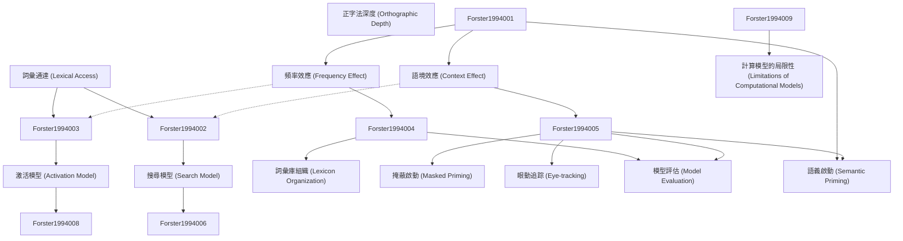

# Zettelkasten 卡片索引

**來源論文**: Computational Modeling and Elementary Process Analysis in Visual Word Recognition
**作者**: forster, kenneth i.
**年份**: None
**生成日期**: 2025-11-04 15:06
**卡片總數**: 12

---

## 📚 卡片清單

### 1. [詞彙通達 (Lexical Access)](zettel_cards/Forster-1994-001.md)
- **ID**: `Forster-1994-001`
- **類型**: 
- **核心**: "Lexical access is the process by which a word's meaning and other properties are retrieved from long-term memory."
- **標籤**: `詞彙辨識`, `認知心理學`, `記憶提取`

### 2. [頻率效應 (Frequency Effect)](zettel_cards/Forster-1994-002.md)
- **ID**: `Forster-1994-002`
- **類型**: 
- **核心**: "High-frequency words are typically recognized faster and more accurately than low-frequency words."
- **標籤**: `詞彙辨識`, `頻率`, `反應時間`

### 3. [語境效應 (Context Effect)](zettel_cards/Forster-1994-003.md)
- **ID**: `Forster-1994-003`
- **類型**: 
- **核心**: "The surrounding context can influence the speed and accuracy of word recognition."
- **標籤**: `詞彙辨識`, `語境`, `上下文`

### 4. [搜尋模型 (Search Model)](zettel_cards/Forster-1994-004.md)
- **ID**: `Forster-1994-004`
- **類型**: 
- **核心**: "In search models, word recognition involves a serial comparison of the input with stored lexical entries."
- **標籤**: `詞彙辨識`, `模型`, `序列搜尋`

### 5. [激活模型 (Activation Model)](zettel_cards/Forster-1994-005.md)
- **ID**: `Forster-1994-005`
- **類型**: 
- **核心**: "In activation models, word recognition involves the parallel activation of multiple lexical entries based on their similarity to the input."
- **標籤**: `詞彙辨識`, `模型`, `平行激活`

### 6. [詞彙庫組織 (Lexicon Organization)](zettel_cards/Forster-1994-006.md)
- **ID**: `Forster-1994-006`
- **類型**: 
- **核心**: "The way in which the mental lexicon is organized can influence the efficiency of lexical access."
- **標籤**: `詞彙辨識`, `詞彙庫`, `組織結構`

### 7. [掩蔽啟動 (Masked Priming)](zettel_cards/Forster-1994-007.md)
- **ID**: `Forster-1994-007`
- **類型**: 
- **核心**: "Masked priming involves presenting a prime stimulus briefly and masking it before presenting the target stimulus."
- **標籤**: `詞彙辨識`, `實驗方法`, `啟動效應`

### 8. [眼動追踪 (Eye-tracking)](zettel_cards/Forster-1994-008.md)
- **ID**: `Forster-1994-008`
- **類型**: 
- **核心**: "Eye-tracking is used to measure eye movements during reading to provide insights into cognitive processes."
- **標籤**: `詞彙辨識`, `實驗方法`, `眼動`

### 9. [模型評估 (Model Evaluation)](zettel_cards/Forster-1994-009.md)
- **ID**: `Forster-1994-009`
- **類型**: 
- **核心**: "Computational models are evaluated by comparing their predictions to empirical data."
- **標籤**: `詞彙辨識`, `計算模型`, `評估`

### 10. [語義啟動 (Semantic Priming)](zettel_cards/Forster-1994-010.md)
- **ID**: `Forster-1994-010`
- **類型**: 
- **核心**: "Recognition of a word is faster when preceded by a semantically related word."
- **標籤**: `詞彙辨識`, `語義`, `啟動效應`

### 11. [正字法深度 (Orthographic Depth)](zettel_cards/Forster-1994-011.md)
- **ID**: `Forster-1994-011`
- **類型**: 
- **核心**: "Orthographic depth refers to the consistency of grapheme-phoneme correspondences in a language."
- **標籤**: `詞彙辨識`, `正字法`, `語言學`

### 12. [計算模型的局限性 (Limitations of Computational Models)](zettel_cards/Forster-1994-012.md)
- **ID**: `Forster-1994-012`
- **類型**: 
- **核心**: "Existing computational models may not fully capture the complexity of human word recognition."
- **標籤**: `詞彙辨識`, `計算模型`, `局限性`

---

## 🗺️ 概念網絡圖

---

## 🏷️ 標籤索引

### 詞彙辨識
- [[Forster-1994-001]] 詞彙通達 (Lexical Access)
- [[Forster-1994-002]] 頻率效應 (Frequency Effect)
- [[Forster-1994-003]] 語境效應 (Context Effect)
- [[Forster-1994-004]] 搜尋模型 (Search Model)
- [[Forster-1994-005]] 激活模型 (Activation Model)
- [[Forster-1994-006]] 詞彙庫組織 (Lexicon Organization)
- [[Forster-1994-007]] 掩蔽啟動 (Masked Priming)
- [[Forster-1994-008]] 眼動追踪 (Eye-tracking)
- [[Forster-1994-009]] 模型評估 (Model Evaluation)
- [[Forster-1994-010]] 語義啟動 (Semantic Priming)
- [[Forster-1994-011]] 正字法深度 (Orthographic Depth)
- [[Forster-1994-012]] 計算模型的局限性 (Limitations of Computational Models)

### 認知心理學
- [[Forster-1994-001]] 詞彙通達 (Lexical Access)

### 記憶提取
- [[Forster-1994-001]] 詞彙通達 (Lexical Access)

### 頻率
- [[Forster-1994-002]] 頻率效應 (Frequency Effect)

### 反應時間
- [[Forster-1994-002]] 頻率效應 (Frequency Effect)

### 語境
- [[Forster-1994-003]] 語境效應 (Context Effect)

### 上下文
- [[Forster-1994-003]] 語境效應 (Context Effect)

### 模型
- [[Forster-1994-004]] 搜尋模型 (Search Model)
- [[Forster-1994-005]] 激活模型 (Activation Model)

### 序列搜尋
- [[Forster-1994-004]] 搜尋模型 (Search Model)

### 平行激活
- [[Forster-1994-005]] 激活模型 (Activation Model)

### 詞彙庫
- [[Forster-1994-006]] 詞彙庫組織 (Lexicon Organization)

### 組織結構
- [[Forster-1994-006]] 詞彙庫組織 (Lexicon Organization)

### 實驗方法
- [[Forster-1994-007]] 掩蔽啟動 (Masked Priming)
- [[Forster-1994-008]] 眼動追踪 (Eye-tracking)

### 啟動效應
- [[Forster-1994-007]] 掩蔽啟動 (Masked Priming)
- [[Forster-1994-010]] 語義啟動 (Semantic Priming)

### 眼動
- [[Forster-1994-008]] 眼動追踪 (Eye-tracking)

### 計算模型
- [[Forster-1994-009]] 模型評估 (Model Evaluation)
- [[Forster-1994-012]] 計算模型的局限性 (Limitations of Computational Models)

### 評估
- [[Forster-1994-009]] 模型評估 (Model Evaluation)

### 語義
- [[Forster-1994-010]] 語義啟動 (Semantic Priming)

### 正字法
- [[Forster-1994-011]] 正字法深度 (Orthographic Depth)

### 語言學
- [[Forster-1994-011]] 正字法深度 (Orthographic Depth)

### 局限性
- [[Forster-1994-012]] 計算模型的局限性 (Limitations of Computational Models)

---

## 📖 閱讀建議順序

1. [[Forster-1994-001]] 詞彙通達 (Lexical Access)

2. [[Forster-1994-002]] 頻率效應 (Frequency Effect)

3. [[Forster-1994-003]] 語境效應 (Context Effect)

4. [[Forster-1994-004]] 搜尋模型 (Search Model)

5. [[Forster-1994-005]] 激活模型 (Activation Model)

6. [[Forster-1994-006]] 詞彙庫組織 (Lexicon Organization)

7. [[Forster-1994-007]] 掩蔽啟動 (Masked Priming)

8. [[Forster-1994-008]] 眼動追踪 (Eye-tracking)

9. [[Forster-1994-009]] 模型評估 (Model Evaluation)

10. [[Forster-1994-010]] 語義啟動 (Semantic Priming)

11. [[Forster-1994-011]] 正字法深度 (Orthographic Depth)

12. [[Forster-1994-012]] 計算模型的局限性 (Limitations of Computational Models)

---

*本索引由 Knowledge Production System 自動生成*