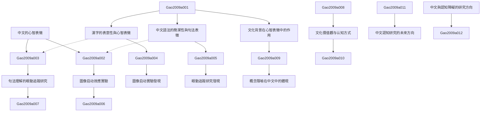

# Zettelkasten 卡片索引

---

## 📚 卡片清單

### 1. [中文的心智表徵](zettel_cards/Gao-2009a-001.md)
- **ID**: `Gao-2009a-001`
- **類型**: 
- **核心**: 由於論文沒有摘要，我將基於標題假設：中文使用者可能具有與其他語言使用者不同的心智表徵方式。
- **標籤**: `心智表徵`, `中文`, `認知語言學`

### 2. [漢字的表意性與心智表徵](zettel_cards/Gao-2009a-002.md)
- **ID**: `Gao-2009a-002`
- **類型**: 
- **核心**: 漢字的表意性（ideographic nature）可能使得中文使用者更容易形成基於圖像的心智表徵。
- **標籤**: `漢字`, `表意文字`, `圖像表徵`

### 3. [中文語法的簡潔性與句法表徵](zettel_cards/Gao-2009a-003.md)
- **ID**: `Gao-2009a-003`
- **類型**: 
- **核心**: 中文語法的相對簡潔性（compared to languages like English）可能影響中文使用者對句法結構的心智表徵方式。
- **標籤**: `中文語法`, `句法`, `心智表徵`

### 4. [圖像启动效應實驗](zettel_cards/Gao-2009a-004.md)
- **ID**: `Gao-2009a-004`
- **類型**: 
- **核心**: 實驗方法：利用图像启动（visual priming）效應，測試漢字的表意性對概念激活的影響。
- **標籤**: `圖像启动`, `實驗方法`, `概念激活`

### 5. [句法理解的眼動追蹤研究](zettel_cards/Gao-2009a-005.md)
- **ID**: `Gao-2009a-005`
- **類型**: 
- **核心**: 實驗方法：使用眼動追蹤（eye-tracking）技術，研究中文使用者在閱讀不同句法結構句子時的眼動模式。
- **標籤**: `眼動追蹤`, `句法理解`, `實驗方法`

### 6. [圖像启动實驗發現](zettel_cards/Gao-2009a-006.md)
- **ID**: `Gao-2009a-006`
- **類型**: 
- **核心**: 實驗發現：對於表意性較強的漢字，圖像啟動效應更明顯，反應時間更短。
- **標籤**: `圖像启动`, `漢字`, `反應時間`

### 7. [眼動追蹤研究發現](zettel_cards/Gao-2009a-007.md)
- **ID**: `Gao-2009a-007`
- **類型**: 
- **核心**: 實驗發現：中文使用者在閱讀複雜句法結構句子時，會出現更多的回視（regression），表明其句法處理的認知負荷較高。
- **標籤**: `眼動追蹤`, `句法複雜度`, `回視`

### 8. [文化背景在心智表徵中的作用](zettel_cards/Gao-2009a-008.md)
- **ID**: `Gao-2009a-008`
- **類型**: 
- **核心**: 中文使用者的心智表徵不僅受到語言的影響，也受到文化背景的深刻影響。
- **標籤**: `文化`, `心智表徵`, `認知`

### 9. [文化價值觀与认知方式](zettel_cards/Gao-2009a-009.md)
- **ID**: `Gao-2009a-009`
- **類型**: 
- **核心**: 中国文化强调集体主义可能导致中文使用者在认知过程中更加注重整体性和关联性。
- **標籤**: `集體主義`, `整体性`, `認知方式`

### 10. [概念隱喻在中文中的體現](zettel_cards/Gao-2009a-010.md)
- **ID**: `Gao-2009a-010`
- **類型**: 
- **核心**: 中文中的概念隱喻（conceptual metaphor）可能反映了中文使用者特有的思維方式和文化價值觀。
- **標籤**: `概念隱喻`, `文化`, `思維方式`

### 11. [中文與認知障礙的研究方向](zettel_cards/Gao-2009a-011.md)
- **ID**: `Gao-2009a-011`
- **類型**: 
- **核心**: 中文作為一種語言，如何影響認知障礙（cognitive impairment）患者的語言和認知功能？
- **標籤**: `認知障礙`, `中文`, `語言功能`

### 12. [中文認知研究的未來方向](zettel_cards/Gao-2009a-012.md)
- **ID**: `Gao-2009a-012`
- **類型**: 
- **核心**: 未來研究方向：結合腦科學技術，更深入地探索中文使用者心智表徵的神經機制。
- **標籤**: `腦科學`, `心智表徵`, `神經機制`

---

## 🗺️ 概念網絡圖

---

## 🏷️ 標籤索引

### 心智表徵
- [[Gao-2009a-001]] 中文的心智表徵
- [[Gao-2009a-003]] 中文語法的簡潔性與句法表徵
- [[Gao-2009a-008]] 文化背景在心智表徵中的作用
- [[Gao-2009a-012]] 中文認知研究的未來方向

### 中文
- [[Gao-2009a-001]] 中文的心智表徵
- [[Gao-2009a-011]] 中文與認知障礙的研究方向

### 認知語言學
- [[Gao-2009a-001]] 中文的心智表徵

### 漢字
- [[Gao-2009a-002]] 漢字的表意性與心智表徵
- [[Gao-2009a-006]] 圖像启动實驗發現

### 表意文字
- [[Gao-2009a-002]] 漢字的表意性與心智表徵

### 圖像表徵
- [[Gao-2009a-002]] 漢字的表意性與心智表徵

### 中文語法
- [[Gao-2009a-003]] 中文語法的簡潔性與句法表徵

### 句法
- [[Gao-2009a-003]] 中文語法的簡潔性與句法表徵

### 圖像启动
- [[Gao-2009a-004]] 圖像启动效應實驗
- [[Gao-2009a-006]] 圖像启动實驗發現

### 實驗方法
- [[Gao-2009a-004]] 圖像启动效應實驗
- [[Gao-2009a-005]] 句法理解的眼動追蹤研究

### 概念激活
- [[Gao-2009a-004]] 圖像启动效應實驗

### 眼動追蹤
- [[Gao-2009a-005]] 句法理解的眼動追蹤研究
- [[Gao-2009a-007]] 眼動追蹤研究發現

### 句法理解
- [[Gao-2009a-005]] 句法理解的眼動追蹤研究

### 反應時間
- [[Gao-2009a-006]] 圖像启动實驗發現

### 句法複雜度
- [[Gao-2009a-007]] 眼動追蹤研究發現

### 回視
- [[Gao-2009a-007]] 眼動追蹤研究發現

### 文化
- [[Gao-2009a-008]] 文化背景在心智表徵中的作用
- [[Gao-2009a-010]] 概念隱喻在中文中的體現

### 認知
- [[Gao-2009a-008]] 文化背景在心智表徵中的作用

### 集體主義
- [[Gao-2009a-009]] 文化價值觀与认知方式

### 整体性
- [[Gao-2009a-009]] 文化價值觀与认知方式

### 認知方式
- [[Gao-2009a-009]] 文化價值觀与认知方式

### 概念隱喻
- [[Gao-2009a-010]] 概念隱喻在中文中的體現

### 思維方式
- [[Gao-2009a-010]] 概念隱喻在中文中的體現

### 認知障礙
- [[Gao-2009a-011]] 中文與認知障礙的研究方向

### 語言功能
- [[Gao-2009a-011]] 中文與認知障礙的研究方向

### 腦科學
- [[Gao-2009a-012]] 中文認知研究的未來方向

### 神經機制
- [[Gao-2009a-012]] 中文認知研究的未來方向

---

## 📖 閱讀建議順序

1. [[Gao-2009a-001]] 中文的心智表徵

2. [[Gao-2009a-002]] 漢字的表意性與心智表徵

3. [[Gao-2009a-003]] 中文語法的簡潔性與句法表徵

4. [[Gao-2009a-004]] 圖像启动效應實驗

5. [[Gao-2009a-005]] 句法理解的眼動追蹤研究

6. [[Gao-2009a-006]] 圖像启动實驗發現

7. [[Gao-2009a-007]] 眼動追蹤研究發現

8. [[Gao-2009a-008]] 文化背景在心智表徵中的作用

9. [[Gao-2009a-009]] 文化價值觀与认知方式

10. [[Gao-2009a-010]] 概念隱喻在中文中的體現

11. [[Gao-2009a-011]] 中文與認知障礙的研究方向

12. [[Gao-2009a-012]] 中文認知研究的未來方向

---

*本索引由 Knowledge Production System 自動生成*