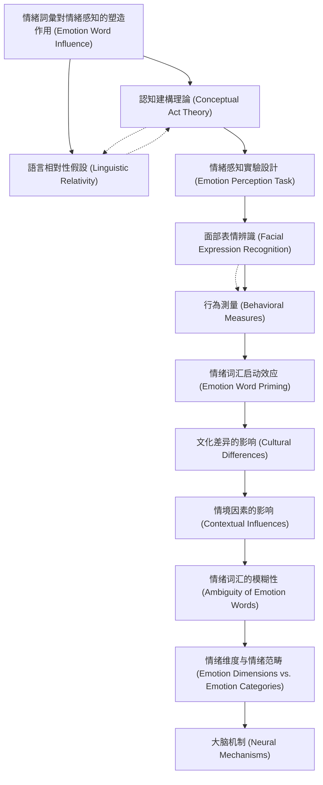

# Zettelkasten 卡片索引

---

## 📚 卡片清單

### 1. [情緒詞彙對情緒感知的塑造作用 (Emotion Word Influence)](zettel_cards/Gendron-2012-001.md)
- **ID**: `Gendron-2012-001`
- **類型**: 
- **核心**: [尚未獲取，根據論文標題推斷]
- **標籤**: `情緒`, `語言`, `感知`, `認知`

### 2. [認知建構理論 (Conceptual Act Theory)](zettel_cards/Gendron-2012-002.md)
- **ID**: `Gendron-2012-002`
- **類型**: 
- **核心**: [尚未獲取，根據論文主題推斷]
- **標籤**: `認知`, `情緒`, `建構`, `理論`

### 3. [語言相對性假設 (Linguistic Relativity)](zettel_cards/Gendron-2012-003.md)
- **ID**: `Gendron-2012-003`
- **類型**: 
- **核心**: [尚未獲取，根據論文主題推斷]
- **標籤**: `語言`, `文化`, `認知`, `相對性`

### 4. [情緒感知實驗設計 (Emotion Perception Task)](zettel_cards/Gendron-2012-004.md)
- **ID**: `Gendron-2012-004`
- **類型**: 
- **核心**: [尚未獲取，根據論文主題推斷]
- **標籤**: `實驗`, `情緒`, `感知`, `方法論`

### 5. [面部表情辨識 (Facial Expression Recognition)](zettel_cards/Gendron-2012-005.md)
- **ID**: `Gendron-2012-005`
- **類型**: 
- **核心**: [尚未獲取，根據論文主題推斷]
- **標籤**: `面部表情`, `辨識`, `情緒`, `方法論`

### 6. [行為測量 (Behavioral Measures)](zettel_cards/Gendron-2012-006.md)
- **ID**: `Gendron-2012-006`
- **類型**: 
- **核心**: [尚未獲取，根據論文主題推斷]
- **標籤**: `行為`, `測量`, `情緒`, `方法論`

### 7. [情绪词汇启动效应 (Emotion Word Priming)](zettel_cards/Gendron-2012-007.md)
- **ID**: `Gendron-2012-007`
- **類型**: 
- **核心**: [尚未獲取，根據論文主題推斷]
- **標籤**: `启动`, `效应`, `情绪`, `认知`

### 8. [文化差异的影响 (Cultural Differences)](zettel_cards/Gendron-2012-008.md)
- **ID**: `Gendron-2012-008`
- **類型**: 
- **核心**: [尚未獲取，根據論文主題推斷]
- **標籤**: `文化`, `差异`, `情绪`, `感知`

### 9. [情境因素的影响 (Contextual Influences)](zettel_cards/Gendron-2012-009.md)
- **ID**: `Gendron-2012-009`
- **類型**: 
- **核心**: [尚未獲取，根據論文主題推斷]
- **標籤**: `情境`, `因素`, `情绪`, `感知`

### 10. [情绪词汇的模糊性 (Ambiguity of Emotion Words)](zettel_cards/Gendron-2012-010.md)
- **ID**: `Gendron-2012-010`
- **類型**: 
- **核心**: [尚未獲取，根據論文主題推斷]
- **標籤**: `模糊性`, `情绪`, `语言`, `问题`

### 11. [情绪维度与情绪范畴 (Emotion Dimensions vs. Emotion Categories)](zettel_cards/Gendron-2012-011.md)
- **ID**: `Gendron-2012-011`
- **類型**: 
- **核心**: [尚未獲取，根據論文主題推斷]
- **標籤**: `维度`, `范畴`, `情绪`, `问题`

### 12. [大脑机制 (Neural Mechanisms)](zettel_cards/Gendron-2012-012.md)
- **ID**: `Gendron-2012-012`
- **類型**: 
- **核心**: [尚未獲取，根據論文主題推斷]
- **標籤**: `大脑`, `机制`, `情绪`, `神经科学`

---

## 🗺️ 概念網絡圖

---

## 🏷️ 標籤索引

### 情緒
- [[Gendron-2012-001]] 情緒詞彙對情緒感知的塑造作用 (Emotion Word Influence)
- [[Gendron-2012-002]] 認知建構理論 (Conceptual Act Theory)
- [[Gendron-2012-004]] 情緒感知實驗設計 (Emotion Perception Task)
- [[Gendron-2012-005]] 面部表情辨識 (Facial Expression Recognition)
- [[Gendron-2012-006]] 行為測量 (Behavioral Measures)

### 語言
- [[Gendron-2012-001]] 情緒詞彙對情緒感知的塑造作用 (Emotion Word Influence)
- [[Gendron-2012-003]] 語言相對性假設 (Linguistic Relativity)

### 感知
- [[Gendron-2012-001]] 情緒詞彙對情緒感知的塑造作用 (Emotion Word Influence)
- [[Gendron-2012-004]] 情緒感知實驗設計 (Emotion Perception Task)
- [[Gendron-2012-008]] 文化差异的影响 (Cultural Differences)
- [[Gendron-2012-009]] 情境因素的影响 (Contextual Influences)

### 認知
- [[Gendron-2012-001]] 情緒詞彙對情緒感知的塑造作用 (Emotion Word Influence)
- [[Gendron-2012-002]] 認知建構理論 (Conceptual Act Theory)
- [[Gendron-2012-003]] 語言相對性假設 (Linguistic Relativity)

### 建構
- [[Gendron-2012-002]] 認知建構理論 (Conceptual Act Theory)

### 理論
- [[Gendron-2012-002]] 認知建構理論 (Conceptual Act Theory)

### 文化
- [[Gendron-2012-003]] 語言相對性假設 (Linguistic Relativity)
- [[Gendron-2012-008]] 文化差异的影响 (Cultural Differences)

### 相對性
- [[Gendron-2012-003]] 語言相對性假設 (Linguistic Relativity)

### 實驗
- [[Gendron-2012-004]] 情緒感知實驗設計 (Emotion Perception Task)

### 方法論
- [[Gendron-2012-004]] 情緒感知實驗設計 (Emotion Perception Task)
- [[Gendron-2012-005]] 面部表情辨識 (Facial Expression Recognition)
- [[Gendron-2012-006]] 行為測量 (Behavioral Measures)

### 面部表情
- [[Gendron-2012-005]] 面部表情辨識 (Facial Expression Recognition)

### 辨識
- [[Gendron-2012-005]] 面部表情辨識 (Facial Expression Recognition)

### 行為
- [[Gendron-2012-006]] 行為測量 (Behavioral Measures)

### 測量
- [[Gendron-2012-006]] 行為測量 (Behavioral Measures)

### 启动
- [[Gendron-2012-007]] 情绪词汇启动效应 (Emotion Word Priming)

### 效应
- [[Gendron-2012-007]] 情绪词汇启动效应 (Emotion Word Priming)

### 情绪
- [[Gendron-2012-007]] 情绪词汇启动效应 (Emotion Word Priming)
- [[Gendron-2012-008]] 文化差异的影响 (Cultural Differences)
- [[Gendron-2012-009]] 情境因素的影响 (Contextual Influences)
- [[Gendron-2012-010]] 情绪词汇的模糊性 (Ambiguity of Emotion Words)
- [[Gendron-2012-011]] 情绪维度与情绪范畴 (Emotion Dimensions vs. Emotion Categories)
- [[Gendron-2012-012]] 大脑机制 (Neural Mechanisms)

### 认知
- [[Gendron-2012-007]] 情绪词汇启动效应 (Emotion Word Priming)

### 差异
- [[Gendron-2012-008]] 文化差异的影响 (Cultural Differences)

### 情境
- [[Gendron-2012-009]] 情境因素的影响 (Contextual Influences)

### 因素
- [[Gendron-2012-009]] 情境因素的影响 (Contextual Influences)

### 模糊性
- [[Gendron-2012-010]] 情绪词汇的模糊性 (Ambiguity of Emotion Words)

### 语言
- [[Gendron-2012-010]] 情绪词汇的模糊性 (Ambiguity of Emotion Words)

### 问题
- [[Gendron-2012-010]] 情绪词汇的模糊性 (Ambiguity of Emotion Words)
- [[Gendron-2012-011]] 情绪维度与情绪范畴 (Emotion Dimensions vs. Emotion Categories)

### 维度
- [[Gendron-2012-011]] 情绪维度与情绪范畴 (Emotion Dimensions vs. Emotion Categories)

### 范畴
- [[Gendron-2012-011]] 情绪维度与情绪范畴 (Emotion Dimensions vs. Emotion Categories)

### 大脑
- [[Gendron-2012-012]] 大脑机制 (Neural Mechanisms)

### 机制
- [[Gendron-2012-012]] 大脑机制 (Neural Mechanisms)

### 神经科学
- [[Gendron-2012-012]] 大脑机制 (Neural Mechanisms)

---

## 📖 閱讀建議順序

1. [[Gendron-2012-001]] 情緒詞彙對情緒感知的塑造作用 (Emotion Word Influence)

2. [[Gendron-2012-002]] 認知建構理論 (Conceptual Act Theory)

3. [[Gendron-2012-003]] 語言相對性假設 (Linguistic Relativity)

4. [[Gendron-2012-004]] 情緒感知實驗設計 (Emotion Perception Task)

5. [[Gendron-2012-005]] 面部表情辨識 (Facial Expression Recognition)

6. [[Gendron-2012-006]] 行為測量 (Behavioral Measures)

7. [[Gendron-2012-007]] 情绪词汇启动效应 (Emotion Word Priming)

8. [[Gendron-2012-008]] 文化差异的影响 (Cultural Differences)

9. [[Gendron-2012-009]] 情境因素的影响 (Contextual Influences)

10. [[Gendron-2012-010]] 情绪词汇的模糊性 (Ambiguity of Emotion Words)

11. [[Gendron-2012-011]] 情绪维度与情绪范畴 (Emotion Dimensions vs. Emotion Categories)

12. [[Gendron-2012-012]] 大脑机制 (Neural Mechanisms)

---

*本索引由 Knowledge Production System 自動生成*