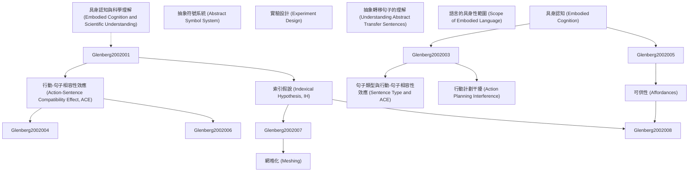

# Zettelkasten 卡片索引

---

## 📚 卡片清單

### 1. [具身認知 (Embodied Cognition)](zettel_cards/Glenberg-2002-001.md)
- **ID**: `Glenberg-2002-001`
- **類型**: 
- **核心**: "In contrast to meaning as an abstract symbol system, consider the possibility that meaning is embodied—that is, that it derives from the biomechanical nature of bodies and perceptual systems (Glenberg, 1997; Lakoff, 1987)."
- **標籤**: `具身認知`, `語言理解`, `認知科學`

### 2. [抽象符號系統 (Abstract Symbol System)](zettel_cards/Glenberg-2002-002.md)
- **ID**: `Glenberg-2002-002`
- **類型**: 
- **核心**: "The dominant approach is to treat language as a symbol manipulation system: Language conveys meaning by using abstract, amodal, and arbitrary symbols (i.e., words) combined by syntactic rules (e.g., Burgess & Lund, 1997; Chomsky, 1980; Fodor, 2000; Kintsch, 1988; Pinker, 1994)."
- **標籤**: `抽象符號`, `語言學`, `認知科學`

### 3. [行動-句子相容性效應 (Action-Sentence Compatibility Effect, ACE)](zettel_cards/Glenberg-2002-003.md)
- **ID**: `Glenberg-2002-003`
- **類型**: 
- **核心**: "When a sentence implied action in one direction (e.g., “Close the drawer” implies action away from the body), the participants had difficulty making a sensibility judgment requiring a response in the opposite direction."
- **標籤**: `ACE`, `具身認知`, `語言理解`, `行動干擾`

### 4. [句子類型與行動-句子相容性效應 (Sentence Type and ACE)](zettel_cards/Glenberg-2002-004.md)
- **ID**: `Glenberg-2002-004`
- **類型**: 
- **核心**: "The ACE was demonstrated for three sentences types: imperative sentences, sentences describing the transfer of concrete objects, and sentences describing the transfer of abstract entities, such as “Liz told you the story.”"
- **標籤**: `ACE`, `句子類型`, `具身認知`, `抽象概念`

### 5. [索引假說 (Indexical Hypothesis, IH)](zettel_cards/Glenberg-2002-005.md)
- **ID**: `Glenberg-2002-005`
- **類型**: 
- **核心**: "According to the IH, three processes transform words and syntax into an action-based meaning. First, words and phrases are indexed or mapped to perceptual symbols (Barsalou, 1999; Stanfield & Zwaan, 2001)."
- **標籤**: `索引假說`, `知覺符號`, `具身認知`, `意義建構`

### 6. [行動計劃干擾 (Action Planning Interference)](zettel_cards/Glenberg-2002-006.md)
- **ID**: `Glenberg-2002-006`
- **類型**: 
- **核心**: "If this simulation requires the same neural systems as the planning and guidance of real action, understanding a toward sentence should interfere with making a movement away from the body to indicate yes (yes-is-far), and understanding an away sentence should interfere with making a movement toward the body (yes-is-near)."
- **標籤**: `行動計劃`, `神經系統`, `具身認知`, `干擾效應`

### 7. [可供性 (Affordances)](zettel_cards/Glenberg-2002-007.md)
- **ID**: `Glenberg-2002-007`
- **類型**: 
- **核心**: "Second, affordances are derived from the perceptual symbols (Glenberg & Robertson, 2000; Kaschak & Glenberg, 2000)."
- **標籤**: `可供性`, `知覺符號`, `行動`, `具身認知`

### 8. [網格化 (Meshing)](zettel_cards/Glenberg-2002-008.md)
- **ID**: `Glenberg-2002-008`
- **類型**: 
- **核心**: "The third process specified by the IH is that affordances are meshed under the guidance of syntactic constructions (Kaschak & Glenberg, 2000)."
- **標籤**: `網格化`, `可供性`, `語法結構`, `行動計劃`, `具身認知`

### 9. [實驗設計 (Experiment Design)](zettel_cards/Glenberg-2002-009.md)
- **ID**: `Glenberg-2002-009`
- **類型**: 
- **核心**: "Participants judged whether sentences were sensible by making a response that required moving toward or away from their bodies."
- **標籤**: `實驗設計`, `行動判斷`, `句子理解`, `相容性效應`

### 10. [抽象轉移句子的理解 (Understanding Abstract Transfer Sentences)](zettel_cards/Glenberg-2002-010.md)
- **ID**: `Glenberg-2002-010`
- **類型**: 
- **核心**: "How does grammatical information guide the meshing of affordances? According to construction grammarians (e.g., Goldberg, 1995; Kay & Fillmore, 1999; Michaelis & Lambrecht, 1996), constructions carry a general meaning that is not dependent on the particular lexical items in the sentence."
- **標籤**: `抽象轉移`, `語法結構`, `網格化`, `具身認知`

### 11. [語言的具身性範圍 (Scope of Embodied Language)](zettel_cards/Glenberg-2002-011.md)
- **ID**: `Glenberg-2002-011`
- **類型**: 
- **核心**: "What is the scope of this analysis? Clearly, our data illustrate an action-based understanding for only a limited set of English constructions."
- **標籤**: `具身性`, `語言`, `範圍`, `局限性`

### 12. [具身認知與科學理解 (Embodied Cognition and Scientific Understanding)](zettel_cards/Glenberg-2002-012.md)
- **ID**: `Glenberg-2002-012`
- **類型**: 
- **核心**: "Ochs et al. noted that this sort of explicit bodily identification was used just when the scientists were having a difficult time understanding a new hypothesis."
- **標籤**: `具身認知`, `科學理解`, `身體經驗`, `抽象概念`

---

## 🗺️ 概念網絡圖

---

## 🏷️ 標籤索引

### 具身認知
- [[Glenberg-2002-001]] 具身認知 (Embodied Cognition)
- [[Glenberg-2002-003]] 行動-句子相容性效應 (Action-Sentence Compatibility Effect, ACE)
- [[Glenberg-2002-004]] 句子類型與行動-句子相容性效應 (Sentence Type and ACE)
- [[Glenberg-2002-005]] 索引假說 (Indexical Hypothesis, IH)
- [[Glenberg-2002-006]] 行動計劃干擾 (Action Planning Interference)
- [[Glenberg-2002-007]] 可供性 (Affordances)
- [[Glenberg-2002-008]] 網格化 (Meshing)
- [[Glenberg-2002-010]] 抽象轉移句子的理解 (Understanding Abstract Transfer Sentences)
- [[Glenberg-2002-012]] 具身認知與科學理解 (Embodied Cognition and Scientific Understanding)

### 語言理解
- [[Glenberg-2002-001]] 具身認知 (Embodied Cognition)
- [[Glenberg-2002-003]] 行動-句子相容性效應 (Action-Sentence Compatibility Effect, ACE)

### 認知科學
- [[Glenberg-2002-001]] 具身認知 (Embodied Cognition)
- [[Glenberg-2002-002]] 抽象符號系統 (Abstract Symbol System)

### 抽象符號
- [[Glenberg-2002-002]] 抽象符號系統 (Abstract Symbol System)

### 語言學
- [[Glenberg-2002-002]] 抽象符號系統 (Abstract Symbol System)

### ACE
- [[Glenberg-2002-003]] 行動-句子相容性效應 (Action-Sentence Compatibility Effect, ACE)
- [[Glenberg-2002-004]] 句子類型與行動-句子相容性效應 (Sentence Type and ACE)

### 行動干擾
- [[Glenberg-2002-003]] 行動-句子相容性效應 (Action-Sentence Compatibility Effect, ACE)

### 句子類型
- [[Glenberg-2002-004]] 句子類型與行動-句子相容性效應 (Sentence Type and ACE)

### 抽象概念
- [[Glenberg-2002-004]] 句子類型與行動-句子相容性效應 (Sentence Type and ACE)
- [[Glenberg-2002-012]] 具身認知與科學理解 (Embodied Cognition and Scientific Understanding)

### 索引假說
- [[Glenberg-2002-005]] 索引假說 (Indexical Hypothesis, IH)

### 知覺符號
- [[Glenberg-2002-005]] 索引假說 (Indexical Hypothesis, IH)
- [[Glenberg-2002-007]] 可供性 (Affordances)

### 意義建構
- [[Glenberg-2002-005]] 索引假說 (Indexical Hypothesis, IH)

### 行動計劃
- [[Glenberg-2002-006]] 行動計劃干擾 (Action Planning Interference)
- [[Glenberg-2002-008]] 網格化 (Meshing)

### 神經系統
- [[Glenberg-2002-006]] 行動計劃干擾 (Action Planning Interference)

### 干擾效應
- [[Glenberg-2002-006]] 行動計劃干擾 (Action Planning Interference)

### 可供性
- [[Glenberg-2002-007]] 可供性 (Affordances)
- [[Glenberg-2002-008]] 網格化 (Meshing)

### 行動
- [[Glenberg-2002-007]] 可供性 (Affordances)

### 網格化
- [[Glenberg-2002-008]] 網格化 (Meshing)
- [[Glenberg-2002-010]] 抽象轉移句子的理解 (Understanding Abstract Transfer Sentences)

### 語法結構
- [[Glenberg-2002-008]] 網格化 (Meshing)
- [[Glenberg-2002-010]] 抽象轉移句子的理解 (Understanding Abstract Transfer Sentences)

### 實驗設計
- [[Glenberg-2002-009]] 實驗設計 (Experiment Design)

### 行動判斷
- [[Glenberg-2002-009]] 實驗設計 (Experiment Design)

### 句子理解
- [[Glenberg-2002-009]] 實驗設計 (Experiment Design)

### 相容性效應
- [[Glenberg-2002-009]] 實驗設計 (Experiment Design)

### 抽象轉移
- [[Glenberg-2002-010]] 抽象轉移句子的理解 (Understanding Abstract Transfer Sentences)

### 具身性
- [[Glenberg-2002-011]] 語言的具身性範圍 (Scope of Embodied Language)

### 語言
- [[Glenberg-2002-011]] 語言的具身性範圍 (Scope of Embodied Language)

### 範圍
- [[Glenberg-2002-011]] 語言的具身性範圍 (Scope of Embodied Language)

### 局限性
- [[Glenberg-2002-011]] 語言的具身性範圍 (Scope of Embodied Language)

### 科學理解
- [[Glenberg-2002-012]] 具身認知與科學理解 (Embodied Cognition and Scientific Understanding)

### 身體經驗
- [[Glenberg-2002-012]] 具身認知與科學理解 (Embodied Cognition and Scientific Understanding)

---

## 📖 閱讀建議順序

1. [[Glenberg-2002-001]] 具身認知 (Embodied Cognition)

2. [[Glenberg-2002-002]] 抽象符號系統 (Abstract Symbol System)

3. [[Glenberg-2002-003]] 行動-句子相容性效應 (Action-Sentence Compatibility Effect, ACE)

4. [[Glenberg-2002-004]] 句子類型與行動-句子相容性效應 (Sentence Type and ACE)

5. [[Glenberg-2002-005]] 索引假說 (Indexical Hypothesis, IH)

6. [[Glenberg-2002-006]] 行動計劃干擾 (Action Planning Interference)

7. [[Glenberg-2002-007]] 可供性 (Affordances)

8. [[Glenberg-2002-008]] 網格化 (Meshing)

9. [[Glenberg-2002-009]] 實驗設計 (Experiment Design)

10. [[Glenberg-2002-010]] 抽象轉移句子的理解 (Understanding Abstract Transfer Sentences)

11. [[Glenberg-2002-011]] 語言的具身性範圍 (Scope of Embodied Language)

12. [[Glenberg-2002-012]] 具身認知與科學理解 (Embodied Cognition and Scientific Understanding)

---

*本索引由 Knowledge Production System 自動生成*