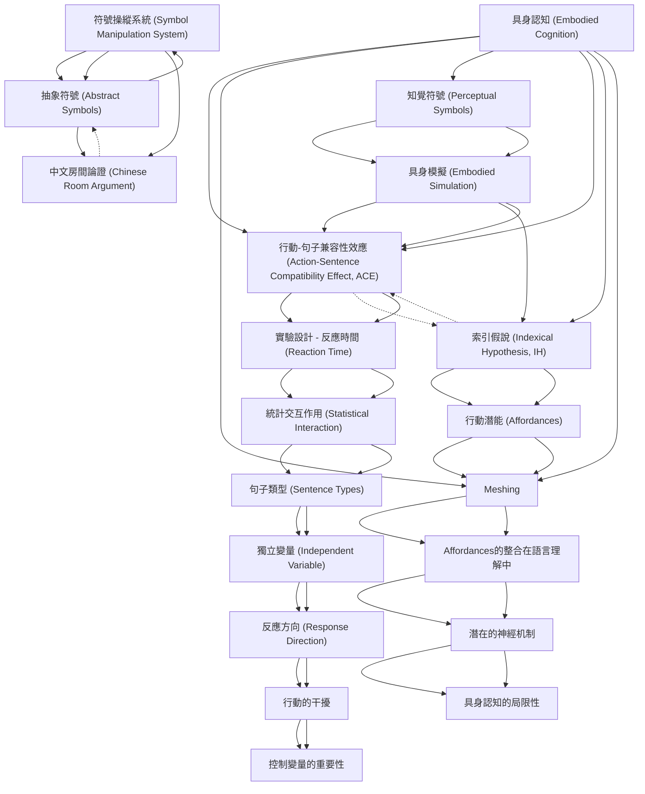

# Zettelkasten 卡片索引

**來源論文**: Glenberg2002_Embodied_Cognition
**作者**: 
**年份**: 2025
**生成日期**: 2025-10-29 16:24
**卡片總數**: 20

---

## 📚 卡片清單

### 1. [具身認知 (Embodied Cognition)](zettel_cards/CogSci-20251029-001.md)
- **ID**: `CogSci-20251029-001`
- **類型**: 
- **核心**: "Here, we reporta new phenomenonthat discriminatesbetweentheseapproaches.Wedemonstrate thatmerelycomprehendingasentencethatimpliesactioninonedirection(e.g.,“Closethedrawer”impliesaction awayfromthebody)interfereswithrealactionintheoppositedirection(e.g.,movementtowardthebody)."
- **標籤**: `具身認知`, `語言理解`, `行動`, `認知科學`

### 2. [符號操縱系統 (Symbol Manipulation System)](zettel_cards/CogSci-20251029-002.md)
- **ID**: `CogSci-20251029-002`
- **類型**: 
- **核心**: "The dominant approachistotreatlanguageasasym- bolmanipulationsystem:Languageconveysmeaningby usingabstract,amodal,andarbitrarysymbols(i.e.,words) combinedbysyntacticrules"
- **標籤**: `符號主義`, `語言`, `認知`, `人工智慧`

### 3. [抽象符號 (Abstract Symbols)](zettel_cards/CogSci-20251029-003.md)
- **ID**: `CogSci-20251029-003`
- **類型**: 
- **核心**: "Wordsareabstractinthatthesameword,suchas “chair,”isusedforbigchairsandlittlechairs,wordsare amodal in that the same word is used when chairs are spokenaboutorwrittenabout,andwordsarearbitrarily relatedtotheirreferents"
- **標籤**: `抽象`, `符號`, `語言`, `意義`

### 4. [知覺符號 (Perceptual Symbols)](zettel_cards/CogSci-20251029-004.md)
- **ID**: `CogSci-20251029-004`
- **類型**: 
- **核心**: "Unlikeab- stract symbols,perceptualsymbolsare modal and non- arbitrary. They are based on thebrain states underlying theperceptionofthereferent."
- **標籤**: `知覺`, `符號`, `具身`, `模擬`

### 5. [具身模擬 (Embodied Simulation)](zettel_cards/CogSci-20251029-005.md)
- **ID**: `CogSci-20251029-005`
- **類型**: 
- **核心**: "theIHproposesthatlanguageismademeaningful by cognitively simulating the actions implied by sen- tences."
- **標籤**: `模擬`, `語言`, `具身`, `行動`

### 6. [中文房間論證 (Chinese Room Argument)](zettel_cards/CogSci-20251029-006.md)
- **ID**: `CogSci-20251029-006`
- **類型**: 
- **核心**: "Harnad’s (1990) versionofSearle’s(1980)“ChineseRoom”argumentpro- videsacompellingintuitionastowhymeaningcannotbe conveyedsolelybythesyntacticrelationsamongabstract symbols."
- **標籤**: `中文房間`, `意義`, `符號主義`, `哲學`

### 7. [行動-句子兼容性效應 (Action-Sentence Compatibility Effect, ACE)](zettel_cards/CogSci-20251029-007.md)
- **ID**: `CogSci-20251029-007`
- **類型**: 
- **核心**: "Whenasentenceimpliedactioninonedirection(e.g.,“Closethedrawer”impliesactionawayfromthebody),theparticipantshaddifficultymakingasensibilityjudgmentrequiringaresponseintheoppositedirection."
- **標籤**: `ACE`, `行動`, `語言`, `兼容性`

### 8. [索引假說 (Indexical Hypothesis, IH)](zettel_cards/CogSci-20251029-008.md)
- **ID**: `CogSci-20251029-008`
- **類型**: 
- **核心**: "Onesuchaccountisprovidedbytheindexicalhypothesis (IH), which proposes that meaning is based on action"
- **標籤**: `索引`, `意義`, `行動`, `具身`

### 9. [行動潛能 (Affordances)](zettel_cards/CogSci-20251029-009.md)
- **ID**: `CogSci-20251029-009`
- **類型**: 
- **核心**: "Affordancesare potentialinter- actionsbetweenbodiesandobjects"
- **標籤**: `行動潛能`, `物體`, `環境`, `知覺`

### 10. [實驗設計 - 反應時間 (Reaction Time)](zettel_cards/CogSci-20251029-010.md)
- **ID**: `CogSci-20251029-010`
- **類型**: 
- **核心**: "Themajordependentvariablewasthetimebe- tween presentation of the sentence and release of the middlebutton(tomovetothenearorthefarbutton),cor- respondingto the time to read and understandthe sen- tenceandtobegintomakethesensibilityresponse."
- **標籤**: `反應時間`, `實驗設計`, `語言理解`, `測量`

### 11. [Meshing](zettel_cards/CogSci-20251029-011.md)
- **ID**: `CogSci-20251029-011`
- **類型**: 
- **核心**: "The set of actions results from meshing(i.e., smoothly integrating) affordances to accomplish action-based goals."
- **標籤**: `Meshing`, `affordances`, `行動目標`, `整合`

### 12. [統計交互作用 (Statistical Interaction)](zettel_cards/CogSci-20251029-012.md)
- **ID**: `CogSci-20251029-012`
- **類型**: 
- **核心**: "Becausewedidnotcontrol forthefinedetailsofthesentences(e.g.,length,frequency of words) or for any intrinsicdifferences in ease of re- sponsedirection,thepredictionwasforastatisticalinter- actionbetweenimpliedsentencedirectionandactualre- sponsedirection."
- **標籤**: `統計`, `交互作用`, `實驗結果`, `預測`

### 13. [句子類型 (Sentence Types)](zettel_cards/CogSci-20251029-013.md)
- **ID**: `CogSci-20251029-013`
- **類型**: 
- **核心**: "TheACEwasdemonstratedforthreesen- tencestypes:imperativesentences,sentencesdescribingthetransferofconcreteobjects,andsentences describingthetransferofabstractentities,suchas“Liztoldyouthestory.”"
- **標籤**: `句子類型`, `實驗刺激`, `語言`, `抽象`

### 14. [獨立變量 (Independent Variable)](zettel_cards/CogSci-20251029-014.md)
- **ID**: `CogSci-20251029-014`
- **類型**: 
- **核心**: "independentvariable,impliedsentencedirection(toward/ away),wasmanipulatedforthesensiblesentences."
- **標籤**: `獨立變量`, `實驗設計`, `句子方向`, `行動方向`

### 15. [反應方向 (Response Direction)](zettel_cards/CogSci-20251029-015.md)
- **ID**: `CogSci-20251029-015`
- **類型**: 
- **核心**: "The actual response direction (yes-is-near/yes-is-far) was manipulated..."
- **標籤**: `反應方向`, `實驗設計`, `按鈕`, `兼容性`

### 16. [Affordances的整合在語言理解中](zettel_cards/CogSci-20251029-016.md)
- **ID**: `CogSci-20251029-016`
- **類型**: 
- **核心**: "thegrammaticalformofthesentence directs a cognitivesimulationthat combines,for exam- ple,theaffordancesofanuprightvacuumcleanerandof a coatto accomplishthegoalof hangingupthecoat."
- **標籤**: `語法`, `認知模擬`, `affordance`, `行動目標`

### 17. [行動的干擾](zettel_cards/CogSci-20251029-017.md)
- **ID**: `CogSci-20251029-017`
- **類型**: 
- **核心**: "understandingatowardsentence shouldinterferewithmakingamovementawayfromthe bodyto indicateyes (yes-is-far), and understanding an awaysentenceshouldinterferewithmakingamovement towardthebody(yes-is-near)."
- **標籤**: `干擾`, `行動`, `語言`, `具身`

### 18. [控制變量的重要性](zettel_cards/CogSci-20251029-018.md)
- **ID**: `CogSci-20251029-018`
- **類型**: 
- **核心**: "Becausewedidnotcontrol forthefinedetailsofthesentences(e.g.,length,frequency of words) or for any intrinsicdifferences in ease of re- sponsedirection..."
- **標籤**: `控制變量`, `實驗設計`, `精確性`, `句子長度`

### 19. [潛在的神經机制](zettel_cards/CogSci-20251029-019.md)
- **ID**: `CogSci-20251029-019`
- **類型**: 
- **核心**: "If thissimulationre- quires the same neural systems as the planning and guidanceofrealaction..."
- **標籤**: `神經機制`, `模擬`, `行動`, `規劃`

### 20. [具身認知的局限性](zettel_cards/CogSci-20251029-020.md)
- **ID**: `CogSci-20251029-020`
- **類型**: 
- **核心**: Howlanguageconveysmeaningremainsanopenques- tion.
- **標籤**: `局限性`, `意義`, `語言`, `具身`

---

## 🗺️ 概念網絡圖

---

## 🏷️ 標籤索引

### 具身認知
- [[CogSci-20251029-001]] 具身認知 (Embodied Cognition)

### 語言理解
- [[CogSci-20251029-001]] 具身認知 (Embodied Cognition)
- [[CogSci-20251029-010]] 實驗設計 - 反應時間 (Reaction Time)

### 行動
- [[CogSci-20251029-001]] 具身認知 (Embodied Cognition)
- [[CogSci-20251029-005]] 具身模擬 (Embodied Simulation)
- [[CogSci-20251029-007]] 行動-句子兼容性效應 (Action-Sentence Compatibility Effect, ACE)
- [[CogSci-20251029-008]] 索引假說 (Indexical Hypothesis, IH)
- [[CogSci-20251029-017]] 行動的干擾
- [[CogSci-20251029-019]] 潛在的神經机制

### 認知科學
- [[CogSci-20251029-001]] 具身認知 (Embodied Cognition)

### 符號主義
- [[CogSci-20251029-002]] 符號操縱系統 (Symbol Manipulation System)
- [[CogSci-20251029-006]] 中文房間論證 (Chinese Room Argument)

### 語言
- [[CogSci-20251029-002]] 符號操縱系統 (Symbol Manipulation System)
- [[CogSci-20251029-003]] 抽象符號 (Abstract Symbols)
- [[CogSci-20251029-005]] 具身模擬 (Embodied Simulation)
- [[CogSci-20251029-007]] 行動-句子兼容性效應 (Action-Sentence Compatibility Effect, ACE)
- [[CogSci-20251029-013]] 句子類型 (Sentence Types)
- [[CogSci-20251029-017]] 行動的干擾
- [[CogSci-20251029-020]] 具身認知的局限性

### 認知
- [[CogSci-20251029-002]] 符號操縱系統 (Symbol Manipulation System)

### 人工智慧
- [[CogSci-20251029-002]] 符號操縱系統 (Symbol Manipulation System)

### 抽象
- [[CogSci-20251029-003]] 抽象符號 (Abstract Symbols)
- [[CogSci-20251029-013]] 句子類型 (Sentence Types)

### 符號
- [[CogSci-20251029-003]] 抽象符號 (Abstract Symbols)
- [[CogSci-20251029-004]] 知覺符號 (Perceptual Symbols)

### 意義
- [[CogSci-20251029-003]] 抽象符號 (Abstract Symbols)
- [[CogSci-20251029-006]] 中文房間論證 (Chinese Room Argument)
- [[CogSci-20251029-008]] 索引假說 (Indexical Hypothesis, IH)
- [[CogSci-20251029-020]] 具身認知的局限性

### 知覺
- [[CogSci-20251029-004]] 知覺符號 (Perceptual Symbols)
- [[CogSci-20251029-009]] 行動潛能 (Affordances)

### 具身
- [[CogSci-20251029-004]] 知覺符號 (Perceptual Symbols)
- [[CogSci-20251029-005]] 具身模擬 (Embodied Simulation)
- [[CogSci-20251029-008]] 索引假說 (Indexical Hypothesis, IH)
- [[CogSci-20251029-017]] 行動的干擾
- [[CogSci-20251029-020]] 具身認知的局限性

### 模擬
- [[CogSci-20251029-004]] 知覺符號 (Perceptual Symbols)
- [[CogSci-20251029-005]] 具身模擬 (Embodied Simulation)
- [[CogSci-20251029-019]] 潛在的神經机制

### 中文房間
- [[CogSci-20251029-006]] 中文房間論證 (Chinese Room Argument)

### 哲學
- [[CogSci-20251029-006]] 中文房間論證 (Chinese Room Argument)

### ACE
- [[CogSci-20251029-007]] 行動-句子兼容性效應 (Action-Sentence Compatibility Effect, ACE)

### 兼容性
- [[CogSci-20251029-007]] 行動-句子兼容性效應 (Action-Sentence Compatibility Effect, ACE)
- [[CogSci-20251029-015]] 反應方向 (Response Direction)

### 索引
- [[CogSci-20251029-008]] 索引假說 (Indexical Hypothesis, IH)

### 行動潛能
- [[CogSci-20251029-009]] 行動潛能 (Affordances)

### 物體
- [[CogSci-20251029-009]] 行動潛能 (Affordances)

### 環境
- [[CogSci-20251029-009]] 行動潛能 (Affordances)

### 反應時間
- [[CogSci-20251029-010]] 實驗設計 - 反應時間 (Reaction Time)

### 實驗設計
- [[CogSci-20251029-010]] 實驗設計 - 反應時間 (Reaction Time)
- [[CogSci-20251029-014]] 獨立變量 (Independent Variable)
- [[CogSci-20251029-015]] 反應方向 (Response Direction)
- [[CogSci-20251029-018]] 控制變量的重要性

### 測量
- [[CogSci-20251029-010]] 實驗設計 - 反應時間 (Reaction Time)

### Meshing
- [[CogSci-20251029-011]] Meshing

### affordances
- [[CogSci-20251029-011]] Meshing

### 行動目標
- [[CogSci-20251029-011]] Meshing
- [[CogSci-20251029-016]] Affordances的整合在語言理解中

### 整合
- [[CogSci-20251029-011]] Meshing

### 統計
- [[CogSci-20251029-012]] 統計交互作用 (Statistical Interaction)

### 交互作用
- [[CogSci-20251029-012]] 統計交互作用 (Statistical Interaction)

### 實驗結果
- [[CogSci-20251029-012]] 統計交互作用 (Statistical Interaction)

### 預測
- [[CogSci-20251029-012]] 統計交互作用 (Statistical Interaction)

### 句子類型
- [[CogSci-20251029-013]] 句子類型 (Sentence Types)

### 實驗刺激
- [[CogSci-20251029-013]] 句子類型 (Sentence Types)

### 獨立變量
- [[CogSci-20251029-014]] 獨立變量 (Independent Variable)

### 句子方向
- [[CogSci-20251029-014]] 獨立變量 (Independent Variable)

### 行動方向
- [[CogSci-20251029-014]] 獨立變量 (Independent Variable)

### 反應方向
- [[CogSci-20251029-015]] 反應方向 (Response Direction)

### 按鈕
- [[CogSci-20251029-015]] 反應方向 (Response Direction)

### 語法
- [[CogSci-20251029-016]] Affordances的整合在語言理解中

### 認知模擬
- [[CogSci-20251029-016]] Affordances的整合在語言理解中

### affordance
- [[CogSci-20251029-016]] Affordances的整合在語言理解中

### 干擾
- [[CogSci-20251029-017]] 行動的干擾

### 控制變量
- [[CogSci-20251029-018]] 控制變量的重要性

### 精確性
- [[CogSci-20251029-018]] 控制變量的重要性

### 句子長度
- [[CogSci-20251029-018]] 控制變量的重要性

### 神經機制
- [[CogSci-20251029-019]] 潛在的神經机制

### 規劃
- [[CogSci-20251029-019]] 潛在的神經机制

### 局限性
- [[CogSci-20251029-020]] 具身認知的局限性

---

## 📖 閱讀建議順序

1. [[CogSci-20251029-006]] 中文房間論證 (Chinese Room Argument)

2. [[CogSci-20251029-018]] 控制變量的重要性

3. [[CogSci-20251029-020]] 具身認知的局限性

4. [[CogSci-20251029-003]] 抽象符號 (Abstract Symbols)

5. [[CogSci-20251029-004]] 知覺符號 (Perceptual Symbols)

6. [[CogSci-20251029-005]] 具身模擬 (Embodied Simulation)

7. [[CogSci-20251029-007]] 行動-句子兼容性效應 (Action-Sentence Compatibility Effect, ACE)

8. [[CogSci-20251029-008]] 索引假說 (Indexical Hypothesis, IH)

9. [[CogSci-20251029-009]] 行動潛能 (Affordances)

10. [[CogSci-20251029-010]] 實驗設計 - 反應時間 (Reaction Time)

11. [[CogSci-20251029-011]] Meshing

12. [[CogSci-20251029-012]] 統計交互作用 (Statistical Interaction)

13. [[CogSci-20251029-013]] 句子類型 (Sentence Types)

14. [[CogSci-20251029-014]] 獨立變量 (Independent Variable)

15. [[CogSci-20251029-015]] 反應方向 (Response Direction)

16. [[CogSci-20251029-016]] Affordances的整合在語言理解中

17. [[CogSci-20251029-017]] 行動的干擾

18. [[CogSci-20251029-019]] 潛在的神經机制

19. [[CogSci-20251029-002]] 符號操縱系統 (Symbol Manipulation System)

20. [[CogSci-20251029-001]] 具身認知 (Embodied Cognition)

---

*本索引由 Knowledge Production System 自動生成*