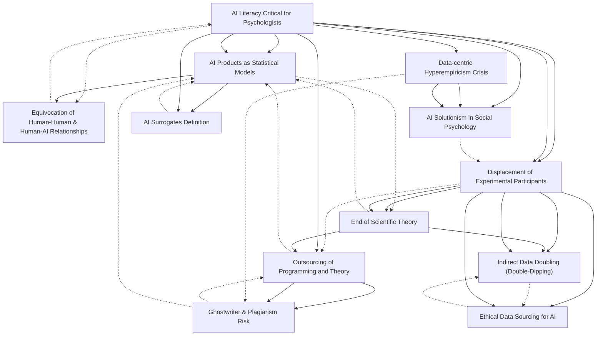

# Zettelkasten 卡片索引

**來源論文**: AI Literacy
**作者**: 
**年份**: 2025
**生成日期**: 2025-10-31 00:38
**卡片總數**: 12

---

## 📚 卡片清單

### 1. [AI Literacy Critical for Psychologists](zettel_cards/CogSci-20251031-001.md)
- **ID**: `CogSci-20251031-001`
- **類型**: 
- **核心**: Critical Artificial Intelligence Literacy for Psychologists
- **標籤**: `AI`, `Literacy`, `Psychology`

### 2. [AI Products as Statistical Models](zettel_cards/CogSci-20251031-002.md)
- **ID**: `CogSci-20251031-002`
- **類型**: 
- **核心**: AI products are statistical models, akin to logistic regression, which all statistics psychologists undergraduate students are required to have a familiarity with.
- **標籤**: `AI`, `Statistics`, `Methodology`

### 3. [Displacement of Experimental Participants](zettel_cards/CogSci-20251031-003.md)
- **ID**: `CogSci-20251031-003`
- **類型**: 
- **核心**: the displacement of experimental participants with opaque AI products;
- **標籤**: `Ethics`, `AI`, `Displacement`

### 4. [Outsourcing of Programming and Theory](zettel_cards/CogSci-20251031-004.md)
- **ID**: `CogSci-20251031-004`
- **類型**: 
- **核心**: the outsourcing of programming, writing, and scientific theorizing to such models.
- **標籤**: `AI`, `Open Science`, `Methodology`

### 5. [Ghostwriter & Plagiarism Risk](zettel_cards/CogSci-20251031-005.md)
- **ID**: `CogSci-20251031-005`
- **類型**: 
- **核心**: The fabrication of ‘I can use AI for understanding non‑existent citations which makes claims worse than baseless because they appear supported by prior work’.
- **標籤**: `AI`, `Ethics`, `Plagiarism`

### 6. [End of Scientific Theory](zettel_cards/CogSci-20251031-006.md)
- **ID**: `CogSci-20251031-006`
- **類型**: 
- **核心**: The End of Scientific Theory – This not only adds to the displacement of work from its evidential and historical basis, but also impedes our theorising about phenomena and systems under study.
- **標籤**: `AI`, `Theory`, `Methodology`

### 7. [Equivocation of Human‑Human & Human‑AI Relationships](zettel_cards/CogSci-20251031-007.md)
- **ID**: `CogSci-20251031-007`
- **類型**: 
- **核心**: Seeing client‑therapist, student‑teacher, patient‑doctor, friendship, or romantic relationships Human & Human‑AI as equivalent to those between people and artifacts.
- **標籤**: `AI`, `Ethics`, `Relationships`

### 8. [Data‑centric Hyperempiricism Crisis](zettel_cards/CogSci-20251031-008.md)
- **ID**: `CogSci-20251031-008`
- **類型**: 
- **核心**: In the 2010s, a crisis started in data‑centric hyperempiricist chology.
- **標籤**: `Psychology`, `Crisis`, `Data`

### 9. [AI Solutionism in Social Psychology](zettel_cards/CogSci-20251031-009.md)
- **ID**: `CogSci-20251031-009`
- **類型**: 
- **核心**: AI solutionism has come for social psych.
- **標籤**: `AI`, `Psychology`, `Solutionism`

### 10. [AI Surrogates Definition](zettel_cards/CogSci-20251031-010.md)
- **ID**: `CogSci-20251031-010`
- **類型**: 
- **核心**: AI surrogates are AI models used to simulate human research participants to generate new knowledge about human cognition and behavior.
- **標籤**: `AI`, `Simulation`, `Psychology`

### 11. [Indirect Data Doubling (Double‑Dipping)](zettel_cards/CogSci-20251031-011.md)
- **ID**: `CogSci-20251031-011`
- **類型**: 
- **核心**: The output can contain indirect original input data (i.e. doubledipping).
- **標籤**: `AI`, `Ethics`, `Data Integrity`

### 12. [Ethical Data Sourcing for AI](zettel_cards/CogSci-20251031-012.md)
- **ID**: `CogSci-20251031-012`
- **類型**: 
- **核心**: The provision of the data used in these models indicates that it is not ethically sourced, falling below standards for our discipline …
- **標籤**: `AI`, `Ethics`, `Data`

---

## 🗺️ 概念網絡圖

---

## 🏷️ 標籤索引

### AI
- [[CogSci-20251031-001]] AI Literacy Critical for Psychologists
- [[CogSci-20251031-002]] AI Products as Statistical Models
- [[CogSci-20251031-003]] Displacement of Experimental Participants
- [[CogSci-20251031-004]] Outsourcing of Programming and Theory
- [[CogSci-20251031-005]] Ghostwriter & Plagiarism Risk
- [[CogSci-20251031-006]] End of Scientific Theory
- [[CogSci-20251031-007]] Equivocation of Human‑Human & Human‑AI Relationships
- [[CogSci-20251031-009]] AI Solutionism in Social Psychology
- [[CogSci-20251031-010]] AI Surrogates Definition
- [[CogSci-20251031-011]] Indirect Data Doubling (Double‑Dipping)
- [[CogSci-20251031-012]] Ethical Data Sourcing for AI

### Literacy
- [[CogSci-20251031-001]] AI Literacy Critical for Psychologists

### Psychology
- [[CogSci-20251031-001]] AI Literacy Critical for Psychologists
- [[CogSci-20251031-008]] Data‑centric Hyperempiricism Crisis
- [[CogSci-20251031-009]] AI Solutionism in Social Psychology
- [[CogSci-20251031-010]] AI Surrogates Definition

### Statistics
- [[CogSci-20251031-002]] AI Products as Statistical Models

### Methodology
- [[CogSci-20251031-002]] AI Products as Statistical Models
- [[CogSci-20251031-004]] Outsourcing of Programming and Theory
- [[CogSci-20251031-006]] End of Scientific Theory

### Ethics
- [[CogSci-20251031-003]] Displacement of Experimental Participants
- [[CogSci-20251031-005]] Ghostwriter & Plagiarism Risk
- [[CogSci-20251031-007]] Equivocation of Human‑Human & Human‑AI Relationships
- [[CogSci-20251031-011]] Indirect Data Doubling (Double‑Dipping)
- [[CogSci-20251031-012]] Ethical Data Sourcing for AI

### Displacement
- [[CogSci-20251031-003]] Displacement of Experimental Participants

### Open Science
- [[CogSci-20251031-004]] Outsourcing of Programming and Theory

### Plagiarism
- [[CogSci-20251031-005]] Ghostwriter & Plagiarism Risk

### Theory
- [[CogSci-20251031-006]] End of Scientific Theory

### Relationships
- [[CogSci-20251031-007]] Equivocation of Human‑Human & Human‑AI Relationships

### Crisis
- [[CogSci-20251031-008]] Data‑centric Hyperempiricism Crisis

### Data
- [[CogSci-20251031-008]] Data‑centric Hyperempiricism Crisis
- [[CogSci-20251031-012]] Ethical Data Sourcing for AI

### Solutionism
- [[CogSci-20251031-009]] AI Solutionism in Social Psychology

### Simulation
- [[CogSci-20251031-010]] AI Surrogates Definition

### Data Integrity
- [[CogSci-20251031-011]] Indirect Data Doubling (Double‑Dipping)

---

## 📖 閱讀建議順序

1. [[CogSci-20251031-005]] Ghostwriter & Plagiarism Risk

2. [[CogSci-20251031-006]] End of Scientific Theory

3. [[CogSci-20251031-007]] Equivocation of Human‑Human & Human‑AI Relationships

4. [[CogSci-20251031-009]] AI Solutionism in Social Psychology

5. [[CogSci-20251031-010]] AI Surrogates Definition

6. [[CogSci-20251031-011]] Indirect Data Doubling (Double‑Dipping)

7. [[CogSci-20251031-012]] Ethical Data Sourcing for AI

8. [[CogSci-20251031-002]] AI Products as Statistical Models

9. [[CogSci-20251031-004]] Outsourcing of Programming and Theory

10. [[CogSci-20251031-008]] Data‑centric Hyperempiricism Crisis

11. [[CogSci-20251031-003]] Displacement of Experimental Participants

12. [[CogSci-20251031-001]] AI Literacy Critical for Psychologists

---

*本索引由 Knowledge Production System 自動生成*