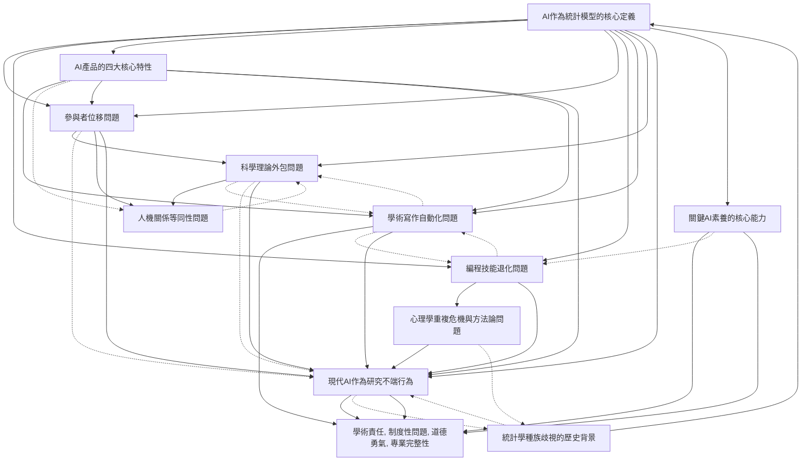

# Zettelkasten 卡片索引

**來源論文**: Critical AI Literacy for Psychologists
**作者**: 
**年份**: 2025
**生成日期**: 2025-10-31 11:04
**卡片總數**: 12

---

## 📚 卡片清單

### 1. [AI作為統計模型的核心定義](zettel_cards/CogSci-20251031-001.md)
- **ID**: `CogSci-20251031-001`
- **類型**: 
- **核心**: "Herein we take the stance that AI is most usefully seen as a series of technology products that have the following properties: • are sophisticated statistical models"
- **標籤**: `AI定義`, `統計模型`, `心理學方法論`, `概念澄清`

### 2. [AI產品的四大核心特性](zettel_cards/CogSci-20251031-002.md)
- **ID**: `CogSci-20251031-002`
- **類型**: 
- **核心**: "• depend on vast swaths of data, which is mostly stolen or otherwise unethically obtained or refined"
- **標籤**: `AI倫理`, `數據來源`, `技術特性`, `社會影響`

### 3. [參與者位移問題](zettel_cards/CogSci-20251031-003.md)
- **ID**: `CogSci-20251031-003`
- **類型**: 
- **核心**: "Displacement of Participants: I can use AI instead of participants to perform tasks and generate data"
- **標籤**: `研究方法論`, `參與者角色`, `數據生成`, `科學有效性`

### 4. [編程技能退化問題](zettel_cards/CogSci-20251031-004.md)
- **ID**: `CogSci-20251031-004`
- **類型**: 
- **核心**: "Outsourcing Programming to Companies: I can use AI for programming experimental paradigms and statistical analyses"
- **標籤**: `技能退化`, `專業能力`, `學術自主性`, `開源科學`

### 5. [學術寫作自動化問題](zettel_cards/CogSci-20251031-005.md)
- **ID**: `CogSci-20251031-005`
- **類型**: 
- **核心**: "Ghostwriter in the Machine: I can use AI for understanding the literature and for scholarly writing"
- **標籤**: `學術誠信`, `寫作自動化`, `引用問題`, `學術責任`

### 6. [科學理論外包問題](zettel_cards/CogSci-20251031-006.md)
- **ID**: `CogSci-20251031-006`
- **類型**: 
- **核心**: "The End of Scientific Theory: I can outsource verbal theorising to AI or use it as a formal cognitive model"
- **標籤**: `科學理論`, `理論建構`, `認知模型`, `科學責任`

### 7. [人機關係等同性問題](zettel_cards/CogSci-20251031-007.md)
- **ID**: `CogSci-20251031-007`
- **類型**: 
- **核心**: "Equivocation of Human-Human & Human-AI: Seeing client-therapist, student-teacher, patient-doctor, friendship, or romantic relationships as equivalent to those between people and artifacts"
- **標籤**: `關係等同性`, `社會心理學`, `去人性化的風險`, `互動分類`

### 8. [現代AI作為研究不端行為](zettel_cards/CogSci-20251031-008.md)
- **ID**: `CogSci-20251031-008`
- **類型**: 
- **核心**: "Ultimately, contemporary artificial intelligence is research misconduct"
- **標籤**: `研究不端`, `科學誠信`, `學術責任`, `定義問題`

### 9. [統計學種族歧視的歷史背景](zettel_cards/CogSci-20251031-009.md)
- **ID**: `CogSci-20251031-009`
- **類型**: 
- **核心**: "Most serious are the eugenics roots of modern statistics and psychometrics, which gave rise to pseudoscientific theories like physiognomy and phrenology, which in turn provided scientific cover for racism, sexism, classism, ableism, and ultimately genocide"
- **標籤**: `歷史背景`, `種族歧視`, `心理測量學`, `統計學批判`

### 10. [心理學重複危機與方法論問題](zettel_cards/CogSci-20251031-010.md)
- **ID**: `CogSci-20251031-010`
- **類型**: 
- **核心**: "In the 2010s, a crisis started in data-centric hyperempiricist disciplines, infamously including social psychology, resulting in a loss of faith in our data, our use of statistical methods, and ultimately our published work"
- **標籤**: `重複危機`, `方法論問題`, `社會心理學`, `統計方法`

### 11. [關鍵AI素養的核心能力](zettel_cards/CogSci-20251031-011.md)
- **ID**: `CogSci-20251031-011`
- **類型**: 
- **核心**: "As is knowing basic open science principles. Therefore, it should come as no shock that assuming the mantle of the non-expert here is inappropriate, and in fact may even be a form of QRP to abandon critical thinking"
- **標籤**: `AI素養`, `開源科學`, `批判性思維`, `專業能力`

### 12. [學術責任, 制度性問題, 道德勇氣, 專業完整性](zettel_cards/CogSci-20251031-012.md)
- **ID**: `CogSci-20251031-012`
- **類型**: 
- **核心**: "if our colleagues are, accidentally or otherwise, promoting such ideas in exchange for salary, grants, or citations, how are we as academic psychologists meant to react?"
- **標籤**: `學術責任`, `制度性問題`, `道德勇氣`, `專業完整性`

---

## 🗺️ 概念網絡圖

---

## 🏷️ 標籤索引

### AI定義
- [[CogSci-20251031-001]] AI作為統計模型的核心定義

### 統計模型
- [[CogSci-20251031-001]] AI作為統計模型的核心定義

### 心理學方法論
- [[CogSci-20251031-001]] AI作為統計模型的核心定義

### 概念澄清
- [[CogSci-20251031-001]] AI作為統計模型的核心定義

### AI倫理
- [[CogSci-20251031-002]] AI產品的四大核心特性

### 數據來源
- [[CogSci-20251031-002]] AI產品的四大核心特性

### 技術特性
- [[CogSci-20251031-002]] AI產品的四大核心特性

### 社會影響
- [[CogSci-20251031-002]] AI產品的四大核心特性

### 研究方法論
- [[CogSci-20251031-003]] 參與者位移問題

### 參與者角色
- [[CogSci-20251031-003]] 參與者位移問題

### 數據生成
- [[CogSci-20251031-003]] 參與者位移問題

### 科學有效性
- [[CogSci-20251031-003]] 參與者位移問題

### 技能退化
- [[CogSci-20251031-004]] 編程技能退化問題

### 專業能力
- [[CogSci-20251031-004]] 編程技能退化問題
- [[CogSci-20251031-011]] 關鍵AI素養的核心能力

### 學術自主性
- [[CogSci-20251031-004]] 編程技能退化問題

### 開源科學
- [[CogSci-20251031-004]] 編程技能退化問題
- [[CogSci-20251031-011]] 關鍵AI素養的核心能力

### 學術誠信
- [[CogSci-20251031-005]] 學術寫作自動化問題

### 寫作自動化
- [[CogSci-20251031-005]] 學術寫作自動化問題

### 引用問題
- [[CogSci-20251031-005]] 學術寫作自動化問題

### 學術責任
- [[CogSci-20251031-005]] 學術寫作自動化問題
- [[CogSci-20251031-008]] 現代AI作為研究不端行為
- [[CogSci-20251031-012]] 學術責任, 制度性問題, 道德勇氣, 專業完整性

### 科學理論
- [[CogSci-20251031-006]] 科學理論外包問題

### 理論建構
- [[CogSci-20251031-006]] 科學理論外包問題

### 認知模型
- [[CogSci-20251031-006]] 科學理論外包問題

### 科學責任
- [[CogSci-20251031-006]] 科學理論外包問題

### 關係等同性
- [[CogSci-20251031-007]] 人機關係等同性問題

### 社會心理學
- [[CogSci-20251031-007]] 人機關係等同性問題
- [[CogSci-20251031-010]] 心理學重複危機與方法論問題

### 去人性化的風險
- [[CogSci-20251031-007]] 人機關係等同性問題

### 互動分類
- [[CogSci-20251031-007]] 人機關係等同性問題

### 研究不端
- [[CogSci-20251031-008]] 現代AI作為研究不端行為

### 科學誠信
- [[CogSci-20251031-008]] 現代AI作為研究不端行為

### 定義問題
- [[CogSci-20251031-008]] 現代AI作為研究不端行為

### 歷史背景
- [[CogSci-20251031-009]] 統計學種族歧視的歷史背景

### 種族歧視
- [[CogSci-20251031-009]] 統計學種族歧視的歷史背景

### 心理測量學
- [[CogSci-20251031-009]] 統計學種族歧視的歷史背景

### 統計學批判
- [[CogSci-20251031-009]] 統計學種族歧視的歷史背景

### 重複危機
- [[CogSci-20251031-010]] 心理學重複危機與方法論問題

### 方法論問題
- [[CogSci-20251031-010]] 心理學重複危機與方法論問題

### 統計方法
- [[CogSci-20251031-010]] 心理學重複危機與方法論問題

### AI素養
- [[CogSci-20251031-011]] 關鍵AI素養的核心能力

### 批判性思維
- [[CogSci-20251031-011]] 關鍵AI素養的核心能力

### 制度性問題
- [[CogSci-20251031-012]] 學術責任, 制度性問題, 道德勇氣, 專業完整性

### 道德勇氣
- [[CogSci-20251031-012]] 學術責任, 制度性問題, 道德勇氣, 專業完整性

### 專業完整性
- [[CogSci-20251031-012]] 學術責任, 制度性問題, 道德勇氣, 專業完整性

---

## 📖 閱讀建議順序

1. [[CogSci-20251031-007]] 人機關係等同性問題

2. [[CogSci-20251031-009]] 統計學種族歧視的歷史背景

3. [[CogSci-20251031-010]] 心理學重複危機與方法論問題

4. [[CogSci-20251031-012]] 學術責任, 制度性問題, 道德勇氣, 專業完整性

5. [[CogSci-20251031-004]] 編程技能退化問題

6. [[CogSci-20251031-005]] 學術寫作自動化問題

7. [[CogSci-20251031-006]] 科學理論外包問題

8. [[CogSci-20251031-008]] 現代AI作為研究不端行為

9. [[CogSci-20251031-011]] 關鍵AI素養的核心能力

10. [[CogSci-20251031-003]] 參與者位移問題

11. [[CogSci-20251031-002]] AI產品的四大核心特性

12. [[CogSci-20251031-001]] AI作為統計模型的核心定義

---

*本索引由 Knowledge Production System 自動生成*