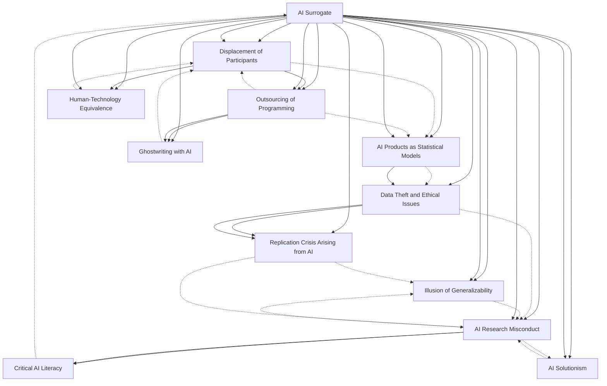

# Zettelkasten 卡片索引

**來源論文**: Critical AI Literacy for Psychologists (GPT)
**作者**: 
**年份**: 2025
**生成日期**: 2025-10-31 11:06
**卡片總數**: 12

---

## 📚 卡片清單

### 1. [AI Surrogate](zettel_cards/CogSci-20251031-001.md)
- **ID**: `CogSci-20251031-001`
- **類型**: 
- **核心**: AI surrogates are AI models used to simulate human research participants to generate new knowledge about human cognition and behavior.
- **標籤**: `AI`, `surrogate`, `modeling`

### 2. [Displacement of Participants](zettel_cards/CogSci-20251031-002.md)
- **ID**: `CogSci-20251031-002`
- **類型**: 
- **核心**: the displacement of experimental participants with opaque AI products
- **標籤**: `displacement`, `participants`, `AI`

### 3. [Outsourcing of Programming](zettel_cards/CogSci-20251031-003.md)
- **ID**: `CogSci-20251031-003`
- **類型**: 
- **核心**: the outsourcing of programming, writing, and even scientific theorising to such models
- **標籤**: `outsourcing`, `programming`, `AI`

### 4. [Human‑Technology Equivalence](zettel_cards/CogSci-20251031-004.md)
- **ID**: `CogSci-20251031-004`
- **類型**: 
- **核心**: the notion that human-technology interactions could be on the same footing as human-human(e.g.,client-therapist,student-teacher,patient-doctor,friendship,orromantic)relationships
- **標籤**: `interaction`, `equivalence`, `AI`

### 5. [AI Products as Statistical Models](zettel_cards/CogSci-20251031-005.md)
- **ID**: `CogSci-20251031-005`
- **類型**: 
- **核心**: AI products are statistical models, akintologisticregression, which all Statistics psychologistsfromundergraduatestudentsare requiredtohaveafamiliaritywith.
- **標籤**: `statisticalmodels`, `AIproducts`, `logisticregression`

### 6. [Data Theft and Ethical Issues](zettel_cards/CogSci-20251031-006.md)
- **ID**: `CogSci-20251031-006`
- **類型**: 
- **核心**: vast swathes of data, which is most often stolen or unethically obtained or refined
- **標籤**: `dataethics`, `theft`, `privacy`

### 7. [Illusion of Generalizability](zettel_cards/CogSci-20251031-007.md)
- **ID**: `CogSci-20251031-007`
- **類型**: 
- **核心**: the illusion of generalizability refers to the mistaken belief that research findings apply more broadly than they actually do.
- **標籤**: `generalizability`, `illusion`, `research`

### 8. [AI Solutionism](zettel_cards/CogSci-20251031-008.md)
- **ID**: `CogSci-20251031-008`
- **類型**: 
- **核心**: AI solutionism has come for social psychology
- **標籤**: `solutionism`, `AI`, `psychology`

### 9. [AI Research Misconduct](zettel_cards/CogSci-20251031-009.md)
- **ID**: `CogSci-20251031-009`
- **類型**: 
- **核心**: Ultimately, contemporary AI is research misconduct.
- **標籤**: `misconduct`, `AI`, `research`

### 10. [Critical AI Literacy](zettel_cards/CogSci-20251031-010.md)
- **ID**: `CogSci-20251031-010`
- **類型**: 
- **核心**: Critical Artificial Intelligence Literacy for Psychologists
- **標籤**: `AIliteracy`, `psychology`, `critical`

### 11. [Ghostwriting with AI](zettel_cards/CogSci-20251031-011.md)
- **ID**: `CogSci-20251031-011`
- **類型**: 
- **核心**: GhostwriterintheMa- This practice implicatesaswatheofissuesakintoautomatingthepapermill
- **標籤**: `ghostwriting`, `plagiarism`, `AI`

### 12. [Replication Crisis Arising from AI](zettel_cards/CogSci-20251031-012.md)
- **ID**: `CogSci-20251031-012`
- **類型**: 
- **核心**: the replication crisis,wherepsy-cistdata-centricsearchangeunfold—alsointhe2010s,andalso chological findings fell into dis(re)pute due to allegedly mis-spreading to many fields
- **標籤**: `replicationcrisis`, `data`, `statisticalmodels`

---

## 🗺️ 概念網絡圖

---

## 🏷️ 標籤索引

### AI
- [[CogSci-20251031-001]] AI Surrogate
- [[CogSci-20251031-002]] Displacement of Participants
- [[CogSci-20251031-003]] Outsourcing of Programming
- [[CogSci-20251031-004]] Human‑Technology Equivalence
- [[CogSci-20251031-008]] AI Solutionism
- [[CogSci-20251031-009]] AI Research Misconduct
- [[CogSci-20251031-011]] Ghostwriting with AI

### surrogate
- [[CogSci-20251031-001]] AI Surrogate

### modeling
- [[CogSci-20251031-001]] AI Surrogate

### displacement
- [[CogSci-20251031-002]] Displacement of Participants

### participants
- [[CogSci-20251031-002]] Displacement of Participants

### outsourcing
- [[CogSci-20251031-003]] Outsourcing of Programming

### programming
- [[CogSci-20251031-003]] Outsourcing of Programming

### interaction
- [[CogSci-20251031-004]] Human‑Technology Equivalence

### equivalence
- [[CogSci-20251031-004]] Human‑Technology Equivalence

### statisticalmodels
- [[CogSci-20251031-005]] AI Products as Statistical Models
- [[CogSci-20251031-012]] Replication Crisis Arising from AI

### AIproducts
- [[CogSci-20251031-005]] AI Products as Statistical Models

### logisticregression
- [[CogSci-20251031-005]] AI Products as Statistical Models

### dataethics
- [[CogSci-20251031-006]] Data Theft and Ethical Issues

### theft
- [[CogSci-20251031-006]] Data Theft and Ethical Issues

### privacy
- [[CogSci-20251031-006]] Data Theft and Ethical Issues

### generalizability
- [[CogSci-20251031-007]] Illusion of Generalizability

### illusion
- [[CogSci-20251031-007]] Illusion of Generalizability

### research
- [[CogSci-20251031-007]] Illusion of Generalizability
- [[CogSci-20251031-009]] AI Research Misconduct

### solutionism
- [[CogSci-20251031-008]] AI Solutionism

### psychology
- [[CogSci-20251031-008]] AI Solutionism
- [[CogSci-20251031-010]] Critical AI Literacy

### misconduct
- [[CogSci-20251031-009]] AI Research Misconduct

### AIliteracy
- [[CogSci-20251031-010]] Critical AI Literacy

### critical
- [[CogSci-20251031-010]] Critical AI Literacy

### ghostwriting
- [[CogSci-20251031-011]] Ghostwriting with AI

### plagiarism
- [[CogSci-20251031-011]] Ghostwriting with AI

### replicationcrisis
- [[CogSci-20251031-012]] Replication Crisis Arising from AI

### data
- [[CogSci-20251031-012]] Replication Crisis Arising from AI

---

## 📖 閱讀建議順序

1. [[CogSci-20251031-002]] Displacement of Participants

2. [[CogSci-20251031-004]] Human‑Technology Equivalence

3. [[CogSci-20251031-007]] Illusion of Generalizability

4. [[CogSci-20251031-008]] AI Solutionism

5. [[CogSci-20251031-010]] Critical AI Literacy

6. [[CogSci-20251031-011]] Ghostwriting with AI

7. [[CogSci-20251031-012]] Replication Crisis Arising from AI

8. [[CogSci-20251031-003]] Outsourcing of Programming

9. [[CogSci-20251031-005]] AI Products as Statistical Models

10. [[CogSci-20251031-006]] Data Theft and Ethical Issues

11. [[CogSci-20251031-009]] AI Research Misconduct

12. [[CogSci-20251031-001]] AI Surrogate

---

*本索引由 Knowledge Production System 自動生成*