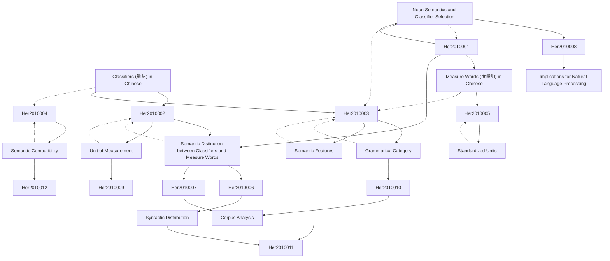

# Zettelkasten 卡片索引

**來源論文**: On the Semantic Distinction between Classifiers and Measure Words in Chinese
**作者**: her, one-soon, hsieh, c. t.
**年份**: None
**生成日期**: 2025-11-04 14:58
**卡片總數**: 12

---

## 📚 卡片清單

### 1. [Classifiers (量詞) in Chinese](zettel_cards/Her-2010-001.md)
- **ID**: `Her-2010-001`
- **類型**: 
- **核心**: (基於標題推斷) Classifiers are grammatical words that specify the type or quantity of a noun in Chinese.
- **標籤**: `量詞`, `中文語法`, `名詞修飾`

### 2. [Measure Words (度量詞) in Chinese](zettel_cards/Her-2010-002.md)
- **ID**: `Her-2010-002`
- **類型**: 
- **核心**: (基於標題推斷) Measure words are a type of quantifier that specify a standard unit of measurement.
- **標籤**: `度量詞`, `中文語法`, `計量單位`

### 3. [Semantic Distinction between Classifiers and Measure Words](zettel_cards/Her-2010-003.md)
- **ID**: `Her-2010-003`
- **類型**: 
- **核心**: (基於標題推斷) This paper investigates the semantic differences that distinguish classifiers from measure words in Chinese.
- **標籤**: `語義區別`, `量詞`, `度量詞`

### 4. [Noun Semantics and Classifier Selection](zettel_cards/Her-2010-004.md)
- **ID**: `Her-2010-004`
- **類型**: 
- **核心**: (基於推斷) The semantics of the noun influences the selection of appropriate classifiers.
- **標籤**: `名詞語義`, `量詞選擇`, `語法關係`

### 5. [Unit of Measurement](zettel_cards/Her-2010-005.md)
- **ID**: `Her-2010-005`
- **類型**: 
- **核心**: (基於推斷) Measure words express a standardized unit of measurement, either conventional or contextually defined.
- **標籤**: `計量單位`, `度量詞`, `標準化`

### 6. [Grammatical Category](zettel_cards/Her-2010-006.md)
- **ID**: `Her-2010-006`
- **類型**: 
- **核心**: (基於推斷) Classifiers and measure words belong to distinct grammatical categories within the larger category of quantifiers.
- **標籤**: `語法範疇`, `量詞`, `度量詞`

### 7. [Semantic Features](zettel_cards/Her-2010-007.md)
- **ID**: `Her-2010-007`
- **類型**: 
- **核心**: (基於推斷) The distinction between classifiers and measure words hinges on their differing semantic features.
- **標籤**: `語義特徵`, `量詞`, `度量詞`

### 8. [Semantic Compatibility](zettel_cards/Her-2010-008.md)
- **ID**: `Her-2010-008`
- **類型**: 
- **核心**: (基於推斷) Classifiers must be semantically compatible with the nouns they modify.
- **標籤**: `語義兼容性`, `量詞`, `名詞`

### 9. [Standardized Units](zettel_cards/Her-2010-009.md)
- **ID**: `Her-2010-009`
- **類型**: 
- **核心**: (基於推斷) Measure words inherently involve standardized or conventionalized units.
- **標籤**: `標準化`, `度量詞`, `單位`

### 10. [Syntactic Distribution](zettel_cards/Her-2010-010.md)
- **ID**: `Her-2010-010`
- **類型**: 
- **核心**: (基於推斷) Analyzing the syntactic distribution of classifiers and measure words can reveal their grammatical differences.
- **標籤**: `句法分佈`, `量詞`, `度量詞`, `語法分析`

### 11. [Corpus Analysis](zettel_cards/Her-2010-011.md)
- **ID**: `Her-2010-011`
- **類型**: 
- **核心**: (基於推斷) A corpus analysis can be used to identify the semantic features and syntactic patterns associated with classifiers and measure words.
- **標籤**: `語料庫分析`, `量詞`, `度量詞`, `語義特徵`, `句法模式`

### 12. [Implications for Natural Language Processing](zettel_cards/Her-2010-012.md)
- **ID**: `Her-2010-012`
- **類型**: 
- **核心**: (基於推斷) Understanding the semantic distinction between classifiers and measure words is crucial for improving the accuracy of natural language processing systems.
- **標籤**: `自然語言處理`, `量詞`, `度量詞`, `語義理解`

---

## 🗺️ 概念網絡圖

---

## 🏷️ 標籤索引

### 量詞
- [[Her-2010-001]] Classifiers (量詞) in Chinese
- [[Her-2010-003]] Semantic Distinction between Classifiers and Measure Words
- [[Her-2010-006]] Grammatical Category
- [[Her-2010-007]] Semantic Features
- [[Her-2010-008]] Semantic Compatibility
- [[Her-2010-010]] Syntactic Distribution
- [[Her-2010-011]] Corpus Analysis
- [[Her-2010-012]] Implications for Natural Language Processing

### 中文語法
- [[Her-2010-001]] Classifiers (量詞) in Chinese
- [[Her-2010-002]] Measure Words (度量詞) in Chinese

### 名詞修飾
- [[Her-2010-001]] Classifiers (量詞) in Chinese

### 度量詞
- [[Her-2010-002]] Measure Words (度量詞) in Chinese
- [[Her-2010-003]] Semantic Distinction between Classifiers and Measure Words
- [[Her-2010-005]] Unit of Measurement
- [[Her-2010-006]] Grammatical Category
- [[Her-2010-007]] Semantic Features
- [[Her-2010-009]] Standardized Units
- [[Her-2010-010]] Syntactic Distribution
- [[Her-2010-011]] Corpus Analysis
- [[Her-2010-012]] Implications for Natural Language Processing

### 計量單位
- [[Her-2010-002]] Measure Words (度量詞) in Chinese
- [[Her-2010-005]] Unit of Measurement

### 語義區別
- [[Her-2010-003]] Semantic Distinction between Classifiers and Measure Words

### 名詞語義
- [[Her-2010-004]] Noun Semantics and Classifier Selection

### 量詞選擇
- [[Her-2010-004]] Noun Semantics and Classifier Selection

### 語法關係
- [[Her-2010-004]] Noun Semantics and Classifier Selection

### 標準化
- [[Her-2010-005]] Unit of Measurement
- [[Her-2010-009]] Standardized Units

### 語法範疇
- [[Her-2010-006]] Grammatical Category

### 語義特徵
- [[Her-2010-007]] Semantic Features
- [[Her-2010-011]] Corpus Analysis

### 語義兼容性
- [[Her-2010-008]] Semantic Compatibility

### 名詞
- [[Her-2010-008]] Semantic Compatibility

### 單位
- [[Her-2010-009]] Standardized Units

### 句法分佈
- [[Her-2010-010]] Syntactic Distribution

### 語法分析
- [[Her-2010-010]] Syntactic Distribution

### 語料庫分析
- [[Her-2010-011]] Corpus Analysis

### 句法模式
- [[Her-2010-011]] Corpus Analysis

### 自然語言處理
- [[Her-2010-012]] Implications for Natural Language Processing

### 語義理解
- [[Her-2010-012]] Implications for Natural Language Processing

---

## 📖 閱讀建議順序

1. [[Her-2010-001]] Classifiers (量詞) in Chinese

2. [[Her-2010-002]] Measure Words (度量詞) in Chinese

3. [[Her-2010-003]] Semantic Distinction between Classifiers and Measure Words

4. [[Her-2010-004]] Noun Semantics and Classifier Selection

5. [[Her-2010-005]] Unit of Measurement

6. [[Her-2010-006]] Grammatical Category

7. [[Her-2010-007]] Semantic Features

8. [[Her-2010-008]] Semantic Compatibility

9. [[Her-2010-009]] Standardized Units

10. [[Her-2010-010]] Syntactic Distribution

11. [[Her-2010-011]] Corpus Analysis

12. [[Her-2010-012]] Implications for Natural Language Processing

---

*本索引由 Knowledge Production System 自動生成*