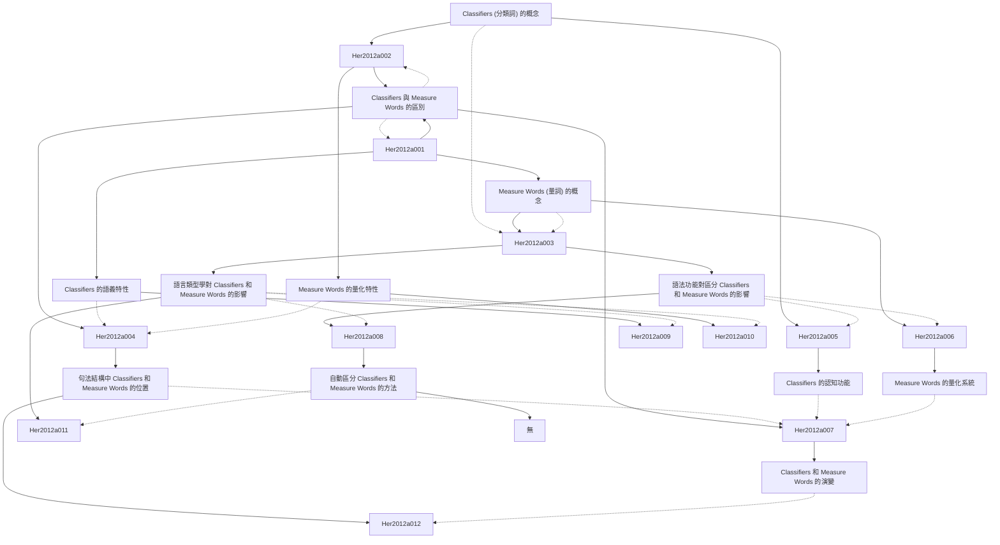

# Zettelkasten 卡片索引

**來源論文**: Distinguishing Classifiers and Measure Words: A
**作者**: her, one-soon
**年份**: None
**生成日期**: 2025-11-04 15:07
**卡片總數**: 12

---

## 📚 卡片清單

### 1. [Classifiers (分類詞) 的概念](zettel_cards/Her-2012a-001.md)
- **ID**: `Her-2012a-001`
- **類型**: 
- **核心**: A classifier is a word or affix that is used to classify nouns based on inherent characteristics of the objects they refer to.
- **標籤**: `[Classifiers]`, `[Grammar]`, `[Linguistics]`

### 2. [Measure Words (量詞) 的概念](zettel_cards/Her-2012a-002.md)
- **ID**: `Her-2012a-002`
- **類型**: 
- **核心**: A measure word is used to quantify nouns, specifying the amount, quantity, or unit of the noun being referred to.
- **標籤**: `[Measure Words]`, `[Grammar]`, `[Linguistics]`, `[Quantification]`

### 3. [Classifiers 與 Measure Words 的區別](zettel_cards/Her-2012a-003.md)
- **ID**: `Her-2012a-003`
- **類型**: 
- **核心**: Classifiers categorize nouns based on inherent properties, while measure words quantify nouns based on amount or unit.
- **標籤**: `[Classifiers]`, `[Measure Words]`, `[Distinction]`, `[Linguistics]`

### 4. [語法功能對區分 Classifiers 和 Measure Words 的影響](zettel_cards/Her-2012a-004.md)
- **ID**: `Her-2012a-004`
- **類型**: 
- **核心**: The grammatical function of classifiers and measure words within a sentence can provide clues to their distinct roles.
- **標籤**: `[Classifiers]`, `[Measure Words]`, `[Grammar]`, `[Syntax]`

### 5. [Classifiers 的語義特性](zettel_cards/Her-2012a-005.md)
- **ID**: `Her-2012a-005`
- **類型**: 
- **核心**: Classifiers typically encode semantic features such as shape, size, animacy, or material.
- **標籤**: `[Classifiers]`, `[Semantics]`, `[Linguistics]`, `[Feature Encoding]`

### 6. [Measure Words 的量化特性](zettel_cards/Her-2012a-006.md)
- **ID**: `Her-2012a-006`
- **類型**: 
- **核心**: Measure words specify the quantity, amount, or unit of the noun they modify, often used with numerals.
- **標籤**: `[Measure Words]`, `[Quantification]`, `[Numerals]`, `[Linguistics]`

### 7. [語言類型學對 Classifiers 和 Measure Words 的影響](zettel_cards/Her-2012a-007.md)
- **ID**: `Her-2012a-007`
- **類型**: 
- **核心**: Different language typologies exhibit varying uses and frequencies of classifiers and measure words.
- **標籤**: `[Classifiers]`, `[Measure Words]`, `[Language Typology]`, `[Linguistics]`

### 8. [句法結構中 Classifiers 和 Measure Words 的位置](zettel_cards/Her-2012a-008.md)
- **ID**: `Her-2012a-008`
- **類型**: 
- **核心**: Classifiers and measure words occupy distinct positions within the syntactic structure of a sentence, reflecting their different functions.
- **標籤**: `[Classifiers]`, `[Measure Words]`, `[Syntax]`, `[Grammar]`

### 9. [Classifiers 的認知功能](zettel_cards/Her-2012a-009.md)
- **ID**: `Her-2012a-009`
- **類型**: 
- **核心**: Classifiers reflect underlying cognitive categorization processes, revealing how speakers conceptualize and organize the world.
- **標籤**: `[Classifiers]`, `[Cognition]`, `[Categorization]`, `[Linguistics]`

### 10. [Measure Words 的量化系統](zettel_cards/Her-2012a-010.md)
- **ID**: `Her-2012a-010`
- **類型**: 
- **核心**: Measure words are part of a language's system for quantifying and measuring entities, reflecting cultural conventions about measurement.
- **標籤**: `[Measure Words]`, `[Quantification]`, `[Measurement]`, `[Culture]`

### 11. [Classifiers 和 Measure Words 的演變](zettel_cards/Her-2012a-011.md)
- **ID**: `Her-2012a-011`
- **類型**: 
- **核心**: The historical development of classifiers and measure words can provide insights into their current functions and distributions.
- **標籤**: `[Classifiers]`, `[Measure Words]`, `[Historical Linguistics]`, `[Evolution]`

### 12. [自動區分 Classifiers 和 Measure Words 的方法](zettel_cards/Her-2012a-012.md)
- **ID**: `Her-2012a-012`
- **類型**: 
- **核心**: Computational methods can be used to automatically distinguish classifiers and measure words in text, based on their syntactic and semantic properties.
- **標籤**: `[Classifiers]`, `[Measure Words]`, `[NLP]`, `[Computational Linguistics]`

---

## 🗺️ 概念網絡圖

---

## 🏷️ 標籤索引

### [Classifiers]
- [[Her-2012a-001]] Classifiers (分類詞) 的概念
- [[Her-2012a-003]] Classifiers 與 Measure Words 的區別
- [[Her-2012a-004]] 語法功能對區分 Classifiers 和 Measure Words 的影響
- [[Her-2012a-005]] Classifiers 的語義特性
- [[Her-2012a-007]] 語言類型學對 Classifiers 和 Measure Words 的影響
- [[Her-2012a-008]] 句法結構中 Classifiers 和 Measure Words 的位置
- [[Her-2012a-009]] Classifiers 的認知功能
- [[Her-2012a-011]] Classifiers 和 Measure Words 的演變
- [[Her-2012a-012]] 自動區分 Classifiers 和 Measure Words 的方法

### [Grammar]
- [[Her-2012a-001]] Classifiers (分類詞) 的概念
- [[Her-2012a-002]] Measure Words (量詞) 的概念
- [[Her-2012a-004]] 語法功能對區分 Classifiers 和 Measure Words 的影響
- [[Her-2012a-008]] 句法結構中 Classifiers 和 Measure Words 的位置

### [Linguistics]
- [[Her-2012a-001]] Classifiers (分類詞) 的概念
- [[Her-2012a-002]] Measure Words (量詞) 的概念
- [[Her-2012a-003]] Classifiers 與 Measure Words 的區別
- [[Her-2012a-005]] Classifiers 的語義特性
- [[Her-2012a-006]] Measure Words 的量化特性
- [[Her-2012a-007]] 語言類型學對 Classifiers 和 Measure Words 的影響
- [[Her-2012a-009]] Classifiers 的認知功能

### [Measure Words]
- [[Her-2012a-002]] Measure Words (量詞) 的概念
- [[Her-2012a-003]] Classifiers 與 Measure Words 的區別
- [[Her-2012a-004]] 語法功能對區分 Classifiers 和 Measure Words 的影響
- [[Her-2012a-006]] Measure Words 的量化特性
- [[Her-2012a-007]] 語言類型學對 Classifiers 和 Measure Words 的影響
- [[Her-2012a-008]] 句法結構中 Classifiers 和 Measure Words 的位置
- [[Her-2012a-010]] Measure Words 的量化系統
- [[Her-2012a-011]] Classifiers 和 Measure Words 的演變
- [[Her-2012a-012]] 自動區分 Classifiers 和 Measure Words 的方法

### [Quantification]
- [[Her-2012a-002]] Measure Words (量詞) 的概念
- [[Her-2012a-006]] Measure Words 的量化特性
- [[Her-2012a-010]] Measure Words 的量化系統

### [Distinction]
- [[Her-2012a-003]] Classifiers 與 Measure Words 的區別

### [Syntax]
- [[Her-2012a-004]] 語法功能對區分 Classifiers 和 Measure Words 的影響
- [[Her-2012a-008]] 句法結構中 Classifiers 和 Measure Words 的位置

### [Semantics]
- [[Her-2012a-005]] Classifiers 的語義特性

### [Feature Encoding]
- [[Her-2012a-005]] Classifiers 的語義特性

### [Numerals]
- [[Her-2012a-006]] Measure Words 的量化特性

### [Language Typology]
- [[Her-2012a-007]] 語言類型學對 Classifiers 和 Measure Words 的影響

### [Cognition]
- [[Her-2012a-009]] Classifiers 的認知功能

### [Categorization]
- [[Her-2012a-009]] Classifiers 的認知功能

### [Measurement]
- [[Her-2012a-010]] Measure Words 的量化系統

### [Culture]
- [[Her-2012a-010]] Measure Words 的量化系統

### [Historical Linguistics]
- [[Her-2012a-011]] Classifiers 和 Measure Words 的演變

### [Evolution]
- [[Her-2012a-011]] Classifiers 和 Measure Words 的演變

### [NLP]
- [[Her-2012a-012]] 自動區分 Classifiers 和 Measure Words 的方法

### [Computational Linguistics]
- [[Her-2012a-012]] 自動區分 Classifiers 和 Measure Words 的方法

---

## 📖 閱讀建議順序

1. [[Her-2012a-001]] Classifiers (分類詞) 的概念

2. [[Her-2012a-002]] Measure Words (量詞) 的概念

3. [[Her-2012a-003]] Classifiers 與 Measure Words 的區別

4. [[Her-2012a-004]] 語法功能對區分 Classifiers 和 Measure Words 的影響

5. [[Her-2012a-005]] Classifiers 的語義特性

6. [[Her-2012a-006]] Measure Words 的量化特性

7. [[Her-2012a-007]] 語言類型學對 Classifiers 和 Measure Words 的影響

8. [[Her-2012a-008]] 句法結構中 Classifiers 和 Measure Words 的位置

9. [[Her-2012a-009]] Classifiers 的認知功能

10. [[Her-2012a-010]] Measure Words 的量化系統

11. [[Her-2012a-011]] Classifiers 和 Measure Words 的演變

12. [[Her-2012a-012]] 自動區分 Classifiers 和 Measure Words 的方法

---

*本索引由 Knowledge Production System 自動生成*