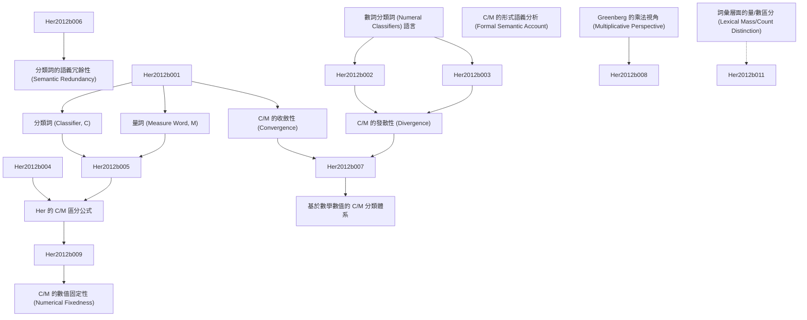

# Zettelkasten 卡片索引

---

## 📚 卡片清單

### 1. [數詞分類詞 (Numeral Classifiers) 語言](zettel_cards/Her-2012b-001.md)
- **ID**: `Her-2012b-001`
- aliases: Her-2012b
- **類型**: 
- **核心**: "In a numeral classifier language, a classifier (C) or measure word (M) is needed to link a noun (N) and its numerical quantifier (Num)."
- **標籤**: `數詞分類詞`, `分類詞`, `量詞`, `語言學`

### 2. [分類詞 (Classifier, C)](zettel_cards/Her-2012b-002.md)
- **ID**: `Her-2012b-002`
- aliases: Her-2012b
- **類型**: 
- **核心**: "A classifier categorizes a class of nouns by picking out some salient perceptual properties, either physically or functionally based, which are permanently associated with entities named by the class of nouns"
- **標籤**: `分類詞`, `語義特徵`, `名詞分類`, `語言學`

### 3. [量詞 (Measure Word, M)](zettel_cards/Her-2012b-003.md)
- **ID**: `Her-2012b-003`
- aliases: Her-2012b
- **類型**: 
- **核心**: "a measure word does not categorize but denotes the quantity of the entity named by noun."
- **標籤**: `量詞`, `數量`, `名詞量化`, `語言學`

### 4. [C/M 的收斂性 (Convergence)](zettel_cards/Her-2012b-004.md)
- **ID**: `Her-2012b-004`
- aliases: Her-2012b
- **類型**: 
- **核心**: "This fact suggests that C and M in a classifier language form a single syntactic category, which we shall dub ‘C/M’."
- **標籤**: `C/M`, `句法範疇`, `數詞分類詞`, `語言學`

### 5. [C/M 的發散性 (Divergence)](zettel_cards/Her-2012b-005.md)
- **ID**: `Her-2012b-005`
- aliases: Her-2012b
- **類型**: 
- **核心**: "The undeniable fact that Ms quantify the head noun, but Cs must qualify the noun in terms of certain semantic features has compelled many researchers to claim that C and M are two distinct semantic and/or syntactic categories"
- **標籤**: `C/M`, `語義差異`, `數詞分類詞`, `語言學`

### 6. [Greenberg 的乘法視角 (Multiplicative Perspective)](zettel_cards/Her-2012b-006.md)
- **ID**: `Her-2012b-006`
- aliases: Her-2012b
- **類型**: 
- **核心**: "all the classifiers are from the referential point of view merely so many ways of saying ‘one’, or more accurately, ‘times one’.”
- **標籤**: `乘法視角`, `分類詞`, `數值`, `語言學`

### 7. [Her 的 C/M 區分公式](zettel_cards/Her-2012b-007.md)
- **ID**: `Her-2012b-007`
- aliases: Her-2012b
- **類型**: 
- **核心**: "[Num X N] = [[Num × X] N], where X = C iff X =1, otherwise X = M."
- **標籤**: `C/M區分`, `數學公式`, `分類詞`, `量詞`, `語言學`

### 8. [分類詞的語義冗餘性 (Semantic Redundancy)](zettel_cards/Her-2012b-008.md)
- **ID**: `Her-2012b-008`
- aliases: Her-2012b
- **類型**: 
- **核心**: "M is semantically substantive but C is semantically redundant, in the sense that M does, but C does not, contribute additional information to the head noun"
- **標籤**: `語義冗餘`, `分類詞`, `量詞`, `信息增益`, `語言學`

### 9. [基於數學數值的 C/M 分類體系](zettel_cards/Her-2012b-009.md)
- **ID**: `Her-2012b-009`
- aliases: Her-2012b
- **類型**: 
- **核心**: "a insightful taxonomy of C/M types can be achieved according to the different types of mathematical values encoded by C/M"
- **標籤**: `C/M分類`, `數學數值`, `分類詞`, `量詞`, `語言學`

### 10. [C/M 的數值固定性 (Numerical Fixedness)](zettel_cards/Her-2012b-010.md)
- **ID**: `Her-2012b-010`
- aliases: Her-2012b
- **類型**: 
- **核心**: "Any C/M with a fixed or standardized value can be seen as standard, thus including C, M1, and M3."
- **標籤**: `數值固定性`, `標準化數值`, `分類詞`, `量詞`, `語言學`

### 11. [C/M 的形式語義分析 (Formal Semantic Account)](zettel_cards/Her-2012b-011.md)
- **ID**: `Her-2012b-011`
- aliases: Her-2012b
- **類型**: 
- **核心**: "we shall first briefly review several important accounts of formal semantics, Chierchia (1998a, 1998b), Krikfa (1995), Jiang (2012), X. Li (2011) and Rothstein (2010), and demonstrate that they cannot model the semantic distinction between C and M argued for in Section 3, before we propose our own formal semantic account."
- **標籤**: `形式語義`, `數詞分類詞`, `語義分析`, `模型`, `語言學`

### 12. [詞彙層面的量/數區分 (Lexical Mass/Count Distinction)](zettel_cards/Her-2012b-012.md)
- **ID**: `Her-2012b-012`
- aliases: Her-2012b
- **類型**: 
- **核心**: "it is necessary to assume a lexical mass/count distinction in classifier languages. This position then leads to the conclusion that such a distinction is universal."
- **標籤**: `量/數區分`, `詞彙層面`, `分類詞語言`, `普遍性`, `語言學`

---

## 🗺️ 概念網絡圖

---

## 🏷️ 標籤索引

### 數詞分類詞
- [[Her-2012b-001]] 數詞分類詞 (Numeral Classifiers) 語言
- [[Her-2012b-004]] C/M 的收斂性 (Convergence)
- [[Her-2012b-005]] C/M 的發散性 (Divergence)
- [[Her-2012b-011]] C/M 的形式語義分析 (Formal Semantic Account)

### 分類詞
- [[Her-2012b-001]] 數詞分類詞 (Numeral Classifiers) 語言
- [[Her-2012b-002]] 分類詞 (Classifier, C)
- [[Her-2012b-006]] Greenberg 的乘法視角 (Multiplicative Perspective)
- [[Her-2012b-007]] Her 的 C/M 區分公式
- [[Her-2012b-008]] 分類詞的語義冗餘性 (Semantic Redundancy)
- [[Her-2012b-009]] 基於數學數值的 C/M 分類體系
- [[Her-2012b-010]] C/M 的數值固定性 (Numerical Fixedness)

### 量詞
- [[Her-2012b-001]] 數詞分類詞 (Numeral Classifiers) 語言
- [[Her-2012b-003]] 量詞 (Measure Word, M)
- [[Her-2012b-007]] Her 的 C/M 區分公式
- [[Her-2012b-008]] 分類詞的語義冗餘性 (Semantic Redundancy)
- [[Her-2012b-009]] 基於數學數值的 C/M 分類體系
- [[Her-2012b-010]] C/M 的數值固定性 (Numerical Fixedness)

### 語言學
- [[Her-2012b-001]] 數詞分類詞 (Numeral Classifiers) 語言
- [[Her-2012b-002]] 分類詞 (Classifier, C)
- [[Her-2012b-003]] 量詞 (Measure Word, M)
- [[Her-2012b-004]] C/M 的收斂性 (Convergence)
- [[Her-2012b-005]] C/M 的發散性 (Divergence)
- [[Her-2012b-006]] Greenberg 的乘法視角 (Multiplicative Perspective)
- [[Her-2012b-007]] Her 的 C/M 區分公式
- [[Her-2012b-008]] 分類詞的語義冗餘性 (Semantic Redundancy)
- [[Her-2012b-009]] 基於數學數值的 C/M 分類體系
- [[Her-2012b-010]] C/M 的數值固定性 (Numerical Fixedness)
- [[Her-2012b-011]] C/M 的形式語義分析 (Formal Semantic Account)
- [[Her-2012b-012]] 詞彙層面的量/數區分 (Lexical Mass/Count Distinction)

### 語義特徵
- [[Her-2012b-002]] 分類詞 (Classifier, C)

### 名詞分類
- [[Her-2012b-002]] 分類詞 (Classifier, C)

### 數量
- [[Her-2012b-003]] 量詞 (Measure Word, M)

### 名詞量化
- [[Her-2012b-003]] 量詞 (Measure Word, M)

### C/M
- [[Her-2012b-004]] C/M 的收斂性 (Convergence)
- [[Her-2012b-005]] C/M 的發散性 (Divergence)

### 句法範疇
- [[Her-2012b-004]] C/M 的收斂性 (Convergence)

### 語義差異
- [[Her-2012b-005]] C/M 的發散性 (Divergence)

### 乘法視角
- [[Her-2012b-006]] Greenberg 的乘法視角 (Multiplicative Perspective)

### 數值
- [[Her-2012b-006]] Greenberg 的乘法視角 (Multiplicative Perspective)

### C/M區分
- [[Her-2012b-007]] Her 的 C/M 區分公式

### 數學公式
- [[Her-2012b-007]] Her 的 C/M 區分公式

### 語義冗餘
- [[Her-2012b-008]] 分類詞的語義冗餘性 (Semantic Redundancy)

### 信息增益
- [[Her-2012b-008]] 分類詞的語義冗餘性 (Semantic Redundancy)

### C/M分類
- [[Her-2012b-009]] 基於數學數值的 C/M 分類體系

### 數學數值
- [[Her-2012b-009]] 基於數學數值的 C/M 分類體系

### 數值固定性
- [[Her-2012b-010]] C/M 的數值固定性 (Numerical Fixedness)

### 標準化數值
- [[Her-2012b-010]] C/M 的數值固定性 (Numerical Fixedness)

### 形式語義
- [[Her-2012b-011]] C/M 的形式語義分析 (Formal Semantic Account)

### 語義分析
- [[Her-2012b-011]] C/M 的形式語義分析 (Formal Semantic Account)

### 模型
- [[Her-2012b-011]] C/M 的形式語義分析 (Formal Semantic Account)

### 量/數區分
- [[Her-2012b-012]] 詞彙層面的量/數區分 (Lexical Mass/Count Distinction)

### 詞彙層面
- [[Her-2012b-012]] 詞彙層面的量/數區分 (Lexical Mass/Count Distinction)

### 分類詞語言
- [[Her-2012b-012]] 詞彙層面的量/數區分 (Lexical Mass/Count Distinction)

### 普遍性
- [[Her-2012b-012]] 詞彙層面的量/數區分 (Lexical Mass/Count Distinction)

---

## 📖 閱讀建議順序

1. [[Her-2012b-001]] 數詞分類詞 (Numeral Classifiers) 語言

2. [[Her-2012b-002]] 分類詞 (Classifier, C)

3. [[Her-2012b-003]] 量詞 (Measure Word, M)

4. [[Her-2012b-004]] C/M 的收斂性 (Convergence)

5. [[Her-2012b-005]] C/M 的發散性 (Divergence)

6. [[Her-2012b-006]] Greenberg 的乘法視角 (Multiplicative Perspective)

7. [[Her-2012b-007]] Her 的 C/M 區分公式

8. [[Her-2012b-008]] 分類詞的語義冗餘性 (Semantic Redundancy)

9. [[Her-2012b-009]] 基於數學數值的 C/M 分類體系

10. [[Her-2012b-010]] C/M 的數值固定性 (Numerical Fixedness)

11. [[Her-2012b-011]] C/M 的形式語義分析 (Formal Semantic Account)

12. [[Her-2012b-012]] 詞彙層面的量/數區分 (Lexical Mass/Count Distinction)

---

*本索引由 Knowledge Production System 自動生成*