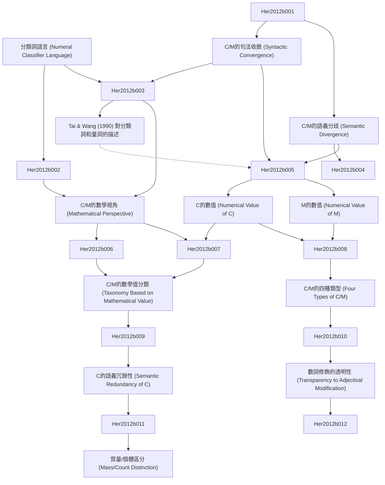

# Zettelkasten 卡片索引

**來源論文**: Taxonomy of Numeral Classifiers:
**作者**: Formal Semantic, Numeral Classifiers, Soon Her, Au Yeung, Shiung Wu
**年份**: 2007
**生成日期**: 2025-11-04 16:32
**卡片總數**: 12

---

## 📚 卡片清單

### 1. [分類詞語言 (Numeral Classifier Language)](zettel_cards/Her-2012b-001.md)
- **ID**: `Her-2012b-001`
- **類型**: 
- **核心**: "In a numeral classifier language, a classifier (C) or measure word (M) is needed to link a noun (N) and its numerical quantifier (Num)."
- **標籤**: `分類詞`, `量詞`, `句法`

### 2. [C/M的句法收斂 (Syntactic Convergence)](zettel_cards/Her-2012b-002.md)
- **ID**: `Her-2012b-002`
- **類型**: 
- **核心**: "This fact suggests that C and M in a classifier language form a single syntactic category, which we shall dub ‘C/M’."
- **標籤**: `分類詞`, `量詞`, `句法`, `C/M`

### 3. [C/M的語義分歧 (Semantic Divergence)](zettel_cards/Her-2012b-003.md)
- **ID**: `Her-2012b-003`
- **類型**: 
- **核心**: "The undeniable fact that Ms quantify the head noun, but Cs must qualify the noun in terms of certain semantic features has compelled many researchers to claim that C and M are two distinct semantic and/or syntactic categories"
- **標籤**: `分類詞`, `量詞`, `語義`, `C/M`

### 4. [Tai & Wang (1990) 對分類詞和量詞的描述](zettel_cards/Her-2012b-004.md)
- **ID**: `Her-2012b-004`
- **類型**: 
- **核心**: "A classifier categorizes a class of nouns by picking out some salient perceptual properties, either physically or functionally based, which are permanently associated with entities named by the class of nouns; a measure word does not categorize but denotes the quantity of the entity named by noun."
- **標籤**: `分類詞`, `量詞`, `語義`, `Tai & Wang`

### 5. [C/M的數學視角 (Mathematical Perspective)](zettel_cards/Her-2012b-005.md)
- **ID**: `Her-2012b-005`
- **類型**: 
- **核心**: "From the multiplicative mathematical perspective proposed in Greenberg (1990[1972]: 172), Au Yeung (2007), and Her (2012a), C and M converge as the multiplicand, with Num as the multiplier."
- **標籤**: `分類詞`, `量詞`, `數學`, `乘法`, `C/M`

### 6. [C的數值 (Numerical Value of C)](zettel_cards/Her-2012b-006.md)
- **ID**: `Her-2012b-006`
- **類型**: 
- **核心**: "Yet, crucially, a C’s value is numerical and necessarily 1, while an M’s value can be anything but 1, thus ¬1."
- **標籤**: `分類詞`, `量詞`, `數值`, `1`, `¬1`

### 7. [M的數值 (Numerical Value of M)](zettel_cards/Her-2012b-007.md)
- **ID**: `Her-2012b-007`
- **類型**: 
- **核心**: "An M’s value can therefore be numerical, e.g., 2, 6, 12, etc., or non-numerical, e.g., kilo, meter, liter, bottle, etc."
- **標籤**: `分類詞`, `量詞`, `數值`, `¬1`, `數值`, `非數值`

### 8. [C/M的數學值分類 (Taxonomy Based on Mathematical Value)](zettel_cards/Her-2012b-008.md)
- **ID**: `Her-2012b-008`
- **類型**: 
- **核心**: "Her & Lin (2015) thus put forth the innovative concept that a insightful taxonomy of C/M types can be achieved according to the different types of mathematical values encoded by C/M"
- **標籤**: `分類詞`, `量詞`, `數值`, `分類`, `C/M`, `Her & Lin`

### 9. [C/M的四種類型 (Four Types of C/M)](zettel_cards/Her-2012b-009.md)
- **ID**: `Her-2012b-009`
- **類型**: 
- **核心**: "Numerical Fixed or C/M Examples
- **標籤**: `分類詞`, `量詞`, `數值`, `分類`, `C/M`, `Her & Lin`

### 10. [C的語義冗餘性 (Semantic Redundancy of C)](zettel_cards/Her-2012b-010.md)
- **ID**: `Her-2012b-010`
- **類型**: 
- **核心**: "The most significant difference is M is semantically substantive but C is semantically redundant, in the sense that M does, but C does not, contribute additional information to the head noun"
- **標籤**: `分類詞`, `量詞`, `語義`, `冗餘`

### 11. [數詞修飾的透明性 (Transparency to Adjectival Modification)](zettel_cards/Her-2012b-011.md)
- **ID**: `Her-2012b-011`
- **類型**: 
- **核心**: "Thus, (9a) and (9b) have the same meaning, but (10a) and (10b) do not.
- **標籤**: `分類詞`, `量詞`, `形容詞`, `修飾`, `語義`

### 12. [質量/個體區分 (Mass/Count Distinction)](zettel_cards/Her-2012b-012.md)
- **ID**: `Her-2012b-012`
- **類型**: 
- **核心**: "Third, we will demonstrate that in carrying out the above two goals it is necessary to assume a lexical mass/count distinction in classifier languages. This position then leads to the conclusion that such a distinction is universal."
- **標籤**: `分類詞`, `量詞`, `質量名詞`, `個體名詞`, `普遍性`

---

## 🗺️ 概念網絡圖

---

## 🏷️ 標籤索引

### 分類詞
- [[Her-2012b-001]] 分類詞語言 (Numeral Classifier Language)
- [[Her-2012b-002]] C/M的句法收斂 (Syntactic Convergence)
- [[Her-2012b-003]] C/M的語義分歧 (Semantic Divergence)
- [[Her-2012b-004]] Tai & Wang (1990) 對分類詞和量詞的描述
- [[Her-2012b-005]] C/M的數學視角 (Mathematical Perspective)
- [[Her-2012b-006]] C的數值 (Numerical Value of C)
- [[Her-2012b-007]] M的數值 (Numerical Value of M)
- [[Her-2012b-008]] C/M的數學值分類 (Taxonomy Based on Mathematical Value)
- [[Her-2012b-009]] C/M的四種類型 (Four Types of C/M)
- [[Her-2012b-010]] C的語義冗餘性 (Semantic Redundancy of C)
- [[Her-2012b-011]] 數詞修飾的透明性 (Transparency to Adjectival Modification)
- [[Her-2012b-012]] 質量/個體區分 (Mass/Count Distinction)

### 量詞
- [[Her-2012b-001]] 分類詞語言 (Numeral Classifier Language)
- [[Her-2012b-002]] C/M的句法收斂 (Syntactic Convergence)
- [[Her-2012b-003]] C/M的語義分歧 (Semantic Divergence)
- [[Her-2012b-004]] Tai & Wang (1990) 對分類詞和量詞的描述
- [[Her-2012b-005]] C/M的數學視角 (Mathematical Perspective)
- [[Her-2012b-006]] C的數值 (Numerical Value of C)
- [[Her-2012b-007]] M的數值 (Numerical Value of M)
- [[Her-2012b-008]] C/M的數學值分類 (Taxonomy Based on Mathematical Value)
- [[Her-2012b-009]] C/M的四種類型 (Four Types of C/M)
- [[Her-2012b-010]] C的語義冗餘性 (Semantic Redundancy of C)
- [[Her-2012b-011]] 數詞修飾的透明性 (Transparency to Adjectival Modification)
- [[Her-2012b-012]] 質量/個體區分 (Mass/Count Distinction)

### 句法
- [[Her-2012b-001]] 分類詞語言 (Numeral Classifier Language)
- [[Her-2012b-002]] C/M的句法收斂 (Syntactic Convergence)

### C/M
- [[Her-2012b-002]] C/M的句法收斂 (Syntactic Convergence)
- [[Her-2012b-003]] C/M的語義分歧 (Semantic Divergence)
- [[Her-2012b-005]] C/M的數學視角 (Mathematical Perspective)
- [[Her-2012b-008]] C/M的數學值分類 (Taxonomy Based on Mathematical Value)
- [[Her-2012b-009]] C/M的四種類型 (Four Types of C/M)

### 語義
- [[Her-2012b-003]] C/M的語義分歧 (Semantic Divergence)
- [[Her-2012b-004]] Tai & Wang (1990) 對分類詞和量詞的描述
- [[Her-2012b-010]] C的語義冗餘性 (Semantic Redundancy of C)
- [[Her-2012b-011]] 數詞修飾的透明性 (Transparency to Adjectival Modification)

### Tai & Wang
- [[Her-2012b-004]] Tai & Wang (1990) 對分類詞和量詞的描述

### 數學
- [[Her-2012b-005]] C/M的數學視角 (Mathematical Perspective)

### 乘法
- [[Her-2012b-005]] C/M的數學視角 (Mathematical Perspective)

### 數值
- [[Her-2012b-006]] C的數值 (Numerical Value of C)
- [[Her-2012b-007]] M的數值 (Numerical Value of M)
- [[Her-2012b-007]] M的數值 (Numerical Value of M)
- [[Her-2012b-008]] C/M的數學值分類 (Taxonomy Based on Mathematical Value)
- [[Her-2012b-009]] C/M的四種類型 (Four Types of C/M)

### 1
- [[Her-2012b-006]] C的數值 (Numerical Value of C)

### ¬1
- [[Her-2012b-006]] C的數值 (Numerical Value of C)
- [[Her-2012b-007]] M的數值 (Numerical Value of M)

### 非數值
- [[Her-2012b-007]] M的數值 (Numerical Value of M)

### 分類
- [[Her-2012b-008]] C/M的數學值分類 (Taxonomy Based on Mathematical Value)
- [[Her-2012b-009]] C/M的四種類型 (Four Types of C/M)

### Her & Lin
- [[Her-2012b-008]] C/M的數學值分類 (Taxonomy Based on Mathematical Value)
- [[Her-2012b-009]] C/M的四種類型 (Four Types of C/M)

### 冗餘
- [[Her-2012b-010]] C的語義冗餘性 (Semantic Redundancy of C)

### 形容詞
- [[Her-2012b-011]] 數詞修飾的透明性 (Transparency to Adjectival Modification)

### 修飾
- [[Her-2012b-011]] 數詞修飾的透明性 (Transparency to Adjectival Modification)

### 質量名詞
- [[Her-2012b-012]] 質量/個體區分 (Mass/Count Distinction)

### 個體名詞
- [[Her-2012b-012]] 質量/個體區分 (Mass/Count Distinction)

### 普遍性
- [[Her-2012b-012]] 質量/個體區分 (Mass/Count Distinction)

---

## 📖 閱讀建議順序

1. [[Her-2012b-001]] 分類詞語言 (Numeral Classifier Language)

2. [[Her-2012b-002]] C/M的句法收斂 (Syntactic Convergence)

3. [[Her-2012b-003]] C/M的語義分歧 (Semantic Divergence)

4. [[Her-2012b-004]] Tai & Wang (1990) 對分類詞和量詞的描述

5. [[Her-2012b-005]] C/M的數學視角 (Mathematical Perspective)

6. [[Her-2012b-006]] C的數值 (Numerical Value of C)

7. [[Her-2012b-007]] M的數值 (Numerical Value of M)

8. [[Her-2012b-008]] C/M的數學值分類 (Taxonomy Based on Mathematical Value)

9. [[Her-2012b-009]] C/M的四種類型 (Four Types of C/M)

10. [[Her-2012b-010]] C的語義冗餘性 (Semantic Redundancy of C)

11. [[Her-2012b-011]] 數詞修飾的透明性 (Transparency to Adjectival Modification)

12. [[Her-2012b-012]] 質量/個體區分 (Mass/Count Distinction)

---

*本索引由 Knowledge Production System 自動生成*