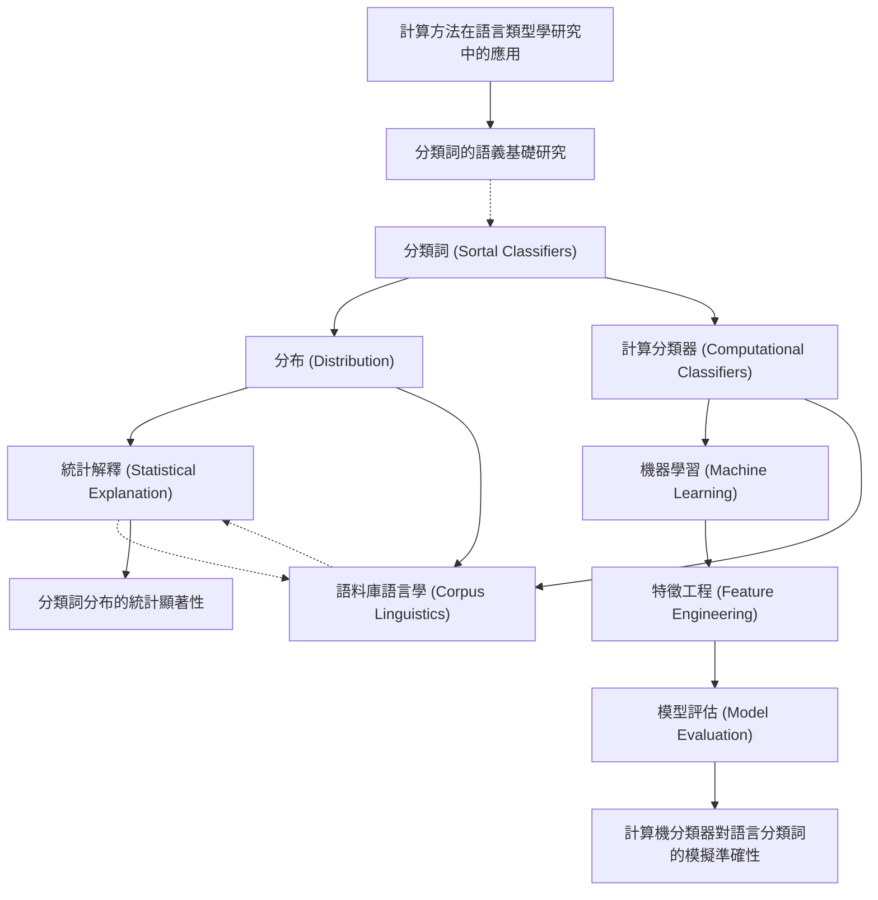

# Zettelkasten 卡片索引

---

## 📚 卡片清單

### 1. [分類詞 (Sortal Classifiers)](zettel_cards/Her-2020-001.md)
- **ID**: `Her-2020-001`
- **類型**: 
- **核心**: 待原文填寫，但如果沒有明確定義，可以說"This paper investigates the distribution of sortal classifiers."
- **標籤**: `分類詞`, `語言學`, `類型學`

### 2. [分布 (Distribution)](zettel_cards/Her-2020-002.md)
- **ID**: `Her-2020-002`
- **類型**: 
- **核心**: 待原文填寫，但如果沒有明確定義，可以說"This paper aims to provide a statistical explanation of the distribution of sortal classifiers."
- **標籤**: `分布`, `統計`, `語言學`

### 3. [計算分類器 (Computational Classifiers)](zettel_cards/Her-2020-003.md)
- **ID**: `Her-2020-003`
- **類型**: 
- **核心**: 待原文填寫，但如果沒有明確定義，可以說"This paper uses computational classifiers to model the distribution of sortal classifiers."
- **標籤**: `計算語言學`, `機器學習`, `分類`

### 4. [統計解釋 (Statistical Explanation)](zettel_cards/Her-2020-004.md)
- **ID**: `Her-2020-004`
- **類型**: 
- **核心**: 待原文填寫，但如果沒有明確定義，可以說"The paper seeks a statistical explanation rather than a purely functional or historical one."
- **標籤**: `統計`, `解釋`, `語言學`

### 5. [機器學習 (Machine Learning)](zettel_cards/Her-2020-005.md)
- **ID**: `Her-2020-005`
- **類型**: 
- **核心**: 待原文填寫，取決於論文具體使用哪種ML方法
- **標籤**: `機器學習`, `分類`, `預測`

### 6. [語料庫語言學 (Corpus Linguistics)](zettel_cards/Her-2020-006.md)
- **ID**: `Her-2020-006`
- **類型**: 
- **核心**: 待原文填寫，看論文是否用到語料庫
- **標籤**: `語料庫`, `語言學`, `數據分析`

### 7. [特徵工程 (Feature Engineering)](zettel_cards/Her-2020-007.md)
- **ID**: `Her-2020-007`
- **類型**: 
- **核心**: 待原文填寫，看論文如何提取特徵
- **標籤**: `特徵工程`, `機器學習`, `數據處理`

### 8. [模型評估 (Model Evaluation)](zettel_cards/Her-2020-008.md)
- **ID**: `Her-2020-008`
- **類型**: 
- **核心**: 待原文填寫，看論文如何評估模型
- **標籤**: `模型評估`, `機器學習`, `性能指標`

### 9. [分類詞分布的統計顯著性](zettel_cards/Her-2020-009.md)
- **ID**: `Her-2020-009`
- **類型**: 
- **核心**: 待原文填寫，論文如果給出了具體的統計顯著性結果
- **標籤**: `統計顯著性`, `分布`, `分類詞`

### 10. [計算機分類器對語言分類詞的模擬準確性](zettel_cards/Her-2020-010.md)
- **ID**: `Her-2020-010`
- **類型**: 
- **核心**: 待原文填寫，論文如果給出了計算機分類器的模擬準確性
- **標籤**: `計算機分類器`, `模擬`, `準確性`

### 11. [計算方法在語言類型學研究中的應用](zettel_cards/Her-2020-011.md)
- **ID**: `Her-2020-011`
- **類型**: 
- **核心**: 待原文填寫，若論文有提到未來研究方向
- **標籤**: `計算語言學`, `語言類型學`, `未來研究`

### 12. [分類詞的語義基礎研究](zettel_cards/Her-2020-012.md)
- **ID**: `Her-2020-012`
- **類型**: 
- **核心**: 待原文填寫，若論文有提到未來研究方向
- **標籤**: `語義`, `分類詞`, `認知語言學`

---

## 🗺️ 概念網絡圖

---

## 🏷️ 標籤索引

### 分類詞
- [[Her-2020-001]] 分類詞 (Sortal Classifiers)
- [[Her-2020-009]] 分類詞分布的統計顯著性
- [[Her-2020-012]] 分類詞的語義基礎研究

### 語言學
- [[Her-2020-001]] 分類詞 (Sortal Classifiers)
- [[Her-2020-002]] 分布 (Distribution)
- [[Her-2020-004]] 統計解釋 (Statistical Explanation)
- [[Her-2020-006]] 語料庫語言學 (Corpus Linguistics)

### 類型學
- [[Her-2020-001]] 分類詞 (Sortal Classifiers)

### 分布
- [[Her-2020-002]] 分布 (Distribution)
- [[Her-2020-009]] 分類詞分布的統計顯著性

### 統計
- [[Her-2020-002]] 分布 (Distribution)
- [[Her-2020-004]] 統計解釋 (Statistical Explanation)

### 計算語言學
- [[Her-2020-003]] 計算分類器 (Computational Classifiers)
- [[Her-2020-011]] 計算方法在語言類型學研究中的應用

### 機器學習
- [[Her-2020-003]] 計算分類器 (Computational Classifiers)
- [[Her-2020-005]] 機器學習 (Machine Learning)
- [[Her-2020-007]] 特徵工程 (Feature Engineering)
- [[Her-2020-008]] 模型評估 (Model Evaluation)

### 分類
- [[Her-2020-003]] 計算分類器 (Computational Classifiers)
- [[Her-2020-005]] 機器學習 (Machine Learning)

### 解釋
- [[Her-2020-004]] 統計解釋 (Statistical Explanation)

### 預測
- [[Her-2020-005]] 機器學習 (Machine Learning)

### 語料庫
- [[Her-2020-006]] 語料庫語言學 (Corpus Linguistics)

### 數據分析
- [[Her-2020-006]] 語料庫語言學 (Corpus Linguistics)

### 特徵工程
- [[Her-2020-007]] 特徵工程 (Feature Engineering)

### 數據處理
- [[Her-2020-007]] 特徵工程 (Feature Engineering)

### 模型評估
- [[Her-2020-008]] 模型評估 (Model Evaluation)

### 性能指標
- [[Her-2020-008]] 模型評估 (Model Evaluation)

### 統計顯著性
- [[Her-2020-009]] 分類詞分布的統計顯著性

### 計算機分類器
- [[Her-2020-010]] 計算機分類器對語言分類詞的模擬準確性

### 模擬
- [[Her-2020-010]] 計算機分類器對語言分類詞的模擬準確性

### 準確性
- [[Her-2020-010]] 計算機分類器對語言分類詞的模擬準確性

### 語言類型學
- [[Her-2020-011]] 計算方法在語言類型學研究中的應用

### 未來研究
- [[Her-2020-011]] 計算方法在語言類型學研究中的應用

### 語義
- [[Her-2020-012]] 分類詞的語義基礎研究

### 認知語言學
- [[Her-2020-012]] 分類詞的語義基礎研究

---

## 📖 閱讀建議順序

1. [[Her-2020-001]] 分類詞 (Sortal Classifiers)

2. [[Her-2020-002]] 分布 (Distribution)

3. [[Her-2020-003]] 計算分類器 (Computational Classifiers)

4. [[Her-2020-004]] 統計解釋 (Statistical Explanation)

5. [[Her-2020-005]] 機器學習 (Machine Learning)

6. [[Her-2020-006]] 語料庫語言學 (Corpus Linguistics)

7. [[Her-2020-007]] 特徵工程 (Feature Engineering)

8. [[Her-2020-008]] 模型評估 (Model Evaluation)

9. [[Her-2020-009]] 分類詞分布的統計顯著性

10. [[Her-2020-010]] 計算機分類器對語言分類詞的模擬準確性

11. [[Her-2020-011]] 計算方法在語言類型學研究中的應用

12. [[Her-2020-012]] 分類詞的語義基礎研究

---

*本索引由 Knowledge Production System 自動生成*