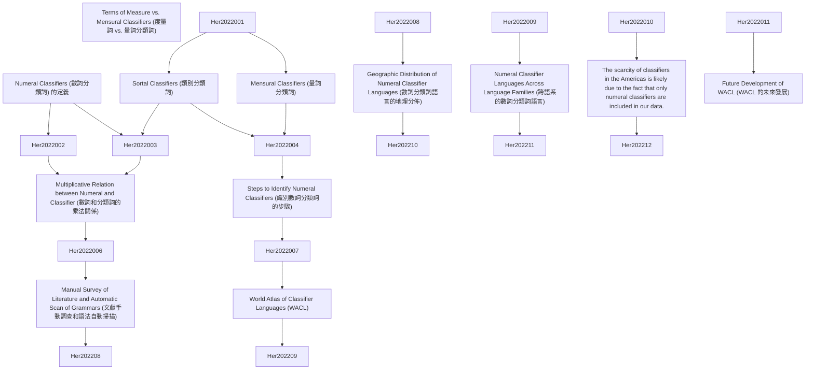

# Zettelkasten 卡片索引

**來源論文**: LinguisticsVanguard2022;8(1):151–164
**作者**: Soon Her, Harald Hammarstr, Marc Allassonni
**年份**: 2022
**生成日期**: 2025-11-04 16:35
**卡片總數**: 12

---

## 📚 卡片清單

### 1. [Numeral Classifiers (數詞分類詞) 的定義](zettel_cards/Her-2022-001.md)
- **ID**: `Her-2022-001`
- **類型**: 
- **核心**: "This paper presents a precise definition of numeral classifiers, steps to identify a numeral classifier language, and a database of 3,338 languages, of which 723 languages have been identified as having a numeral classifier system."
- **標籤**: `數詞分類詞`, `分類詞`, `語言學`, `類型學`

### 2. [Sortal Classifiers (類別分類詞)](zettel_cards/Her-2022-002.md)
- **ID**: `Her-2022-002`
- **類型**: 
- **核心**: "First, sortal classifiers highlight or single out some inherent features of the referent denoted by a count noun (Her and Hsieh 2010)."
- **標籤**: `類別分類詞`, `分類詞`, `語義`, `數詞`

### 3. [Mensural Classifiers (量詞分類詞)](zettel_cards/Her-2022-003.md)
- **ID**: `Her-2022-003`
- **類型**: 
- **核心**: "Second, mensural classifiers are used for measuring both mass nouns and count nouns according to their physical properties (Aikhenvald 2000:115; Bisang 1999:121); however, unlike sortal classifiers, which do not alter the quantity of the nominal, mensural classifiers specify the quantity."
- **標籤**: `量詞分類詞`, `分類詞`, `語義`, `數詞`

### 4. [Multiplicative Relation between Numeral and Classifier (數詞和分類詞的乘法關係)](zettel_cards/Her-2022-004.md)
- **ID**: `Her-2022-004`
- **類型**: 
- **核心**: "Sortal and mensural classifiers thus converge as the multiplicand of the numeral, but diverge in the mathematical values they encode, i.e., sortal classifiers encode the precise value of ‘one’ and mensural classifiers can represent any value, numerical or non-numerical, that is not necessarily ‘one’."
- **標籤**: `乘法關係`, `數詞`, `分類詞`, `數學`, `語義`

### 5. [Terms of Measure vs. Mensural Classifiers (度量詞 vs. 量詞分類詞)](zettel_cards/Her-2022-005.md)
- **ID**: `Her-2022-005`
- **類型**: 
- **核心**: "For instance, terms of measure in English are nouns (i.e., strictly lexical items) since they can take plural morphology and require the preposition ‘of’, cf. ‘three cups of tea’, when quantifying a noun. In a numeral classifier language, the classifiers do not take plural marking (if present in the language), and syntactically they behave as sortal classifiers in quantifying the noun directly without the mediation of an adposition."
- **標籤**: `度量詞`, `量詞分類詞`, `英語`, `句法`, `語義`

### 6. [Steps to Identify Numeral Classifiers (識別數詞分類詞的步驟)](zettel_cards/Her-2022-006.md)
- **ID**: `Her-2022-006`
- **類型**: 
- **核心**: "(i) Consider all grammatical quantifying phrases. (ii) Divide these morphemes into classes on distributional grounds. (iii) If there is a class which is closed. (iv) And if the members of that class can/must occur with an open class of nominals. (v) And if the members of that class single out a property particular to the meaning of the quantified nominal. (vi) And if the members of that class preserve cardinality of countable nominals, the language has a classifier system."
- **標籤**: `識別方法`, `數詞分類詞`, `句法`, `形態學`, `語言分析`

### 7. [Manual Survey of Literature and Automatic Scan of Grammars (文獻手動調查和語法自動掃描)](zettel_cards/Her-2022-007.md)
- **ID**: `Her-2022-007`
- **類型**: 
- **核心**: "Based on the definitions provided in Section 2, we conducted two parallel surveys to identify languages that have numeral classifiers. During these surveys, we gathered as many language grammars that could be found as an attempt to cover as many languages as possible."
- **標籤**: `研究方法`, `文獻調查`, `自動掃描`, `語法`, `數據收集`

### 8. [World Atlas of Classifier Languages (WACL)](zettel_cards/Her-2022-008.md)
- **ID**: `Her-2022-008`
- **類型**: 
- **核心**: "Therefore, following the FAIR principles (Findable, Accessible, Interoperable, and Reusable), we also aim at releasing the data obtained through our surveys as an online open-access database, which is named The World Atlas of Classifier Languages and abbreviated as WACL."
- **標籤**: `數據庫`, `WACL`, `開放獲取`, `FAIR原則`, `數詞分類詞`

### 9. [Geographic Distribution of Numeral Classifier Languages (數詞分類詞語言的地理分佈)](zettel_cards/Her-2022-009.md)
- **ID**: `Her-2022-009`
- **類型**: 
- **核心**: "The data includes 723 (22%, 723/3,338) numeral classifier languages and 2,615 (78%, 2,615/3,338) languages without numeral classifiers."
- **標籤**: `地理分佈`, `數詞分類詞`, `類型學`, `語言學`

### 10. [Numeral Classifier Languages Across Language Families (跨語系的數詞分類詞語言)](zettel_cards/Her-2022-010.md)
- **ID**: `Her-2022-010`
- **類型**: 
- **核心**: "Numeral classifier languages are found in 56 of the 203 language families included in the data."
- **標籤**: `語系`, `數詞分類詞`, `語言學`, `類型學`

### 11. [The scarcity of classifiers in the Americas is likely due to the fact that only numeral classifiers are included in our data.](zettel_cards/Her-2022-011.md)
- **ID**: `Her-2022-011`
- **類型**: 
- **核心**: "The scarcity of the classifiers in the Americas is likely due to the fact that only numeral classifiers (more specifically sortal classifiers) are included in our data, which excludes other types of classifiers that are generally found in languages spoken in South America."
- **標籤**: `美洲`, `分類詞稀缺`, `數詞分類詞`

### 12. [Future Development of WACL (WACL 的未來發展)](zettel_cards/Her-2022-012.md)
- **ID**: `Her-2022-012`
- **類型**: 
- **核心**: "WACL will also be expanded with additional features such as the obligatoriness/optionality of classifiers, detailed examples for each language in the database, differentiation of sub-categories of numeral classifiers (e.g., sortal vs. mensural classifiers), the inventory of classifiers in each language, among others."
- **標籤**: `WACL`, `未來發展`, `數詞分類詞`, `語言學`

---

## 🗺️ 概念網絡圖

---

## 🏷️ 標籤索引

### 數詞分類詞
- [[Her-2022-001]] Numeral Classifiers (數詞分類詞) 的定義
- [[Her-2022-006]] Steps to Identify Numeral Classifiers (識別數詞分類詞的步驟)
- [[Her-2022-008]] World Atlas of Classifier Languages (WACL)
- [[Her-2022-009]] Geographic Distribution of Numeral Classifier Languages (數詞分類詞語言的地理分佈)
- [[Her-2022-010]] Numeral Classifier Languages Across Language Families (跨語系的數詞分類詞語言)
- [[Her-2022-011]] The scarcity of classifiers in the Americas is likely due to the fact that only numeral classifiers are included in our data.
- [[Her-2022-012]] Future Development of WACL (WACL 的未來發展)

### 分類詞
- [[Her-2022-001]] Numeral Classifiers (數詞分類詞) 的定義
- [[Her-2022-002]] Sortal Classifiers (類別分類詞)
- [[Her-2022-003]] Mensural Classifiers (量詞分類詞)
- [[Her-2022-004]] Multiplicative Relation between Numeral and Classifier (數詞和分類詞的乘法關係)

### 語言學
- [[Her-2022-001]] Numeral Classifiers (數詞分類詞) 的定義
- [[Her-2022-009]] Geographic Distribution of Numeral Classifier Languages (數詞分類詞語言的地理分佈)
- [[Her-2022-010]] Numeral Classifier Languages Across Language Families (跨語系的數詞分類詞語言)
- [[Her-2022-012]] Future Development of WACL (WACL 的未來發展)

### 類型學
- [[Her-2022-001]] Numeral Classifiers (數詞分類詞) 的定義
- [[Her-2022-009]] Geographic Distribution of Numeral Classifier Languages (數詞分類詞語言的地理分佈)
- [[Her-2022-010]] Numeral Classifier Languages Across Language Families (跨語系的數詞分類詞語言)

### 類別分類詞
- [[Her-2022-002]] Sortal Classifiers (類別分類詞)

### 語義
- [[Her-2022-002]] Sortal Classifiers (類別分類詞)
- [[Her-2022-003]] Mensural Classifiers (量詞分類詞)
- [[Her-2022-004]] Multiplicative Relation between Numeral and Classifier (數詞和分類詞的乘法關係)
- [[Her-2022-005]] Terms of Measure vs. Mensural Classifiers (度量詞 vs. 量詞分類詞)

### 數詞
- [[Her-2022-002]] Sortal Classifiers (類別分類詞)
- [[Her-2022-003]] Mensural Classifiers (量詞分類詞)
- [[Her-2022-004]] Multiplicative Relation between Numeral and Classifier (數詞和分類詞的乘法關係)

### 量詞分類詞
- [[Her-2022-003]] Mensural Classifiers (量詞分類詞)
- [[Her-2022-005]] Terms of Measure vs. Mensural Classifiers (度量詞 vs. 量詞分類詞)

### 乘法關係
- [[Her-2022-004]] Multiplicative Relation between Numeral and Classifier (數詞和分類詞的乘法關係)

### 數學
- [[Her-2022-004]] Multiplicative Relation between Numeral and Classifier (數詞和分類詞的乘法關係)

### 度量詞
- [[Her-2022-005]] Terms of Measure vs. Mensural Classifiers (度量詞 vs. 量詞分類詞)

### 英語
- [[Her-2022-005]] Terms of Measure vs. Mensural Classifiers (度量詞 vs. 量詞分類詞)

### 句法
- [[Her-2022-005]] Terms of Measure vs. Mensural Classifiers (度量詞 vs. 量詞分類詞)
- [[Her-2022-006]] Steps to Identify Numeral Classifiers (識別數詞分類詞的步驟)

### 識別方法
- [[Her-2022-006]] Steps to Identify Numeral Classifiers (識別數詞分類詞的步驟)

### 形態學
- [[Her-2022-006]] Steps to Identify Numeral Classifiers (識別數詞分類詞的步驟)

### 語言分析
- [[Her-2022-006]] Steps to Identify Numeral Classifiers (識別數詞分類詞的步驟)

### 研究方法
- [[Her-2022-007]] Manual Survey of Literature and Automatic Scan of Grammars (文獻手動調查和語法自動掃描)

### 文獻調查
- [[Her-2022-007]] Manual Survey of Literature and Automatic Scan of Grammars (文獻手動調查和語法自動掃描)

### 自動掃描
- [[Her-2022-007]] Manual Survey of Literature and Automatic Scan of Grammars (文獻手動調查和語法自動掃描)

### 語法
- [[Her-2022-007]] Manual Survey of Literature and Automatic Scan of Grammars (文獻手動調查和語法自動掃描)

### 數據收集
- [[Her-2022-007]] Manual Survey of Literature and Automatic Scan of Grammars (文獻手動調查和語法自動掃描)

### 數據庫
- [[Her-2022-008]] World Atlas of Classifier Languages (WACL)

### WACL
- [[Her-2022-008]] World Atlas of Classifier Languages (WACL)
- [[Her-2022-012]] Future Development of WACL (WACL 的未來發展)

### 開放獲取
- [[Her-2022-008]] World Atlas of Classifier Languages (WACL)

### FAIR原則
- [[Her-2022-008]] World Atlas of Classifier Languages (WACL)

### 地理分佈
- [[Her-2022-009]] Geographic Distribution of Numeral Classifier Languages (數詞分類詞語言的地理分佈)

### 語系
- [[Her-2022-010]] Numeral Classifier Languages Across Language Families (跨語系的數詞分類詞語言)

### 美洲
- [[Her-2022-011]] The scarcity of classifiers in the Americas is likely due to the fact that only numeral classifiers are included in our data.

### 分類詞稀缺
- [[Her-2022-011]] The scarcity of classifiers in the Americas is likely due to the fact that only numeral classifiers are included in our data.

### 未來發展
- [[Her-2022-012]] Future Development of WACL (WACL 的未來發展)

---

## 📖 閱讀建議順序

1. [[Her-2022-001]] Numeral Classifiers (數詞分類詞) 的定義

2. [[Her-2022-002]] Sortal Classifiers (類別分類詞)

3. [[Her-2022-003]] Mensural Classifiers (量詞分類詞)

4. [[Her-2022-004]] Multiplicative Relation between Numeral and Classifier (數詞和分類詞的乘法關係)

5. [[Her-2022-005]] Terms of Measure vs. Mensural Classifiers (度量詞 vs. 量詞分類詞)

6. [[Her-2022-006]] Steps to Identify Numeral Classifiers (識別數詞分類詞的步驟)

7. [[Her-2022-007]] Manual Survey of Literature and Automatic Scan of Grammars (文獻手動調查和語法自動掃描)

8. [[Her-2022-008]] World Atlas of Classifier Languages (WACL)

9. [[Her-2022-009]] Geographic Distribution of Numeral Classifier Languages (數詞分類詞語言的地理分佈)

10. [[Her-2022-010]] Numeral Classifier Languages Across Language Families (跨語系的數詞分類詞語言)

11. [[Her-2022-011]] The scarcity of classifiers in the Americas is likely due to the fact that only numeral classifiers are included in our data.

12. [[Her-2022-012]] Future Development of WACL (WACL 的未來發展)

---

*本索引由 Knowledge Production System 自動生成*